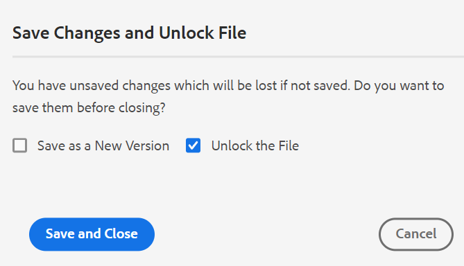

# Februariutgåva av [!DNL Adobe Experience Manager Guides] as a Cloud Service

## Uppgradera till februari-versionen

Uppgradera din nuvarande [!DNL Adobe Experience Manager Guides] as a Cloud Service-konfiguration (kallas senare [!DNL AEM Guides] as a Cloud Service) genom att utföra följande steg:
1. Ta en titt på Git-koden för molntjänster och växla till den gren som konfigurerats i molntjänstflödet för den miljö du vill uppgradera.
1. Uppdatera egenskapen `<dox.version>` i `/dox/dox.installer/pom.xml`-filen för Git-koden för molntjänster till 2022.2.114.
1. Genomför ändringarna och kör molntjänstpipelinen för att uppgradera till februariversionen av [!DNL AEM Guides] as a Cloud Service.

## Kompatibilitetsmatris

I det här avsnittet visas kompatibilitetsmatrisen för de program som stöds i as a Cloud Service-versionen från [!DNL AEM Guides], februari 2022.

### FrameMaker och FrameMaker Publishing Server

| FMPS | FrameMaker |
| --- | --- |
| Inte kompatibel | 2020 uppdatering 4 och senare |
| | |

### Syrgasanslutning

| [!DNL AEM Guides]-molnversionen | Syrgasanslutningsfönster | Syrgasanslutning Mac |
| --- | --- | --- |
| 2022.2.0 | 2.4.0 | 2.4.0 |
|  |  |  |

## Nya funktioner och förbättringar

### PDF

Stöd för att skapa ett PDF-program har också lagts till i februari-utgåvan av [!DNL AEM Guides] as a Cloud Service. En ny publiceringsmotor har lagts till med följande funktioner:
* Skapa en CSS-mall
* Skapa olika sidmallar
* Designa PDF-mallar med CSS och sidmallar
* Publicera kartor och ämnesinnehåll i PDF-format

### Stöd för kunskapsbasens webbplatssökväg vid artikelbaserad publicering

[!DNL AEM Guides] as a Cloud Service tillhandahåller den artikelbaserade publiceringsfunktionen för att stegvis generera utdata från ett eller flera ämnen eller publicera ditt innehåll på en kunskapsbas-plattform. I februari-versionen har du ytterligare ett alternativ för att välja den webbplatssökväg i kunskapsbasen som ämnet/kartan ska publiceras till. När du har valt sökvägen genereras utdata på den angivna sökvägen.

### Förbättringar i Web Editor

Många förbättringar och nya funktioner har lagts till i Web Editor:

* **Förbättrad dialogruta vid filstängning**

[!DNL AEM Guides] as a Cloud Service uppmanar dig att spara dina ändringar och låsa upp dina låsta filer när du försöker stänga en fil som har öppnats i Web Editor. Frågorna visas baserat på **Fråga efter incheckning vid stängning** och **Fråga efter ny version vid stängning** som konfigurerats av administratören.

Beroende på konfigurationen kan du välja att spara ändringarna och skapa en ny version av dokumentet. Du kan också checka in filen och spara ändringarna i den aktuella versionen.

Mer information finns i *Stängningsscenarier för filer och sparscenarier* i användarhandboken.

* Ett hårt blanksteg har lagts till i teckenpallen.  Ett **hårt**-blanksteg förhindrar en automatisk radbrytning vid en viss punkt i ett HTML-dokument. Web Editor har stöd för fasta mellanslag för både AEM Site och HTML5.

* När du överför en bild från Web Editor visas en bekräftelsedialogruta om det redan finns en bild med samma namn. Du kan antingen behålla båda filerna - befintliga och nya, eller skriva över befintliga filer och bara spara den nya.

* Om någon användare har låst en fil för redigering kan administratören låsa upp låset och checka in filen. Den här funktionen är användbar när vissa filer behöver redigeras men har låsts av användare som inte är tillgängliga för att checka in filen

### Kartkontrollpanel

När du väljer att hämta DITA-kartan köas begäran och du får ett meddelande när kartan är klar att hämtas. Du kan välja att ladda ned kartfilen direkt eller ladda ned den senare via länken i AEM meddelandeinkorg.

### Granska

Du kan ange informationen i beskrivningsfältet för granskningsaktiviteten och den visas i det e-postmeddelande som skickas till granskaren.

## Åtgärdade problem

De buggar som har åtgärdats i olika områden listas nedan:

### Artikelbaserad publicering

* Artikelbaserad publicering publicerar inte artiklar baserat på den valda baslinjen. 8771
* DITAVAL-filer respekteras inte vid artikelbaserad publicering. 8770
* Det går inte att göra artikelbaserad publicering för Salesforce-profilen när posttypen är Vanliga frågor och artikelfältets innehåll är Fråga. 8448
* Det går inte att göra artikelbaserad publicering för Salesforce-profilen när posttypen är Manuell. 8447

### Web Editor

* Det går inte att dra och släppa ett villkor i DITA-avsnitt. 8761
* Attribut saknas när du lägger till ett kapitel i bokmappen med dra och släpp från favoritvyn. 8746
* Om du redigerar egenskaperna för en bild (höjd, bredd) uppstår ett programfel. (8722)
* Brutna länkar visas inte på dispositionspanelen i källvyn. (8590)
* XML-redigeraren tar bort newline-taggen i kodblocket. (8522)
* Ordlista visas som en anteckning när en ordlista har skapats. 8384
* xref kan inte infogas även på giltiga platser. 8354
* Elementlistan (Alt+Retur) visas nedtonad i det mörka/mörkaste temat. 7913
* Listan med mappningsmallar i **Create** option( ellipsis-menyn) på databaspanelen är inte densamma som i **Mappprofilen** i användarinställningarna. (5918)
* Element-ID:n genereras inte automatiskt för element som läggs till från funktionen Återanvänd innehåll i huvudverktygsfältet. 5826

### Assets UI

* Bildredigeringen fungerar inte som förväntat på molnservern. 8768
* I panelen för versionshistorik visas en felaktig tidsstämpel i det aktuella versionsavsnittet och informationen ändras. 8765
* DITAVAL-filöverföring på molnservern misslyckas när AEM skrivbordsverktyg används. 8707
* Den andra administratörsanvändaren kan inte läggas till som den första administratörsanvändaren i en mapp. 8430
* Icke-unika egenskaper för en resurs kopieras inte när resursen kopieras och klistras in. 8241

### Användbarhetsändringar

* Om ett användarnamn är långt visas inte ikonerna för att acceptera/avvisa på panelen Granska i Web Editor tydligt. 8793
* I panelen **Sök och ersätt** visas en oönskad ikon vid muspekaren i resultatavsnittet. 8775
* Anpassad ikon väljs inte från egenskapen och i stället visas standardikonen för rapporter som genereras med knappen Generera rapport. 8573
