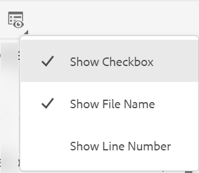

# Augustiversionen av Adobe Experience Manager Guides as a Cloud Service

## Uppgradera till augusti-versionen

Uppgradera din nuvarande konfiguration av Adobe Experience Manager Guides as a Cloud Service (kallas senare *AEM Guides as a Cloud Service*) genom att utföra följande steg:
1. Ta en titt på Git-koden för molntjänster och växla till den gren som konfigurerats i molntjänstflödet för den miljö du vill uppgradera.
1. Uppdatera egenskapen `<dox.version>` i `/dox/dox.installer/pom.xml`-filen för Git-koden för molntjänster till 2022.8.167.
1. Genomför ändringarna och kör molntjänsterna för att uppgradera till augusti-versionen av AEM Guides as a Cloud Service.

## Kompatibilitetsmatris

I det här avsnittet listas kompatibilitetsmatrisen för de program som stöds av AEM Guides as a Cloud Service från augusti 2022.

### FrameMaker och FrameMaker Publishing Server

| FMPS | FrameMaker |
| --- | --- |
| Inte kompatibel | 2020 uppdatering 4 och senare |
| | |

*Baslinje och villkor som skapats i AEM stöds i FMPS-versioner från och med 2020.2.

### Syrgasanslutning

| AEM Guides som Cloud-release | Syrgasanslutningsfönster | Syrgasanslutning Mac |
| --- | --- | --- |
| 2022.8.0 | 2.7.5 | 2.7.5 |
|  |  |  |

## Nya funktioner och förbättringar

AEM Guides as a Cloud Service innehåller många förbättringar och nya funktioner i augusti-versionen:

### Layoutvyn i kartredigeraren

Nu kan du visa den fullständiga layouten för en DITA-karta i kartredigeraren. När du öppnar en karta för redigering öppnas vyn **Layout** i kartredigeraren. I den här vyn kan du se mappningshierarkin i en trädvy och även ordna eller strukturera ämnen i en karta.

Layoutvyn innehåller ett separat verktygsfält som du kan använda för att utföra många åtgärder på de ämnen som finns på en karta.
Du kan infoga ämnesreferenser, ämnesgrupper och nyckeldefinitioner på en karta. Du kan ordna om ämnen som finns på en karta genom att flytta dem uppåt, nedåt, åt vänster eller åt höger. Du kan också dra och släppa ämnen för att flytta dem på en karta. Karteditorn innehåller även ikoner för att låsa eller låsa upp filer, kontrollera versionshistoriken och göra en versionsetiketthantering.

I layoutvyn finns även **Visningsalternativ** som du kan använda för att visa eller dölja radnummer, visa eller dölja kryssrutan eller visa filnamnet eller titeln för avsnitten i en karta.

Du kan också visa ämnen baserat på villkorsstyrda filter.

Förutom att ordna ämnen i kartfilen kan du även lägga till, flytta, kopiera, klistra in eller ta bort referenser med hjälp av menyn **Alternativ** som är tillgänglig för ett element i layoutvyn. Du kan också dra och släppa ett ämne eller en karta från databaspanelen till den karta som öppnas i Kartredigeraren.

På den högra panelen visas Innehållsegenskaper och Kartegenskaper i layoutvyn i kartredigeraren. De infogade attribut som definieras för det valda avsnittet visas mot ämnet i layoutvyn. Du kan till exempel snabbt hitta alla ämnen som har plattformsattributet definierat som `IOS`.

Nu kan du även ange metadatainformation för avsnitten eller kartan. Du kan definiera navigeringstiteln, länktexten, den korta beskrivningen och nyckelorden för det markerade ämnet eller kartan.

Mer information finns i avsnittet *Layoutvy* i Använda Adobe Experience Manager Guides as a Cloud Service.

### Textbundna attribut i redigeringsinställningarna

AEM Guides tillåter nu att administratören konfigurerar **infogade attribut** från **redigeringsinställningarna**. Du kan också lägga till nya textbundna attribut eller ta bort befintliga attribut från fliken **Textbundna attribut** i redigeringsinställningarna.
De konfigurerade infogade attribut som definieras för ett ämne visas mot ämnet i layoutvyn.

### Ytterligare filter i databasvyn

Nu har filtersökningen i databasvyn blivit kraftfullare. Två nya sökvillkor, **Senast ändrade** och **taggar**, har lagts till för att filtrera filerna och begränsa sökningen i AEM-databasen:
* **Senast ändrad**: Du kan söka efter filer som senast har ändrats efter ett valt datum men före ett valt datum. Du kan också använda de fördefinierade villkoren och söka efter filer som senast har ändrats under de senaste 2 timmarna, förra veckan, förra månaden eller förra året.
* **Taggar**: Du kan också söka efter filer som har särskilda taggar. Du kan antingen skriva taggen eller välja den i listrutan.

## Åtgärdade problem

De buggar som har åtgärdats i olika områden listas nedan:

* Inaktuellt Lucene-index används i /core/article-publish/src/main/java/com/adobe/dxml/article/publish/util/DoxUtils.java (9291)
* Uppdaterad Node.js används inte för publicering. 9835
* DITA-avsnittet uppdateras inte automatiskt med de ändringar som har gjorts på sidan **Egenskaper**. 8745
* Frontmatter-elementet fungerar inte korrekt när det läggs till i en DITA-bokmapp. 9507
* PDF | En tom PDF genereras när **Snabbgenerering** används för flera filer när ett tomt element väljs. 9822
* PDF | Bilaga publiceras som ett kapitel i PDF-utdata. 9829
* PDF | När en SVG-bild redigeras visas den inte i sidlayouten. (9069)
* Ett vanligt bindestreck infogas när ett `Nonbreaking Hyphen`-tecken infogas med dialogrutan **Infoga specialtecken** . (8919)
* Uppdaterade bilder i avsnitten visas inte i XML-redigeraren om de har redigerats. (9500)
* När utdata publiceras via redigeraren kan förinställningarna inte tas bort från fliken **Utdata**. (9100)
* Undermapparna för en DITA-karta är inte utcheckade med alternativet **Markera alla** på ellipsmenyn. 9814
* Det går inte att dra och släppa mappnings- eller ämnesmallar från menyn **Mallar** till den anpassade mappningsmallen i webbredigeraren. 9846
* Det går inte att skapa ett nytt ämne eller en ny mappningsmall i undermappen till en mappnings- eller ämnesmall. 9888
* Det finns inget alternativ för att bläddra bland ämnen eller kartor som finns inuti undermapparna för en karta eller ämnesmall. 9889
* När en Schematron-fil uppdateras och sparas tillsammans med DITA-filen visas inte den högra panelen (om DITA-filen bryter valideringarna i Schematron-filen). (9986)
* En ny förinställning för duplicerade utdata kan skapas om namnet är detsamma som en befintlig förinställning. (9997)
* SVG-bilder blir skadade och publiceras inte korrekt när HTML-utdata genereras. (9949)

## Kända fel

Adobe har identifierat följande kända problem i AEM Guides as a Cloud Service August 2022.

### Kända problem med lösningar

Använd den angivna lösningen för följande kända problem:

* Layoutvyn visas inte i kartredigeraren.

  **Tillfällig lösning**: Uppdatera ui_config.json i mappprofilen.

* Symbols.json har åsidosatts, så utgåva 8919 inträffar.

  **Tillfällig lösning**: Uppdaterade symbols.json måste sammanfogas med åsidosatta symbols.json.

### Andra kända fel

* Om flera filer är markerade i resultatavsnittet som visas när du gör en sökning i databasen och sedan drar-släpper i författarvyn, läggs bara en fil till.
