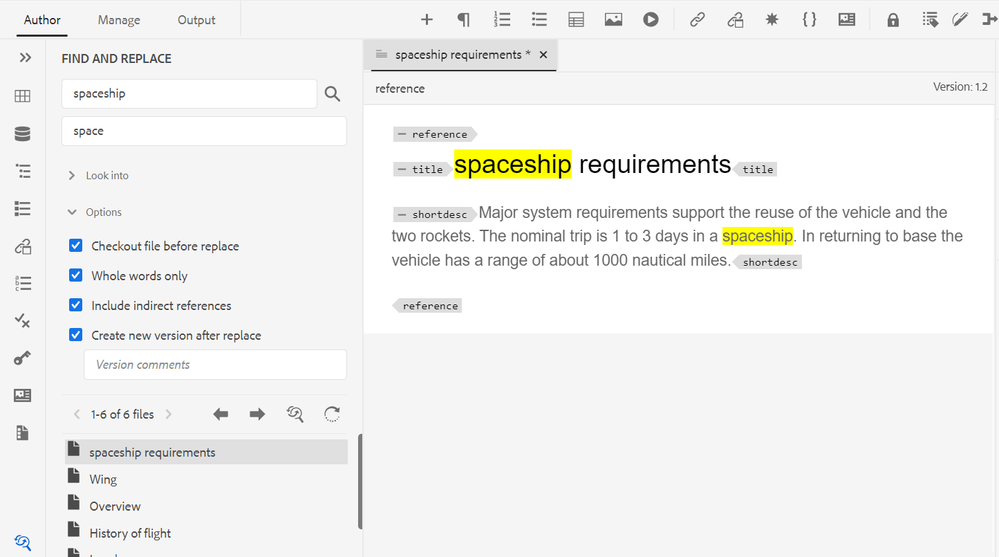

# September-versionen av Adobe Experience Manager Guides as a Cloud Service

## Uppgradera till september-versionen

Uppgradera din nuvarande konfiguration av Adobe Experience Manager Guides as a Cloud Service (kallas senare *AEM Guides as a Cloud Service*) genom att utföra följande steg:
1. Ta en titt på Git-koden för molntjänster och växla till den gren som konfigurerats i molntjänstflödet för den miljö som du vill uppgradera.
1. Uppdatera egenskapen `<dox.version>` i `/dox/dox.installer/pom.xml`-filen för Git-koden för molntjänster till 2022.9.178.
1. Genomför ändringarna och kör Cloud Services-pipeline för att uppgradera till Septemberversionen av AEM Guides as a Cloud Service.

## Steg för indexering av befintligt innehåll

Utför följande steg för att indexera det befintliga innehållet och använd den nya sök- och ersätt-texten på mappningsnivå:
* Kör en POST-begäran till servern (med korrekt autentisering) - `http://<server:port>/bin/guides/map-find/indexin`.
(Valfritt: Du kan skicka specifika sökvägar för mappningarna för att indexera dem. Som standard indexeras alla mappningar ||  Exempel:   `https://<Server:port>/bin/guides/map-find/indexing?paths=<map_path_in_repository>`)
* API:t returnerar ett jobId. Om du vill kontrollera jobbets status kan du skicka en GET-begäran med jobb-ID till samma slutpunkt - `http://<server:port>/bin/guides/map-find/indexing?jobId={jobId}`
(Till exempel: `http://<_localhost:8080_>/bin/guides/map-find/indexing?jobId=2022/9/15/7/27/7dfa1271-981e-4617-b5a4-c18379f11c42_678)`
* När jobbet är klart kommer ovanstående GET-förfrågan att besvaras med framgång och ange om några kartor misslyckades. De korrekt indexerade mappningarna kan bekräftas från serverloggarna.

## Kompatibilitetsmatris

I det här avsnittet visas kompatibilitetsmatrisen för de program som stöds i AEM Guides as a Cloud Service från september 2022.

### FrameMaker och FrameMaker Publishing Server

| FMPS | FrameMaker |
| --- | --- |
| Inte kompatibel | 2020 uppdatering 4 och senare |
| | |

*Baslinje och villkor som skapats i AEM stöds i FMPS-versioner från och med 2020.2.

### Syrgasanslutning

| AEM Guides som Cloud-release | Syrgasanslutningsfönster | Syrgasanslutning Mac | Redigera i syrgasfönster | Redigera i Syrgas Mac |
| --- | --- | --- | --- | --- |
| 2022.9.0 | 2.7.13 | 2.7.13 | 2,3 | 2,3 |
|  |  |  |  |  |

## Nya funktioner och förbättringar

AEM Guides as a Cloud Service innehåller många förbättringar och nya funktioner i september-versionen:

### Skapa en dynamisk baslinje baserad på etiketter

Nu kan du med AEM Guides skapa dynamiska baslinjer baserade på etiketter. Om du genererar en baslinje, hämtar en baslinje eller skapar ett översättningsprojekt med hjälp av en baslinje, hämtas filerna dynamiskt baserat på de uppdaterade etiketterna. Den här funktionen är praktisk eftersom du inte behöver ändra baslinjen när du uppdaterar etiketterna.
Du kan också exportera ögonblicksbilden av baslinjen som en CSV-fil.

### Söka efter och ersätta text på mappningsnivå

Nu kan du söka efter filer på en karta som innehåller viss text. Den sökta texten markeras i filerna. Du kan också ersätta det sökda ordet eller frasen med ett annat ord eller en annan fras i filerna.
Markera ikonen **Ersätt** om du vill ersätta den aktuella förekomsten och ikonen **Ersätt alla i filen** om du vill ersätta alla förekomster i den markerade filen.

Som standard är alternativen **Checka ut fil före ersättning** och **Skapa ny version efter ersättning** markerade, så en fil checkas ut innan du ersätter texten och en ny version skapas när texten har ersatts.

### Visa versionsskillnad för filer som inte är synkroniserade från översättningsinstrumentpanelen

Du kan nu välja att översätta **filer som inte är synkroniserade** baserat på ändringar som gjorts mellan de två versionerna av ett ämne.\

På översättningens kontrollpanel ser du enkelt skillnaderna mellan den senaste översatta versionen och den aktuella versionen av den valda filen.

Beroende på skillnaderna kan du bestämma om du vill översätta ett ämne eller inte.

### Metadatagränssnitt för PDF-förinställningar

Du kan ställa in metadata från utdataförinställningen för en DITA-karta. Du kan ange metadata för titel, författare, ämne och nyckelord. Dessa metadata mappas till metadata i filegenskaperna för utdata-PDF.
Dessa metadata åsidosätter metadata som definierats på boknivå. Du kan definiera metadata specifikt för varje utdatainställning och skicka den vidare till utdata-PDF.

## Åtgärdade problem

De buggar som har åtgärdats i olika områden listas nedan:

* Web Editor | När du flyttar element inom ett ämne skrivs de tilldelade ID:n för element över av automatiskt tilldelade ID:n. 7895
* Spåra ändringar | Innehållet förloras när ett nytt element anges med Retur-tangenten. (10246)
* Delkartan som refereras till huvudkartan i Dita-mallar skapas inte. (10231)
* XML Editor | Kopiera och klistra in fungerar inte i redigeringsläget. (10309)
* Flera versionsetiketter avmarkeras inte när de har markerats. 9561
* Automatisk navigering till sökvägen i dialogrutan Bläddra fungerar inte som filbläddring. (9920)
* Dispositionspanelen visar inte innehåll när den växlar från **Författare** till **Source** -läge. (10319)
* Det går inte att definiera i ett nytt ämne som skapats med innehåll i ämnesmallen. Hash-ID:t som kopieras uppdateras inte i innehållskopian. (9890)
* Webbredigerare | Det finns ingen inläsare när en karta skapas från mappningsmallen. 9891
* Ny kartredigerare | Fet eller kursiv text som lagts till i karttiteln behålls inte om vi växlar från **Författare** till **layoutvyn**. (10218)
* Ny kartredigerare | Det går inte att ta bort villkor som används på referenser från layoutvyn. (10213)
* Ny kartredigerare | Det går inte att använda villkorsreferenser i layoutvyn på samma sätt som i redigeringsvyn. (10198)
* Ny kartredigerare | Om du flyttar åt vänster på snabbmenyn tas referensen bort om den inte kan flyttas åt vänster. (10219)
* Ny kartredigerare |Ikonen visas felaktigt för referenserna i en karta som skapats i layoutvyn. (10197)
* Databaspanel | Om du högerklickar på databaspanelen uppstår ett programfel. (10123)
* Sök och ersätt | Det mörka läget går inte att läsa för sökresultat i webbredigeraren. (9978)
* Översättning | Metadata och taggar sprids inte till översatta kopior. 4696
* Kopiera inklistring (ctrl+c/ctrl+v) ger ett fel i redigeringsläget. (10304)
* PDF-mall | Om du lägger till bakgrundsbilder i en sidlayout visas bildsökvägen absolut och bilderna visas inte i utdata-PDF. (10297)
* PDF | Kapitelrubrik och kapitelrubrik fungerar inte i PDF. 9947
* PDF | `xref` för ett koncept har inte matchats korrekt för ett specifikt DITA-ämne. (10229)
* PDF | Det går inte att visa bildtext för en tabell i genererade PDF-utdata. 9827
* PDF | Referenser i bilagor visas inte som bilagor i PDF-utdata. (10182)
* PDF | Bildruteattributet för en tabell sprids inte till den temporära HTML (som klass). (10353)
* PDF | temporära HTML-filer lägger till klasserna colsep och rowsep till td och även om deras värde är 0 i käll-DITA. (10352)
* PDF |  Metadata för villkor som lagts till i sidlayouten respekteras inte. (10377)
* PDF |  Generering av PDF misslyckas för specifikt innehåll. (9927)
* PDF | Innehåll via conkeyref visas inte i PDF-utdata. 9836
* PDF | Nyckelreferenser för nyckeldefinitioner med bilder eller externa länkar är inte lösta. (10063)
* I redigeringsvyn för en karta visas inte platshållartext för tabeller och illustrationer. (10330)
* När vi skapar en ny baslinje används inte det redan valda baslinjefärgfiltret. (9954)
* Videofilen saknas från baslinjen om det överordnade mappnamnet har ett blankstegstecken. 10031)
* När du skapar baslinje väljs inte den senaste versionen när användarens tidszon skiljer sig från serverns tidszon. (10190)
* Kortkommandot Ctrl+F öppnar inte sökgränssnittet på Assets-konsolen efter installation av AEM Guides 4.1 i AEM 6.5.12. (10189)

## Kända fel

Adobe har identifierat följande kända fel i AEM Guides as a Cloud Service från september 2022.

* Dynamisk baslinje är inte integrerad med kunskapsbaspublicering.

* Översättning | Ikonen för versionsskillnad visas för källinnehållet på grund av ändringar i målinnehållet.
