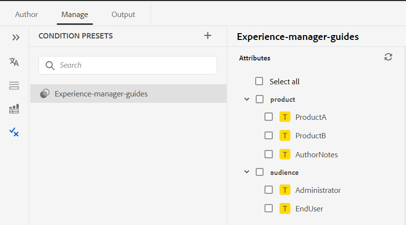

# Nyheter i november 2023-utgåvan av Adobe Experience Manager Guides as a Cloud Service

I den här artikeln beskrivs de nya och förbättrade funktionerna i Adobe Experience Manager Guides-versionen från november 2023 (kallas senare *Experience Manager Guides as a Cloud Service*).

Mer information om uppgraderingsinstruktioner, kompatibilitetsmatris och de problem som har åtgärdats i den här versionen finns i [Versionsinformation](release-notes-2023-11-0.md).

## Förbättringar av inbyggda PDF

Följande förbättringar av ursprungligt PDF har gjorts i november 2023:

### Använda och duplicera färdiga PDF-mallar

Experience Manager Guides har färdiga mallar eller PDF. Duplicera PDF-mallarna i fabriken för att skapa anpassade PDF-mallar.

Nu kan du även förhandsvisa miniatyrbilden för en mall när du skapar och duplicerar en mall. Du kan också redigera eller ta bort den här bilden. Den här funktionen är användbar när du vill märka ut eller skilja ut mallar med liknande namn.
Läs mer om mallen [PDF](../native-pdf/pdf-template.md).

{width="550" align="left"}

*Duplicera en befintlig PDF-mall.*

### Ändra ordningen på sidorna och publicera flera sidor per ark

Förutom att publicera sidorna enligt källdokumentet kan du även ändra ordningen på sidorna i PDF när du publicerar ett flersidigt dokument.  Detta ger dig flexibilitet att publicera sidorna i olika ordningsföljd, som alla udda eller alla jämna sidor först. Du kan även publicera som ett häfte och läsa sidorna som en bok. Du kan också bestämma hur många sidor du vill publicera på ett enda pappersark. Mer information finns i avsnittet [Sidorganisation](../native-pdf/components-pdf-template.md#page-organization).

### Sortera ordlistor baserat på sorteringsnycklar

Nu kan du även sortera ordlistorna baserat på sorteringsnycklar. Du kan använda taggen&quot;sort-as&quot; för att definiera en sorteringsnyckel för ordlistorna. Sedan kan du sortera dem baserat på sorteringsnycklar i stället för villkoren. På så sätt kan du sortera ordlistorna efter termer som används på olika språk. Du kan också definiera en sorteringsnyckel för en ordlista med en fras eller en grupp med ord.
Mer information finns i [Avancerade PDF-inställningar](../native-pdf/components-pdf-template.md#advanced-pdf-settings).

### Förbättrad resurshantering för mallar i Native PDF

Experience Manager Guides har nu förbättrat resurshanteringen för mallar för inbyggda PDF. Nu kan du dela och återanvända resurser, som bilder, CSS-filer och teckensnittsfiler, i flera olika PDF-mallar. I och med den här förbättringen är det mycket enklare att hantera resurser för en stor uppsättning mallar. Du behöver inte skapa dubblettresurser för varje mall, och du kan behålla dem i en delad mapp och använda dem i alla mallar i PDF.
Mer information finns i [PDF-mallen](../native-pdf/pdf-template.md).

## Förbättringar i Web Editor

Följande förbättringar av webbredigeraren har gjorts i november 2023:

### Visa filer efter namn eller filnamn

Nu kan du välja standardsättet att visa filerna i Web Editor. Du kan visa fillistan efter titlarna eller filnamnen från de olika panelerna i redigeringsvyn.

{width="550" align="left"}

*Ändra standardsättet att visa filerna i dialogrutan **Användarinställningar**.*

### Hantera villkorsförinställningar

Du kan definiera villkorsattribut i dina DITA-avsnitt. Använd sedan villkorsattributen i villkorsförinställningen för att publicera innehållet i en DITA-karta. I Experience Manager Guides kan du nu även skapa och hantera villkorsförinställningar från Web Editor. Du kan också enkelt redigera, duplicera eller ta bort dem.

{width="550" align="left"}

Mer information finns i [Använd förinställningar för villkor](../user-guide/generate-output-use-condition-presets.md).

### Återställ filflikar när webbläsaren uppdateras

Experience Manager Guides återställer status för de öppna filflikarna i Web Editor när du uppdaterar webbläsaren. Mer information finns i **Uppdatera webbläsaren medan du redigerar filerna** under [Redigera ämnen i Web Editor](../user-guide/web-editor-edit-topics.md).

### Frigör enkelt ett element

Nu kan du enkelt frigöra ett element med hjälp av alternativet på snabbmenyn för ett element i Web Editor. Det gör det enklare att sammanfoga elementets text med dess överordnade element.
Mer information finns i avsnittet **Dela upp ett element** från de [andra funktionerna i Web Editor](../user-guide/web-editor-other-features.md).

### Kortkommandon för att flytta markören

I Experience Manager Guides kan du nu även använda kortkommandon för att flytta markören i Web Editor. Du kan använda kortkommandona för att snabbt flytta ett ord åt vänster eller höger. Du kan också gå till början eller slutet av raden med hjälp av kortkommandona.
Nu kan du också använda kortkommandon för att flytta markören till början av nästa element eller till slutet av föregående element.
Läs mer om [kortkommandona i Web Editor](../user-guide/web-editor-keyboard-shortcuts.md).
