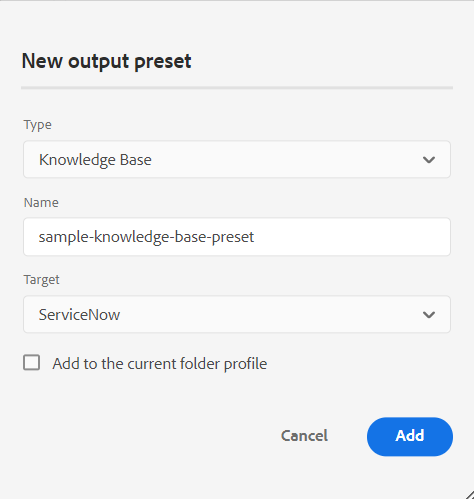

# Nyheter i december 2023-utgåvan av Adobe Experience Manager Guides as a Cloud Service

I den här artikeln beskrivs de nya och förbättrade funktionerna i Adobe Experience Manager Guides-versionen från december 2023 (kallas senare *Experience Manager Guides as a Cloud Service*).

Mer information om uppgraderingsinstruktioner, kompatibilitetsmatris och de problem som har åtgärdats i den här versionen finns i [Versionsinformation](release-notes-2023-12-0.md).

## Använd variabler i PDF-utdata

Du kan använda variabler för att dynamiskt infoga och hantera återanvändbar information. Experience Manager Guides hjälper dig att skapa, redigera och förhandsgranska variabler medan du genererar PDF. Du kan snabbt ändra variabelvärdena och göra dokumenten portabla och enkla att uppdatera.

{width="800" align="left"}

*Skapa och hantera variabler i Web Editor.*

Du kan också skapa variabeluppsättningar som åsidosätter standardvärdena och tilldelar alternativa värden till variablerna. Om du infogar dessa variabler i sidlayouten och använder samma PDF-layout behöver du inte skapa separata layouter för varje värdeuppsättning. Du kan till exempel skapa en variabeluppsättning för varje produktrelease. Den här variabeluppsättningen kan bestå av variabler för olika produktdetaljer som produktnamn, versionsnummer och releasedatum. Sedan kan du lägga till olika värden för dessa variabler.

**Variabeluppsättning 1: Adobe-set1**

* ProductName: Experience Manager Guides
* Versionsnummer: 2311
* Releasedatum: 2023-11-02

**Variabeluppsättning 2: Adobe-set2**

* ProductName: Experience Manager Guides
* Versionsnummer: 2310
* Releasedatum: 2023-09-27

*Generera utdata från PDF med hjälp av variabler i layouten PDF.*

Du kan använda format och formatera variablerna med HTML.  Du kan också snabbt uppdatera värdena för variablerna när det behövs och återskapa utdata. Om du till exempel behöver uppdatera informationen för en version kan du redigera värdet för versionen i variabeln VersionNumber och generera om utdata.

Läs mer om hur du använder [variabler i utdata från PDF](../native-pdf/native-pdf-variables.md).

## Förbättrad upplevelse för att redigera attributen

Nu får du en omgjord upplevelse där du kan lägga till eller redigera attribut för ett element från panelen **Innehållsegenskaper** i webbredigeraren.

{width="300" align="left"}

*Lägg till attribut från panelen Innehållsegenskaper.*

Du kan också enkelt redigera och ta bort attributen.

Mer information finns i beskrivningen av funktionen **Innehållsegenskaper** i avsnittet [Högerpanel](../user-guide/web-editor-features.md#id2051EB003YK).

## Redigera metadata vid redigering

När du redigerar kan du nu uppdatera filens metadatataggar med hjälp av listrutan i **filegenskaperna** i den högra panelen. Du kan också välja **Redigera fler egenskaper** om du vill uppdatera fler metadata.

{width="300" align="left"}

*Uppdatera metadata och redigera filegenskaper från den högra panelen.*

Mer information finns i funktionsbeskrivningen för **File Properties** i avsnittet [Right Panel](../user-guide/web-editor-features.md#id2051EB003YK) .

## Möjlighet att publicera innehåll i ServiceNow-kunskapsbasen

Nu kan du även publicera ditt innehåll på ServiceNow-kunskapsbasplattformen.

I december 2023-utgåvan kan du som administratör skapa en publiceringsprofil för ServiceNow-kunskapsbasservern. Som författare eller utgivare kan du sedan välja den ServiceNow-publiceringsprofilen i förinställningen för utdata för att publicera utdata till den angivna kunskapsbasen.

Med den här funktionen kan du publicera innehåll, som text, videoklipp och bilder, på kunskapsbasplattformen ServiceNow och underhålla ett omfattande arkiv.

{width="300" align="left"}

*Skapa en förinställning för ServiceNow-kunskapsbasen.*

Läs mer om [kunskapsbasens](../user-guide/generate-output-knowledge-base.md) förinställningar för utdata.

## Förbättrad kontrollpanel för kartsamling

Experience Manager Guides har en förbättrad kontrollpanel för kartsamling. I en kartsamling kan du snabbt konfigurera flera metadataegenskaper för DITA-kartorna. Den här funktionen är praktisk eftersom du inte behöver uppdatera metadataegenskaperna för varje DITA-karta separat.

Nu kan du visa filnamnet på DITA-kartan. Du kan också visa baslinjerna. På så sätt kan du snabbt hitta den baslinje som används för en förinställning.

{width="800" align="left"}

*Visa, redigera och generera utdata från kartsamlingens kontrollpanel.*

Lär dig hur du [använder kartsamling för utdatagenerering](../user-guide/generate-output-use-map-collection-output-generation.md).

## Visa nyckelattribut i Kartvyn

När du definierar nyckelattribut för ämnet eller mappningsreferenserna kan du även visa titeln, motsvarande ikon och nyckeln i den vänstra panelen. Nyckeln visas som `key=<key-name>`.

Mer information finns i funktionsbeskrivningen för **Kartvyn** i avsnittet [Vänster panel](../user-guide/web-editor-features.md#id2051EA0M0HS).

 {width="300" align="left"}

*Visa nyckelattributet i Kartvyn.*

## Möjlighet att duplicera en baslinje baserat på etikett

Experience Manager Guides ger nu en förbättrad användarupplevelse när du skapar baslinjer från Web Editor.\
 {width="300" align="left"}
*Skapa baslinje i webbredigeraren.*

Du kan också duplicera en baslinje baserat på etiketten. Referensversionen väljs baserat på den angivna etiketten (om den finns) när du duplicerar, eller också väljs versionen från den duplicerade baslinjen.

 {width="300" align="left"}

*Duplicera en baslinje baserat på en etikett eller skapa en exakt kopia.*

Läs mer om hur du [skapar och hanterar baslinjer i Web Editor](../user-guide/web-editor-baseline.md).

## Lösa länkar för korsmappning i AEM webbplatsutdata

Korsmappslänkar (XREF med scope-peer) som återges i AEM webbplatsutdata tolkas nu enligt filtiteln för publiceringskontexten som angetts för den genererade kartan.

## Konfigurera URL:en för AEM som ska använda dokumenttiteln

I Experience Manager Guides kan du som administratör konfigurera URL:en för AEM webbplatsutdata. Om filnamnet inte finns eller innehåller alla specialtecken kan du konfigurera så att de ersätts med en avgränsare i URL:en för AEM platsutdata. Du kan även ersätta dem med namnet på det första underordnade ämnet. Lär dig hur du [konfigurerar URL:en för AEM webbplatsutdata så att dokumenttiteln &#x200B;](../cs-install-guide/conf-output-generation.md#configure-the-url-of-the-aem-site-output-to-use-the-document-title) används.
