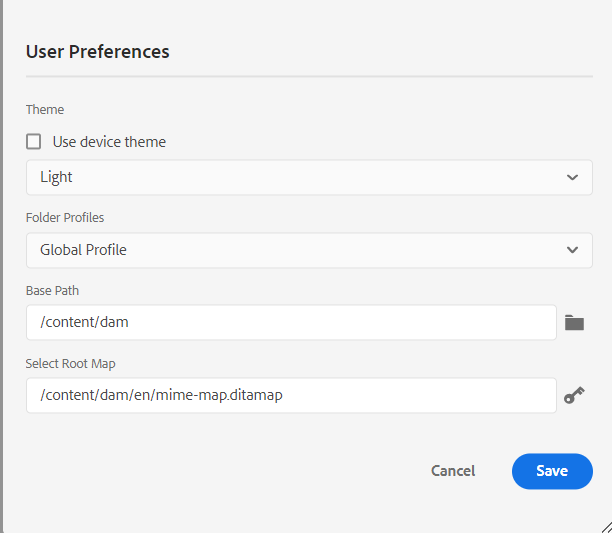

# Nyheter i juni 2023-utgåvan av Adobe Experience Manager Guides as a Cloud Service

I den här artikeln beskrivs de nya och förbättrade funktionerna i Adobe Experience Manager Guides version från juni 2023 (kallas senare *AEM Guides as a Cloud Service*).

Mer information om uppgraderingsinstruktioner, kompatibilitetsmatris och problemen som åtgärdas i den här versionen finns i [Versionsinformation](release-notes-2023-6-0.md).

## Rapporten Brutna länkar i Web Editor

Med AEM Guides kan du kontrollera om dina tekniska dokument är fullständiga och generera rapporter från Web Editor. I juni 2023-versionen av AEM Guides finns en funktion för att visa och åtgärda brutna länkar. Det här är en användbar rapport som hjälper dig att hantera brutna länkar. Du kan enkelt visa de brutna länkar som finns på DITA-kartan och även åtgärda dem.
{width="800" align="left"}

När du har åtgärdat en länk visas den inte under listan med brutna länkar.

Mer information finns i [Visa och korrigera brutna länkar](../user-guide/reports-web-editor.md#report-broken-links).

## Byta namn på och flytta filer i databasvyn

Nu kan du även byta namn på eller flytta en fil från databaspanelen. Den här funktionen är praktisk och hjälper dig att hantera dina filer enkelt från panelen Databas. Du kan markera en fil och byta namn på den eller flytta den med menyn **Alternativ** för den markerade filen. Ett meddelande visas när du flyttar eller byter namn på en fil.

{width="650" align="left"}

Mer information om alternativmenyn för en fil finns i funktionsbeskrivningen för **databasvyn** i avsnittet [Vänster panel](../user-guide/web-editor-features.md#id2051EA0M0HS).

## Förbättringar av inbyggda PDF

### Lägga till en vattenstämpel i utdata från PDF för utkast till dokument

Nu kan du lägga till en vattenstämpel i utdata från PDF i dokumentet som ännu inte är godkänt. Den här vattenstämpeln visas inte om du genererar PDF för dokumentet i dokumentet Godkänt. Du kan till exempel lägga till en vattenstämpel i Utkast för PDF.

Mer information finns i [Lägga till en vattenstämpel i PDF-utdata för utkast ](../native-pdf/use-javascript-content-style.md#watermark-draft-document).

### Stöd för språkvariabler

AEM Guides stöder språkvariabler. Du kan använda språkvariabler för att definiera en lokaliserad version av körklara etiketter som Anteckning, Varning och Varning eller statisk text i utdata från PDF.
Du kan lägga till språkvariablerna eller den lokaliserade versionen av etiketterna i lämpliga avsnitt i utdata från PDF och i utdatamallarna.

#### Språkvariabler i utdata från PDF

Du kan använda språkvariablerna för att definiera lokaliserade etiketter för element som Anteckning, Varning och Varning. Du kan uppdatera värdet för dessa variabler på ett eller flera språk, och sedan hämtas det lokaliserade värdet automatiskt i utdata från PDF.
Du kan till exempel visa etiketten Note i PDF-utdata på följande sätt:

* Engelska: Note
* Franska: Remarque
* Tyska: Hinweis

#### Språkvariabler i utdatamallarna

Om du vill skapa PDF-utdata på olika språk måste du skapa olika PDF-mallar med lokaliserad text för varje språk. Med funktionen för språkvariabler behöver du bara skapa mallen en gång. För statisk text som du behöver lokalisera kan du sedan skapa motsvarande språkvariabler och använda dem i mallen.
Du kan skapa språkvariabler för längre text, till exempel en hel mening eller till och med ett stycke. Du kan också använda format och formatera dessa språkvariabler med HTML-kod.

Mer information finns i [Stöd för språkvariabler](../native-pdf/native-pdf-language-variables.md).

### Möjlighet att använda AEM metadata i PDF-layouter

Metadata är beskrivningen eller definitionen av ditt innehåll. Dessa metadata lagras i DITA-källans kartinnehåll.

I AEM Guides kan du nu även välja metadataegenskaper för dina resurser och lägga till dem i sidlayouten. AEM Guides väljer sedan dessa metadataegenskaper för dina resurser och publicerar dem i utdata från PDF.

{width="550" align="left"}

>[!NOTE]
>
> AEM Guides stöder också metadataegenskaperna för dina DITA-kartor.

Mer information finns i [Lägg till fält och metadata](../native-pdf/design-page-layout.md#add-fields-metadata).

## Förbättringar av schematron

### Använd rapportsatser för att kontrollera regler i schemat

AEM Guides stöder nu även rapportprogramsatser med Schematron. En rapportprogramsats genererar ett meddelande när en testprogramsats utvärderas till true. Om du till exempel vill att den korta beskrivningen ska innehålla högst 150 tecken kan du definiera en rapportsats för att kontrollera ämnen där den korta beskrivningen innehåller mer än 150 tecken.

Mer information finns i [Använd satserna assert och report för att kontrollera regler](../user-guide/support-schematron-file.md#schematron-assert-report).

### Använd Regex-uttryck

Du kan också använda Regex-uttryck för att definiera en regel med funktionen match() och sedan utföra valideringen med filen Schematron.

Mer information finns i [Använd Regex-uttryck](../user-guide/support-schematron-file.md#schematron-assert-report).

### Definiera abstrakta mönster

AEM Guides har även stöd för abstrakta mönster i Schematron. Du kan definiera allmänna abstrakta mönster och återanvända dessa abstrakta mönster. Abstrakta mönster kan förenkla schemat i Schematron och även hjälpa dig att hantera och uppdatera valideringslogiken.

Mer information finns i [Definiera abstrakta mönster](../user-guide/support-schematron-file.md#schematron-abstract-patterns).

## Navigera från webbredigeraren till AEM startsida

Nu kan du enkelt navigera från webbredigeraren till AEM startsida.

{width="800" align="left"}

* Klicka på ikonen **Stödlinjer** ( ) för att gå tillbaka till AEM navigeringssida.

Mer information finns i [AEM Navigeringssida](../user-guide/web-editor-launch-editor.md#id2056BG00RZJ).

## Hantera hierarkiska definitioner av ämnesdefinitioner och uppräkningar

AEM Guides har den kraftfulla funktionen för att skapa Subject scheme-kartor som är en speciell form av DITA-kartor som används för att definiera taxonomiska ämnen och kontrollerade värden. Nu kan du i AEM Guides även definiera ämnesdefinitionen i en karta och uppräkningsdefinitionerna i en annan karta. Du kan sedan lägga till kartreferensen och använda ämnesschemat.
Ämnesuppräkningsreferenserna löses i samma karta eller i den refererade kartan.

Mer information om hur du hanterar hierarkiska definitioner för ämnesdefinitioner och uppräkningar finns i funktionsbeskrivningen för **Ämnesschema** i avsnittet [Vänster panel](../user-guide/web-editor-features.md#id2051EA0M0HS).

## Stöd för XLIFF-format i översättning

AEM Guides har också stöd för XLIFF-formatet (XML Localization Interchange File Format) vid översättning. Nu kan du även välja att **skapa ett nytt XLIFF-översättningsprojekt** för att konvertera XML-innehållet till XLIFF-format.
Med det här formatet kan du exportera innehållet till det branschledande XLIFF-formatet och sedan tillhandahålla samma format till översättningsleverantörerna. Mer information finns i [Skapa ett översättningsprojekt](../user-guide/translate-documents-web-editor.md#create-translation-project).

{width="350" align="left"}

## Förbättrad Favoritpanel

AEM Guides hjälper dig att skapa en samling eller favoritlista med dina filer och mappar och att enkelt använda dem. Nu finns menyn **Alternativ** även på panelen **Favoriter**. Du kan byta namn på den markerade samlingen eller ta bort den från menyn **Alternativ** . Du kan välja alternativet **Uppdatera** för att få en ny lista över filer eller mappar från databasen. Du kan även visa mappinnehållet i Assets användargränssnitt.

{width="650" align="left"}

>[!NOTE]
>
> Du kan också uppdatera listan med ikonen **Uppdatera** högst upp.

Mer information om menyn **Alternativ** i en Favoriter-samling finns i funktionsbeskrivningen för **Favoriter** i avsnittet [Vänster panel](../user-guide/web-editor-features.md#id2051EA0M0HS).

## Växla till systemtemat

Nu kan du även använda enhetstemat. Med **användarinställningarna** kan du konfigurera AEM Guides så att det automatiskt växlar mellan ljusa och mörka teman baserat på temat på din enhet.

{width="550" align="left"}

Mer information finns i beskrivningen av funktionen **Användarinställningar** i avsnittet [Huvudverktygsfält](../user-guide/web-editor-features.md#id2051EA0G05Z).
