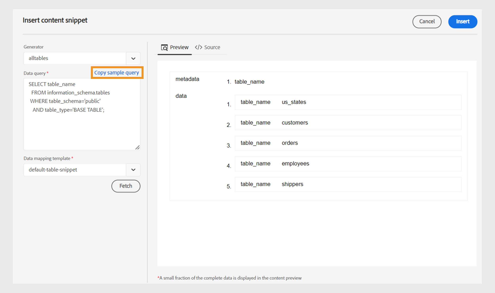

# Nyheter i version 2024.4.0

I den här artikeln beskrivs de nya och förbättrade funktionerna i version 2024.4.0 av Adobe Experience Manager Guides.

En lista över problem som har åtgärdats i den här versionen finns i [Åtgärdade problem i version 2024.4.0](fixed-issues-2024-04-0.md).

Läs mer om [uppgraderingsinstruktioner för version 2024.4.0](upgrade-instructions-2024-04-0.md).

## Möjlighet att översätta innehåll till flera språk med förkonfigurerade språkgrupper

Med Experience Manager Guides kan du nu skapa språkgrupper och enkelt översätta innehåll till flera språk. Med den här funktionen kan du ordna och hantera översättningar efter organisationens behov.

Om du till exempel behöver översätta innehåll för vissa länder i Europa kan du skapa en språkgrupp för europeiska språk som engelska (EN), franska (FR), tyska (DE), spanska (ES) och italienska (IT).

{width="300" align="left"}

*Välj de språkgrupper eller språk som du vill översätta dina dokument.*

>[!NOTE]
>
>Om målmappen för ett språk saknas eller målspråket är samma som källan, är den nedtonad och visar ett varningstecken.

Som administratör kan du skapa språkgrupper och konfigurera dem till flera mappprofiler. Som författare kan du visa språkgrupperna som är konfigurerade för din mappprofil.

Generellt sett förbättrar möjligheten att skapa språkgrupper effektiviteten och produktiviteten i översättningsprojekt, vilket i slutänden förbättrar lokaliseringsprocessen för flera språk.

Lär dig hur du [översätter dokument från webbredigeraren](../user-guide/translate-documents-web-editor.md).

## Ta bort eller inaktivera översättningsprojektet automatiskt efter översättningen

Som administratör kan du nu konfigurera översättningsprojekten så att de inaktiveras eller tas bort automatiskt när översättningen är klar. Med den här funktionen kan du effektivt använda resurser och hantera filer när översättningen är klar.

Om du tar bort ett projekt tas alla filer och mappar i projektet bort permanent. Om du tar bort översättningsprojekten kan du frigöra diskutrymme.

Du kan inaktivera översättningsprojekten om du vill använda dem senare.

{width="550" align="left"}

*Konfigurera språkgrupper och rensningsinställningar för översättningsprojekt.*

Läs mer om hur du [tar bort eller inaktiverar översättningsprojektet](../user-guide/translate-documents-web-editor.md#automatically-delete-or-disable-a-completed-translation-project) automatiskt.

## Aktivera utdata för dina kartor i en gruppaktiveringssamling i Preview-instansen

Förutom att aktivera utdata för din massaktiveringssamling på publiceringsinstansen har Experience Manager Gudies as Cloud Services funktionen som aktiverar den på **Preview**-instansen.

Den här funktionen hjälper dig att aktivera ditt innehåll till en förhandsvisningsinstans, så att du kan kontrollera hur det ser ut och fungerar innan du aktiverar det till **Publish** -instansen.

{width="800" align="left"}

*Visa information om aktiverade mapputdata på fliken **Granskningshistorik**.*

Läs mer om [massaktivering](../user-guide/conf-bulk-activation-publish-map-collection.md).

## Förbättringar av datakällanslutningar

Följande förbättringar har gjorts i datakällanslutningarna för version 2024.4.0:

### Anslut till datakällorna Salsify, Akeneo och Microsoft Azure DevOps Boards (ADO)

Förutom de befintliga färdiga anslutningarna tillhandahåller Experience Manager Guides även kopplingar för datakällorna Salsify, Akeneo och Microsoft Azure DevOps Boards (ADO). Som administratör kan du hämta och installera dessa anslutningar. Konfigurera sedan de installerade anslutningarna.

### Kopiera och klistra in exempelfrågan för att skapa ett innehållsavdrag eller ämne

Du kan enkelt kopiera och klistra in en exempeldatafråga i generatorn för att skapa ett innehållsavdrag eller ämne. Med den här funktionen behöver du inte komma ihåg syntaxen eller skapa en fråga manuellt. I stället för att skriva frågan manuellt kan du kopiera och klistra in en exempelfråga, redigera den och använda den för att hämta data efter dina behov.

{width="800" align="left"}

*Kopiera och redigera en exempelfråga för att skapa innehållsavsnittet.*

### Ansluta till JSON-datafiler med en filkoppling

Som administratör kan du nu konfigurera en JSON-filkoppling så att JSON-datafiler används som datakälla. Använd anslutningen för att importera JSON-filerna från datorn eller Adobe Experience Manager Assets. Som författare kan du sedan skapa innehållsfragment eller ämnen med hjälp av generatorerna.

Den här funktionen hjälper dig att använda data som lagras i dina JSON-filer och återanvända dem i olika fragment. Innehållet uppdateras också dynamiskt när du uppdaterar JSON-filerna.

### Konfigurera flera resurs-URL:er för en koppling för att skapa innehållsfragment eller ämnen

Som administratör kan du konfigurera flera resurs-URL:er för vissa anslutningar som Generic REST Client, Salsify, Akeneo och Microsoft Azure DevOps Boards (ADO).

Som författare kan du sedan ansluta till datakällorna för att skapa innehållsfragment eller ämnen med generatorerna. Den här funktionen är användbar eftersom du inte behöver skapa en datakälla för varje URL. Det hjälper dig att snabbt hämta data från någon av resurserna för en viss datakälla i ett enda innehållskuvert eller ämne.

Visa mer information om datakällanslutningarna och hur du [konfigurerar en datakällkoppling från användargränssnittet](../cs-install-guide/conf-data-source-connector-tools.md).

Lär dig hur du [använder data från din datakälla](../user-guide/web-editor-content-snippet.md).

## Anpassa Web Editor med nya användargränssnitt

Dialogrutan **Användarinställningar** i Web Editor innehåller nu en ny **Utseende**-flik. Med den här nya fliken kan du enkelt konfigurera de vanligaste inställningarna för utseende och känsla i Web Editor-gränssnittet.

Du kan konfigurera så att filerna visas efter namn eller filnamn och ändra temat för programmet och källvyn. Det hjälper dig även att konfigurera inställningarna för att hitta en öppen fil i databasvyn och för att hantera de fasta mellanrummen.

{width="550" align="left"}

*Anpassa utseendet enligt dina inställningar.*

Läs mer om funktionsbeskrivningen för **användarinställningar** i avsnittet [Vänster panel](../user-guide/web-editor-features.md#id2051EA0M0HS).

## Leta reda på en öppen fil i databasvyn i Web Editor

Välj alternativet **Leta alltid reda på filer i databasen** i **användarinställningarna** för att snabbt navigera och hitta filen i databasvyn. Du behöver inte söka efter den manuellt.

När du redigerar kan du med den här funktionen även enkelt visa filens plats i databashierarkin.

Mer information finns i [leta upp en öppen fil i databasvyn](../user-guide/web-editor-edit-topics.md#locate-an-open-file-in-the-repository-view).

## Förbättrad hantering av hårda blanksteg i Web Editor

I Experience Manager Guides kan du visa en fast mellanslag när du redigerar dokument i Web Editor. Det förbättrar också hanteringen av fasta mellanslag.
Den konverterar flera på varandra följande blanksteg till ett enda blanksteg för att bevara dokumentets WYSIWYG-vy i Web Editor. Den här funktionen förbättrar också dokumentets utseende och professionalism.

Mer information finns i [övriga funktioner i Web Editor](../user-guide/web-editor-other-features.md).

## Inaktivera efterbearbetning för selektiva mappar i Adobe Experience Manager Assets

Som administratör kan du nu inaktivera efterbearbetning och generering av UUID för selektiva mappar på Experience Manager Assets. Den här konfigurationen kan vara användbar, särskilt när du hanterar många resurser eller komplexa mappstrukturer. Det hjälper även flera användare att snabbt överföra resurserna samtidigt utan att störa varandra.  

Om du inaktiverar efterbearbetning för en mapp påverkas även alla dess underordnade mappar. Experience Manager Guides erbjuder nu möjlighet att selektivt aktivera efterbearbetning för enskilda underordnade mappar i den ignorerade mappen.

Lär dig hur du [inaktiverar efterbearbetning för en mapp](../cs-install-guide/conf-folder-post-processing.md).

## Förbättrad upplevelse för att söka efter och filtrera filer i databasvyn

Nu får du en bättre upplevelse när du filtrerar filer. Den förbättrade funktionen för att filtrera filer är ett bättre sätt att enkelt söka efter och navigera bland filer.

{width="300" align="left"}

*Sök efter filer som innehåller texten`general purpose.`*

Få snabbare åtkomst till relevanta filer och ett mer intuitivt användargränssnitt, vilket gör sökningen smidigare och effektivare.

 {width="300" align="left"}

*Använd snabbfiltren för att söka efter DITA- och icke-DITA-filer.*

Läs mer om funktionen **Filtersökning** i avsnittet [Vänster panel](../user-guide/web-editor-features.md#id2051EA0M0HS).

## Segmenterad lista för att visa och infoga giltiga element utifrån deras position

När du redigerar ett dokument i Web Editor kan du nu visa en delad lista med element som är giltiga på den aktuella platsen och utanför den aktuella platsen. Beroende på dina behov kan du välja ett element bland följande alternativ:

* **Giltiga element på den aktuella platsen** som du kan infoga på den aktuella markörplatsen.
* **Giltiga element utanför den aktuella platsen** som du kan infoga efter någon av de överordnade elementen för det aktuella elementet i elementhierarkin.

{width="300" align="left"}

*Visa de separerade listorna med giltiga element för att infoga ett element på den aktuella platsen.*

Den här delade listan med giltiga element hjälper dig att underhålla innehållsstrukturen och följa DITA-standarderna.

Läs mer om funktionen **Infoga element** i avsnittet [Sekundärt verktygsfält](../user-guide/web-editor-features.md#2051ea0j0y4).

## Innehållsegenskapstyp visas som en listruta

Innehållsegenskaperna **Typ** visas nu som en listruta. Du kan visa och välja taggarna i hela hierarkin för den aktuella taggen i listrutan.

Med den här listrutan kommer du snabbt åt de relevanta taggarna i den hierarkiska strukturen.

{width="300" align="left"}

*Välj en tagg i hierarkin för den aktuella taggen.*

Läs mer om funktionen **Innehållsegenskaper** i avsnittet [Högerpanel](../user-guide/web-editor-features.md#id2051eb003yk).

## Förbättrade prestanda vid gruppkontroll av filer från kartredigeraren

Experience Manager Guides förbättrar prestanda och upplevelsen av incheckningsfunktionen för massfiler i kartredigeraren. Den här förbättringen hjälper dig att checka in flera filer samtidigt snabbare.
Du kan också visa incheckningsförloppet för filerna i dialogrutan **Spara som ny version och Lås upp**. Slutligen visas meddelandet om att åtgärden har slutförts och alla markerade utcheckade filer checkas in.

{width="300" align="left"}

*Visa listan och statusen för de filer som har checkats in samtidigt från kartredigeraren.*

[Arbeta med den avancerade kartredigeraren](../user-guide/map-editor-advanced-map-editor.md)

## Hämta den temporära filen medan du genererar utdata via DITA-OT

Du kan också hämta de temporära filer som genereras när du publicerar AEM Site, HTML, Custom, JSON eller PDF via DITA-OT. Med den här funktionen kan du analysera problem som kan uppstå under genereringsprocessen och felsöka effektivt.  
Du kan också hämta filen metadata.xml om du har valt metadataegenskaper som har skickats till utdata som genererats med DITA-OT. 

Mer information om förinställningarna finns i [Om förinställningarna](../user-guide/generate-output-understand-presets.md).

## Ersätt IMS JWT-autentiseringsuppgifter med IMS OAuth-autentiseringsuppgifter för Microservice-baserad publicering

JWT-autentiseringsuppgifterna (Service Account) har ersatts med autentiseringsuppgifterna **OAuth Server-to-Server**. Dina program som använder JWT-inloggningsuppgifterna (Service Account) slutar fungera efter 1 januari 2025. Du måste migrera till de nya autentiseringsuppgifterna senast 1 januari 2025 för att programmet ska fortsätta fungera.

Molnpubliceringstjänsten för Experience Manager Guides skyddas nu av Adobe IMS OAuth-baserad autentisering. Lär dig hur du [konfigurerar mikrotjänstbaserad publicering med OAuth-autentisering](../knowledge-base/publishing/configure-microservices-imt-config.md).
