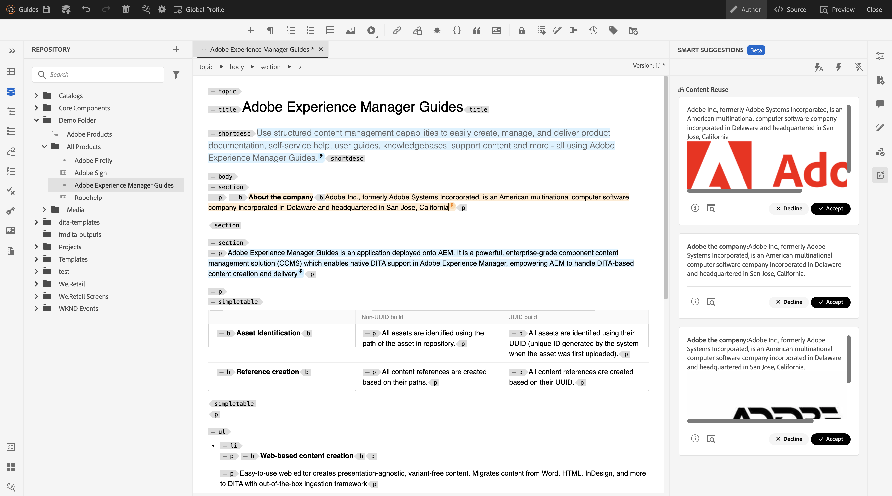

# Nyheter i version 2024.2.0

I den här artikeln beskrivs de nya och förbättrade funktionerna i version 2024.2.0 av Adobe Experience Manager Guides.

En lista över problem som har åtgärdats i den här versionen finns i [Åtgärdade problem i version 2024.2.0](fixed-issues-2024-2-0.md).

Läs mer om [uppgraderingsinstruktioner för version 2024.2.0](upgrade-instructions-2024-2-0.md).

## Smarta förslag som bygger på AI för att lägga till innehållsreferenser när du redigerar innehåll

Nu kan du förbättra redigeringsprocessen med smarta förslag, en ny AI-baserad funktion i Web Editor. När du skapar ditt innehåll ger den här smarta funktionen realtidsförslag på innehållsreferenser, förbättrar ditt arbetsflöde, ökar noggrannheten och säkerställer oöverträffad effektivitet.

För att innehållet ska bli korrekt och konsekvent begränsas sökningen och förslagen till det innehåll som ägs av organisationen och är nära matchade med de nyckelord som du söker efter.

 {width="800" align="left"}

*Visa smarta förslag för att hitta och lägga till matchande innehållsreferenser från din innehållsdatabas.*

Du kan också jämföra det aktuella innehållet med liknande innehåll i andra ämnen. Sedan kan du enkelt välja ut delar av innehållet från olika ämnen och lägga till dem som innehållsreferenser i det aktuella ämnet. Genom att lägga till innehållsreferenserna blir uppdateringarna enklare att hantera, särskilt i större dokumentationsprojekt. Du skapar till exempel en broschyr om de senaste funktionerna i din produkt. I så fall kan du snabbt lägga till de uppdaterade specifikationerna som innehållsreferenser från de relaterade funktionsdokumenten.

Med den här intelligenta funktionen slipper du det manuella arbetet med att söka relaterat innehåll och kan fokusera på att skapa nytt innehåll.  Det bidrar också till att upprätthålla enhetligheten och underlättar också bättre teamsamarbete.

Läs mer om [AI-baserade smarta förslag för att skapa innehåll](../user-guide/authoring-ai-based-smart-suggestions.md).

## Ny funktion för versionshistorik i Web Editor

Nu har Experience Manager Guides en förbättrad funktion för versionshistorik som gör att du kan jämföra ändringar som gjorts i ett dokument över tiden. I den nya vyn sida vid sida kan du enkelt jämföra innehållet och metadata för den aktuella versionen med en tidigare version av samma dokument. Du kan också visa etiketter och kommentarer för de jämförda versionerna. Som administratör kan du styra metadata för versionen av ämnet och deras värden som ska visas i dialogrutan **Versionshistorik**.

{width="800" align="left"}
*Förhandsgranska ändringarna i olika versioner av ett ämne.*

Läs mer om funktionsbeskrivningen för **versionshistorik** i avsnittet [Vänster panel](../user-guide/web-editor-features.md#id2051EA0M0HS).

## Förbättrad användarupplevelse på panelen Översättning

Panelen **Översättning** har förbättrats.  Du kan visa listan **Tillgängliga språk** och snabbt välja den språkinställning som du vill översätta projektet i. Med ett enda val kan du även välja **Markera alla** för att översätta projektet till alla tillgängliga språk.

{width="300" align="left"}

*Välj de språkområden där du vill översätta projektet. Välj standard, baslinje eller den senaste versionen av filer för översättning.*

Läs mer om hur du [översätter innehåll](../user-guide/translation.md).

## Förbättrad söklogik i dialogrutan Infoga element

Nu kan du enkelt hitta elementen i dialogrutan Infoga element.  Du kan skriva en sträng i sökrutan och få en lista över alla giltiga element som börjar med den angivna strängen.

Om du till exempel redigerar ett stycke som du vill infoga kan du söka efter tecknet &#39;t&#39; för att få
alla giltiga element som börjar med t.

{width="300" align="left"}

*Ange ett tecken för att söka efter alla giltiga element som börjar med tecknet.*

Mer information finns i funktionsbeskrivningen för **Infoga element** i avsnittet [Vänster panel](../user-guide/web-editor-features.md#id2051EA0M0HS).

## Möjlighet att dela den aktuella listan och börja med ett nytt listobjekt på samma nivå

Nu kan du enkelt dela upp listan i Web Editor. Välj alternativet **Dela lista** på snabbmenyn för ett listobjekt om du vill dela den aktuella listan. En ny lista skapas på samma nivå, med början från det listobjekt du valde för delningen.

{width="300" align="left"}

*Välj alternativet att dela den aktuella listan.*

Mer information finns i funktionsbeskrivningen för **Infoga lista** i avsnittet [Vänster panel](../user-guide/web-editor-features.md#id2051EA0M0HS).

## Få åtkomst till filegenskaper i källäget för redigering

Nu kan du komma åt funktionen **Filegenskaper** i den högra panelen i alla fyra lägen eller vyer: Layout, Författare, Source och Förhandsgranska.  Detta gör att du kan visa filens egenskaper även när du växlar mellan olika lägen.

Mer information finns i funktionsbeskrivningen för **filegenskaper** i avsnittet [Högerpanel](../user-guide/web-editor-features.md#id2051EB003YK).

## Möjlighet att publicera flera förinställningar med dynamiska baslinjer parallellt

Experience Manager tillhandahåller funktionen för att skapa baslinjer genom att automatiskt välja ämnen enligt den etikett som används på dem. Nu kan du också enkelt publicera flera förinställningar med automatiska baslinjer från samma DITA-karta. Du behöver inte publicera bara en förinställning i taget, men du kan enkelt publicera flera förinställningar parallellt.

## Förbättringar av inbyggda PDF

Följande förbättringar för Native PDF har gjorts i version 2024.2.0:

### Skicka metadata för resurser till utdata från PDF

Experience Manager har nu möjlighet att skicka resursernas metadataegenskaper från DITA-kartan till utdata från PDF.
I utdataförinställningen för PDF kan du välja de metadata som du vill skicka till publiceringsprocessen PDF. Du kan välja både anpassade egenskaper och standardegenskaper.  De markerade metadataegenskaperna skickas till PDF-filen som skapats med PDF.

Den här funktionen är användbar eftersom den hjälper dig att hålla resursegenskaperna som författare, skapandedatum eller dokumenttitel konsekventa. Det gör det enklare att ordna, söka i och kategorisera dokumenten.

Mer information finns i **Avancerade**-inställningar i [Publish PDF-utdata](../web-editor/native-pdf-web-editor.md).

### Använd metadata som lagts till i elementet `topicmeta` för utdata från PDF

Metadatafunktionen i Native PDF kan underlätta innehållshantering och hjälpa till att söka efter filer på Internet.

*Välj ett alternativ för att lägga till och anpassa metadataalternativ.*

Nu har Experience Manager Guides möjlighet att använda de metadata som du har lagt till i elementet `topicmeta` i DITA-kartan för att fylla i metadatafälten i PDF-utdata. Det här alternativet är markerat som standard.

Med den här funktionen blir det enklare att hantera dokument, säkerställa enhetlighet och göra dokumenten sökbara.

Mer information finns på fliken **Metadata** i [Publish PDF-utdata](../web-editor/native-pdf-web-editor.md).
