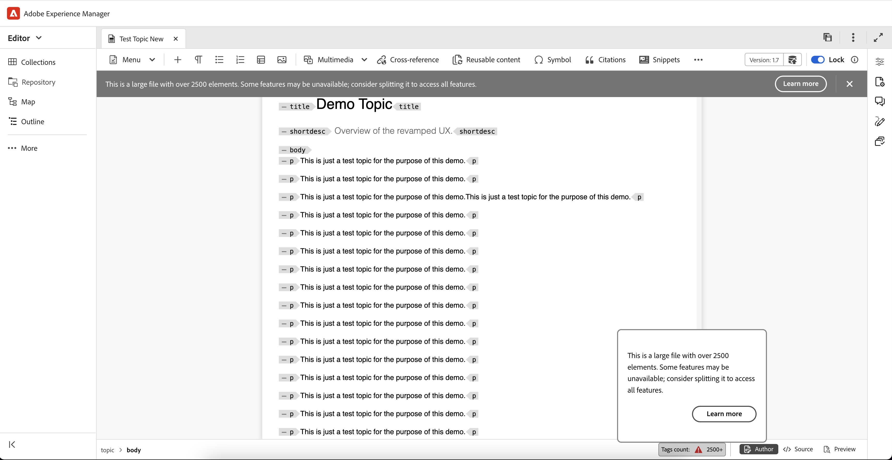

# Nyheter i version 2025.04.0 (april 2025)

I den här artikeln beskrivs de nya och förbättrade funktionerna som introducerades i version 2025.04.0 av Adobe Experience Manager Guides as a Cloud Service.

En lista över problem som har åtgärdats i den här versionen finns i [Åtgärdade problem i version 2025.04.0](fixed-issues-2025-04-0.md).

Läs mer om [uppgraderingsinstruktioner för version 2025.04.0](../release-info/upgrade-instructions-2025-04-0.md).

## Attributet Format har lagts till för referenslänkar

Adobe Experience Manager Guides lägger nu till ett **format**-attribut för referenslänkar i Redigeraren. Det här attributet visas i **Source-vyn** och anger tydligt filtypen, till exempel:

- För filer med tillägget **.pdf** anges formatet till **pdf**
- För filer med tillägget **.html** ställs formatet in på **html**
- För filer med en **.dita** - eller **.ditamap** -fil ställs formatet in på **dita**

Dessutom kommer filer med tillägget **.xml** också att ha formatet **dita**. För filer utan filtillägg lämnas formatet tomt. Dessutom, för alla referenslänkar med ett omfång inställt på **external**, kommer formatet att anges till **html** oavsett filtillägget i referenslänkarna.

## Korrekt kommunikation för stora filer i Redigeraren

Experience Manager Guides meddelar nu att en fil klassificeras som stor fil, och vissa funktioner, som Ångra, Gör om, konturpanelen och den snuskiga markören, kanske inte fungerar som förväntat. Ett varningsmeddelande visas högst upp i gränssnittet för stora filer, vilket visas i utdraget nedan, som anger antalet element baserat på parametern **largeFileTagCount** i filen **uiconfig.json** .

Dessutom visas taggantalet i det nedre fältet, med ett verktygstips när du håller muspekaren över det. Om du väljer fliken **Läs mer** får du detaljerad information om hur du hanterar stora filer. Den här varningen är endast tillgänglig för DITA-filer och är synlig i alla vyer: Författare, Source och Layout.

Mer information finns i [Hantera stora filer i redigeraren](../user-guide/web-editor-other-features.md#handling-large-files-in-the-editor).

{width="800" align="left"}

## Den exporterade baslinjen innehåller nu dokumentläge

Funktionen Exportera baslinje innehåller nu **dokumentläget** tillsammans med nyckeldetaljer som titel, filnamn, filtyp och versionsnummer i ögonblicksbilden av baslinjen. Den här förbättringen förbättrar baslinjehanteringen genom att ge en mer heltäckande översikt över baslinjen.

Mer information finns i [Skapa och hantera baslinjer från kartkonsolen](../user-guide/web-editor-baseline.md#manage-baselines).

## Förbättrad sökfunktion för panelen Återanvändbart innehåll

Experience Manager Guides introducerar en förbättrad sökfunktion i panelen Återanvändbart innehåll. Med den här uppdateringen skannas alla filer som lagts till som återanvändbart innehåll när du söker efter nyckelord, och inte bara de öppna, så att du kan hitta den exakta positionen för nyckelordet i alla förekomster, oavsett om behållarna är öppna eller komprimerade. När du rensar sökfältet behålls dessutom det ursprungliga läget för alla behållare, vilket ger en mer effektiv och användarvänlig sökfunktion.

Mer information finns i [Återanvändbart innehåll](../user-guide/web-editor-features.md#reusable-content).

## DITA OT-versionsuppdatering för mikrotjänstbehållare

För molnmiljöer som har stöd för mikrotjänster kommer vi att gå över till Java 21, vilket säkerställer att de befintliga DITA-OT-processerna och de inbyggda PDF-genereringsprocesserna inte påverkas. Det befintliga arbetsflödet i DITA-OT 3 kommer att fortsätta fungera smidigt med Java 21.  Dessutom kommer DITA-OT 4 att vara helt i drift, vilket gör att man kan generera PDF:er med DITA-OT och PDF, samt producera material för AEM egna webbplatser och andra format.