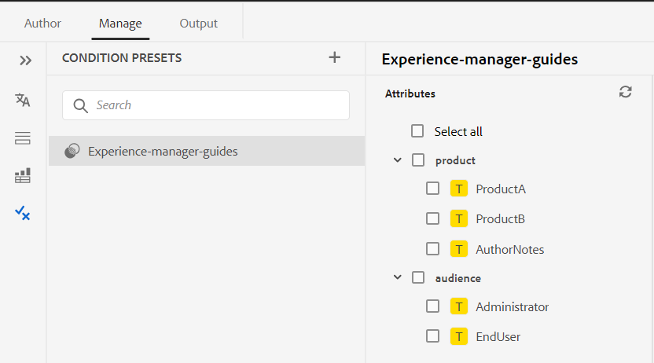
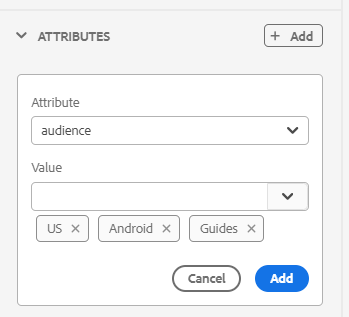
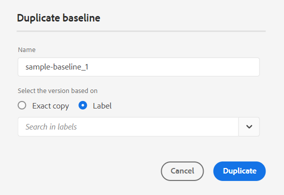
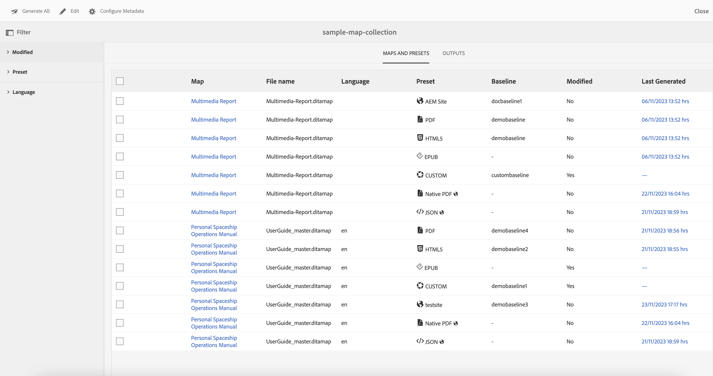
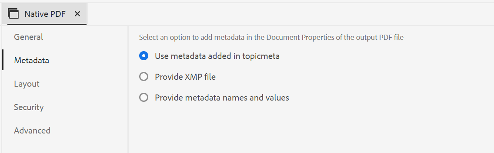

# Nyheter i version 4.4.0 av Adobe Experience Manager Guides (januari 2024)

I den här artikeln beskrivs de nya och förbättrade funktionerna i version 4.4.0 av Adobe Experience Manager Guides (senare kallat *Stödlinjer för Experience Manager*).

Mer information om uppgraderingsinstruktioner, kompatibilitetsmatris och problemen som åtgärdas i den här versionen finns i [Versionsinformation](./release-notes-4-4.md).

## Ny funktion för versionshistorik i Web Editor

Nu har Experience Manager-stödlinjerna en förbättrad funktion för versionshistorik som gör att du kan jämföra ändringar som gjorts i ett dokument över tiden. I den nya vyn sida vid sida kan du enkelt jämföra innehållet och metadata för den aktuella versionen med en tidigare version av samma dokument. Du kan också visa etiketter och kommentarer för de jämförda versionerna. Som administratör kan du styra metadata för versionen av ämnet och deras värden som ska visas i **Tidigare versioner** -dialogrutan.

{width="800" align="left"}
*Förhandsgranska ändringarna i de olika versionerna av ett ämne.*

Läs mer om **Tidigare versioner** funktionsbeskrivning i [Vänster panel](../user-guide/web-editor-features.md#id2051EA0M0HS) -avsnitt.

## Hantera villkorsförinställningar

Du kan definiera villkorsattribut i dina DITA-avsnitt. Använd sedan villkorsattributen i villkorsförinställningen för att publicera innehållet i en DITA-karta. Experience Manager Guides ger nu också en bättre upplevelse i Web Editor, som hjälper dig att skapa och hantera villkorsförinställningar mer effektivt. Du kan också enkelt redigera, duplicera eller ta bort dem.

{width="550" align="left"}

Mer information finns i [Använda förinställningar för villkor](../user-guide/generate-output-use-condition-presets.md).

## Förbättrad upplevelse för att redigera attributen

Nu får du en omgjord upplevelse som lägger till eller redigerar attributen för ett element från **Innehållsegenskaper** i webbredigeraren.

{width="300" align="left"}

*Lägg till attribut från panelen Innehållsegenskaper.*

Du kan också enkelt redigera och ta bort attributen.
Mer information finns i **Innehållsegenskaper** funktionsbeskrivning i [Höger panel](../user-guide/web-editor-features.md#id2051EB003YK) -avsnitt.

## Redigera metadata vid redigering

När du redigerar kan du nu uppdatera filens metadatataggar med hjälp av listrutan i **Filegenskaper** i den högra panelen. Du kan också välja **Redigera fler egenskaper** för att uppdatera fler metadata.

{width="300" align="left"}

*Uppdatera metadata och redigera filegenskaper från den högra panelen.*

Mer information finns i **Filegenskaper** funktionsbeskrivning i [Höger panel](../user-guide/web-editor-features.md#id2051EB003YK) -avsnitt.

## Visa nyckelattribut i Kartvyn

När du definierar nyckelattribut för ämnet eller mappningsreferenserna kan du även visa titeln, motsvarande ikon och nyckeln i den vänstra panelen. Tangenten visas som `key=<key-name>`.

 {width="300" align="left"}

*Visa nyckelattributet i Kartvyn.*

Mer information finns i **Kartvy** funktionsbeskrivning i [Vänster panel](../user-guide/web-editor-features.md#id2051EA0M0HS) -avsnitt.

## Möjlighet att duplicera en baslinje baserat på etikett

Experience Manager Guides ger nu en bättre användarupplevelse när du skapar baslinjer från Web Editor.
Alternativen **Manuell uppdatering** och **Automatisk uppdatering** är mer intuitiva och hjälper dig att enkelt välja mellan att skapa en statisk baslinje eller att uppdatera den automatiskt enligt etiketterna.

 {width="300" align="left"}
*Skapa baslinje i Web Editor.*

Du kan också duplicera en baslinje baserat på etiketten. Referensversionen väljs baserat på den angivna etiketten (om den finns) när du duplicerar, eller också väljs versionen från den duplicerade baslinjen.

 {width="300" align="left"}

*Duplicera en baslinje baserat på en etikett eller skapa en exakt kopia.*

Läs mer om hur [skapa och hantera baslinjer från Web Editor](../user-guide/web-editor-baseline.md).

## Förbättrad kontrollpanel för kartsamling

Stödlinjerna i Experience Manager har en förbättrad kontrollpanel för kartsamling. I en kartsamling kan du snabbt konfigurera flera metadataegenskaper för DITA-kartorna. Den här funktionen är praktisk eftersom du inte behöver uppdatera metadataegenskaperna för varje DITA-karta separat.

Nu kan du visa filnamnet på DITA-kartan. Du kan också visa baslinjerna. På så sätt kan du snabbt hitta den baslinje som används för en förinställning.

{width="800" align="left"}

*Visa, redigera och generera utdata från kartsamlingens kontrollpanel.*

Lär dig hur [använd Map Collection för generering av utdata](../user-guide/generate-output-use-map-collection-output-generation.md).

## Förbättrad översättningspanel

The **Översättning** panelen har förbättrats.  Du kan visa **Tillgängliga språk** och snabbt välja den språkinställning där du vill översätta projektet. Med en enda markering kan du även välja **Markera alla** för att översätta projektet till alla tillgängliga språk.

{width="300" align="left"}

*Välj de språkområden där du vill översätta projektet. Välj standard, baslinje eller den senaste versionen av filer för översättning.*

Läs mer om hur [översätta innehåll](../user-guide/translation.md).

## Förbättrad söklogik i dialogrutan Infoga element

Nu kan du enkelt hitta elementen i dialogrutan Infoga element.  Du kan skriva en sträng i sökrutan och få en lista över alla giltiga element som börjar med den angivna strängen.

Om du till exempel redigerar ett stycke som du vill infoga kan du söka efter tecknet &#39;t&#39; för att få alla giltiga element som börjar med &#39;t&#39;.

{width="300" align="left"}

*Skriv ett tecken för att söka efter alla giltiga element som börjar med tecknet.*

Mer information finns i **Infoga element** funktionsbeskrivning i [Vänster panel](../user-guide/web-editor-features.md#id2051EA0M0HS) -avsnitt.

## Möjlighet att dela upp en lista på samma nivå

Nu kan du enkelt dela upp listan i Web Editor. Välj **Delad lista** på snabbmenyn för ett listobjekt för att dela upp den aktuella listan. En ny lista skapas på samma nivå, med början från det listobjekt du valde för delningen.

{width="300" align="left"}

*Välj alternativet att dela den aktuella listan.*

Mer information finns i **Infoga lista** funktionsbeskrivning i [Vänster panel](../user-guide/web-editor-features.md#id2051EA0M0HS) -avsnitt.

## Frigör enkelt DITA-element

Nu kan du enkelt frigöra ett element med hjälp av alternativet på snabbmenyn för ett element i Web Editor. Det gör det enklare att sammanfoga elementets text med dess överordnade element.
Mer information finns i **Dela upp ett element** från [andra funktioner i Web Editor](../user-guide/web-editor-other-features.md).

## Få åtkomst till filegenskaper i källäget för redigering

Nu kan du komma åt den högra panelens **Filegenskaper** i alla fyra lägena eller vyerna: Layout, Författare, Källa och Förhandsgranska.  Detta gör att du kan visa filens egenskaper även när du växlar mellan olika lägen.

Mer information finns i **Filegenskaper** funktionsbeskrivning i [Höger panel](../user-guide/web-editor-features.md#id2051EB003YK) -avsnitt.

## Visa filer efter namn eller filnamn

Nu kan du välja standardsättet att visa filerna i Web Editor. Du kan visa fillistan efter titlarna eller filnamnen från de olika panelerna i redigeringsvyn.

{width="550" align="left"}

*Ändra standardsättet att visa filerna från **Användarinställningar**-dialogrutan.*

## Återställ filflikar när webbläsaren uppdateras

Stödlinjer i Experience Manager återställer läget för de öppna filflikarna i webbredigeraren när du uppdaterar webbläsaren. Mer information finns i **Uppdatera webbläsaren när filerna redigeras** avsnitt under [Redigera ämnen i Web Editor](../user-guide/web-editor-edit-topics.md).

## Möjlighet att navigera med kortkommandon

Nu kan du använda kortkommandon för att flytta markören i webbredigeraren med hjälp av stödlinjerna i Experience Manager. Du kan använda kortkommandona för att snabbt flytta ett ord åt vänster eller höger. Du kan också gå till början eller slutet av raden med hjälp av kortkommandona.
Nu kan du också använda kortkommandon för att flytta markören till början av nästa element eller till slutet av föregående element.
Läs mer om [kortkommandon i Web Editor](../user-guide/web-editor-keyboard-shortcuts.md).

## Lösa länkar för korsmappning i AEM webbplatsutdata

Korsmappslänkar (XREF med scope-peer) som återges i AEM webbplatsutdata tolkas nu enligt filtiteln för publiceringskontexten som angetts för den genererade kartan.

## Konfigurera URL:en för AEM som ska använda dokumenttiteln

Med hjälp av stödlinjerna i Experience Manager kan du som administratör konfigurera URL:en för AEM webbplatsutdata. Om filnamnet inte finns eller innehåller alla specialtecken kan du konfigurera så att de ersätts med en avgränsare i URL:en för AEM platsutdata. Du kan även ersätta dem med namnet på det första underordnade ämnet. Lär dig hur [konfigurera URL:en för AEM som ska använda dokumenttiteln](../cs-install-guide/conf-output-generation.md#configure-the-url-of-the-aem-site-output-to-use-the-document-title).

## Publicera flera förinställningar parallellt

Experience Manager tillhandahåller funktionen för att skapa baslinjer genom att automatiskt välja ämnen enligt den etikett som används på dem. Nu kan du också enkelt publicera flera förinställningar med automatiska baslinjer från samma DITA-karta. Du behöver inte publicera bara en förinställning i taget, men du kan enkelt publicera flera förinställningar parallellt.

Läs mer om hur [skapa och hantera baslinjer från Web Editor](../user-guide/web-editor-baseline.md).

## Förbättringar av inbyggda PDF

Följande förbättringar av ursprungligt PDF har gjorts i version 4.4.0:

### Använd variabler i PDF-utdata

Du kan använda variabler för att dynamiskt infoga och hantera återanvändbar information. Med stödlinjerna i Experience Manager kan du skapa, redigera och förhandsgranska variabler när du genererar PDF. Du kan snabbt ändra variabelvärdena och göra dokumenten portabla och enkla att uppdatera.

{width="800" align="left"}

*Skapa och hantera variabler i Web Editor.*

Du kan också skapa variabeluppsättningar som åsidosätter standardvärdena och tilldelar alternativa värden till variablerna. Om du infogar dessa variabler i sidlayouten och använder samma PDF-layout behöver du inte skapa separata layouter för varje värdeuppsättning. Du kan till exempel skapa en variabeluppsättning för varje produktrelease. Den här variabeluppsättningen kan bestå av variabler för olika produktdetaljer som produktnamn, versionsnummer och releasedatum. Sedan kan du lägga till olika värden för dessa variabler.

**Variabeluppsättning 1: Adobe-set1**

* ProductName: Experience Manager Guides
* Versionsnummer: 2311
* Releasedatum: 2023-11-02

**Variabeluppsättning 2: Adobe-set2**

* ProductName: Experience Manager Guides
* Versionsnummer: 2310
* Releasedatum: 2023-09-27

*Generera utdata från PDF med hjälp av variabler i layouten PDF.*

Du kan använda format och formatera variablerna med HTML.  Du kan också snabbt uppdatera värdena för variablerna när det behövs och återskapa utdata. Om du till exempel behöver uppdatera informationen för en version kan du redigera värdet för versionen i variabeln VersionNumber och generera om utdata.

Läs mer om hur du använder [variabler i utdata från PDF](../native-pdf/native-pdf-variables.md).

### Sprid metadata för resurser till utdata från PDF

Experience Manager kan nu överföra resursernas metadataegenskaper från DITA-kartan till utdata från PDF.
I utdataförinställningen för PDF kan du välja de metadata som du vill sprida till publiceringsprocessen för PDF. Du kan välja både anpassade egenskaper och standardegenskaper.  De markerade metadataegenskaperna överförs till PDF-filen som skapas med PDF.

Den här funktionen är användbar eftersom den hjälper dig att hålla resursegenskaperna som författare, skapandedatum eller dokumenttitel konsekventa. Det gör det enklare att ordna, söka i och kategorisera dokumenten.

Mer information finns i **Avancerat** inställningarna i [Publish PDF output](../web-editor/native-pdf-web-editor.md).

### Använd metadata som lagts till i `topicmeta` element för utdata från PDF

Metadatafunktionen i Native PDF kan underlätta innehållshantering och hjälpa till att söka efter filer på Internet.

*Välj ett alternativ för att lägga till och anpassa metadataalternativ.*

Nu kan du använda metadata som du har lagt till i Experience Manager-stödlinjerna `topicmeta` -element i DITA-kartan för att fylla i metadatafälten i utdata från PDF. Det här alternativet är markerat som standard.

Med den här funktionen blir det enklare att hantera dokument, säkerställa enhetlighet och göra dokumenten sökbara.

Om du vill veta mer kan du visa **Metadata** i [Publish PDF output](../web-editor/native-pdf-web-editor.md).

### Använda och duplicera färdiga PDF-mallar

Experience Manager Guides innehåller färdiga mallar eller PDF-mallar. Duplicera PDF-mallarna i fabriken för att skapa anpassade PDF-mallar.

Nu kan du även förhandsvisa miniatyrbilden för en mall när du skapar och duplicerar en mall. Du kan också redigera eller ta bort den här bilden. Den här funktionen är användbar när du vill märka ut eller skilja ut mallar med liknande namn.
Läs mer om [PDF-mall](../native-pdf/pdf-template.md).

{width="550" align="left"}

*Duplicera en befintlig PDF-mall.*

### Ändra ordningen på sidorna och publicera flera sidor per ark

Förutom att publicera sidorna enligt källdokumentet kan du även ändra ordningen på sidorna i PDF när du publicerar ett flersidigt dokument.  Detta ger dig flexibilitet att publicera sidorna i olika ordningsföljd, som alla udda eller alla jämna sidor först. Du kan även publicera som ett häfte och läsa sidorna som en bok. Du kan också bestämma hur många sidor du vill publicera på ett enda pappersark. Mer information finns i [Sidorganisation](../native-pdf/components-pdf-template.md#page-organization) -avsnitt.

### Sortera ordlistor baserat på sorteringsnycklar

Nu kan du även sortera ordlistorna baserat på sorteringsnycklar. Du kan använda taggen&quot;sort-as&quot; för att definiera en sorteringsnyckel för ordlistorna. Sedan kan du sortera dem baserat på sorteringsnycklar i stället för villkoren. På så sätt kan du sortera ordlistorna efter termer som används på olika språk. Du kan också definiera en sorteringsnyckel för en ordlista med en fras eller en grupp med ord.
Mer information finns i [Avancerade PDF-inställningar](../native-pdf/components-pdf-template.md#advanced-pdf-settings).

### Förbättrad resurshantering för mallar i Native PDF

Experience Manager Guides har nu förbättrat resurshanteringen för mallar för inbyggda PDF. Nu kan du dela och återanvända resurser, som bilder, CSS-filer och teckensnittsfiler, i flera olika PDF-mallar. I och med den här förbättringen är det mycket enklare att hantera resurser för en stor uppsättning mallar. Du behöver inte skapa dubblettresurser för varje mall, och du kan behålla dem i en delad mapp och använda dem i alla mallar i PDF.
Mer information finns i [PDF-mall](../native-pdf/pdf-template.md).

