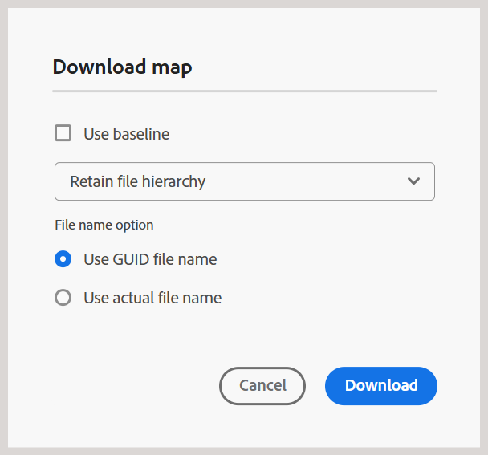

# Nyheter i version 5.1.0 (september 2025)

I den här artikeln beskrivs de nya och förbättrade funktionerna som introducerades i version 5.1.0 av Adobe Experience Manager Guides.

En lista över problem som har åtgärdats i den här versionen finns i [Åtgärdade problem i version 5.1.0](fixed-issues-5-1-0.md).

Läs mer om [uppgraderingsinstruktioner för version 5.1.0](../release-info/upgrade-instructions-5-1-0.md).

## Förbättrat granskningsflöde

I den här versionen har granskningsflödet förbättrats avsevärt för att ge bättre stöd för smidig kommunikation mellan författare och granskare. Viktiga uppdateringar är:

- Arbetsflöden för uppgiftshantering med åtgärdbara meddelanden
- Möjlighet att tagga användare för att omedelbart söka uppmärksamhet
- Åtkomst till projekt- och uppgiftsinformation från granskningspanelen för enkel användning

Med dessa förbättringar kan man nu förvänta sig:

- Effektiva granskningsrundor i rätt tid
- Minskad manuell insats vid utbyte av feedback

Mer information finns i [Introduktion till granskning](../user-guide/review.md)

## Förbättrad upplevelse för att skapa och använda DITAVAL-filer

Uppdateringen innehåller flera förbättringar som gör det enklare att skapa, hantera och använda DITAVAL-filer, vilket ger bättre kontroll över villkorat innehåll och format i olika utdataformat.

De viktigaste högdagrarna är följande:

- **Förbättrat stöd för flaggning i redigering av DITAVAL-filer:** Experience Manager Guides har nya funktioner för anpassning av innehållspublicering tack vare utökat stöd för flaggning i DITAVAL-filer. Du kan nu lägga till start- och slutflaggor runt visst innehåll, inklusive bilder, och utöka flaggade avsnitt med formateringsalternativ som fet, kursiv stil och mycket annat. Om du vill hantera villkorsöverlappningar kan du konfigurera **formatkonflikten**, som bland annat anger en standardbakgrund och en standardtextfärg, vilket ger tydlighet och enhetlighet i utdata. Dessa flaggor stöds fullt ut i PDF-generering, och resultatet återger alla använda formatelement korrekt och fullständigt.
Mer information finns i [Använd DITAVAL-redigeraren](../user-guide/ditaval-editor.md).

  {width="350" align="left"}

- **Flera DITAVAL-filer har stöd för PDF:** För PDF kan nu flera DITAVAL-filer läggas till, som visas som en taggad post för enkel identifiering och borttagning, vilket ger större flexibilitet och kontroll över villkorat innehåll i PDF-utdata

  Uppdateringen förbättrar dessutom framtagningen av förinställningar för utdata genom att aktivera redigerbara DITAVAL-fält i olika format, så att användarna kan ange DITAVAL-sökvägar manuellt.

  Mer information finns i [Förstå förinställningarna](../user-guide/generate-output-understand-presets.md) i Experience Manager Guides.

## Förbättrad publicering

Följande publiceringsförbättringar har gjorts som en del av den nya versionen:

### Förbättrad loggfiltrering för generering av utdata

Den här versionen har förbättrat användargränssnittet för loggfiltrering av utdatagenerering. Du kan nu filtrera loggarna för utdatagenerering bättre för alla fyra distinkta nivåer: **Info**, **Warn**, **Error** (inklusive både fel och undantag) och **Fatal** med förbättrade och intuitiva färgkodade indikatorer som förenklar analys och skärpesynlighet i loggströmmen. Denna förbättring gör att du kan navigera i loggarna mer effektivt och hitta de kritiska problemen med precision.

Mer information finns i [Grundläggande felsökning](../user-guide/generate-output-basic-troubleshooting.md).

{align="left"}

### Tillfälliga filer för publicerade utdata inkluderar nu författar- och publicerings-URL:er i en ny konfigurationsfil

De senaste publiceringsförbättringarna av Experience Manager Guides lägger nu till en ny `system_config.xml`-fil till de temporära filer som genereras när HTML-, PDF- och JSON-utdata publiceras med DITA-OT, liksom utdata från PDF. Den här filen inkluderas automatiskt i publiceringsjobbet och är även tillgänglig via temporära filer när du aktiverar alternativet **Behåll temporära filer** för förinställningarna och genererar utdata.

Filen `system_config.xml` innehåller information om AEM-instanser, inklusive författar-URL, lokal URL och publicerings-URL, som ger tydligare kontext och förbättrar spårbarheten för hämtade URL:er.

Mer information finns i [Förstå förinställningarna](../user-guide/generate-output-understand-presets.md).

### Nytt stöd för variabeln output path för generering av utdata

I den här uppdateringen introduceras dynamisk `output path`-konfiguration för utdataförinställningar som PDF, DITA-OT PDF, JSON, HTML5 och Custom. I stället för att använda en fast sökväg kan användare nu definiera utdataplatsen med variabeln `${base_output_path}` under installationen, vilket ger större flexibilitet. Den tidigare standardsökvägen `/content/dam/fmdita-outputs` är inte längre obligatorisk.

Alla utdatasökvägar som är associerade med förinställningarna för den globala mappprofilen migreras automatiskt så att den nya basvariabeln för utdatasökväg används. För anpassade mappprofiler är dock migreringen inte automatisk. Du rekommenderas att kontakta Customer Success-teamet för att få hjälp.

Mer information finns i [Förstå förinställningarna](../user-guide/generate-output-understand-presets.md).

### Den exporterade baslinjen innehåller nu dokumentläge

Funktionen Exportera baslinje innehåller nu **dokumentläget** tillsammans med nyckeldetaljer som titel, filnamn, filtyp och versionsnummer i ögonblicksbilden av baslinjen. Den här förbättringen förbättrar baslinjehanteringen genom att ge en mer heltäckande översikt över baslinjen.

Mer information finns i [Skapa och hantera baslinjer från kartkonsolen](../user-guide/web-editor-baseline.md#manage-baselines).

### Stöd för baslinjedriven inkrementell publicering via kartpanelen för AEM Sites-utdata med äldre komponentmappning

Processen för att skapa inkrementella utdata har förbättrats med stöd för publicering av specifika versioner av ämnen som definierats i den valda baslinjen för AEM-webbplatser med hjälp av äldre komponentmappning, vilket säkerställer korrekt spridning av innehållet i utdata.

Mer information finns i [Inkrementell utdatagenerering](../user-guide/generate-output-aem-site.md).

## Förbättringar i redigeraren

Följande redigeringsförbättringar har gjorts som en del av den nya versionen:

### Förbättrad sökfunktion för panelen Återanvändbart innehåll

Experience Manager Guides introducerar en förbättrad sökfunktion i panelen Återanvändbart innehåll. Med den här uppdateringen skannas alla filer som lagts till som återanvändbart innehåll när du söker efter nyckelord, och inte bara de öppna, så att du kan hitta den exakta positionen för nyckelordet i alla förekomster, oavsett om behållarna är öppna eller komprimerade. När du rensar sökfältet behålls dessutom det ursprungliga läget för alla behållare, vilket ger en mer effektiv och användarvänlig sökfunktion.

Mer information finns i [Återanvändbart innehåll](../user-guide/web-editor-features.md#reusable-content).

### Attributet Format har lagts till för referenslänkar

Adobe Experience Manager Guides lägger nu till ett **format**-attribut för referenslänkar i Redigeraren. Det här attributet visas i **Source-vyn** och anger tydligt filtypen, till exempel:

- För filer med tillägget **.pdf** anges formatet till **pdf**
- För filer med tillägget **.html** ställs formatet in på **html**
- För filer med en **.dita** - eller **.ditamap** -fil ställs formatet in på **dita**

Dessutom kommer filer med tillägget **.xml** också att ha formatet **dita**. För filer utan filtillägg lämnas formatet tomt. Dessutom, för alla referenslänkar med ett omfång inställt på **external**, kommer formatet att anges till **html** oavsett filtillägget i referenslänkarna.

### Förbättrade hämtningsalternativ för kartor i Redigeraren

Experience Manager Guides introducerar ett nytt **Använd faktiska filnamn**-alternativ i dialogrutan **Hämta karta**. När du laddar ned kartfiler kan du nu välja att behålla originalfilnamnen i stället för standard-UID:n, vilket gör det mycket enklare att identifiera och hantera filerna. Det här alternativet är bara tillgängligt om du väljer **Behåll filhierarkin** och är inaktiverat när du väljer **Förenkla filhierarkin**, vilket ger dig större flexibilitet när du ordnar dina hämtade kartor.

Mer information finns i [Hämta filer](../user-guide/authoring-download-assets.md#download-a-dita-map-file-from-the-editor).

{width="300" align="left"}

### Sessionstidsfråga för att förhindra oavsiktlig innehållsförlust

Ett popup-meddelande meddelar dig nu när din Adobe Experience Manager-session upphör att gälla och du är utloggad på grund av inaktivitet. Det här meddelandet utlöses när du försöker redigera innehåll i Experience Manager Guides efter att sessionen har avslutats. Funktionen minskar risken för att förlora osparat arbete och förbättrar den övergripande tillförlitligheten och flödet i upplevelsen, även under inaktivitetsperioder.

Läs mer om [timeout-fråga för sessioner](../user-guide/session-timeout-prompt.md) i Experience Manager Guides.

### Förbättrad `navref`-hantering i redigeraren

De senaste förbättringarna av redigeraren förbättrar hanteringen av `navref` element i en DITA-karta. När du lägger till ett `navref`-element på en karta öppnas dialogrutan **Välj sökväg** så att du enkelt kan välja vilka kartreferenser som ska inkluderas som navigeringslänkar på kartan. När du har lagt till titeln för den tillagda kartan visas den i både redigeringsvyn och layoutvyn, vilket ger bättre synlighet för den inkluderade navigeringen vid redigering.  Dessutom tolkas det tillagda `navref`-elementet automatiskt så att den refererade kartan visas i redigeraren.

Mer information finns i [Lägg till navigeringsreferenser](../user-guide/map-editor-other-features.md#add-navigation-references).

### Förbättringar av användargränssnittet i redigerarens verktygsfält och användarinställningar

I den här versionen har inställningarna på **användarinställningarna** på startsidan för flikarna Allmänt och Utseende omstrukturerats. Det innebär att etiketten **Öppnar inställningar för Kartor** byts namn och att växlingen för hårda blanksteg flyttas till redigerarens verktygsfält.

I redigerarens verktygsfält finns dessutom några snabbredigeringsreglage för att aktivera eller inaktivera Spåra ändringar, Taggar och Ej brytande mellanslag nu grupperade under alternativet **Visa** i menylistrutan för bättre användbarhet.

Mer information finns i [Verktygsfältet i redigeraren](../user-guide/web-editor-toolbar.md#menu-dropdown).

