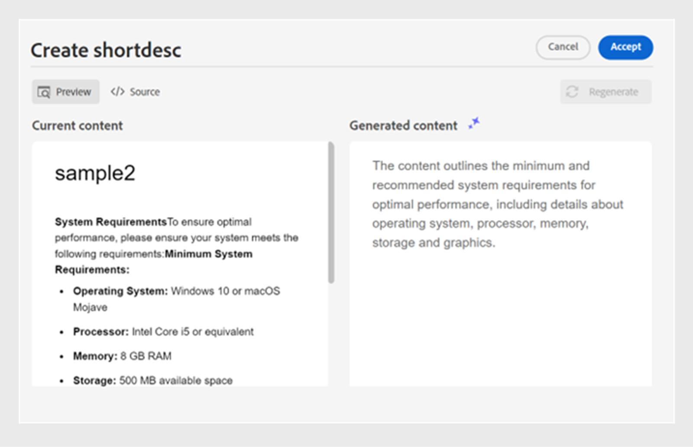

# Skapa dokument smart med AI Assistant (Beta)

Adobe Experience Manager Guides har ett AI Assistant-verktyg som hjälper dig att skapa smartare och snabbare. Använd det här verktyget för att visa de smarta förslagen för att återanvända innehållet från den befintliga innehållsdatabasen. Använd textpromptfunktionen för att få en fråga och ändra innehållet efter dina behov. Använd AI Assistant för att konvertera ett stycke till en lista på ett smart sätt. Du kan skapa en kort beskrivning av det aktuella ämnet baserat på det markerade innehållet. Den här funktionen hjälper dig även att enkelt förbättra och översätta det markerade innehållet.

>[!NOTE]
>
> Den här redigeringsfunktionen är bara tillgänglig för DITA-avsnitt och kan bara nås från redigeringsgränssnittet. På hemsidan och kartkonsolen visas bara panelen **Hjälp**. De alternativ som är tillgängliga under redigeringsfunktionen konfigureras på mappprofilnivå av administratörer med hjälp av inställningarna för Workspace.

När du har markerat texten i ett ämne kan du välja att utföra någon av AI-assistentåtgärderna:

{width="300" align="left"}

## Föreslå återanvändbart innehåll

Använd funktionen **Föreslå återanvändbart innehåll**  för att skapa innehåll på ett konsekvent och korrekt sätt. Du kan markera innehållet och Experience Manager Guides ger förslag på hur du kan återanvända det befintliga innehållet i din databas.
Läs mer om hur du använder [AI-baserade smarta förslag för att skapa innehåll](authoring-ai-based-smart-suggestions.md).

## Använd textfråga

En textprompt är en instruktion, fråga eller programsats som guidar AI-assistenten att generera ett specifikt svar.

Du kan använda en textprompt för att ändra innehållet. Du kan till exempel markera innehållet i det aktuella ämnet och använda uppmaningen *Gör texten mer koncis*. På samma sätt kan du använda en textprompt för att lägga till ett attribut till taggen som används i det markerade innehållet.

1. Markera den text som du vill använda textprompten för.
1. Välj **Använd textprompt**  på **redigeringspanelen**.
1. Gör en fråga på något av följande sätt:

   - Välj en fråga bland de föreslagna uppmaningarna.
   - Granska eller redigera en föreslagen fråga för att skapa en anpassad fråga enligt dina önskemål.

     >[!NOTE]
     >
     > De föreslagna uppmaningarna har konfigurerats i `ui_config.json` av din administratör.

   - Skriv uppmaningen i textrutan.

1. Välj **Återskapa**  för ytterligare svar eller utdata baserat på uppmaningen.

1. (Valfritt) Välj **Expandera**  för att öppna redigeraren för **Använd textprompt**. Den visar det aktuella och det genererade innehållet. Du kan redigera innehållet i källayouten och kontrollera förhandsvisningen.

   

   >[!NOTE]
   >
   > Svaren genereras baserat på det valda innehållet.

1. Du kan också redigera uppmaningen i redigeraren och generera om svaret. Du kan till exempel ändra uppmaningen så att texten blir mer kortfattad till ungefär 40 ord.

1. Du kan verifiera källan för det genererade innehållet och redigera den om det behövs.

1. Välj **Acceptera** om du vill ersätta det markerade innehållet i ämnet med det genererade innehållet.
1. **Avbryt**: Avbryter textpromptåtgärden. Återgår till redigeringspanelen.

   >[!NOTE]
   >
   > Om du väljer ikonen **Stäng** på redigeringspanelen återgår du till det ursprungliga läget för AI-assistenten.

## Förbättra innehållet

Använd funktionen **Förbättra innehåll** för att förbättra kvaliteten på det markerade innehållet i det aktuella ämnet. Du kan markera innehållet för att kontrollera stavning, språk och grammatisk struktur och föreslå en bättre version av innehållet. Det förbättrar också meningens kvalitet.

1. Markera innehållet.
1. Välj **Förbättra innehåll**  om du vill hitta förslag på det förbättrade innehållet.
1. Välj **Återskapa** om du vill ha ett annat förslag på förbättrat innehåll.

1. (Valfritt) Välj **Expandera** för att öppna den förbättrade innehållsredigeraren. Den visar aktuellt och genererat innehåll. Du kan redigera innehållet i källayouten och även kontrollera förhandsvisningen.

   

Acceptera förslaget, redigera svaret i källvyn innan du godkänner det, generera om för ett annat svar eller avbryt åtgärden för att återgå till föregående läge.

## Skapa kortkommandon

Skapa en kort beskrivning av ämnet baserat på det valda innehållet med ca 30-50 ord. Den korta beskrivningen hjälper användarna att söka efter och hitta relevant innehåll.
Du kan till exempel lista systemkraven och generera en kort beskrivning utifrån detta.

1. Markera innehållet.
1. Välj **Skapa genvägar**  om du vill skapa en kort beskrivning av det aktuella ämnet.
1. Välj **Acceptera** om du vill skapa en ny kort beskrivning om den korta beskrivningen inte redan finns. Om det finns en kort beskrivning måste du bekräfta den innan du ersätter den med den nya korta beskrivningen.

Du kan även utföra följande åtgärder:

- Välj **Generera om** om du vill generera en annan kort beskrivning av ämnet.
- Välj **Expandera** för att öppna redigeraren för **Skapa genvägar**.

  

## Specificera innehåll

Med den här funktionen konverteras ett markerat stycke till en lista på ett intelligent sätt.  Innehållet analyseras och en logisk lista med objekt skapas. Du behöver inte skapa objekten manuellt. Om du t.ex. har ett stycke med information om stegen för att skapa ett användarkonto, kan verktyget omvandla detta till en stegvis lista, vilket eliminerar behovet av att manuellt skapa objekten en i taget.

1. Markera innehållet.
1. Välj **Specificera innehåll**  om du vill konvertera det markerade innehållet till en lista.
Med redigeringsverktyget på AI-assistentpanelen kan du konvertera innehållet på ett smart sätt till en lista med objekt.
1. (Valfritt) Välj **Expandera** för att öppna redigeraren **Specificera innehåll**.
1. När listan är klar godkänner du ändringarna i det genererade innehållet. Det genererade innehållet ersätter det markerade innehållet.

## Översätta innehåll

Använd den här intelligenta funktionen för att översätta det markerade innehållet till målspråket, vilket gör det mycket användbart när du lägger till anteckningar på olika språk. Du kan till exempel lägga till innehåll på engelska och snabbt översätta det till arabiska.

Utför följande steg för att översätta innehållet:

1. Markera innehållet som du vill översätta.
1. Välj **Översätt innehåll**  på panelen **Redigering**.
1. Välj målspråk i listrutan. Det översatta innehållet visas på AI-assistentpanelen.

1. (Valfritt) Välj **Expandera** för att öppna redigeraren för **Översätt innehåll**.
1. Du kan också välja ett annat språk i listrutan och återskapa innehållet på det valda språket. Om du t.ex. väljer franska och sedan **Återskapa** översätts innehållet till franska.

