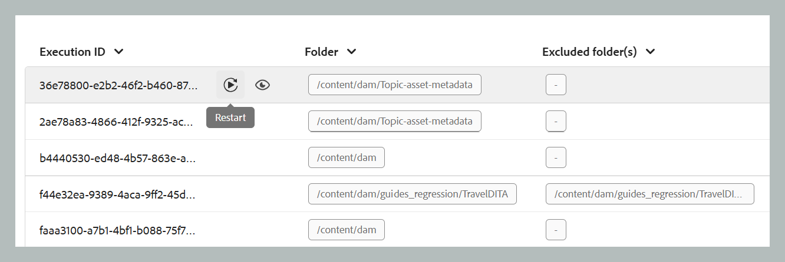
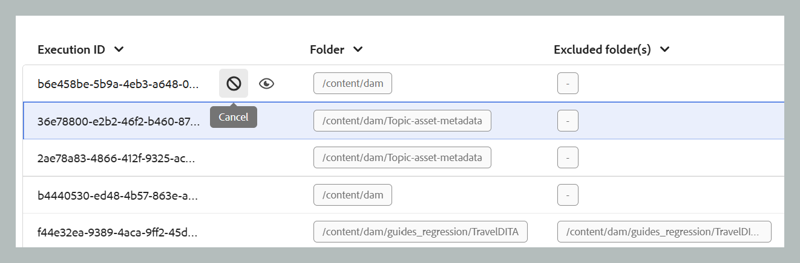

# Bearbeta resurser

I dataintensiva arbetsflöden som publicering är effektiv resurshantering avgörande för att upprätthålla prestanda och tillförlitlighet. Arbetsflödet för bearbetning av resurser är utformat för att hantera användarspecifika resurser som kräver omfattande dataåtgärder. Det gäller främst två fall: när den inledande bearbetningen misslyckas på grund av fel eller när filerna inte bearbetas eftersom ingen resurshanteringsutlösare initierades. Genom att aktivera målstyrd bearbetning på mappnivå kan användarna isolera och bearbeta endast de nödvändiga resurserna, och därigenom undvika onödiga beräkningar. Denna selektiva metod förbättrar prestanda avsevärt och minskar tiden som krävs för kritiska operationer som publicering och rapportgenerering. På det hela taget bidrar det till ökad effektivitet och snabbare hantering av komplexa datauppgifter.

>[!NOTE]
>
> - För stora datauppsättningar är det bäst att köra bearbetningen under tider med låg belastning för att undvika att påverka systemets prestanda. När bearbetningsuppgiften har slutförts kan du granska informationen för att analysera resultaten. 
>- Systemet utlöser resursbearbetning för mappen `/content/dam` var 15:e minut. Under varje cykel hämtas och bearbetas resurser som nyligen har lagts till eller varit obearbetade under det senaste 15-minutersperioden. [Konfigurera funktionen för bearbetning av resurser](../cs-install-guide/configure-asset-processing-cs.md) om du vill konfigurera den automatiska vyn för bearbetning av resurser.

## Bearbetar resurserna

Följ stegen nedan för att bearbeta resurserna:

1. Markera Adobe Experience Manager logotyp överst och välj **Verktyg**.
1. Välj **Stödlinjer** på panelen **Verktyg**.
1. Markera rutan **Gruppbearbetare**.

   {align="left"}

1. Fönstret Guides Bulk Processor öppnas med informationen som visas nedan. I det här fönstret visas bara den information som gäller de senaste fem migreringarna.

   - **Funktionstyp**: Visar funktionen för den process som körs.

   - **Körnings-ID**: Det är det unika ID:t för varje bearbetningsåtgärd som du utför.

   - **Mapp**: Visar den mapp som har valts för bearbetning.

   - **Exkluderade mappar**: Visar den mapp som är exkluderad från bearbetning.

   - **Skapad av**: Visar vem som skapade uppgiften eller processen. Det kan vara både du och systemet.

   - **Starttid:** Visar datum och tid då bearbetningsprocessen initieras.

   - **Sluttid**: Visar datum och tid då bearbetningsprocessen avslutas.

   - **Status**: Visar status för pågående bearbetning, slutförd eller Avbruten.

   {align="left"}

1. Välj fliken **Ny process** längst upp till höger i fönstret om du vill starta en ny bearbetningsåtgärd.

   Dialogrutan **Ny process** öppnas.

   {width="350" align="left"}

1. Ange följande information i dialogrutan:

   1. **Funktionstyp**: Välj **Resursbearbetning** i listrutan.
   1. **Välj mappar och filer**: Navigera och välj en eller flera mappar och filer som ska bearbetas.
   1. **Välj mappar som ska ignoreras**: Om du vill kan du välja att undermappar i den valda överordnade mappen ska exkluderas från bearbetning.
   1. **Resurstyp**: I listrutan väljer du den specifika resurstyp som ska bearbetas (t.ex. DITA-ämne, DITA-karta, Markdown, HTML/CSS, DITAVAL eller andra filer). Endast den valda resurstypen bearbetas från mappen/mapparna som du angav tidigare.
Exempel: Om du väljer DITA-ämne bearbetas endast DITA-ämnen i den valda mappen, vilket aktiverar riktad filtrering.
   1. **Skapad efter/Skapad före**: Använd datumfilter för att bearbeta resurser som skapats inom den angivna tidsramen.

   >[!NOTE]
   >
   > Om en process redan körs för en mapp kan du inte starta en ny process för samma mapp förrän den aktuella uppgiften har slutförts.

1. Välj **Skapa**. Du får ett popup-fönster som visar **Slutfört och processen har utlösts**. Du kan se statusen för bearbetningsaktiviteten i fönstret.

   {width="350" align="left"}

## Ytterligare alternativ för bearbetning av resurser

Det finns fler alternativ för bearbetningsuppgiften när den har initierats. Du kan komma åt dessa alternativ genom att hovra över uppgifternas körnings-ID. Mer information om dessa alternativ finns nedan:

- **Starta om** : Startar om den tidigare slutförda resurshanteringsuppgiften.

  {width="650" align="left"}

- **Återuppta** : Återupptar den tidigare avbrutna eller misslyckade resurshanteringen.

  {width="650" align="left"}

- **Avbryt** : Avbryter den pågående resurshanteringen.

  {width="650" align="left"}

- **Visa loggar**: Visar loggarna för resurshanteringsuppgiften. För pågående uppgifter visar loggen detaljerad bearbetningsinformation, inklusive uppskattad återstående tid och resursstatus. Den här logglistan visar upp till de senaste 500 posterna. Den fullständiga loggen kan laddas ned.

  {width="650" align="left"}
