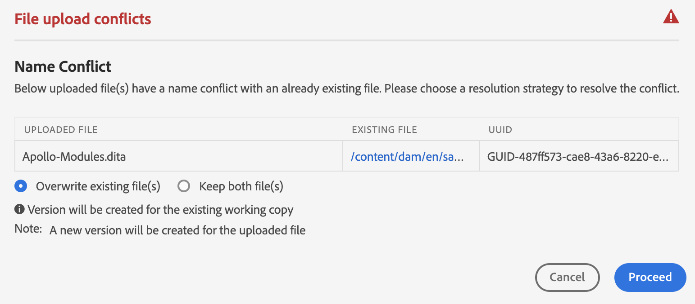
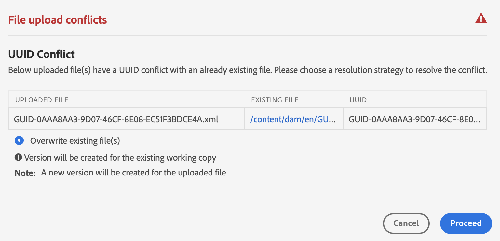

# Hantera filer och mappar {#id2116G0L08XA}

I det här avsnittet beskrivs hur Adobe Experience Manager Guides hanterar de grundläggande filåtgärderna, som kopiera, klistra in, dra och släppa samt ta bort filer. Följande scenarier är möjliga:

## Kopiera och klistra in filer

**Om filen har ett läsbart filnamn**

- *Om filen med samma namn inte finns i målmappen* skapas en ny kopia av filen och ett UUID tilldelas den också. Här är filnamnet detsamma som det ursprungliga filnamnet.
- *Om filen med samma namn redan finns i målmappen* skapas en ny kopia av filen med suffixet \(som filnamnet0.extension\). Ett UUID tilldelas också till den nya filen.

**Om filnamnet baseras på ett UUID-mönster**

- *Om filen med samma namn inte finns i målmappen* skapas en ny kopia av filen och ett nytt UUID tilldelas den på den nya platsen. Här är filnamnet samma som UUID.
- *Om filen med samma namn redan finns i målmappen* skapas en ny kopia av filen och ett nytt UUID tilldelas den också. Filnamnet är samma som UUID.

## Kopiera och klistra in mappar

**Kopiera och klistra in mapp på samma plats**

- *Mappen innehåller filer med läsbara filnamn*: En ny kopia av mappen skapas med suffixet \(som mappnamn0\). Ett nytt UUID tilldelas också till filerna i mappen. Filnamnen ändras dock inte.

- *Mappen innehåller filer med filnamn som baseras på ett UUID-mönster*: En ny kopia av mappen skapas med suffixet \(som mappnamn0\). Ett nytt UUID tilldelas också till alla filer i den nya mappen. Filnamnen ändras också. Filnamnen är desamma som det nya UUID:t.

**Kopiera och klistra in mapp på en annan plats**

- *Mappen innehåller filer med läsbara filnamn*: En ny kopia av mappen skapas och ett nytt UUID tilldelas till alla filer i mappen på den nya platsen. Här ändras inte mapp- eller filnamnen.

- *Mappen innehåller filer med filnamn som baseras på ett UUID-mönster*: En ny kopia av mappen skapas med samma namn som den ursprungliga mappen. Ett nytt UUID tilldelas också till alla filer i den nya mappen. Filnamnen ändras också. Filnamnen är desamma som det nya UUID:t.

**Meddelandet och meddelandet har slutförts**

Kopiera och klistra in-åtgärden för mappar i Assets-gränssnittet körs asynkront i bakgrunden, vilket gör att du kan fortsätta arbeta medan begäran bearbetas i systemet. Ett popup-meddelande visas som anger att processen har initierats.

{width="350" align="left"}

När åtgärden är slutförd utlöses ett meddelande om att åtgärden lyckades eller misslyckades för att ange om den misslyckades.

{width="650" align="left"}

## Dra och släppa filer

**Dra och släpp med läsbara filnamn**

- *Dra och släpp på samma plats*: Du får alternativen att **Skriv över befintlig fil\)**, **Behåll båda filer\)** och ett alternativ för att skapa en version av den befintliga arbetskopian.

  {width="650" align="center"}

  Om du väljer alternativet **Skriv över befintlig fil\** ersätter filen som överförs den aktuella arbetsversionen av den befintliga filen på den ursprungliga platsen. UUID skapas eller ändras inte.

  Om du väljer alternativet **Behåll båda filerna\)** skapas en ny kopia av filen med suffixet \(som filnamn0.extension\). Ett nytt UUID tilldelas också till den nyligen kopierade filen.

  Om du väljer alternativet Skriv över befintlig fil, och väljer alternativet att skapa en version från den befintliga arbetskopian, skapas även en ny version från arbetskopian av dokumentet.

  >[!NOTE]
  >
  > Funktionen **Skapa ny version för den överförda filen** måste aktiveras av administratören. Om den här funktionen är aktiverad skapas en ny version för den överförda filen. Om alternativet är avmarkerat skapas ingen version av den överförda filen. Mer information finns i avsnittet *Skapa ny version för överförd fil* i Installera och konfigurera Adobe Experience Manager Guides as a Cloud Service.

  Om en fil redan har checkats ut av en annan användare för redigering, och du försöker överföra och skriva över den befintliga filen, misslyckas den och visar ett fel.

  >[!NOTE]
  >
  >Funktionen **Skriv över utcheckad fil vid överföring** måste inaktiveras av administratören. Om den här funktionen är aktiverad kan du skriva över utcheckade filer. Om funktionen inte är aktiverad går det inte att skriva över en utcheckad fil. Mer information finns i avsnittet *Skriv över utcheckad fil vid överföring* i Installera och konfigurera Adobe Experience Manager Guides as a Cloud Service.

- *Dra och släpp filer på en annan plats*: En ny kopia av filen skapas och ett nytt UUID tilldelas också till den nya platsen. Här är filnamnet detsamma som det ursprungliga filnamnet.

**Dra och släpp med filnamn som baseras på ett UUID-mönster**

*Dra och släpp filen på samma plats*: Du får alternativen att **Skriv över befintlig fil\)** tillsammans med alternativet att skapa en version av den befintliga arbetskopian.

{width="650" align="center"}

När filen skrivs över ändras inte filnamnet eller dess UUID.

Om du väljer alternativet **Skapa version för den befintliga arbetskopian** skapas en ny version av arbetskopian av dokumentet. Den nya filen överförs, en ny version av filen skapas också och den skapas som arbetskopia av dokumentet.

Funktionen **Skapa ny version för den överförda filen** måste aktiveras av administratören. Om den här funktionen är aktiverad skapas en ny version för den överförda filen. Om alternativet är avmarkerat skapas ingen version av den överförda filen. Mer information finns i avsnittet *Skapa ny version för den överförda filen* i Installera och konfigurera Adobe Experience Manager Guides as a Cloud Service.

*Dra och släpp fil på en annan plats*: Du får alternativen för att **Skriva över befintlig fil\)**, **flytta fil\(er\) till ny plats** och ett alternativ för att skapa en version av den befintliga arbetskopian.

{width="650" align="center"}

Om du väljer alternativet **Skriv över befintlig fil\** ersätts den befintliga filen på den ursprungliga platsen av filen som överförs. UUID skapas eller ändras inte.

Om du väljer alternativet **Flytta fil\(er\) till ny plats** flyttas den befintliga filen till den aktuella platsen och skrivs sedan över med filen som överförs. När du flyttar en fil till den nya platsen bryts inte befintliga referenser från eller till filen.

Om du väljer alternativet att skapa en version från den befintliga kopian när du ersätter eller flyttar filerna skapas en ny version från arbetskopian av dokumentet. Den nya filen ersätts antingen på den befintliga platsen eller flyttas till den nya platsen.

## Flytta flera filer samtidigt {#move-files-bulk}

Experience Manager Guides har ett verktyg för flyttning av flera filer som hjälper en administratör att flytta en mapp med ett stort antal filer från en plats till en annan. Med det här verktyget kan du enkelt flytta filer i en eller flera mappar till en annan mapp i din Adobe Experience Manager-databas. En av de viktigaste funktionerna i det här verktyget är att det inte bara flyttar ett stort antal filer, det bevarar även referenserna till och från de filer som flyttas. Du kan ändra antalet filer som du kan flytta i grupper utan att det påverkar redigerings- och publiceringsåtgärderna.

>[!NOTE]
>
> Verktyget för flyttning av grupp fungerar bara på mappnivå. Om du vill flytta enskilda avsnitt eller kartfiler använder du det vanliga flyttverktyget från Adobe Experience Manager Assets-gränssnitt.

Här är några av funktionerna som finns i verktyget Flytta satsvis:

- Du kan justera antalet filer som ska bearbetas i varje grupp. Detta kan kräva att du kör några tester innan du kommer fram till ett optimalt nummer som systemet enkelt kan hantera.
- Redigerings- och publiceringstjänsterna går smidigt utan avbrott i flyttningen.
- Ha fullständig kontroll över tidsintervallet mellan efterföljande batchprocesser av typen \(körning av\). Med det här tidsintervallet säkerställs att efterbearbetningen slutförs innan nästa grupp med filer startas.

- Automatisk hantering av mappar med samma namn. Den här funktionen ser till att även om det finns mappar med samma namn som flyttas, skrivs de inte över.

- Automatisk hantering av referenser till och från de filer som flyttas.

Du måste tänka på följande innan du kör gruppbearbetningen:

- Om du planerar att flytta ämnen som är under granskning måste du stänga granskningsprocessen för alla sådana ämnen innan du flyttar dem. Granskningsprocessen avbryts om granskningsåtgärden inte stängs.
- Du får bara köra en enskild massflyttningsåtgärd på systemet när som helst. Detta säkerställer att referenser till och från ämnen som flyttas hanteras på rätt sätt.

Så här flyttar du flera filer samtidigt:

1. Markera Adobe Experience Manager logotyp överst och välj **Verktyg**.
1. Välj **Stödlinjer** i listan över verktyg.
1. Markera rutan **Flytta satsvis**.
1. Sidan Verktyg för flyttning av grupp visas baserat på dina inställningar. Ange följande information på sidan **Verktyg för massflyttning**:

   

   
 Molntjänster och lokalt UUID-baserat filsystem 

   {width="650" align="center"}

   >[!TIP]
   >
   > Välj    i närheten av ett fält för att visa mer information om det.

   - **Lägg till suffix i dubblettmappar**: Om du flyttar mappar med samma namn måste du välja det här alternativet. I den föregående skärmbilden innehåller till exempel sökvägen **Source** namnet på de mappar som ska flyttas. Mappen med namnet topic finns på två olika platser - test-A och test-B. När du väljer det här alternativet flyttas mapparna. Den första flyttade mappen får namnet topic medan den andra mappen får namnet topic0. Flyttåtgärden lägger till ett suffix i sekventiell serie \(0, 1, 2 och så vidare\) i mapparna med samma namn.

     Om du flyttar mappar med samma namn utan att markera det här alternativet avbryts åtgärden med ett meddelande.

   - **Source-sökväg\**: Ange platsen för de mappar som du vill flytta.

      - Välj **Bläddra i mapp**      för att öppna dialogrutan **Markera bana** . Markera de mappar som du vill flytta och välj **Markera** för att slutföra processen. Du kan markera flera mappar som placerats på olika platser i sökvägsläsaren. Sökvägen till de valda mapparna behålls så att du enkelt kan granska och ändra dem när du öppnar dialogrutan igen.

      - Du kan också skriva eller kopiera och klistra in källplatsen. Tryck på Retur för att lägga till mappen i listan.

        De markerade mapparna visas tillsammans med sökvägen. Håll muspekaren över mapptaggen för att visa hela sökvägen.
      - Du kan även ta bort mappar genom att välja **Ta bort**  nära mappen.

   - **Målsökväg**: Ange platsen där du vill flytta källmapparna.

      - Välj **Bläddra i mapp**  om du vill öppna dialogrutan Bläddra efter filer. Välj den plats där du vill flytta källmapparna. och väljer Markera för att slutföra processen.
      - Du kan också skriva eller kopiera och klistra in målsökvägen.

     Den markerade mappen visas tillsammans med sökvägen i textrutan.

   - Välj **Massflyttning**.

     Systemet börjar flytta filer från källan till målplatsen. När processen är klar visas en sammanfattning av flyttprocessen till höger på sidan.

     {width="650" align="center"}

   

   

   
 Lokalt icke-UID-baserat filsystem 

   {width="650" align="center"}

   >[!TIP]
   >
   > Välj    i närheten av ett fält för att visa mer information om det.

   - **Batchstorlek**: Ange antalet filer som ska flyttas i en enda grupp. Standardvärdena om det finns 50 filer.
   - **Vilointervall (sekunder)**: Ange tiden i sekunder som processen väntar innan nästa batch startas. Under vilolägestidsintervallet korrigeras referenserna till och från de flyttade filerna. Standardintervallet för strömsparläge är 60 sekunder.

   - **Lägg till suffix i dubblettmappar**: Om du flyttar mappar med samma namn måste du välja det här alternativet. I den föregående skärmbilden innehåller till exempel **Source-sökvägen** namnet på mapparna som ska flyttas. Mappen med namnet topic finns på två olika platser - test-A och test-B. När du väljer det här alternativet flyttas mapparna. Den första flyttade mappen får namnet topic medan den andra mappen får namnet topic0. Flyttåtgärden lägger till ett suffix i sekventiell serie \(0, 1, 2 och så vidare\) i mapparna med samma namn.

     Om du flyttar mappar med samma namn utan att markera det här alternativet avbryts åtgärden med ett meddelande.

   - **Uppdatera referenser för utcheckade filer**: Om du flyttar mappar som innehåller utcheckade filer bör du välja det här alternativet. Om du väljer det här alternativet kommer alla filer som är utcheckade att sparas och checkas in med en ny revision. Den nya revisionen flyttas sedan till målplatsen.

     Om du inte markerar det här alternativet flyttas de utcheckade filerna till målmappen med samma utcheckningsstatus. Det kan dock finnas en viss dataförlust i den här rörliga processen.

   - **Source-sökväg\**: Ange platsen för de mappar som du vill flytta.

      - Välj **Bläddra i mapp**      för att öppna dialogrutan **Markera bana** . Markera de mappar som du vill flytta och välj **Markera** för att slutföra processen. Du kan markera flera mappar som placerats på olika platser i sökvägsläsaren. Sökvägen till de valda mapparna behålls så att du enkelt kan granska och ändra dem när du öppnar dialogrutan igen.

      - Du kan också skriva eller kopiera och klistra in källplatsen. Tryck på Retur för att lägga till mappen i listan.

        De markerade mapparna visas tillsammans med sökvägen. Håll muspekaren över mapptaggen för att visa hela sökvägen.
      - Du kan även ta bort mappar genom att välja **Ta bort**  nära mappen.

   - **Målsökväg**: Ange platsen där du vill flytta källmapparna.

      - Välj **Bläddra i mapp**  om du vill öppna dialogrutan Bläddra efter filer. Välj den plats där du vill flytta källmapparna. och väljer Markera för att slutföra processen.
      - Du kan också skriva eller kopiera och klistra in målsökvägen.

        Den markerade mappen visas tillsammans med sökvägen i textrutan.

   - Välj **Massflyttning**.

     Systemet börjar flytta filer från källan till målplatsen. När processen är klar visas en sammanfattning av flyttprocessen till höger på sidan.
     {width="650" align="center"}

## Sök i DITA-innehåll

Som standard känner Adobe Experience Manager inte igen DITA-innehåll, vilket innebär att det inte finns någon mekanism för att söka efter DITA-innehåll i dess databas. Experience Manager Guides lägger till ett lager ovanpå Adobe Experience Manager, vilket gör att Adobe Experience Manager kan förstå och bearbeta DITA-innehåll. Med funktionen Sök i DITA-innehåll i Experience Manager Guides kan du söka efter DITA-innehåll i Adobe Experience Manager-databaser.

>[!NOTE]
>
>Systemadministratören kan konfigurera sökkomponenten **DITA-element** och sedan använda funktionen från Adobe Experience Manager Assets-gränssnittet. Mer information finns i avsnittet *Lägg till sökkomponent för DITA-element i Assets UI* i Installera och konfigurera Adobe Experience Manager Guides as a Cloud Service.

Med sökfunktionen kan du:

- Sök efter DITA-innehåll baserat på ett elementvärde, till exempel `author`= xml
- Sök efter DITA-innehåll baserat på ett attributvärde, till exempel `@platform`= fönster
- Använd en kombination av DITA-element och attributvärde, till exempel `author`= xml `AND` `@platform`= fönster

Utför följande steg för att söka efter DITA-innehåll i Adobe Experience Manager-databasen:

1. Öppna Assets UI.

1. Välj **Filter** i den vänstra listen.

   {width="450" align="center"}

   Alternativen för innehållsfiltrering visas i den vänstra listen. Du hittar också filteralternativet DITA Element, som används för att filtrera DITA-innehåll.

   {width="450" align="center"}

1. *\(Valfritt\)* I fältet **Välj sökkatalog** bläddrar du till den plats du vill söka i.

1. Ange **elementnamnet**, **attributet** och ett värde som du vill söka efter i filtret **DITA-element**. Om du till exempel vill söka efter dokument som har `author`-element som är från `@type` skapare måste du ange den information som visas på följande skärmbild:

   {width="650" align="center"}

   Sökvillkoren som anges i **DITA-elementfiltret** visas högst upp i sökfältet. Filerna som matchar sökvillkoren visas i området **Sökresultat**.

   Tänk på följande när du anger sökvillkoren:

   - Om du vill söka efter en exakt fras anger du frasen i fältet Värde inom citattecken `"`frassökning`"`.
   - Du kan lägga till upp till tre sökvillkor för DITA-element.
   - Om du anger flera sökvillkor kombineras alla med hjälp av AND-logiken.
   - Du kan inte använda jokertecken i sökvillkoren. Om du till exempel vill söka efter plattformen \(attribut\) med värdet Windows kan du inte ange \*form eller Windows.

**Statusfilter för utcheckning i sökning**

Förutom DITA-elementfiltret kan du i Experience Manager Guides även söka efter innehåll baserat på utcheckningsstatus. Detta är praktiskt när du snabbt vill filtrera bort filer som är utcheckade av dig och vill checka in dem igen.

Gör så här för att söka efter filer baserat på utcheckningsstatus:

1. Öppna Assets UI.

1. Välj **Filter** i den vänstra listen.
1. Ange söknyckelordet i sökfältet.
1. Använd de filter som krävs från vänster rulle.

   Du kan till exempel använda filtret **Utcheckningsstatus** för att visa utcheckade eller incheckade ämnen. Du kan förfina den här listan ytterligare genom att välja användaren eller gruppen i listan Utcheckad av.

   Sökresultatet visas.

## Ta bort filer

Borttagning av filer från Adobe Experience Manager-databasen är en begränsad funktion som styrs av systemadministratören. Beroende på konfigurationerna kan det vara svårt att ta bort filer om de är:

- Utcheckad
- Har inkommande eller utgående referenser

Du kan också ta bort filer endast om du tillhör en viss användargrupp som har behörighet att ta bort filer.

>[!NOTE]
>
> Mer information om konfigurationerna för filhantering finns i avsnitten *Förhindra borttagning av utcheckade filer* och *Förhindra borttagning av refererade filer* i Installera och konfigurera Adobe Experience Manager Guides as a Cloud Service.

Om administratören har gett alla användare behörighet att ta bort filer visas följande meddelande när du tar bort filer som innehåller referenser:

{width="650" align="center"}

I det här fallet kan du framtvinga borttagning av filer utan att ta bort inkommande eller utgående referenser från filerna.

Om borttagningsbehörigheterna ges till en viss användargrupp visas även ovanstående meddelande för användare som tillhör den gruppen. För andra användare visas dock följande meddelande:

{width="650" align="center"}

I det här fallet kan användare inte ta bort filer förrän alla inkommande och utgående referenser har tagits bort.

## Arbeta med mediefiler

Mediefiler som bilder och videor är en viktig del av innehållet. När du överför och hanterar ditt innehåll kan du även arbeta med mediefiler.

Om mediefilen har ändrats kan du söka efter och förhandsgranska filerna i **Tidigare versioner**.Om du vill ta reda på ändringarna i de olika versionerna av en mediefil:

1. Få åtkomst till filen i **Assets-gränssnittet**.
1. Markera filen som du vill visa versionshistoriken för.
1. Välj **Versionshistorik** i den vänstra listen och välj en version.
1. Du kan även visa miniatyrbilder av de olika versionerna under Versionshistorik.

   {align="center"}

1. Välj den som du vill använda som basversion i de listade versionerna och välj **Förhandsgranska version**. Förhandsgranskningen av den valda versionen visas i fönstret Förhandsgranska version.

   {width="650" align="center"}

**Överordnat ämne:**&#x200B;[ Hantera innehåll](authoring.md)
