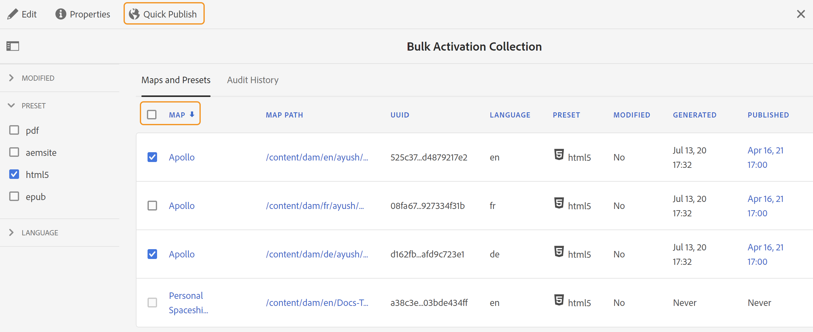

# Aktivera utdata {#id214GGF00V5U}

När du har skapat en kartsamling för massaktivering är nästa steg att aktivera ditt innehåll på publiceringsinstansen. Så här aktiverar du ditt innehåll:

1. Välj **Stödlinjer** i listan över verktyg.

1. Klicka på länken Adobe Experience Manager överst och välj **Verktyg**.

1. Klicka på panelen **Massvis med Publish Dashboard**.

   En lista över massaktiveringskarta visas.

1. Markera samlingen som du vill publicera och klicka på **Öppna**.

   {width="800" align="left"}

1. \(*Valfritt*\) Använd de filter som krävs från den vänstra listen för att filtrera kartan baserat på deras ändrade \(status\), utdataförinställning eller språk.

   >[!NOTE]
   >
   >Generera utdata för kartan med förinställningen för utdata innan du aktiverar dem i kartsamlingen.

Visa olika sätt att aktivera din samling baserat på dina inställningar.

 Cloud Service 

{width="650" align="left"}

Du kan aktivera utdata för **förhandsgransknings** - eller **Publish** -instanserna.

**Förhandsgranska**

* Om du vill aktivera utdata för markerade kartor markerar du de förgenererade kartutdata och väljer **Publish till** > **Förhandsgranska**.
* Om du vill aktivera utdata för alla DITA-kartor med deras konfigurerade förinställningar markerar du kryssrutan bredvid kolumnen **Karta** och väljer sedan **Publish till** > **Publish** .

**Publish**

* Om du vill aktivera utdata för markerade kartor markerar du de förgenererade kartutdata och väljer **Publish till** > **Publish**.

* Om du vill aktivera utdata för alla DITA-kartor med deras konfigurerade förinställningar markerar du kryssrutan bredvid kartan (kolumn) och väljer sedan **Publish till** > **Publish**.

>[!NOTE]
> 
> Kryssrutan för en karteutdata är bara aktiverad om du har genererat utdata för en karta.

Ett meddelande om att kartan lyckades visas när kartutdata är köade för publicering.

När utdata har aktiverats för de markerade mappfilerna uppdateras fliken för granskningshistorik och de senaste aktiverade utdata visas överst. Kolumnen **Publicerad** uppdateras med publiceringsdatum och -tid.

    

  Lokal programvara 

Gör något av följande:

* Om du vill aktivera utdata för markerade kartor markerar du förgenererade karteutdata och väljer **Quick Publish**.
* Om du vill aktivera utdata för alla DITA-kartor med deras konfigurerade förinställningar markerar du kryssrutan bredvid kartan (kolumn) och väljer sedan **Quick Publish.**
  {width="650" align="left"}

  >[!NOTE]
  > 
  >Kryssrutan för en karteutdata är bara aktiverad om du har genererat utdata för en karta.

Ett meddelande om att kartan lyckades visas när kartutdata är köade för publicering.

När utdata har aktiverats för de markerade mappfilerna uppdateras fliken för granskningshistorik och de senaste aktiverade utdata visas överst. Kolumnen **Publicerad** uppdateras med publiceringsdatum och -tid.

**Överordnat ämne: **[Massaktivering av publicerat innehåll](conf-bulk-activation.md)
