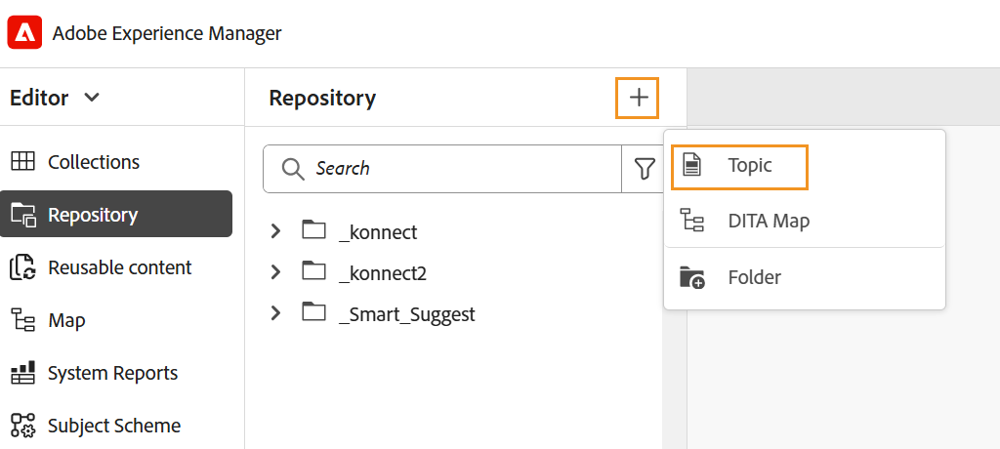

# DITAVAL editor {#ditaval-editor}

DITAVAL-filer används för att generera villkorsstyrda utdata. I ett enskilt ämne kan du lägga till villkor med elementattribut för att villkorsanpassa innehållet. Sedan skapar du en DITAVAL-fil där du anger villkoren som ska plockas upp för att generera innehåll och vilket villkor som ska utelämnas från det slutliga resultatet.

Med Adobe Experience Manager Guides kan du enkelt skapa och redigera DITAVAL-filer med DITAVAL-redigeraren. DITAVAL-redigeraren hämtar attributen \(eller taggar\) som är definierade i systemet, och du kan använda dem för att skapa eller redigera DITAVAL-filer. Mer information om hur du skapar och hanterar taggar i Adobe Experience Manager finns i avsnittet [Administrera taggar](https://experienceleague.adobe.com/docs/experience-manager-cloud-service/sites/authoring/features/tags.html?lang=sv-SE) i Adobe Experience Manager-dokumentationen.

I följande avsnitt beskrivs de alternativ som är tillgängliga för en DITAVAL-fil i Experience Manager Guides.

- [Skapa DITAVAL-fil](#create-ditaval-file)
- [Redigera DITAVAL-fil](#edit-ditaval-file)
- [DITAVAl filredigeringsvyer](#ditaval-editor-views)
- [Arbeta med DITAVAL-filen i Assets-gränssnittet](#working-with-ditaval-files-in-the-assets-ui)

## Skapa DITAVAL-fil

Så här skapar du en DITAVAL-fil:

1. På panelen Databas markerar du ikonen **Ny fil** och väljer sedan **Ämne** i listrutan.

   {align="left"}

   Du kan även komma åt det här alternativet från [Experience Manager Guides hemsida](./intro-home-page.md) och alternativmenyn för en mapp i databasvyn.

2. Dialogrutan **Nytt ämne** visas.

3. Ange följande information i dialogrutan **Nytt ämne**:
   - En rubrik för ämnet.
   - \(Valfritt\)* Ämnets filnamn. Filnamnet föreslås automatiskt baserat på ämnet Titel. Om administratören har aktiverat automatiska filnamn baserat på UUID-inställningen, kommer du inte att visa namnfältet.
   - En mall som ämnet baseras på. För en DITAVAL-fil väljer du **Ditaval** i listrutan.
   - Sökväg där du vill spara ämnesfilen. Som standard visas sökvägen till den markerade mappen i databasen i fältet Sökväg.

   {width="300" align="left"}

4. Välj **Skapa**.

Ämnet skapas på den angivna sökvägen. Dessutom öppnas ämnet i Redigeraren för redigering.

{align="left"}

## Redigera DITAVAL-fil

När du skapar ett DITAVAL-ämne öppnas det i Redigeraren för redigering. Om du vill redigera ett befintligt DITAVAL-ämne går du till den mapp eller karta där DITAVAL-avsnittet finns och väljer sedan **Redigera** på **Alternativ** -menyn.

Med DITAVAL-redigeraren kan du utföra följande uppgifter:

- Växla vänster panel

  Växla den vänstra panelvyn. Om du har öppnat DITAVAL-filen via DITA-kartan visas kartan och databasen på den här panelen. Mer information om hur du öppnar en fil via DITA-kartan finns i [Redigera ämnen via DITA-kartan](map-editor-advanced-map-editor.md#id17ACJ0F0FHS).

- Spara

  Sparar de ändringar du har gjort i filen. Alla ändringar sparas i den aktuella versionen av filen.

- Lägg till egenskap

  Lägg till en enda egenskap i DITAVAL-filen.

  

  I den första listrutan visas de tillåtna DITA-attribut som du kan använda i DITAVAL-filen. Det finns fem attribut som stöds - `audience`, `platform`, `product`, `props` och `otherprops`.

  I den andra listrutan visas de värden som konfigurerats för det valda attributet. I nästa nedrullningsbara lista visas de åtgärder som du kan konfigurera för det valda attributet. De tillåtna värdena i åtgärdslistrutan är - `include`, `exclude`, `passthrough` och `flag`. Mer information om dessa värden finns i definitionen av elementet [prop](http://docs.oasis-open.org/dita/dita/v1.3/errata01/os/complete/part3-all-inclusive/langRef/ditaval/ditaval-prop.html#ditaval-prop) i dokumentationen för OASIS DITA

- Lägg till alla egenskaper

  Om du vill lägga till alla villkorliga egenskaper eller attribut som definierats i systemet med ett enda klick använder du funktionen Lägg till alla egenskaper.

  >[!NOTE]
  >
  > Om alla definierade villkorliga egenskaper redan finns i DITAVAL-filen kan du inte lägga till fler egenskaper. Du får ett felmeddelande i det här scenariot.

  

När du är klar med redigeringen av DITAVAL-filen väljer du **Spara**.

>[!NOTE]
>
> Om du stänger filen utan att spara kommer ändringarna att gå förlorade. Om du inte vill spara ändringarna i Adobe Experience Manager-databasen väljer du **Stäng** och sedan **Stäng utan att spara** i dialogrutan **Osparade ändringar**.

## DITAVAL-redigeringsvyer

Adobe Experience Manager Guides DITAVAL-redigerare har stöd för att visa DITAVAL-filer i två olika lägen eller vyer:

**Författare**:   Detta är ett typiskt exempel på vad du ser i vyn What You Get \(WYSISYG\) i DITAVAL-redigeraren. Du kan lägga till eller ta bort egenskaper med det enkla användargränssnittet, som visar egenskaperna, dess värden och åtgärder i listrutan. I redigeringsvyn kan du infoga en enskild egenskap och infoga alla egenskaper med ett enda klick.

Du kan också hitta den version av DITAVAL-filen som du arbetar med genom att hålla pekaren över filnamnet.

**Source**:   I Source-vyn visas den underliggande XML-filen som utgör DITAVAL-filen. Förutom att göra vanliga textredigeringar i den här vyn kan en författare även lägga till eller redigera egenskaper med den smarta katalogen.

Om du vill anropa den smarta katalogen placerar du markören i slutet av en egenskapsdefinition och skriver &quot;&lt;&quot;. Redigeraren visar en lista över alla giltiga XML-element som du kan infoga på den platsen.

## Arbeta med DITAVAL-filer i Assets användargränssnitt

Du kan också skapa en DITAVAL-fil från Assets-gränssnittet. Så här skapar du ett nytt DITAVAL-ämne:

1. I Assets-gränssnittet navigerar du till den plats där du vill skapa DITAVAL-filen.

1. Välj **Skapa** \> **DITA-ämne**.

1. På sidan Design väljer du DITAVAL-filmall och väljer **Nästa**.

1. På sidan Egenskaper anger du **Title** och **Name** för DITAVAL-filen.

   >[!NOTE]
   >
   > Namnet föreslås automatiskt baserat på filens namn. Om du vill ange filnamnet manuellt kontrollerar du att namnet inte innehåller blanksteg, apostrof eller klammerparenteser och slutar med .ditaval.

1. Välj **Skapa**.

   Meddelandet Ämnet har skapats visas.

Du kan välja att öppna DITAVAL-filen för redigering i DITAVAL-redigeraren eller att spara ämnesfilen i Adobe Experience Manager-databasen.

Utför följande steg för att redigera en befintlig DITAVAL-fil:

1. I Assets-gränssnittet navigerar du till den DITAVAL-fil som du vill redigera.

1. Om du vill låsa filen exklusivt markerar du filen och väljer **Checka ut**.

1. Markera filen och välj **Redigera** för att öppna filen i Adobe Experience Manager Guides DITAVAL-redigeraren.

