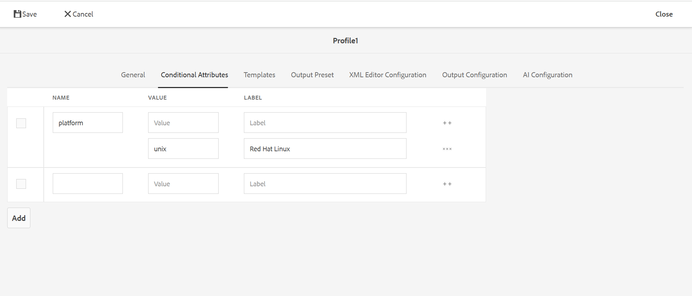

# Profilering av villkorliga attribut {#id1843I0HN0Y4}

På företagsnivå är det mycket viktigt att se till att ni har ett standardiserat taggningssystem. Taggar och villkorliga attribut kan kopplas till digitala resurser i databasen, vilket gör det enklare att publicera utdata baserat på valda villkor. Du kan till exempel skapa villkorsattribut för Windows- och Mac-innehåll. Sedan lägger du till dessa attribut i det relevanta innehållet i dina ämnen. När du publicerar innehåll kan du välja om du vill publicera endast Windows- eller Mac-innehåll.

Med Adobe Experience Manager Guides kan du enkelt skapa och associera villkorliga attribut med relevanta DITA-attribut. Du kan definiera villkorliga attribut på global nivå eller på mappnivå. De globalt definierade villkoren visas i alla projekt och mappspecifika villkor visas bara i projekt som skapats i den angivna mappen. Innehållsförfattare kan använda dessa villkorsstyrda attribut för att villkoralisera innehåll i sina DITA-avsnitt eller -kartor som de skapar eller använder. Dessa villkor kan sedan användas av utgivaren för att skapa villkorliga förinställningar. Med hjälp av de villkorliga förinställningarna kan utgivaren bestämma vilket villkor som ska inkluderas och exkluderas från publicerade utdata.

>[!NOTE]
>
> Du kan skapa eller redigera villkorliga attribut i en mappprofil som du har tillgång till. Om systemadministratören inte har gett dig åtkomst till en mappprofil kan du inte skapa eller redigera villkorliga attribut i mappprofilen.

Så här definierar du villkorliga attribut:

1. Markera Adobe Experience Manager logotyp överst och välj **Verktyg**.

1. Välj **Stödlinjer** på verktygspanelen.

1. Markera rutan **Mappprofiler** och välj en mappprofil.

   >[!NOTE]
   >
   > Du kan inte redigera den globala profilen.

1. Markera fliken **Villkorliga attribut** och välj sedan **Redigera**.

   Tabellen Villkorliga attribut visas.

1. Välj **Lägg till**.

1. Ange **Namn**, **Värde** och **Etikett** för attributet.

   Du kan spara en profil med endast attributnamnet. Ett attribut kan dock bara användas när det har ett angivet värde. Om du anger både värde och etikett för ett attribut visas bara attributets värde i Web Editor. Etiketten visas för publiceringsadministratören när den villkorliga förinställningen skapas.

   I följande skärmbild visas definitionen för attributet `platform` med värdet `unix` och etiketten `Red Hat Linux`.

   {width="800" align="left"}

1. Om du vill lägga till fler värden för samma attribut markerar du ikonen **+** och anger ytterligare värde och etikett.

1. Om du vill lägga till fler attribut väljer du **Lägg till**.

1. Välj **Spara** om du vill spara ändringarna.

Attributet `platform` lagras i systemet. När en författare bestämmer sig för att använda attributet `platform` i ett DITA-avsnitt i en mapp kan de visa värdena på fliken Egenskaper i Redigeraren.

{width="350" align="left"}

**Överordnat ämne:**[ Utdatagenerering](generate-output.md)
