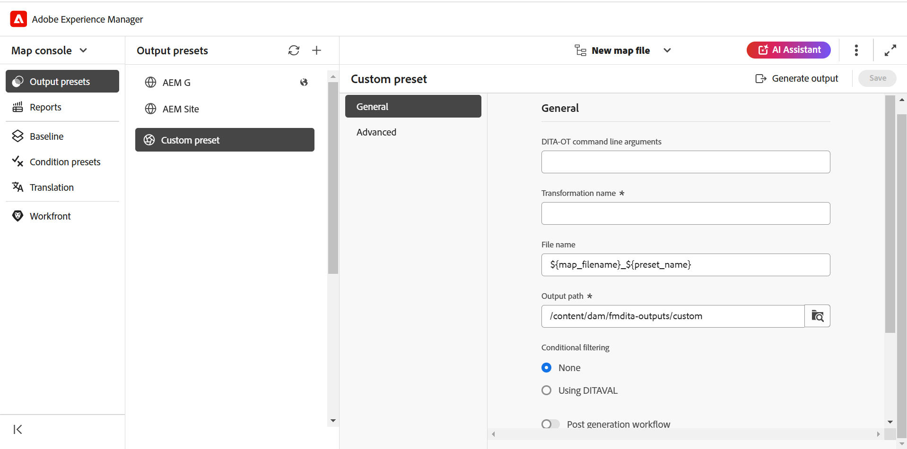

# Egen {#id205BEF00PX0}

Förinställningarna för anpassade utdata är tillgängliga för anpassade DITA-OT-plugin-program. Du kan skapa en anpassad DITA-OT-förinställning för publicering av utdata med ditt anpassade DITA-OT-plugin-program.

Du kan skapa den anpassade förinställningen på två sätt:

- [Skapa den anpassade förinställningen från kartkonsolen](#create-the-custom-preset-from-the-map-console)
- [Skapa den anpassade förinställningen från kontrollpanelen Karta](#create-the-custom-preset-from-the-map-dashboard)

## Skapa den anpassade förinställningen från kartkonsolen

Följ de här stegen för att skapa den anpassade förinställningen från kartkonsolen:

1. [Öppna en DITA-kartfil i kartkonsolen](./open-files-map-console.md).

   Du kan även komma åt kartfilen från widgeten **Senaste filer** i avsnittet [Översikt](./intro-home-page.md#overview). Den markerade kartfilen öppnas i kartkonsolen.
1. Välj ikonen + på fliken **Utdataförinställningar** för att skapa en förinställning.
1. Välj **Egen** i listrutan Typ i dialogrutan **Ny förinställning** .
1. Ange ett namn för den här förinställningen i fältet **Namn**.
1. Välj alternativet **Lägg till i den aktuella mappprofilen** om du vill skapa en förinställning i den aktuella mappprofilen. Mappprofilsikonen  indikerar en förinställning på mappprofilnivå.

   Läs mer om [Hantera förinställningar för globala utdata och mappprofiler](./web-editor-manage-output-presets.md).

1. Välj **Lägg till**.

   Den anpassade förinställningen skapas.

   {width="300" align="left"}

I kartkonsolen ordnas de förinställda konfigurationsalternativen under flikarna **Allmänt** och **Avancerat**.

{align="left"}

Fliken **Allmänt** innehåller följande konfigurationsalternativ:

- Kommandoradsargument för DITA-OT
- Transformeringsnamn
- Filnamn
- Utdatasökväg
- Villkorsfiltrering \(Om villkoren är definierade för en karta\)
- Använd baslinje \(Om en baslinje skapas för en karta\)
- Arbetsflöde efter generering

**Avancerat**

Fliken Avancerat innehåller följande konfigurationsalternativ:

- Behåll tillfälliga filer
- Filegenskaper

Mer information om konfigurationsalternativ för förinställningar finns i avsnittet [Anpassad förinställningskonfiguration](#custom-preset-configuration).

## Skapa den anpassade förinställningen från kontrollpanelen Karta

Så här skapar du den anpassade förinställningen från kontrollpanelen Karta:

1. I Assets-gränssnittet navigerar du till och väljer DITA-kartan för att öppna den på kartkontrollpanelen.
1. Kontrollera att fliken **Utdatainställningar** är markerad.
1. Välj **Skapa** i verktygsfältet.

   Ett nytt formulär för att skapa förinställningar för utdata visas.

   {width="650" align="left"}

1. Ange nödvändig konfigurationsinformation för den anpassade förinställningen.
1. Välj **Klar** om du vill spara förinställningarna.

Mer information om konfigurationsalternativ för förinställningar finns i avsnittet [Anpassad förinställningskonfiguration](#custom-preset-configuration).

## Anpassad förinställningskonfiguration

Konfigurationsalternativen varierar något beroende på om du konfigurerar förinställningen från kartkonsolen eller kartkontrollpanelen. Vissa alternativ gäller bara för kontrollpanelen Karta, medan andra gäller båda.

I de fall där samma konfiguration har två olika fältetiketter avgränsar en **/** dem i tabellen nedan. Den första representerar etiketten i kartkonsolen och den andra representerar etiketten på kartkontrollpanelen.

Exempel: **Utdatasökväg/Målsökväg** - Här är **Utdatasökväg** den etikett som används i kartkonsolen, medan **Målsökväg** är den etikett som används i kartkontrollpanelen för samma konfiguration.

| Anpassade utdataalternativ | Beskrivning |
| --- | --- |
| Utdatatyp (*Gäller endast för kontrollpanelen Karta*) | Den typ av utdata som du vill generera. Om du vill generera utdata med ett anpassat DITA-OT-plugin-program väljer du alternativet Egen. |
| Inställningsnamn (*Gäller endast för kartkontrollpanelen*) | Ge utdatainställningarna ett beskrivande namn. Du kan till exempel ange _interna kunders utdata_ eller _slutanvändares utdata_. |
| Kommandoradsargument för DITA-OT | Ange de ytterligare argument som du vill att DITA-OT ska behandla när du genererar utdata. Mer information om vilka kommandoradsargument som stöds i DITA-OT finns i [DITA-OT-dokumentationen](https://www.dita-ot.org/). |
| Transformeringsnamn | Ange vilken typ av utdata du vill generera. Detta är nödvändigt om du vill generera utdata med ett eget anpassat plugin-program, som är integrerat i DITA-OT-plugin-programmet. Om du till exempel vill generera XHTML-utdata anger du `xhtml`. En lista över omvandlingar som är tillgängliga i DITA-OT finns i [DITA-OT-omvandlingar (utdataformat)](http://www.dita-ot.org/2.3/user-guide/AvailableTransforms.html) i användarhandboken för OASIS DITA-OT. |
| Filnamn | Ange det filnamn som du vill spara utdata med.  **Obs!** Om du inte anger något filnamn används DITA-kartans titel för att generera det slutliga utdatafilnamnet. Om kartan inte har någon titel används DITA-kartans filnamn för att namnge det slutliga resultatet. Filnamnet sanaliseras med de regler som konfigurerats i systemet för att hantera ogiltiga tecken. |
| Villkorsstyrd filtrering/Använd villkor med | Välj ett av följande alternativ:  * **Inget använt**: Välj det här alternativet om du inte vill använda något villkor på publicerade utdata. * **DITAVal-fil**: Välj DITAVal-filer om du vill generera anpassat innehåll. Du kan markera flera DITAVal-filer i dialogrutan Bläddra eller genom att skriva filsökvägen. Använd kryssikonen bredvid filnamnet för att ta bort den. DITAVal-filer utvärderas i den ordning som anges, så de villkor som anges i den första filen har företräde framför de matchande villkor som anges i senare filer. Du kan behålla filordningen genom att lägga till eller ta bort filer. Om DITAVal-filen flyttas till en annan plats eller tas bort, tas den inte automatiskt bort från kartkontrollpanelen. Du måste uppdatera platsen om filerna flyttas eller tas bort. Du kan hovra över filnamnet för att visa sökvägen i AEM-databasen där filen lagras. Du kan bara välja DITAVal-filer och ett fel visas om du har valt någon annan filtyp. * **Villkorsförinställning**: Välj en villkorsförinställning i listrutan om du vill använda ett villkor när du publicerar utdata. Alternativet är synligt om du har lagt till ett villkor på fliken Villkorsförinställningar i DITA-kartkonsolen. Visa [Använd förinställningar](generate-output-use-condition-presets.md#id1825FL004PN) om du vill veta mer om villkorsförinställningar. |
| Utdatasökväg/målsökväg | Sökvägen i AEM-databasen där EPUB-utdata lagras. |
| Behåll tillfälliga filer | Välj det här alternativet om du vill behålla de temporära filer som genererats av DITA-OT. Om du får problem när du genererar utdata via DITA-OT väljer du det här alternativet om du vill behålla de tillfälliga filerna. Du kan sedan använda dessa filer för att felsöka fel vid generering av utdata.    När du har skapat utdata väljer du ikonen **Hämta temporära filer**  för att hämta ZIP-mappen som innehåller de temporära filerna.    **Obs!** Om filegenskaper läggs till under genereringen innehåller de tillfälliga utdatafilerna även en *metadata.xml*-fil som innehåller dessa egenskaper. |
| Kör arbetsflöde efter generering | När du väljer det här alternativet visas en ny arbetsflödeslista som innehåller alla arbetsflöden som konfigurerats i AEM. Du måste välja ett arbetsflöde som du vill köra när arbetsflödet för generering av utdata har slutförts.  **Obs!** Mer information om hur du skapar ett anpassat arbetsflöde för efterhandsgenerering finns i _Anpassa arbetsflöde för efterhandsgenerering_ i Installera och konfigurera Adobe Experience Manager Guides as a Cloud Service. |
| Använd baslinje | Om du har skapat en baslinje för den valda DITA-kartan väljer du det här alternativet för att ange vilken version du vill publicera.   Visa [Arbeta med baslinje](generate-output-use-baseline-for-publishing.md#id1825FI0J0PF) om du vill ha mer information. |
| Filegenskaper/egenskaper | Välj de egenskaper som du vill bearbeta som metadata. Dessa egenskaper ställs in från sidan Egenskaper i DITA-kartan eller bokmappningsfilen. Egenskaperna som du väljer i listrutan visas under fältet **Filegenskaper**. Markera kryssikonen bredvid egenskapen för att ta bort den.   **Obs!**: Du kan också skicka metadata till utdata med DITA-OT-publicering. Om du vill ha mer information kan du [skicka metadata till utdata med DITA-OT](pass-metadata-dita-ot.md#id21BJ00QD0XA). |

**Överordnat ämne:**&#x200B;[ Förstå förinställningarna för utdata](generate-output-understand-presets.md)

