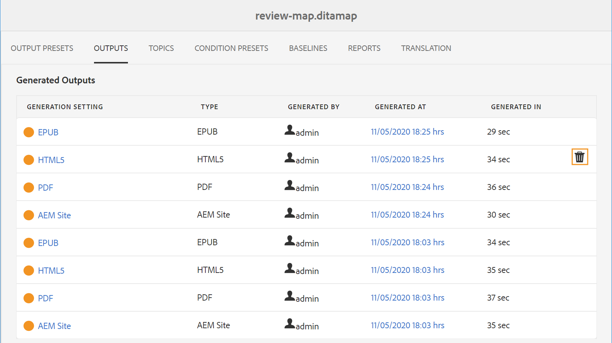

# Hantera genereringsprocess för utdata

Med Adobe Experience Manager Guides kan du utföra följande åtgärder på genererade utdata:

- [Visa status för utdatagenereringsaktiviteten](#view-the-status-of-the-output-generation-task)
- [Avbryt en utdatagenereringsaktivitet](#cancel-an-output-generation-task)
- [Ta bort en utdatauppgift](#delete-an-output-task)

## Visa status för utdatagenereringsaktiviteten

När du har initierat genereringsuppgiften för en karta eller återskapat valda ämnen, skickar Experience Manager Guides den här uppgiften till kön för utdatagenerering. Den här kön uppdateras i realtid och visar statusen för varje utdatagenereringsuppgift i kön.

1. Navigera till och öppna kartfilen som du vill kontrollera utdatagenereringsstatusen för i Assets-användargränssnittet.

1. Välj **UTDATA**.

   {width="800" align="left"}

   Sidan Utdata är uppdelad i två delar:

   - **Utdata i kö:**

     Visar utdata som väntar på att skapas eller som håller på att genereras. De köade eller pågående uppgifterna visas med en blå färgikon före förinställningens namn. Du kan också hitta den inställning eller förinställning för generering av utdata som används för uppgiften som står i kö, typ, användare som initierade uppgiften, tid sedan uppgiften placerades i kö samt aktuell status.

     Markera länken för att komma åt **Publish Dashboard** och visa aktuell körningsstatus. En lista över alla aktiva publiceringsåtgärder finns på Publish Dashboard. Länken **Köade utdata** och **Publish Dashboard** visas bara när det finns utdata som antingen väntar på att skapas eller som håller på att genereras. De visas inte när utdataaktiviteterna har slutförts.Mer information om Publish Dashboard finns i [Hantera publiceringsaktiviteter med Publish Dashboard](generate-output-publish-dashboard.md#).

   - **Genererade utdata**

     Visar en lista över utdataaktiviteter som har slutförts. Informationen som visas här liknar den i avsnittet Utdata i kö med några skillnader. Du har en ny uppsättning information i form av ikoner för utdataresultat och tiden för generering av utdata.

     I den här listan kan du ha uppgifter som har körts, uppgifter som har körts med meddelande eller misslyckade uppgifter. De slutförda åtgärderna visas med en grön färgikon, uppgifterna med ett meddelande har en orange färgikon och de misslyckade åtgärderna visas med en röd färgikon.

     Publiceringsprocessen skapar en loggfil, \(logs.txt\), som du kommer åt genom att markera länken i kolumnen Genererad vid. För uppgifter som har misslyckats eller innehåller meddelanden kan du kontrollera loggfilen, som förklaras i avsnittet [Visa och kontrollera loggfilen](generate-output-basic-troubleshooting.md#id1822G0P0CHS).

     >[!NOTE]
     >
     > När du väljer länken till de genererade PDF-utdata ombeds du ladda ned PDF.

## Avbryt en utdatagenereringsaktivitet

Experience Manager Guides ger utgivaren ett enkelt och enkelt sätt att avbryta alla pågående publiceringsuppgifter. Som utgivare kan du avbryta en pågående publiceringsåtgärd från DITA-kartkonsolen eller [Publish Dashboard](generate-output-publish-dashboard.md#).

Utför följande steg för att avbryta en utdatagenereringsaktivitet från DITA-kartkonsolen:

1. Navigera till och öppna den kartfil som du vill avbryta en pågående utdatagenereringsåtgärd för i Assets-gränssnittet.

1. Välj **UTDATA**.

1. Håll pekaren över en uppgift som du vill avbryta i listan **Utdata i kö**.

1. Välj ikonen **Avbryt det här jobbet** .

   {width="800" align="left"}

1. Välj **Ja** i meddelandet **Bekräfta annullering**.

   {width="800" align="left"}

   Om aktiviteten inte har startats ännu körs kommandot cancel för uppgiften. För en uppgift som avbryts ställs statusen in på Avbryta.

   När aktiviteten har avbrutits flyttas den till listan **Genererade utdata** med statusen **Avbruten**. När du hovrar över den avbrutna uppgiften visas namnet på den användare som avbrutit uppgiften. I skärmbilden nedan avbryts aktiviteten *HTML5*.

   {width="800" align="left"}

## Ta bort en utdatauppgift

När du genererar flera utdata för en DITA-karta, blir listan Genererade utdata för en sådan karta mycket lång under en tidsperiod. Som utgivare kan du rensa utdatahistoriken för alla mappningsfiler genom att ta bort inaktuella uppgifter från listan *Genererade utdata*. Observera att utdata inte tas bort från systemet. Det är bara posten för genererade utdata som tas bort från listan *Genererade utdata*.

Så här tar du bort en utdatauppgift från listan Genererade utdata:

1. Navigera till och öppna kartfilen som du vill ta bort uppgifterna från i Assets-gränssnittet.

1. Välj **UTDATA**.

1. Håll pekaren över en aktivitet som du vill ta bort i listan **Genererade utdata**.

1. Välj ikonen Ta bort.

   {width="800" align="left"}

1. Välj **Ja** i meddelandet **Bekräfta borttagning**.

   Uppgiften tas bort från listan Genererade utdata.

