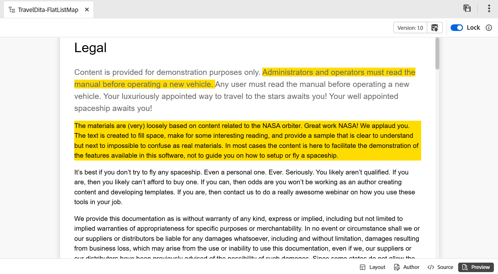

# Kartredigeraren {#id1942D0S0IHS}

Verktygsfältet i kartredigeraren liknar ämnet redigerare. Grundläggande åtgärder som att växla den vänstra panelen, spara karta, skapa en ny version av kartan, ångra/göra om senaste åtgärden och ta bort de markerade elementen är vanliga i båda redigerarna. Mer information om hur dessa åtgärder fungerar finns i avsnittet [Känn till redigeringsfunktioner](web-editor-features.md#).

De alternativ som du visar i redigeringsverktygsfältet baseras på Kartredigerarens vy. Det finns fyra tillgängliga vyer i kartredigeraren:

- [Layout](#layout-view)
- [Författare](#author-view)
- [Source](#source-view)
- [Förhandsgranska](#preview)

I följande avsnitt beskrivs de verktygsfältsalternativ som är tillgängliga i de olika vyerna i kartredigeraren:

## Layoutvyn

När du öppnar en karta för redigering öppnas layoutvyn i kartredigeraren. I layoutvyn visas karthierarkin i en trädvy där du kan ordna avsnitten i en karta.

>[!NOTE]
>
> I layoutvyn visas endast de referenser som finns i en karta. Om några referenser bryts visas en liten tvärsymbol till vänster om referensen

Följande alternativ är tillgängliga i verktygsfältet i layoutvyn:

**Ämnesreferens** - 

Visar dialogrutan för ämnessökning. Navigera till avsnittet/mappfilen som du vill infoga och välj **Markera** för att lägga till den på kartan.

{align="left"}

**Ämnesgrupp** - 

Infoga elementet `topicgroup`. Mer information om gruppering av ämnen finns i [topicsGroup](https://docs.oasis-open.org/dita/v1.0/langspec/topicgroup.html) -dokumentationen i OASIS DITA-språkspecifikationen.

**Nyckeldefinition** - 

Visar dialogrutan Infoga nyckelord. Använd den här dialogrutan för att definiera en nyckeldefinition som du vill använda på kartan.

{width="300" align="left"}

**Infoga före/infoga efter** -  / 

Visar dialogrutan Infoga element. Markera det element som du vill infoga på kartan. Beroende på åtgärden infogas det nya elementet före eller efter det aktuella elementet i kartan.

**Infoga framobjekt** - 

Den här ikonen visas när du öppnar ett bokschema för redigering. Du kan infoga komponenter i början av boken som en innehållsförteckning, ett index och en lista med tabeller.

**Infoga bakgrundsmaterial** - 

Den här ikonen visas när du öppnar ett bokschema för redigering. Du kan infoga komponenter i slutet av boken som ett index, en ordlista och en lista med illustrationer.

**Flytta det markerade objektet åt vänster/höger** -  / 

Markera vänsterpilen om du vill flytta ämnet mot den vänstra sidan i hierarkin. Detta befordrar i huvudsak respektive ämne en nivå upp i hierarkin. Om du t.ex. markerar vänsterpilen medan ett underordnat ämne är markerat, kan du göra det till det ämne som finns på samma nivå som det ovanför. Om du markerar högerpilen flyttas ämnet åt höger och blir underordnat ämnet ovanför det.

**Flytta det markerade objektet upp/ned**  - / 

Markera upp- eller nedpilsikonerna för att flytta ämnet uppåt eller nedåt i hierarkin.

>[!NOTE]
>
> Du kan också dra och släppa referenserna för att flytta dem på en karta.

**Lås/lås upp**

Hämtar ett lås på kartfilen och släpper låset. Om du har osparade ändringar i kartfilen uppmanas du att spara kartfilen när du släpper låset. Ändringarna sparas i den aktuella versionen av kartfilen.

**Sammanfoga** - 

Mer information om hur du sammanfogar innehåll från en annan version av samma eller en annan fil finns i [Sammanfogning](web-editor-features.md#menu-dropdown) i Redigeraren.

**Versionshistorik** - 

Kontrollera de tillgängliga versionerna och etiketterna för det aktiva ämnet och gå tillbaka till valfri version från redigeraren.

**Versionsetikett** - 

Visar dialogrutan för versionsetiketthantering. Välj en version i listrutan. Välj den etikett som du vill använda för den valda versionen och välj **Lägg till etikett** för att lägga till den.

**Visa filnamn**

Visar filnamnet på ämnesrubrikerna.

>[!NOTE]
>
> När du håller pekaren över ett temats titel visas filsökvägen.

**Visa radnummer**

Visar eller döljer radnumret för varje ämne. Radnumren visas beroende på nivån i hierarkin.

**Visa kryssruta**

Visar eller döljer en kryssruta för varje ämne. Du kan använda kryssrutan för att markera ämnet och utföra olika åtgärder på Alternativ-menyn.

**Alternativ-menyn i layoutvyn**

Förutom att ordna ämnen i kartfilen kan du även utföra följande åtgärder med Alternativ-menyn som visas när du håller pekaren över en fil eller högerklickar i redigeraren i layoutvyn:

{width="650" align="left"}

- **Lägg till**: Du kan välja att lägga till ett nytt ämne eller en tom referens från kartredigeraren:
   - **Tom referens**: Med det här alternativet kan du lägga till en tom referens på DITA-kartan. Du kan dubbelklicka på den infogade tomma referensen senare och lägga till ämnesinformationen.
   - **Nytt ämne**: När du väljer att skapa ett nytt ämne på menyn visas dialogrutan **Nytt ämne**. Ange nödvändig information i dialogrutan **Nytt ämne** och välj **Skapa**.
- **Flytta**: Du kan välja att flytta ett ämne uppåt/nedåt/höger/vänster i hierarkin. Du kan också dra och släppa ett ämne eller en karta från databaspanelen till den karta som öppnas i Kartredigeraren.
- **Ångra**: Ångra den senaste åtgärden i layoutvyn.
- **Gör om**: Gör om den senaste åtgärden i layoutvyn.
- **Kopiera**: Kopiera den markerade referensen från kartfilen.

  >[!NOTE]
  >
  > Du kan visa och sedan markera kryssrutorna för att kopiera flera referenser.

- **Klistra in**: Klistra in de kopierade referenserna på den aktuella platsen i hierarkin.
- **Ta bort**: Ta bort de markerade referenserna från mappningsfilen.

  >[!NOTE]
  >
  > Du kan visa och sedan markera kryssrutorna för att ta bort flera referenser.

**Visa ämnen baserat på villkorliga filter**

Om du har tillämpat några villkor för ett ämne visas en filterikon till höger om ämnet. När du håller pekaren över en filterikon visas det använda villkoret och dess attributvärde.

## Författarvy

I vyn **Författare** kan du redigera din DITA-karta i Redigeraren. Detta visar WYSIWYG-vyn i kartredigeraren och några av de ikoner som visas i redigeringsvyn är desamma som layoutvyn.

{align="left"}

Dessutom kan du visa följande ikoner och utföra relaterade uppgifter i redigeringsvyn:

**Infoga före/Infoga efter** -  / 

Visar elementet **Insert före eller **Insert efter dialogruta. Markera det element som du vill infoga på kartan. Beroende på åtgärden infogas det nya elementet före eller efter det aktuella elementet i kartan.

**Element** - 

Visar dialogrutan **Infoga element**. Markera elementet som du vill infoga. Du kan använda tangentbordet för att bläddra igenom elementlistan och trycka på Retur för att infoga önskat element. Du kan också markera elementet och infoga det på kartan.

<!-----------------------------------------------------------

**Relationship table** - 

Inserts a relationship table in the map.

Perform the following steps to work with relationship tables in the Basic Map Editor:

1.  In the Assets UI, navigate to the DITA map in which you want to create the relationship table.

1.  Select the DITA map to open it in DITA map console.

1.  Select the **Topics** tab to view a list of topics available in the DITA map.

    >[!TIP]
    >
    > The Topics tab gives you an option to download the map file with its dependents. For more details, view [Export a DITA map file](authoring-download-assets.md#id218UBA00IXA).

1.  In the main toolbar, select **Edit**.

    The map file is opened in the Advanced Map Editor.

1.  Select **Reltable** from the toolbar.

    {width="650" align="left"}

1.  Drag-and-drop topics from the topic list to the Reltable editor.

    >[!NOTE]
    >
    > You can add topics from any folder in the References rail.

    {width="550" align="left"}

1.  To add a header to your relationship table, click **Add Relheader**.

1.  To add a column to your relationship table, click **Add a Column**.

    {width="550" align="left"}

1.  Click **Save**.

You can also perform the following actions from the relationship table editor:

**Delete rows or columns**

If you want to delete a column from your table, select the checkbox in the column header and click Delete. If you want to remove a row from table, select the checkbox in the first column of the respective row and click Delete.

**Delete a topic**

If you want to delete a topic from your table, click the cross icon next to the topic.

**Delete the relationship table**

If you want to delete the relationship table, click anywhere outside the relationship table and click Delete. For details, view [Work with relationship tables in the Map Editor](map-editor-basic-map-editor.md).
----->

**Återanvändbart innehåll** - 

Visar dialogrutan **Återanvänd innehåll**. Använd den här dialogrutan för att infoga innehållet som du vill återanvända på kartan.

**Uppdatera navigeringsrubrikattributet** - 

Synkroniserar elementet `title` i en refererad fil i en karta med det värde som anges i dess `@navtitle`-attribut. Du kan lägga till olika typer av referensfiler på en karta, till exempel avsnitt-, referens-, uppgift-, \(sub\)-kartor. De flesta av dessa filer stöder attributet `@navtitle`. Om en fil innehåller attributet `@navtitle` uppdateras attributet `@navtitle` för samma fil på kartan. Om attributet `@navtitle` inte finns med läggs attributet `@navtitle` till i referensfilen och dess `title` uppdateras även för att visa `@navtitle`.

>[!NOTE]
>
> Administratören kan konfigurera det automatiskt tillagda attributet `@navtitle` för varje referensfil som du lägger till på en karta. Mer information om hur du konfigurerar attributet `@navtitle` som läggs till automatiskt finns i *Inkludera @navtitle som standard* i Installera och konfigurera Adobe Experience Manager Guides as a Cloud Service.

Markera ikonen Uppdatera navigeringsrubrikattribut om du vill synkronisera värdena för elementet `title` och attributet `@navtitle`.

**Taggar**

Visar eller döljer XML-märkorden. Taggarna fungerar som visuella tecken som anger ett elements gräns. I det här läget, om du vill infoga en ämne/mappningsreferens, drar och släpper du den önskade filen före eller efter taggen. Det vågräta fältet visas inte i taggvyn.

**Spåra ändringar** - 

Du kan hålla reda på alla uppdateringar som gjorts i kartfilen genom att aktivera läget Spåra ändringar. När du har aktiverat spårändringar hämtas alla infogningar och borttagningar i dokumentet. Mer information finns i [Spåra ändringar](web-editor-features.md#track-changes) i redigeraren.

**Skapa granskningsaktivitet** - 

Du kan skapa en granskningsåtgärd för det aktuella ämnet eller kartan direkt från redigeraren. Öppna filen som du vill skapa granskningsaktiviteten för och välj **Skapa granskningsaktivitet** för att starta granskningsprocessen. Följ instruktionerna i [Introduktion för att granska](review.md#) om du vill ha mer information.

## Source view

I den här vyn kan du redigera innehåll i Raw-format, vilket ger fullständig kontroll över strukturen och formateringen.

{align="left"}

I den här vyn innehåller verktygsfältet grundläggande alternativ för redigering och infogning av innehåll som är tillgängliga i listrutan **Meny**, inklusive Klipp ut, Kopiera, Ångra, Gör om, Ta bort, Sök och ersätt, Versionsetikett, Sammanfoga, Spara som ny version, Lås och Lås upp.

## Förhandsgranska

Förhandsgranskningsläget återger innehållet så som det kommer att se ut i det slutliga resultatet, vilket gör att du kan granska layouten och formateringen innan du publicerar det.

Förutom att kunna visa positionen för varje ämnesfil i en karta, är det önskvärt att kartinnehållet visas i ett sammanhängande flöde. Med funktionen Förhandsgranska karta kan du visa hela innehållet i kartfilen med ett enda klick. Du behöver inte generera utdata från kartfilen för att se hur hela kartan kommer att se ut när den har publicerats. Du kan enkelt öppna kartans förhandsgranskning och alla ämnen och undermappar återges i form av en bok.

{align="left"}

>[!NOTE]
>
> Det finns inga alternativ för innehållsredigering eller infogning i verktygsfältet i förhandsgranskningsläget. Du kan inte redigera innehållet i den här vyn. Du kan dock använda funktionerna **Spara som ny version** och **Lås** eller **Lås upp**.

Du kan utföra följande åtgärder i förhandsgranskningsläget:

- Högerklicka på ett ämne och välj **Redigera** för att öppna ämnet för redigering på en ny flik.

  >[!NOTE]
  >
  > Om du inte har redigeringsbehörighet öppnas avsnittet i skrivskyddat läge.

- Gå till önskat ämne genom att välja ämnesrubriken i schematrädet \(i den vänstra panelen\).

- Det aktuella avsnittet i förhandsvisningen av kartan markeras också i schematrädet.

**Andra sätt att förhandsgranska en kartfil**

Du kommer åt förhandsgranskningen av en karta från:

- **Assets-gränssnitt**: Navigera till kartpositionen i Assets-gränssnittet, markera kartfilen och välj **Förhandsgranska karta** i verktygsfältet. Förhandsgranskningen av kartan visas på en ny flik. Du kan visa innehållet i alla ämnen i förhandsgranskningsläget. I den här vyn kan du inte redigera något ämne.

  >[!NOTE]
  >
  > Om alternativet *Förhandsgranskningskarta* inte visas i huvudverktygsfältet kan det ha flyttats under verktygsfältmenyn **Mer**.

- **Kartredigeraren**: Välj **Förhandsgranska** på Alternativ-menyn i kartredigeraren om du vill visa förhandsgranskningen av den aktuella kartan.

  {width="650" align="left"}

  Förhandsgranskningen av kartan visas i en popup-ruta.

  {width="500" align="left"}

**Kartegenskaper**

Visar dialogrutan Kartegenskaper där du kan ange attribut och metadatainformation för kartan.

## Redigera ämnen via DITA-kartan {#id17ACJ0F0FHS}

Om du redigerar ett enskilt ämne får inte författaren hela kontexten. En författare har ingen information om var ett ämne placeras på en DITA-karta. Utan den här kontextuella informationen blir det lite svårt för författare att skapa innehåll.

Med Experience Manager Guides kan författare öppna en DITA-karta i redigeraren och visa placeringen av ämnen på kartan. Detta hjälper författare att veta exakt var ämnet är placerat på kartan och skapa mer relevant innehåll. Om det finns flera författare som arbetar med ett projekt kan de också veta vilka ämnen som är tillgängliga på kartan och återanvända innehållet där det behövs.

Så här redigerar du ämnen via en DITA-karta:

1. Navigera till och öppna den DITA-mappningsfil som du vill redigera på databaspanelen.

   Kartfilen öppnas i kartvyn.

>[!NOTE]
>
> Du kan också använda Assets-gränssnittet för att öppna en DITA-kartfil. Navigera till den DITA-kartfil som innehåller de ämnen som du vill redigera och välj **Redigera ämnen** i huvudverktygsfältet för att starta redigeraren.

1. Markera en ämneslänk om du vill öppna den i redigeraren för redigering.

   Du kan öppna flera ämnen i redigeraren och varje ämne öppnas på en ny flik i redigeraren. Även om din DITA-karta innehåller underkartor öppnas även ämnen från underkartorna på en ny flik för redigering. Om du vill visa ämnen under en delmappning kan du markera och expandera delkartan.

   {align="left"}

   Om du väljer en kartfil öppnas kartan på en ny flik i Redigeraren.

1. När du är klar med redigeringen av ämnena kan du göra följande:

   - Du kan spara dem en och en. Om du stänger utan att spara dina ämnen visas en dialogruta där du uppmanas att spara de osparade avsnitten:

     {width="300" align="left"}

     Du kan välja att spara alla markerade ämnen eller avmarkera de ämnen som du inte vill spara.

   - Du kan låsa upp ämnet med alternativet **Spara som ny version**. När du sparar en version av ämnet skapas en ny version och låset släpps också.

     Du bör spara ändringarna innan du låser upp filerna.  När du sparar ändringarna valideras XML-filen.

   - Du kan även visa förloppet för ämnena i dialogrutan **Spara som ny version** . Ett meddelande visas när filerna är olåsta.

   - Om administratören har aktiverat alternativet att låsa upp filer när de stängs visas en uppmaning om att spara filer när de låsta filerna stängs. När det här alternativet är aktiverat visas listan med låsta filer som behöver sparas när du stänger redigeraren med ändrade filer. De låsta filerna visas med en låsikon:

     {width="350" align="left"}

## Högerpanelen i kartredigeraren

På den högra panelen visas Innehållsegenskaper och Kartegenskaper i layoutvyn i kartredigeraren.

**Innehållsegenskaper**

Panelen Innehållsegenskaper innehåller information om vilken typ av ämne som är markerat på kartan, dess länk-URL och dess attribut. Mer information finns i [Innehållsegenskaper](web-editor-features.md#right-panel) i redigeraren.

- **Andra attribut** Om administratören har skapat en profil för attribut får du dessa attribut tillsammans med deras konfigurerade värden. Med innehållsegenskapspanelen kan du välja dessa attribut och tilldela dem till relevant innehåll i ditt ämne. Du kan också tilldela attribut som konfigurerats av administratören på fliken **Visningsattribut** i redigeringsinställningarna. De attribut som är definierade för ett element visas i layoutvyn och dispositionsvyn. Detta hjälper dig att snabbt få en överblick över alla ämnen i en karta för vilka ett visst attribut har definierats. Alla ämnen som har attributet `audience` definieras till exempel som `US`.

  {width="650" align="left"}

  Mer information finns i *Visningsattributen* i funktionsbeskrivningen för *Inställningar* i [redigeraren](web-editor-features.md#main-toolbar).

- **Metadata** Du kan ange metadatainformation med hjälp av metadata. Du kan definiera navigeringsrubriken, länktexten, kortbeskrivningen och nyckelorden.

Mer information om standardämnesattribut och metadata finns i [topicref](https://docs.oasis-open.org/dita/v1.2/os/spec/langref/topicref.html) -dokumentationen i språkspecifikationen för OASIS DITA.

**Överordnat ämne:** [Introduktion till kartredigeraren](map-editor.md)
