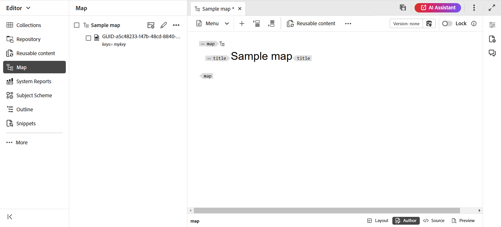

# Skapa en karta {#id176FEN0D05Z}

>[!INFO]
>
>Från version 2025.11.0 har **databasnamnet** ändrats till **Utforskaren**. För lokal installation är den fortfarande tillgänglig som databas till version 5.1 av Experience Manager Guides.

Adobe Experience Manager Guides har två färdiga mallar för kartor - DITA-karta och Bookmap. Du kan också skapa egna mappningsmallar och dela dem med författarna för att skapa mappningsfiler.

Så här skapar du en karta:

1. I Utforskarpanelen väljer du ikonen **Ny fil** och sedan **DITA-karta** i listrutan.

   {align="left"}

   Du kan även komma åt det här alternativet från [Experience Manager Guides hemsida](./intro-home-page.md) och alternativmenyn för en mapp i Utforskaren-vyn.

2. Dialogrutan **Ny karta** visas.

3. Ange följande information i dialogrutan **Ny karta**:
   - En titel för kartan.
   - \(Valfritt\)* Filnamnet för kartan. Filnamnet föreslås automatiskt baserat på ämnet Titel. Om administratören har aktiverat automatiska filnamn baserat på UUID-inställningen, kommer du inte att visa namnfältet.
   - En mall som ämnet baseras på. De tillgängliga alternativen för en kartfil är **Bookmap**, **Map** och **Subject scheme**.
   - Sökväg där du vill spara kartfilen. Som standard visas sökvägen till den markerade mappen i Utforskaren i fältet Sökväg.

   {width="300" align="left"}

4. Välj **Skapa**.

Kartan skapas på den angivna sökvägen. Kartan öppnas även i Kartredigeraren för redigering.

{align="left"}

## Lägga till ämnen i en kartfil

Förutom att redigera kartfiler direkt från redigeraren kan du även öppna ämnesfiler i en karta och redigera redigeraren. Du kan lägga till ämnen i en kartfil.

Utför följande steg för att lägga till ämnen i en kartfil från kartkonsolen:

1. I Utforskaren navigerar du till och öppnar den kartfil som du vill redigera.
1. Välj ikonen **Redigera** .

   {width="450" align="left"}

1. Kartfilen öppnas i kartredigeraren. Om du har öppnat en ny kartfil visas endast kartans titel i redigeraren.

   {align="left"}

   - **A** - \(*Flikfält*\): Det här liknar redigerarens flikfält. Visa [flikfältet](./web-editor-tab-bar.md) i redigeraren om du vill ha mer information.

   - **B** - \(*Verktygsfält*\) Det här är verktygsfältet som du kan använda för att arbeta med kartfiler. Mer information om de funktioner som är tillgängliga via verktygsfältet finns i [Funktioner i kartredigerarens verktygsfält](#features-available-in-the-map-editors-toolbar).

   - **C** - \(*Kartvyer*\): Gör att du kan växla mellan layouten, författaren, Source och förhandsgranskningen i Kartredigeraren. I vyn **Layout** kan du ordna ämnen i en DITA-karta. Detta ger kartans träd eller hierarkiska vy. I vyn **Författare** kan du redigera ämnen i Kartredigeraren. Detta ger även en WYSIWYG-vy över kartfilen. I vyn **Source** kan du arbeta med kartfilens underliggande XML. Med Förhandsgranska får du en samlad vy över alla avsnitt och undermappar i kartfilen.

   - **D** - \(*Vänster panel*\): Ger åtkomst till den vänstra panelen, som ger dig tillgång till funktionerna Samlingar, Utforskaren, Karta, Kontur och andra. Du kan expandera eller komprimera den genom att välja ikonen Expandera/Komprimera. Mer information om de funktioner som är tillgängliga i den vänstra panelen finns i [vänsterpanelen](./web-editor-left-panel.md) i redigeraren.

   - **E** - \(*Mittområde*\): Mappa innehållets redigeringsområde.

   - **F** - \(*Högerpanel*\): Ger åtkomst till panelen Egenskaper. Du kan visa innehållsegenskaperna och mappningsegenskaperna för det markerade ämnet eller kartan. Mer information om de funktioner som är tillgängliga på den här panelen finns i [Högerpanelen](web-editor-right-panel.md) i redigeraren.

1. I den vänstra panelen växlar du till vyn **Utforskaren**.

1. I Utforskaren i Adobe Experience Manager navigerar du till den mapp som innehåller de ämnen eller undermappar som du vill lägga till.

1. Markera ämne- eller mappfilen i **Utforskaren**-vyn och dra och släpp den i \(mitten\) redigeringsområdet för kartinnehåll.

   Ämnet läggs till på kartan.

   {align="left"}

1. Om du vill lägga till efterföljande ämnen eller en undermappning drar och släpper du ämnet eller undermappningen till önskad plats på kartan.

   Tänk på följande när du skapar kartfilen:

   - Filen läggs till på en plats där den streckade rektangeln visas i kartredigeringsområdet. I följande skärmbild kommer avsnittet *Ett exempelavsnitt* att läggas till mellan avsnitten *Smarta förslag 1* och *Smarta förslag 2*.

     {align="left"}

   - Om du vill ersätta ett ämne drar och släpper du det nya ämnet ovanpå det ämne som du vill ersätta. och släppa det över anger att det kommer att ersättas med det ämne som släpps på det.

   - Om du lägger till en undermapp till din DITA-karta visas underkartan som en länk i DITA-kartan. Om du vill visa alla ämnen i underkartan Ctrl-klickar du på länken för underkartan. Innehållet i undermappen visas på en ny flik. Om du vill öppna ett ämne från DITA-kartan Ctrl-klickar du på ämneslänken så öppnas det på den nya fliken.

   - Du kan använda kortkommandona CTRL+Z och CTRL+Y eller deras respektive ikoner i verktygsfältet för att ångra eller göra om ändringar i kartan.

   - Om du vill ändra positionen för ett ämne markerar du ämnet \(genom att markera avsnittsikonen\) och drar och släpper det på önskad plats i kartfilen. På följande skärmbild flyttas ämnet *Smart Suite 1* efter *A Sample topic*.

     {align="left"}

   - Om du vill kontrollera kartfilens egenskaper högerklickar du var som helst i kartredigeringsområdet och väljer **Egenskaper** på snabbmenyn. Baserat på din Adobe Experience Manager-version kan du visa egenskaper som metadata, schemaaktivering, referenser, dokumenttillstånd med mera.

1. Välj **Spara**.

## Skapa en karta från användargränssnittet i Assets

Du kan också skapa en kartefil från Assets-gränssnittet och öppna den i Kartredigeraren för redigering.

Så här skapar du en karta från Assets-gränssnittet:

1. Gå till den plats där du vill skapa kartfilen i Assets-användargränssnittet.

1. Välj **Skapa** \> **DITA-karta**.

1. På sidan Design väljer du den typ av kartmallar som du vill använda och väljer **Nästa**.

   >[!NOTE]
   >
   > Hur ämnen hänvisas till i en kartfil beror på kartmallen. Om du till exempel väljer mappningsmallen används ämnesreferenserna \(`topicref`\) för att referera till ämnen. Om det är en bokmapp skapas ämnesreferenser med elementet `chapter` i DITA.

   {align="left"}

1. Ange kartan **Titel** på sidan Egenskaper.

1. \(Valfritt\) Ange filen **Namn**.

   Om administratören har konfigurerat det automatiska filnamnet baserat på UUID-inställningen visas inte alternativet att ange filnamnet. Ett UUID-baserat filnamn tilldelas automatiskt till filen.

   Om alternativet för filnamngivning är tillgängligt föreslår vi automatiskt ett namn baserat på kartans titel. Om du vill ange kartfilens namn manuellt kontrollerar du att filnamnet inte innehåller blanksteg, apostrof eller klammerparenteser och slutar med `.ditamap`.

1. Välj **Skapa**.

   Meddelandet Kartan har skapats visas.

   Alla nya mappningsfiler som du skapar från Assets-gränssnittet eller redigeraren tilldelas ett unikt mappnings-ID. Dessutom sparas den nya kartan som den senaste arbetskopian i DAM. Innan du sparar en revision av en nyligen skapad karta, kommer du inte att visa något versionsnummer i Tidigare versioner. Om du öppnar kartan för redigering visas versionsinformationen i det övre högra hörnet på mappningsfilens flik:

   {align="left"}

   Versionsinformationen för en nyligen skapad karta visas som *ingen*. När du sparar en ny version tilldelas den ett versionsnummer som 1.0. Mer information om hur du sparar en ny version finns i [Spara som ny version](web-editor-features.md#save-as-new-version).

   Du kan välja att öppna kartan för redigering i den konfigurerade kartredigeraren eller spara kartefilen i Utforskaren.

   >[!NOTE]
   >
   > Om du vill använda den avancerade kartredigeraren öppnar du kartfilen i redigeraren. Om administratören har konfigurerat den avancerade kartredigeraren som standardredigerare i kartfilerna öppnas kartfilen direkt i den avancerade kartredigeraren för redigering. Visa *Ange avancerad kartredigerare som standard* i Installera och konfigurera Adobe Experience Manager Guides as a Cloud Service.

### Lägga till ämnen i en kartfil från Assets användargränssnitt

Utför följande steg för att lägga till ämnen i en kartfil från Assets-gränssnittet:

1. Navigera i Assets-gränssnittet till den kartfil som du vill redigera.

   >[!NOTE]
   >
   > Kontrollera att du inte har aktiverat resursurvalsläget.

1. Om du vill låsa kartfilen exklusivt markerar du kartfilen och väljer sedan alternativet **Utcheckning** längst upp.

   >[!NOTE]
   >
   > När du har ett exklusivt lås på en kartfil kan andra användare inte redigera kartan. De kan dock arbeta med ämnen i kartfilen. Om administratören har konfigurerat redigeraren så att filer låses före redigering kan du inte redigera en fil förrän du låser den.

1. Markera kartfilen och välj **Redigera ämnen**.

   {align="left"}

   Du kan också välja alternativet **Redigera ämnen** på Åtgärdsmenyn i kartfilen:

   {align="left"}

   Kartfilen öppnas för redigering i Redigeraren. Om du vill lägga till ämnen i kartfilen följer du stegen (4-8) i [Lägg till ämnen i en kartfil](#add-topics-to-a-map-file).

**Överordnat ämne: [Introduktion till kartredigeraren](map-editor.md)
