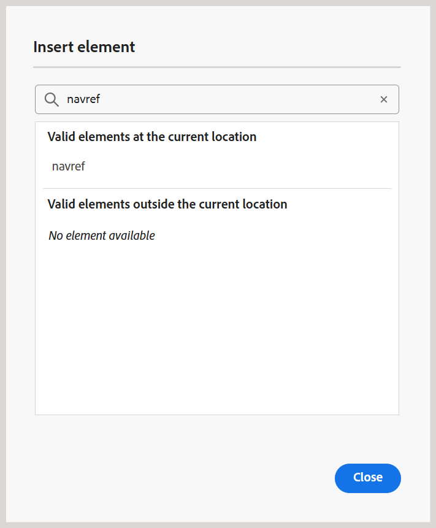
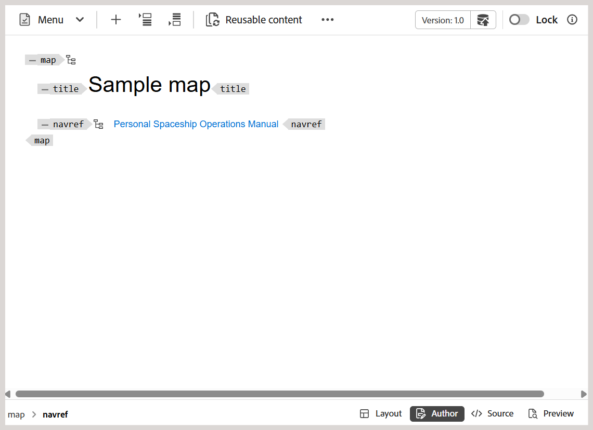

# Ytterligare funktioner i kartredigeraren {#id1942D0T0HUI}

Några vanliga funktioner i kartredigeraren är:

## Lös nyckelreferenser {#id176GD01H05Z}

En DITA-innehållsnyckelreferens, eller `conkeyref`, är en mekanism som infogar en del av innehåll från ett ämne i ett annat. Den här mekanismen använder nyckel för att hitta det innehåll som ska återanvändas i stället för den direkta mekanismen för innehållsreferens. Mer information om direkt och indirekt referens i DITA finns i *DITA-adressering* i språkspecifikationen för OASIS DITA.

Om DITA-avsnittet har associerade nyckelreferenser måste de lösas innan du förhandsgranskar, redigerar eller granskar ett ämne.

Nyckelreferenserna tolkas utifrån rotmappningen i följande prioritetsordning:

1. Användarinställningar
1. Kartvyn, panel
1. Mappprofil

Rotmappningen som är markerad i användarinställningarna har den högsta prioriteten för att matcha nyckelreferenser följt av mappvypanelen och mappprofilens rotmappning. Om ingen karta har angetts i användarinställningarna används kartan som har öppnats på panelen Kartvy. Om ingen karta är öppen på panelen Kartvy används kartan i mappprofilerna för att matcha nyckelreferenserna.

Nyckelreferenserna kan lagras i en DITA-kartfil eller en separat DITA-fil. I Experience Manager Guides kan du ange nyckelreferenser antingen på projektnivå eller sessionsnivå. Om en rotmappning redan har definierats för användarsessionen används den för att matcha nycklarna. I annat fall används standardrotkartan för den mappen. Om en standardrotkarta inte är konfigurerad markeras de saknade nyckelreferenserna för användaren.

Det finns flera sätt att lösa nyckelreferenser i ett DITA-avsnitt genom att definiera DITA-kartan som ska användas på följande platser:

**Projektegenskaper** - Du kan definiera en rotmappning för att matcha nyckelreferenser när du skapar ett projekt i avsnittet Projektegenskaper.

Den här rotmappningen kommer att gälla för alla resurser \(mappar och undermappar\) som är associerade med det projektet. För innehåll som refereras i flera projekt behålls en alfabetisk lista över projekt och den standardrotkarta som är associerad med det första projektet används. Du kan också välja den DITA-karta som ska användas i listan för att lösa nyckelreferenser.

**Förhandsgranskning av ämne** - I läget för ämnesförhandsgranskning väljer du ikonen för tangentupplösning i verktygsfältet och väljer den DITA-fil som ska användas för nyckelreferenser.

**Ämnesredigeringsvy** - Välj ikonen för tangentupplösning när du redigerar ett DITA-ämne och markera den DITA-fil som ska användas för att matcha nyckelreferenserna.

## Lägg till navigeringsreferenser

Elementet `navref` används i en DITA-karta för att inkludera navigeringsreferenser från en annan DITA-karta. Detta gör att författare kan återanvända navigeringsstrukturen, t.ex. delade menyer eller länkar, utan att det faktiska innehållet i den refererade kartan läggs samman med utdata.

>[!NOTE]
>
> Elementet `navref` är endast avsett för navigering i kartstrukturen. Den bidrar inte till de genererade DITA-mappningsutdata och är exkluderad från bearbetning och visning i Kartvyn, Rapporter, Baslinje, Översättning och Förhandsgranskning.

Så här lägger du till navigeringsreferenser till en karta:

1. Öppna DITA-kartfilen där du vill lägga till en navigeringsreferens.

   Kartfilen öppnas i kartredigeraren.
1. Växla till redigeringsvyn och placera markören på en giltig plats för en navigeringsreferens.
1. Välj alternativet **Element** i verktygsfältet.
1. I dialogrutan **Infoga element** väljer du **navref**.

   
1. Dialogrutan **Markera bana** visas. Markera en kartfil som du vill ta med som navigeringsreferens på kartan och välj **Markera**.

En navigeringsreferens för den markerade kartfilen läggs till på den angivna platsen. Titeln på den refererade kartan visas även i både redigeringsvyn och layoutvyn.

*Författarvy*

*Layoutvy*

**Överordnat ämne:**[ Introduktion till kartredigeraren](map-editor.md)
