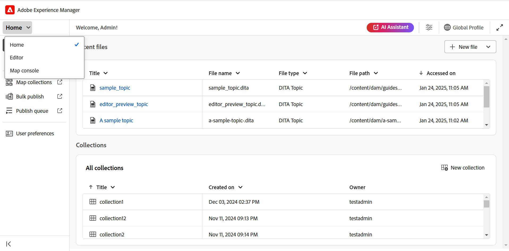

# Öppna filer i kartkonsolen

Gör så här för att öppna en DITA-kartfil i kartkonsolen:

1. Öppna **kartkonsolen** från startsidan.

   {width="800"align="left"}

2. Eftersom ingen kartfil är markerad uppmanas du att välja en kartfil för att använda karthanterings- och publiceringsfunktionerna.

   

3. Välj **Markera karta** och välj en sökväg där DITA-kartfilen finns.

   Kartfilen öppnas i kartkonsolen. Fliken **Utdatainställningar** är markerad som standard.

   {width="800"align="left"}

   >[!NOTE]
   >
   >  Kartan som öppnas i kartkonsolen synkroniseras med kartvyn som är tillgänglig i redigeraren.

## Öppna kartfiler från Redigeraren

Du kan också öppna en befintlig kartfil i kartkonsolen från redigeraren.

1. Navigera till och markera DITA-mappningsfilen i databasvyn.

   Kartfilen öppnas i kartvyn.

2. Välj ikonen **Öppna i kartkonsol** .

   Kartfilen öppnas i kartkonsolen.

   {align="left"}
