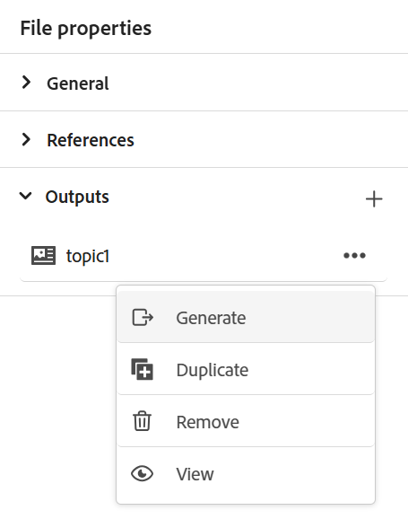

# Publicera innehållsfragment

Innehållsfragment är separata innehållsdelar i Adobe Experience Manager. De är strukturerade innehåll baserat på en innehållsmodell. Innehållsfragment är rent innehåll utan design- eller layoutinformation. De kan redigeras och hanteras oberoende av de kanaler som Adobe Experience Manager stöder. Innehållsfragment är modulära, där innehållet delas upp i mindre komponenter.

Med Experience Manager Guides kan du publicera ett ämne eller dess element i ett innehållsfragment.

>[!NOTE]
>
>Du kan bara välja de element i ett ämne som har ett id-attribut definierat.

Så här skapar du ett innehållsfragment:

1. Skapa en [innehållsfragmentmodell](https://experienceleague.adobe.com/docs/experience-manager-65/assets/content-fragments/content-fragments-models.html?lang=en) i Adobe Experience Manager Assets.
1. Skapa en mapp där du vill spara de innehållsfragment som du skapar baserat på modellen för innehållsfragment. Exempel:&quot;stock-content-fragments&quot;.
1. Redigera mappens egenskaper (till exempel&quot;stock-content-fragments&quot;) och lägg till sökvägen till mappen, som innehåller modellen för innehållsfragment i molnkonfigurationen.
Lägg till exempel till `/conf/we-retail` i molnkonfigurationen. Den här konfigurationen kopplar alla innehållsfragmentmodeller till mappen.\
   {width="650" align="left"}
   *Lägg till molnkonfigurationen i mappegenskaperna för att ansluta den till fragmentmodellerna.*

1. Om du vill generera ett innehållsfragment väljer du **Ny utdata**  i avsnittet **Utdata** i **filegenskaper** för ett ämne.
1. Välj **Innehållsfragment**.\
    {width="300" align="left"}

   *Lägg till ett nytt innehållsfragment från filegenskaperna för ett ämne*.

1. I dialogrutan **Generera innehållsfragment** fyller du i följande information på flikarna **Allmänt** och **Mappning**.

   Fliken **Allmänt**
   
   *Lägg till sökväg, namn, titel och villkorsfiltrering för att publicera ett ämne eller dess element som ett innehållsfragment.*

   * **Sökväg**: Bläddra och välj sökvägen till mappen där du vill publicera innehållsfragmentet. Om du markerar ett befintligt innehållsfragment skrivs innehållet i de mappade fälten över.
   * **Titel**: Ange innehållsfragmentets rubrik. Som standard fylls rubriken i med ämnestiteln. Du kan redigera det. Den här titeln används för att generera namnet på innehållsfragmentet.
   * **Namn**: Ange namnet på innehållsfragmentet. Som standard fylls namnet i med rubriken för ämnet och blankstegen ersätts med &#39;_&#39;. Exempel: *sample_content_fragment*. Du kan redigera det.  Det här namnet används för att generera URL:en för innehållsfragmentet.

   * Du kan välja olika villkor för att skapa varianter för innehållsfragment. Välj något av följande alternativ:

     >[!NOTE]
     > 
     > Villkor aktiveras bara om villkorsattribut definieras i avsnittet.

      * **Inget**: Välj det här alternativet om du inte vill använda något villkor på publicerade utdata.
      * **Använder DITAVAL**: Markera DITAVAL-filen om du vill inkludera eller exkludera visst innehåll i det genererade utdata. Du kan markera DITAVAL-filen i dialogrutan Bläddra eller genom att skriva filsökvägen.
      * **Använda attribut**: Du kan definiera villkorsattribut i dina DITA-avsnitt. Välj sedan villkorsattributet för att publicera det relevanta innehållet.

   Fliken **Mappning**

   

   *Välj innehållsfragmentmodellen och lägg till mappningsinformationen för att publicera ett ämne eller dess element som ett innehållsfragment.*

   * **Modell**: Välj den innehållsfragmentmodell som du vill använda för att skapa ditt innehållsfragment. Modellerna hämtas från mappen som du har konfigurerat på Experience Manager Guides-servern.
   * **Mappning**: Du kan visa de ämneselement som har ett ID-attribut tillämpat på dem. Dra ämneselementen till fälten i innehållsfragmentmodellen.
Den högra sidan fylls med innehållet i det publicerade innehållsfragmentet om det finns ett befintligt innehållsfragment. Dessa kan skrivas över med ämnesinnehållet om det behövs. Du kan också välja **Ångra** om du vill återställa mappningsändringarna.

     >[!NOTE]
     >
     > Om du använder 4.4 eller tidigare versioner väljer du en mappning i listrutan. Mappningarna från filen *contentFragmentMapping.json* väljs.  Administratören kan lägga till mappningarna i filen *contentFragmentMapping.json*. Läs mer om hur du [skapar en mappning mellan ett ämne och ett innehållsfragment](../cs-install-guide/conf-content-fragment-mapping-cs.md) i installations- och konfigureringshandboken.

1. Välj **Generera** om du vill publicera innehållsfragmentet.

1. Du kan visa innehållsfragment för ett ämne under avsnittet **Utdata** i **Filegenskaper**.

   {width="300" align="left"}

   *Visa innehållsfragment för ett ämne och publicera dem igen.*

När du har publicerat innehållsfragmenten kan du även använda dem på alla Adobe Experience Manager-webbplatser.

## Alternativ-menyn för ett innehållsfragment

Du kan även utföra följande åtgärder för ett innehållsfragment på menyn **Alternativ** :

* **Generera**: Publicera om innehållsfragmentet för att uppdatera det med det senaste innehållet från DITA-avsnittet. När du genererar om utdata kan du ändra sökvägen, namnet, titeln, modellen och mappningen för innehållsfragmentet. Du kan också välja olika villkor när du återskapar utdata.

* **Duplicera**: Duplicera ett innehållsfragment. Du kan ändra sökväg, namn, titel, modell och mappning. Du kan också välja olika villkor när du duplicerar ett innehållsfragment för att skapa en variant för innehållsfragment.

* **Ta bort**: Ta bort ett innehållsfragment från utdatalistan. En bekräftelsefråga visas. När du har bekräftat tas innehållsfragmentet bort från listan **Utdata**.

  >[!NOTE]
  >
  > Inget innehåll tas bort från innehållsfragmentet av den här åtgärden.

* **Visa**: Visa redigeraren för innehållsfragment. Du kan också göra ändringar och spara dem.