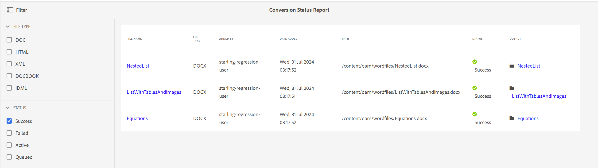

# Statusrapport för konvertering {#id205BBA00WZZ}

Adobe Experience Manager Guides har en robust konverteringsfunktion för att konvertera dokument i olika format till DITA. I Conversion Status Report finns en samlad vy över alla konverteringsåtgärder som utförs av Experience Manager Guides.

Följ de här stegen för att visa rapporten om konverteringsstatus:

1. Välj Adobe Experience Manager logotyp längst upp och välj **Verktyg**.

1. Välj **Stödlinjer** i listan över verktyg.

1. Markera rutan **Konverteringsstatusrapport**.

   Statusrapporten för konvertering visas för alla konverteringsåtgärder som körs i systemet.

   {align="left"}

1. Rapportsidan är uppdelad i två delar:

   - **Filter:**

     Du kan filtrera rapportdata baserat på filtyp och konverteringsstatus. I filtypen kan du välja att visa rapportdata för Word-dokument, strukturerade HTML-, XML-, DocBook- och IDML-dokument. I Status kan du välja att visa rapportdata för aktiviteter som har körts utan fel, misslyckats, aktiverats eller placerats i kö.

     På följande skärmbild visas rapportdata för konverteringsåtgärder med statusen Slutfört.

     {align="left"}

   - **Rapportera data:**

     Rapportdata innehåller följande kolumner:

      - **Filnamn**: Namnet på källfilen som konverteringsprocessen kördes på. Om du väljer länken Filnamn kommer du till källdokumentets plats.

      - **Filtyp**: Typ av källdokument, som kan vara Word, strukturerad HTML, XML, IDML och DocBook.

      - **Tillagd av**: Namnet på användaren som utförde konverteringsåtgärden.

      - **Datum tillagt**: Datum när aktiviteten kördes. Loggfilen hämtas om du väljer länken Datum tillagt.

      - **Sökväg**: Källdokumentets fullständiga sökväg.

      - **Status**: Status för konverteringsaktiviteterna - Slutfört, Misslyckat, Aktivt eller Köat.

      - **Utdata**: Sökväg till det konverterade dokumentet. Om du väljer på länken Utdata kommer du till den plats där utdata sparas.

**Överordnat ämne:**&#x200B;[&#x200B; Introduktion till rapporter](reports-intro.md)
