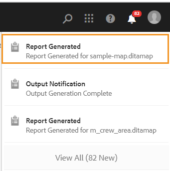

# DITA-kartrapport från kartpanelen {#id205BB800EEN}

AEM Guides förser administratörerna med rapporteringsfunktioner för att kontrollera dokumentationens övergripande integritet innan den publiceras eller görs tillgänglig för slutanvändarna. DITA-kartrapporten från kartkontrollpanelen i AEM Guides innehåller värdefull information, t.ex. saknade ämnen, ämnen med saknade element, UUID för refererade ämnen och mediefiler samt granskningsstatus för varje ämne. En detaljerad rapport på individuell ämnesnivå innehåller även DITA-innehållsrelaterad information som innehållsreferenser, saknade bilder eller korsreferenser.

>[!NOTE]
>
> AEM Guides uppdaterar den här rapporten för varje händelse som resulterar i en ändring i kartfilen eller när en referens i ämnesfilen uppdateras.

Utför följande steg för att visa DITA-kartrapporten:

1. Navigera till och klicka på den DITA-kartfil som du vill visa rapporten för i Assets-användargränssnittet.

1. Klicka på **Rapporter**.

   {width="800" align="left"}

   Rapportsidan är uppdelad i två delar:

   - **Ämnessammanfattning:**

     Visar den övergripande sammanfattningen av den markerade kartfilen. Genom att titta på Sammanfattning kan du snabbt se det totala antalet ämnen på kartan, saknade ämnen, antal ämnen som saknar element, ämnesstatus - Utkast, Under granskning eller Granskad.

   - **Information:**

     När du klickar på ett ämne visas en detaljerad rapport om det valda ämnet.

     {width="800" align="left"}

     Objekt som är markerade under **A**, **B**, **C** och **D** beskrivs nedan:

      - **Ämne**: Titeln på det ämne som anges i DITA-kartan. När du placerar muspekaren över ämnesrubriken visas hela objektets sökväg. Om det finns problem i ämnet, t.ex. saknade referenser eller bilder, visas en röd punkt före ämnestiteln.

      - **Filnamn**: Filens namn.

      - **UID**: Den universellt unika identifieraren \(UUID\) för filen.

      - **Författare**: Användare som senast arbetade med det här ämnet.

      - **Dokumenttillstånd**: Dokumentets aktuella tillstånd - Utkast, Under granskning eller Granskad.

      - **Saknade ämnen \(B\)**: Om det finns ämnen med brutna referenser visas dessa ämnen i listan Saknade ämnen.

      - **Saknade element**: Visar antalet saknade bilder eller eventuella brutna korsreferenser.

      - **Öppna i redigeraren \(D\)**: Om du klickar på den här ikonen öppnas ämnet i webbredigeraren.

   Objekt som är markerade under **E** beskrivs nedan:

   - **Multimedia**: Sökvägen till bilder som används i avsnittet visas tillsammans med dess UUID. Om du klickar på bildsökvägen öppnas motsvarande bild i ett popup-fönster. Brutna bildlänkar anges i röd färg.

   - **Innehållsreferenser**: Sökvägen till innehållet som refereras i avsnittet visas tillsammans med dess UUID. Om du klickar på titeln för det refererade innehållet öppnas motsvarande ämne i förhandsgranskningsläget.

   - **Korsreferens**: Sökvägen för det korsrefererade innehållet visas tillsammans med dess UUID. Om du klickar på titeln för det refererade innehållet öppnas motsvarande ämne i förhandsgranskningsläget. Brutna korsreferenser visas i röd färg.

   - **Granskning**: Visar status för ämnesgranskningen. Du kan se status \(öppna eller stäng\), förfallodatum och tilldelad för det ämne som granskas. Om du klickar på ämneslänken öppnas ämnet i granskningsläge.

   - **Används i**: Visar en lista över andra ämnen eller kartor där ämnet används. UUID för alla sådana ämnen och kartor visas också.

Förutom rapporten för varje enskilt ämne har administratörer även tillgång till information som publiceringshistorik för en DITA-karta. Mer information om historiken för genererade utdata finns i [Visa status för utdatagenereringsaktiviteten](generate-output-for-a-dita-map.md#viewing_output_history).

## Generera en CSV-fil över DITA-kartrapport

Du kan hämta och exportera CSV-filen för en DITA-kartrapport. CSV-filen innehåller den detaljerade DITA-kartrapporten.

Utför följande steg för att generera CSV-filen för en DITA-kartrapport:

1. Klicka på **Generera rapport** i det övre vänstra hörnet för att generera DITA-kartrapporten.

   {width="800" align="left"}

1. Du får ett meddelande när rapporten är klar att hämtas. Klicka på **Hämta** om du vill hämta CSV-filen för den genererade rapporten.

   {width="550" align="left"}

   Du kan även hämta CSV-filen för den genererade rapporten senare från AEM.

   Klicka på den genererade rapporten i Inkorgen för att hämta rapporten.

   {width="300" align="left"}

När rapporten har laddats ned i Inkorgen kan du även välja rapporten och använda ikonen Öppna längst upp för att öppna den valda rapporten.

**Överordnat ämne:**[ Rapporter](reports-intro.md)
