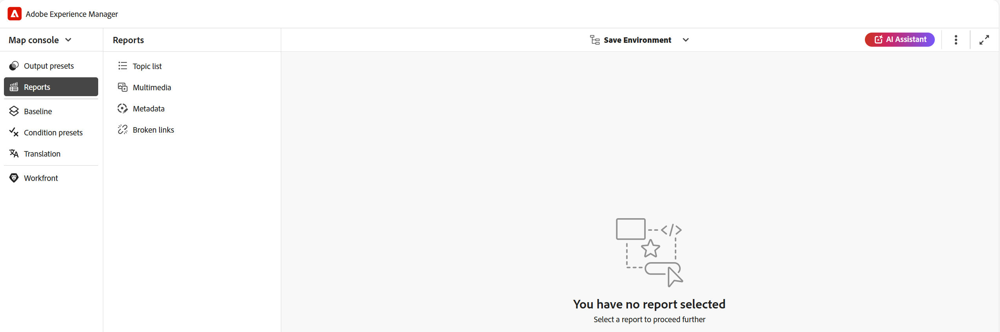

# DITA-kartrapport från kartkonsolen {#id231HF0Z0NXA}

Adobe Experience Manager Guides har en funktion i kartkonsolen som gör att du kan kontrollera kartans övergripande integritet och generera rapporter för den.

Du kan visa ämneslistan, hantera metadata för alla referenser, visa multimedielistan och åtgärda alla brutna länkar för den aktuella kartan från fliken **Rapporter** i kartkonsolen som du kan få åtkomst till enligt följande:

1. Öppna DITA-mappningsfilen i Kartvyn på panelen **Databas**.

   >[!NOTE]
   >
   > Du kan också öppna en DITA-karta direkt på fliken **Kartkonsol** i listrutan till vänster på hemsidan.

1. Välj ikonen **Öppna i kartkonsol** .

   {width="600" align="left"}

1. Välj **Rapporter** i den vänstra panelen.

Du kan hitta alla fyra rapporterna på panelen **Rapporter**. Beroende på dina behov kan du välja vilken som helst av rapporterna som visas här.

{align="left"}

Panelen Rapporter ger tillgång till fyra olika typer av rapporter. Varje rapport, tillsammans med dess tillgänglighet och funktioner, beskrivs i detalj nedan.

## Ämneslista - rapport

Rapporten **Ämneslista** innehåller detaljerad information om dina ämnen, till exempel referenstyp, dokumenttillstånd och författare.

Du kan visa rapporten med ämneslistan för en karta genom att utföra följande steg:

1. Välj **Ämneslista** på rapportpanelen. Listan med ämnen i DITA-kartan visas.

   {align="left"}

1. På panelen **Filter** kan du filtrera ämnen baserat på **referenstypen** \(direkt eller indirekt\), **dokumentstatus** \(om du t.ex. använder läget Redigera, Granskning eller Granskad visas de här avsnitten\) eller Ämnets **Författare** .

   >[!NOTE]
   >
   > Alla filter innehåller en fullständig lista med alternativ som finns i systemet.

1. Du kan också använda följande alternativ för ämnesfiltrering för att välja att visa följande kolumner i listan:

   - **Titel** Ämnets namn anges på DITA-kartan. Du kan markera det ämne som du vill redigera.
   - **Filnamn** Filens namn.
   - **UID** Den universellt unika identifieraren \(UUID\) för filen.
   - **Filplats** Ämnets fullständiga sökväg.
   - **Referenstyp** Referenstypen - direkt eller indirekt.
   - **Dokumenttillstånd** Ämnets tillstånd.
   - **Författare** Användaren som arbetade senast med ämnet. Listan sidnumreras och läses in asynkront, med en begränsad uppsättning användare åt gången och fler hämtas när du rullar eller navigerar. Detta förbättrar inläsningshastigheten och övergripande prestanda, särskilt när du arbetar med ett stort antal användare.
   - **Överordnad karta** Listan över alla kartor där ämnet refereras direkt.
   >[!NOTE]
   >
   > Välj **Uppdatera** om du vill få en ny lista över ämnen och visa ändringar i kartfilen eller om en referens i ämnesfilen uppdateras.

1. Välj **Hämta** om du vill hämta ögonblicksbilden av alla ämnen på DITA-kartan. Excel-arket innehåller de markerade kolumnerna och de ämnen som filtreras i vyn **Ämneslista**.

## Metadatarapport

**Metadatarapporten** innehåller en detaljerad rapport om dina referenser i den aktuella DITA-kartan, till exempel referenstyp, dokumenttillstånd, taggar, filplats osv.

Du kan visa metadatarapporten för en karta genom att utföra följande steg:

1. Välj **Metadata** på rapportpanelen. Listan över alla referenser till en karta visas tillsammans med dess metadata som taggar, dokumenttillstånd och anpassade metadata. Mer information om hur du lägger till en ny anpassad metadatakolumn finns i avsnittet [Lägg till anpassade metadatakolumner](#add-custom-metadata-columns).

   {align="left"}

1. På panelen **Filter** kan du filtrera ämnen baserat på **dokumenttillståndet** \(om t.ex. avsnitten är i läget Redigera, Granskning eller Granskad visas de här\), **Referenser** \(direkt eller indirekt\), **Filtyp** \(Karta, Ämne, Dokument, Bild, Video och annat\) i referensen.

   >[!NOTE]
   >
   > Alla filter innehåller en fullständig lista med alternativ som finns i systemet.

1. Du kan också välja att endast visa **filer utan taggar** eller välja särskilda taggar från filtret **Taggar** för att visa de filer som är associerade med dem.
1. Du kan också använda följande alternativ för ämnesfiltrering för att välja att visa följande kolumner i metadatalistan:
   - **Titel** \(markerat som standard\) Titeln på den refererade filen anges på DITA-kartan. Du kan markera filen som du vill redigera.

     >[!NOTE]
     >
     > En utcheckningsikon visas också nära titeln på en utcheckad fil. Du kan hålla muspekaren över ikonen för att visa namnet på användaren.

   - **Filnamn** Filens namn.
   - **Filplats** Den fullständiga sökvägen till filen.
   - **UID** Den universellt unika identifieraren \(UUID\) för filen.
   - **Taggar** \(valt som standard\) som används i filen.

     >[!NOTE]
     >
     > Som standard kan du visa två taggar för en fil. Om du vill visa fler taggar väljer du **Visa fler**. Välj **Visa färre** om du vill dra samman listan igen.

   - **Dokumentläge** \(markerat som standard\) Referensfilens aktuella läge.
   - **Referenstyp** Referenstypen - direkt eller indirekt
   - **Filtyp** \(vald som standard\) Typ av källfil. De tillgängliga alternativen är Karta, Ämne och Bild.
   - **Låst av** Den användare som har låst filen.

1. Välj **Hämta** om du vill hämta ögonblicksbilden av alla referenser i DITA-kartan. Excel-bladet innehåller de markerade kolumnerna och de referenser som filtreras i vyn **Metadata**.

### Hantera flera metadata samtidigt från metadatarapporten

Du kan lägga till taggar i ett enskilt ämne eller använda funktionen för grupptaggning för att lägga till flera taggar i flera ämnen, en DITA-karta eller på en underkarta. Du kan också ändra dokumentläget för alla markerade ämnen till nästa möjliga gemensamma dokumentläge.

### Uppdatera metadata

Så här uppdaterar du metadata:

1. Om du vill uppdatera metadata markerar du den eller de filer som du vill uppdatera. Du kan markera de filer som visas på panelen Metadata genom att markera kryssrutan bredvid **Titel**.

   Om du vill markera alla poster använder du fliken **Markera alla** ovanför namnlisten. Eftersom posterna läses in progressivt när du rullar, måste du bläddra till slutet av listan innan du använder **Markera alla**. Detta säkerställer att redigeringsbehörigheter och låsstatus utvärderas för alla filer, inte bara för de poster som är synliga just nu.

   >[!NOTE]
   >
   > Om en fil är låst av en annan användare kan den inte väljas för att uppdatera metadata. En låsikon visas också nära titeln på en låst fil. Du kan hålla muspekaren över ikonen för att visa namnet på användaren.

   {align="left"}

1. Välj **Hantera** överst.

   {width="350" align="left"}

1. Om du vill lägga till nya taggar väljer du nya taggar i listrutan för att använda dem i alla markerade avsnitt. Du kan också ta bort taggar genom att markera kryssikonen bredvid taggen.

1. Välj ett nytt dokumentläge om du vill ändra dokumentläget för alla markerade referenser. I listrutan visas det vanliga möjliga läget för alla valda ämnen. Om det aktuella läget för dina ämnen till exempel är Under granskning kan du visa läget Utkast, Godkänd eller Granskad.
1. Välj **Uppdatera** för att uppdatera metadata. Ett bekräftelsemeddelande visas för metadatan, oavsett om de har uppdaterats eller inte. Du kan också välja **Hämta rapport** om du vill hämta ögonblicksbilden av rapporten. Den här ögonblicksbilden innehåller information om den uppdaterade statusen för de valda referenserna.

### Lägg till anpassade metadatakolumner

Med den här funktionen kan du lägga till anpassade metadatakolumner efter behov, som sedan visas i metadatarapporten. Den ger också större flexibilitet vid rapportering av metadata. Så här lägger du till en ny anpassad metadatakolumn:

1. Om du vill lägga till en anpassad metadatakolumn väljer du **Workspace-inställningar** (visas som **Inställningar** för **Lokal**) från de tre punkterna i det övre högra hörnet på metadatasidan.

   {width="600" align="left"}

1. Välj **Metadata** på den vänstra panelen i popup-fönstret som visas.
1. Lägg till ett nytt anpassat metadatafält efter behov på fliken **Lägg till**.

   {width="600" align="left"}

1. Ange en specifik metadatasökväg och en lämplig rubrik för den som du vill lägga till i kolumnerna i metadatarapporten. En anpassad metadata med titelspråket och en specifik sökväg läggs till.

   >[!NOTE]
   >
   > Om du vill ta bort en viss metadatakolumn kan du ta bort den från den lista som visas. Dessutom kan du redigera **Label** om du vill ändra visningsrubriken för kolumnen.

   {width="600" align="left"}

1. Välj **Spara** och **Uppdatera** i metadatavyn. En ny anpassad kolumn, **Språk**, har lagts till i listan med kolumner på panelen Filter.

   >[!NOTE]
   >
   > Om du lägger till en ny metadatakolumn visas även panelen **Versionshistorik** i Redigeraren. Mer information finns i **[Metadata](web-editor-features.md)**.

   {width="600" align="left"}

På samma sätt kan du följa ovanstående steg för att lägga till nya anpassade metadatafält baserat på dina krav som behövs i metadatarapporten.

## Multimedierapport

**Multimedierapporten** innehåller detaljerad information om multimedia som används på kartan, till exempel titel, typ \(ljud, video och bilder\), filer som multimedia används i och referenstyp för de filer som de har använts i. Du kan också visa UUID och platsen för multimedia i databasen. Du kan visa en rapport om multimedia genom att utföra följande steg:

1. Välj **Multimedia** på rapportpanelen. Listan över multimedia som finns i DITA-kartan visas.
1. Från panelen **Filter** kan du sortera listan efter multimedia eller efter namnen som används i referenser.

   - När du sorterar efter **Multimedia** visas multimediets namn i den första kolumnen och sedan visas namnen på alla referenser som de har använts i i en annan kolumn på samma rad. På följande skärmbild visas multimedia testSong.mp3 i den första kolumnen och två referenser som den används i visas i den tredje kolumnen på samma rad.

     {width="650" align="left"}

   - Om du sorterar efter kolumnen **Används i** visas den omformade vyn där namnen på de referenser som multimedia har använts i listas i den första kolumnen medan multimedianamnen listas i en annan kolumn på separata rader. På följande skärmbild visas namnen på två referenser, \(testing_indirekt och Video content Topic\), i den första kolumnen och multimedia testSong.mp3 visas i den tredje kolumnen på två separata rader.

     {width="650" align="left"}

1. Du kan filtrera multimedia baserat på **multimedietypen** och **referenstypen**. Listan med multimediefiler visas baserat på dina val i listrutan. Du kan t.ex. välja att bara visa ljudreferenserna på DITA-kartan, och en fil visar bara de ljudreferenser som används i den.

1. Du kan också använda följande filtreringsalternativ för att välja att visa följande kolumner i listan:

   - **Multimedia** \(markerat som standard\) Multimediets titel anges på DITA-kartan. Du kan välja multimedia för att redigera den.
   - **Multimediaplats** Multimediets fullständiga sökväg.
   - **Multimedia-UUID** Den universellt unika identifieraren \(UUID\) för filen.
   - **Multimedietyp** \(vald som standard\) Multimedietyp. De tillgängliga alternativen är Ljud, Video eller Bild.
   - **Används i** \(markerat som standard\) Referenserna som multimediet har använts i. Du kan markera referensen för att redigera den.
   - **Referenstyp** \(valt som standard\) Referenstypen - direkt eller indirekt.
   >[!NOTE]
   >
   > Välj **Uppdatera** om du vill få en ny lista över multimedia och visa alla ändringar i kartfilen eller om några multimedia på din DITA-karta har uppdaterats.

1. Välj **Hämta** om du vill hämta ögonblicksbilden av alla multimedia på DITA-kartan. Excel-bladet innehåller de markerade kolumnerna och multimedia som filtrerats i vyn **Multimedia**.

## Rapport om brutna länkar

**Brutna länkar** är en användbar rapport som ger dig information om de brutna länkar som finns på din aktuella karta. Du kan visa brutna länkar, som kan vara för DITA-avsnitt, multimediafilreferenser, innehållsnyckelreferenser och så vidare. Du kan också åtgärda dem här själv.
Rapporten innehåller detaljerad information om exempelvis den brutna länken, länktypen, filer som referensen används i och vilken typ av filer som de har använts i.
Du kan visa rapporten för brutna länkar genom att utföra följande steg:

1. Välj **Brutna länkar** på rapportpanelen. Listan med brutna länkar eller referenser i DITA-kartan visas.
1. På panelen **Filter** kan du sortera listan efter länkar eller efter namnen som används i referenser.

   - När du sorterar efter **Bruten länk** visas sökvägarna för de brutna länkarna i den första kolumnen och namnen på alla referenser där de har använts visas sedan i en annan kolumn på separata rader. Om samma brutna länk används i flera filer visas de på en rad och visas som grupperade eller underrader. På följande skärmbild visas två brutna länkar i den första kolumnen och referensen som de används i. `m_ElectricalSpecs_900.ditamap` visas i den tredje kolumnen på två separata rader.

   {align="left"}

   - Om du sorterar efter **Används i kolumnen**, kommer du att visa den omformade vyn där namnen på referenserna där de brutna länkarna har använts listas i den första kolumnen medan de brutna länkarna listas i en annan kolumn på samma rad. På följande skärmbild visas referensen (i vilken den brutna länken används) `m_ElectricalSpecs_900.ditamap` i den första kolumnen och de brutna länkarna visas i den tredje kolumnen på samma rad.

   {align="left"}

1. Du kan filtrera brutna länkar baserat på **filtypen** och **länktypen**. Listan med brutna länkar visas baserat på ditt val i listrutan. Du kan t.ex. välja att bara visa innehållsreferenserna i DITA-kartan, och en fil visar bara de brutna innehållsreferenserna som används i den.

   DITA-avsnitt, DITA-karta, filreferens, nyckelreferens, innehållsreferens, referens för innehållsnyckel, bildreferens, multimediefilsreferens och multimedienyckelreferens är tillgängliga värden i listrutan **Länktyp** och Ämne, Karta, Dokument, Bild, Video, Ljud med flera är tillgängliga i listrutan **Filtyp** .
1. Du kan också använda följande filtreringsalternativ för att välja att visa följande kolumner i listan:

   - **Bruten länk** (markerad som standard) Den brutna länkens sökväg anges i DITA-kartan.

   - **Länktyp** (markerad som standard) Länktypen. De tillgängliga alternativen är Ämne, Karta, Filreferens, Nyckelreferens, Innehållsreferens, Innehållsnyckelreferens, Bildreferens, Multimediefilsreferens och Multimedienyckelreferens.

   - **Används i** (markerat som standard) Referenserna där den brutna länken har använts. Du kan markera referensen för att visa den i redigeringsläge.

   - **Filtyp** (markerad som standard) Referenstypen - Ämne, Karta, Dokument, Bild, Video, Ljud med flera.

   Välj **Uppdatera** om du vill få en ny lista över brutna länkar och visa ändringar i kartfilen eller om någon bruten länk i DITA-kartan har uppdaterats.
1. Du kan välja att åtgärda den brutna länken på ikonen **Åtgärda länk** ().

   >[!NOTE]
   >
   > Håll pekaren över den brutna länksökvägen under kolumnen Bruten länk för att visa ikonen Korrigera länk ().

   Du kan åtgärda en länk i båda vyerna när du har beställt av **brutna länkar** eller av **Används i**.

   >[!NOTE]
   >
   > När du åtgärdar en bruten länk medan du har sorterat efter brutna länkar, kommer länken att korrigeras i alla filer där den används (som grupperas på en rad).

1. Du måste uppdatera den nödvändiga referensinformationen i dialogrutan **Uppdatera länk**. Vilken information som krävs i dialogrutan **Uppdatera länk** beror på referenstypen.\
   När du har åtgärdat en länk visas den inte under listan med brutna länkar. I stället kan du visa den under Ämneslista eller Metadata.

1. Välj **Hämta** om du vill hämta ögonblicksbilden av alla brutna länkar i DITA-kartan. Excel-filen innehåller de markerade kolumnerna och de brutna länkarna som filtreras i vyn Brutna länkar.

**Överordnat ämne:**[ Introduktion till rapporter](reports-intro.md)
