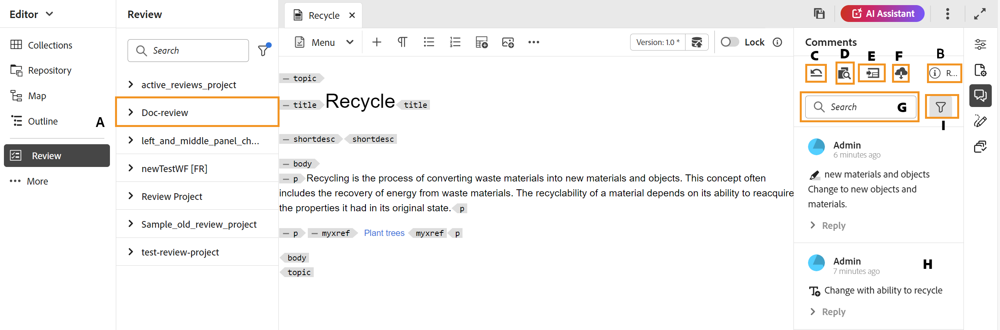
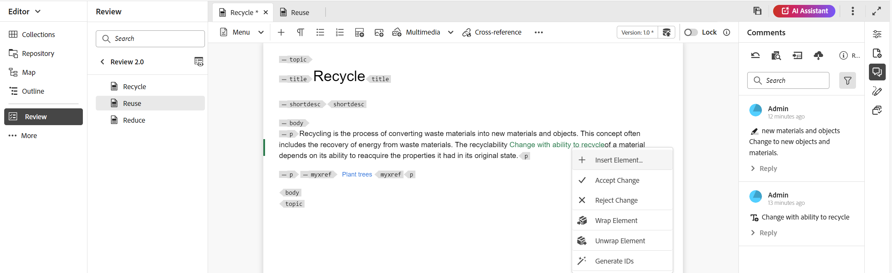

# Adressgranskningskommentarer {#id2056B0X0KBI}

Som författare kan du adressera kommentarer i ett ämne med redigeraren. Kommentarerna läses in baserat på den granskningsuppgift som valts på granskningspanelen. Mer information finns i funktionsbeskrivningen för **Granskningspanelen**  i avsnittet [Vänster panel](../user-guide/web-editor-features.md#id2051EA0M0HS).

I följande avsnitt beskrivs olika sätt att hantera kommentarer i redigeraren.

En författare kan adressera kommentarer i ett dokument från Redigeraren. Visuella indikatorer visas som anger om kommentarer som infogats, tagits bort eller markerats. Även kommentarstypen anges längst upp i varje kommentarspost.

>[!NOTE]
>
> När du adresserar granskningskommentarer \(för ett aktivt granskningsdokument\) ska du se till att du inte öppnar ämnet i granskningen på flera flikar med full taggvy aktiverat, inte växla mellan redigeringsläget och visningsläget för Source.

{align="left"}

I redigeraren innehåller den högra panelen ikonerna för Granska och spåra ändringar. Granskningspanelen visar alla kommentarer som har gjorts i dokumentet av granskare. Panelen **Spåra ändringar** visar status för alla infogade och borttagna kommentarer i dokumentet.

- **A**: Välj en granskningsåtgärd om du vill visa granskningskommentarer. Om ditt ämne har delats för granskning i flera granskningsåtgärder, kommer du att visa de uppgifter som listas i den här listrutan.

  När du väljer en granskningsuppgift i listan kan du visa kommentarer som gjorts av granskarna i den uppgiften. Du kan adressera granskningskommentarerna separat i uppgifter, vilket innebär att alla uppdateringar av en kommentar bara är synliga för granskarna av den aktuella uppgiften.

- **B:** Välj **Granska information**  på panelen **Kommentarer** om du vill visa mer information om granskningsaktiviteten:

   - **Namn**: Namn på granskningsaktiviteten.
   - **Granskningsversion**: Visar versionen som är associerad med den valda granskningsuppgiften. Detta hjälper dig att hålla reda på vilken version du har delat för granskning
   - **Status**: Aktuell status för granskningsaktiviteten.

  >[!NOTE]
  >
  > Om rotkartan för din granskningsåtgärd skiljer sig från rotkartan för redigering visas information om den för att ange att redigeringen och rotkartan för granskningen inte matchar.

- **C**: Om du har uppdaterat ämnet efter att du startat granskningen återställer du arbetskopian till den version som delats för granskning genom att välja ikonen **Återställ ämne till granskningsversion** . Det gör det enklare för dig att lägga in granskningsfeedback direkt i den version som delats för granskning. När du har tagit med feedback kan du spara ändringarna i den återskapade versionen eller skapa en ny version av ämnet. Om du väljer att skapa en ny revision av ditt ämne skapas en ny gren av den ämnesversion som delats för granskning. Om du till exempel delade version `1.2` av ett ämne för granskning medan den aktuella redigeringsversionen är `1.3` kan du använda den här ikonen för att växla tillbaka till version `1.2` för att inkludera granskningskommentarer. Om du väljer att skapa en ny revision efter att ha infogat ändringar i version `1.2` skapas en ny gren med version `1.2.0` för ämnet.

  När du har infogat feedback på en granskning vill du vanligtvis sammanfoga ändringar från den senaste versionen av avsnittet. Om du vill göra det använder du funktionen [Sammanfoga](web-editor-features.md#id205DF04E0HS) för att hämta alla uppdateringar som gjorts efter att ämnet delats för granskning.

- **D**: Öppna sida vid sida-vyn om du vill visa den kommenterade versionen av ämnet. Som du ser på skärmbilden ovan är avsnittet längst till vänster den senaste versionen av ämnet där du kan göra ändringar. Nästa avsnitt är den kommenterade versionen av ämnet. När du navigerar mellan kommentarer i ämnet ändras sidvyn och den versionen av ämnet som kommentaren gjordes om visas. Alla kommentarer på kommentarspanelen är länkade till motsvarande text i det här avsnittet. Den hjälper dig att identifiera kommenterad text. Kommentarerna visas i den ordning som de kommenteras i dokumentet.

  Du kan visa versionsnumret högst upp i sidvyn. Om du väljer den här ikonen igen döljs den kommenterade versionen av ämnet.

- E: Importera infogade och borttagna \(eller Genomstruken\) kommentarer direkt i ämnet. När du har valt ikonen Importera visas alla textinmatningar och -borttagningar i arbetskopian av avsnittet. Nu finns det två sätt att godkänna eller avslå kommentarer.

  Om du vill infoga den föreslagna ändringen \(infoga eller ta bort\) en i taget högerklickar du bara på kommentaren i innehållet och väljer Acceptera ändring eller Ignorera ändring. Beroende på vad du väljer godkänns eller avvisas kommentaren. Om en kommentar godtas läggs innehållet till i innehållet och om den avvisas tas det bort från innehållet. Statusen för kommentaren ändras också på granskningspanelen.

  {align="left"}

  Du kan också använda panelen Spåra ändringar för att acceptera eller ignorera kommentarer. Om du markerar en kommentar markeras kommentaren i dokumentet.

  {align="left"}

  >[!IMPORTANT]
  >
  > Funktionen för att importera kommentarer fungerar bara på de dokument som inte har ändrats sedan de delades för granskning. Om du har gjort några ändringar efter att du har skickat dokumentet för granskning får du en varning om att **framtvinga import**-kommentarer i dokumentet. Om du gör det förlorar du dock alla uppdateringar som du har gjort i dokumentet. Varningen **Tvinga import** visas också om dokumentet har skapats utanför och sedan delats för granskning. Du kan importera kommentarerna.

  När du accepterar eller avvisar en kommentar tas den bort från listan Spårade ändringar. Detta fungerar också som en indikator på hur många kommentarer som behöver tas upp i dokumentet.

- **F**: Hämta alla bilagor som är tillgängliga i granskningsavsnittet på menyn Fler alternativ.
- **G**: Sök efter text i kommentarer.
- **H**: Acceptera eller avvisa en kommentar.

- **I**: Använd ett filter på kommentarerna. Du kan filtrera om du vill visa kommentarer baserat på granskningstyp \(all, markerad, borttagen, infogad eller anteckningsbar), granskningsstatus \(all, accepterad, avvisad eller ingen\), granskare \(alla eller vissa granskare\)\) eller ämnesversioner.

**Svara på en kommentar genom att tagga andra användare**

Som författare och initierare av granskningsaktiviteten kan du svara på granskningskommentarer och tagga andra användare som deltar i samma granskningsåtgärd för att dirigera om deras uppmärksamhet eller tilldela uppföljningar. Den här funktionen är bara tillgänglig för aktiva granskningsåtgärder.

>[!NOTE]
>
> Om du vill visa listan över användare som tilldelats en granskningsaktivitet och tagga dem i en kommentar, måste du ha *läsåtkomst* på `/home/users and /home/groups` -noder. Mer information finns i [Användaradministration och -säkerhet](../cs-install-guide/user-admin-sec.md#additional-notes-on-user-groups).   Om taggning fortfarande inte är tillgänglig efter att du har bekräftat åtkomst kan din administratör behöva tilldela en `user-admin`-licens för att aktivera den här funktionen.

{width="350" align="left"}
*Bildtextanvändare :Tag som initierare/författare*

Taggade användare får både ett e-postmeddelande och ett AEM-meddelande så att de snabbt kan informeras. Mer information om hur granskningsmeddelanden utlöses finns i [Om granskningsmeddelanden](./review-understanding-review-notifications.md).

**Få åtkomst till granskningskommentarer med granskningsgränssnittet**

Om du är initierare eller författare för en granskningsåtgärd och öppnar den från **projektkonsolen**, startas avsnittet i granskningsgränssnittet. Eftersom den här uppgiften inte är tilldelad dig kan du visa och svara på kommentarer, men inte utföra några granskningsåtgärder. Verktygsfältet för kommentarer är inaktiverat för användare som inte är tilldelade uppgiften.

{width="350" align="left"}

**Överordnat ämne:**&#x200B;[ Introduktion till granskning](review.md)
