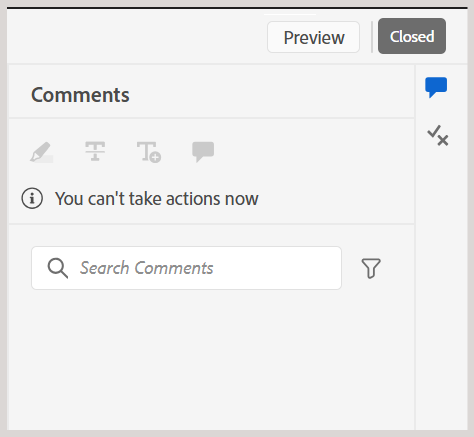
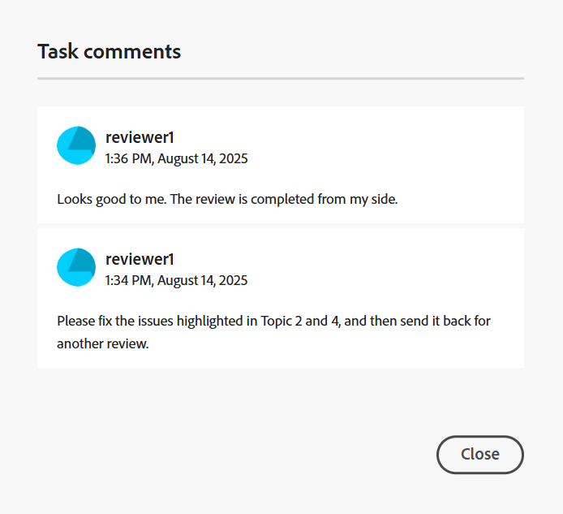

# Slutför granskningsaktiviteten som en granskare

>[!IMPORTANT]
>
> De nya funktionerna som beskrivs i den här artikeln aktiveras som standard i version 2508 av Experience Manager Guides as a Cloud Service. Granskningar som skapades före migreringen påverkas inte och fortsätter att använda det tidigare arbetsflödet. Om du föredrar att fortsätta använda de befintliga funktionerna utan dessa uppdateringar kontaktar du ditt Customer Success-team för att inaktivera de nya funktionerna.

Som granskare kan du markera en granskningsåtgärd som slutförd när du har granskat allt innehåll och vill meddela författaren. Du kan även lämna eventuella slutkommentarer i det här skedet.

Utför följande steg för att slutföra en granskningsåtgärd:

1. Öppna granskningsaktiviteten som du har tilldelats.
2. Välj **Markera som färdig** i den övre delen enligt nedan:

   {width="350" align="left"}

   Dialogrutan **Slutför åtgärd** visas.
3. I dialogrutan **Slutför uppgift** lägger du till de sista kommentarerna för författaren och väljer **Fullständig**.

   >[!NOTE]
   >
   > Kommentarerna på aktivitetsnivå fungerar som en sammanfattning eller som slutliga kommentarer, och skiljer sig från kommentarer på textnivå som lagts till under ämnesgranskningen. I den här dialogrutan kan du antingen göra en översikt över uppföljningsåtgärder, som att be författaren att adressera specifika kommentarer och skicka om uppgiften för granskning eller ange att granskningen är slutförd.

   Som granskare kan du till exempel lägga till en kommentar som en uppföljningsåtgärd för författaren:

   {width="350" align="left"}

   Du kan också lägga till en kommentar som anger att uppgiften har slutförts enligt nedan:

   {width="350" align="left"}

Du har markerat aktiviteten som slutförd och dess status är nu inställd på **Slutförd**. Inga fler åtgärder tillåts när aktiviteten har markerats som slutförd. Ett meddelande skickas till författaren eller initieraren av granskningsåtgärden för att dra uppmärksamheten till sig direkt. Mer information om hur granskningsmeddelanden utlöses finns i [Om granskningsmeddelanden](./review-understanding-review-notifications.md).

{width="350" align="left"}

Om författaren eller initieraren av uppgiften [stänger granskningsaktiviteten](./review-close-review-task.md), baserat på feedback, ändras uppgiftsstatusen i granskningsgränssnittet till **Stängd**.

{width="350" align="left"}

## Visa kommentarer på aktivitetsnivå

Alla kommentarer på aktivitetsnivå visas i dialogrutan **Aktivitetskommentarer** som är tillgänglig i skrivskyddat läge. När du slutför en granskningsåtgärd med en slutgiltig kommentar, registreras dina indata i den här dialogrutan för framtida referens.

Om du vill få åtkomst till kommentarer på åtgärdsnivå från granskningsgränssnittet går du till den vänstra panelen och väljer ikonen **Åtgärdskommentarer** .

{width="350" align="left"}

Dialogrutan **Uppgiftskommentarer** visas till höger.

{width="350" align="left"}

Kommentarerna i dialogrutan visas i kronologisk ordning med de senaste kommentarerna först och de äldsta kommentarerna sist. Den här beställningen hjälper dig att följa konversationen allt eftersom den fortskrider över tid.

Dialogrutan **Uppgiftskommentarer** är tillgänglig för alla användare som deltar i granskningsaktiviteten, inklusive författaren eller initieraren av granskningsaktiviteten och andra granskare. Därför kan kommentarer från andra granskare (om de är inblandade) också visas i dialogrutan Uppgiftskommentarer. Detta bidrar till att säkerställa tydlig och spårbar kommunikation under hela granskningsprocessen.

Efter att ha granskat feedback på aktivitetsnivå kan författaren antingen begära en ny granskning eller stänga granskningsaktiviteten. I båda fallen är alla kommentarer som samlats in under granskningsprocessen tillgängliga som referens i dialogrutan **Aktivitetskommentarer** .
