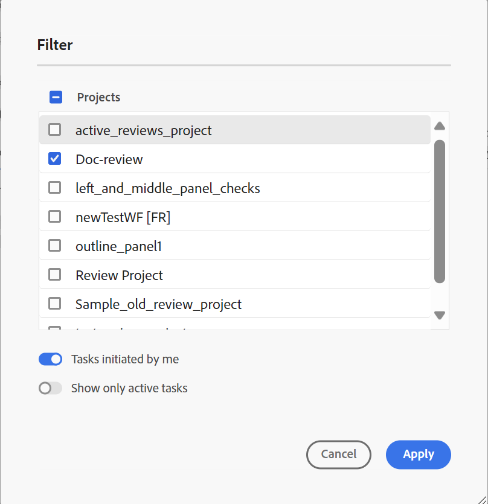

# Visa en slutförd granskningsaktivitet

Du kan slutföra granskningsåtgärder för de projekt som du är författare till (eller initierare). När en granskningsuppgift är klar kan du och alla granskare öppna den i skrivskyddat läge.

## Som granskare

Som granskare kan du visa en indikator på kommentarpanelen för att visa att granskningen har avslutats. Verktygsfältet för kommentarer visas inte, så du kan inte markera, genomstryka, infoga text eller lägga till kommentarer. Du kan läsa en kommentar men inte redigera eller ta bort den. Du kan inte heller lägga till ett svar på kommentarerna. Du kan inte visa kontextverktygsfältet (används för att markera eller genomstryka text). Ikonen för inaktuella kommentarer visas inte heller i en slutförd granskningsåtgärd.

Du kan dock söka efter och filtrera kommentarer. Du kan också välja att visa eller dölja villkor och visa villkorsstyrt innehåll i enlighet med detta. Du kan hämta alla bifogade filer, men du kan inte överföra eller ta bort bifogade filer för kommentarerna.

{align="left"}

## Som författare

Du kan visa de slutförda granskningsaktiviteterna på panelen **Granska** på projektnivå i avsnittet **Stängda aktiviteter** så som visas på skärmbilden. Du kan söka efter eller filtrera granskningsåtgärder baserat på projekt. Du kan till exempel välja specifika projekt i dialogrutan **Filter** och visa dem på panelen Aktiv granskning. Du kan filtrera resultaten ytterligare med alternativen **Åtgärder som har initierats av mig** och **Visa endast aktiva aktiviteter**.

{align="left"}

För stängda granskningsåtgärder kan du läsa en kommentar, men inte acceptera eller avvisa en kommentar. Du kan inte redigera eller ta bort kommentarer. Du kan inte heller lägga till något svar för kommentaren. Ikonen Inaktuella kommentarer och ikonen Importera kommentarer till redigeringsvyn visas inte för en slutförd granskningsåtgärd. Ikonen Återställ ämne och ikonen för import inaktiveras när granskningsåtgärden har slutförts enligt skärmbilden.

Du kan också söka efter eller filtrera kommentarer som finns på granskningspanelen. Du kan hämta alla bifogade filer, men du kan inte överföra eller ta bort bifogade filer för kommentarerna.

{align="left"}

Både som granskare eller författare kan du visa det granskade innehållet tillsammans med kommentarerna, men du kan inte göra några ändringar i en slutförd granskningsåtgärd.
