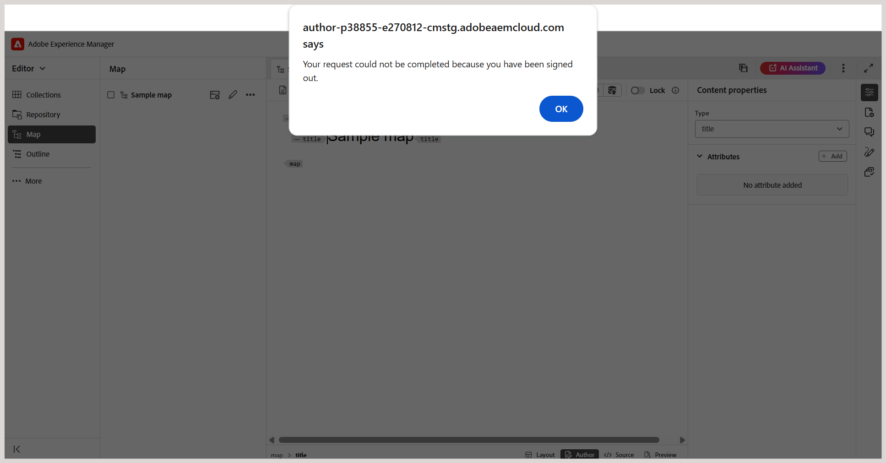

# Varför loggar Experience Manager Guides ut mig efter en viss tidsperiod?

Experience Manager Guides avslutar en användarsession efter en angiven inaktivitetsperiod (tidsgräns för inaktivitet). Den här funktionen för automatisk utloggning är konfigurerad i Adobe Experience Manager. När sessionen förfaller visas en popup-varning som meddelar användaren om den session som förfaller. Den här varningen hindrar användaren från att göra ytterligare ändringar i innehållet.

**Hur fungerar timeout för sessioner?**

Experience Manager Guides skickar en bakgrundsbegäran `token.json` var 30:e sekund för att validera sessionen. Om sessionen fortfarande är aktiv returneras en giltig token. Om sessionen har gått ut på grund av inaktivitet returneras en tom token och sessionen betraktas som inaktiv.

**Vad händer när sessionen upphör?**

När en inaktiv session upptäcks:

- Ett popup-meddelande om att du har loggats ut visas.

  

- Varningen inaktiverar all interaktion med programmet.

- Om du väljer **OK** uppdateras webbläsaren och du omdirigeras till inloggningssidan.
- När du loggar in omdirigeras du till den senast öppnade sidan av Experience Manager Guides.

**Nästa steg**

Varningen om sessionens förfallodatum förhindrar dataförlust genom att hindra dig från att göra ändringar i programmet under en inaktiv session. För att undvika oavsiktlig förlust av innehåll rekommenderar vi att du sparar arbetet regelbundet i redigeraren, särskilt innan du går bort från systemet under en längre period.

