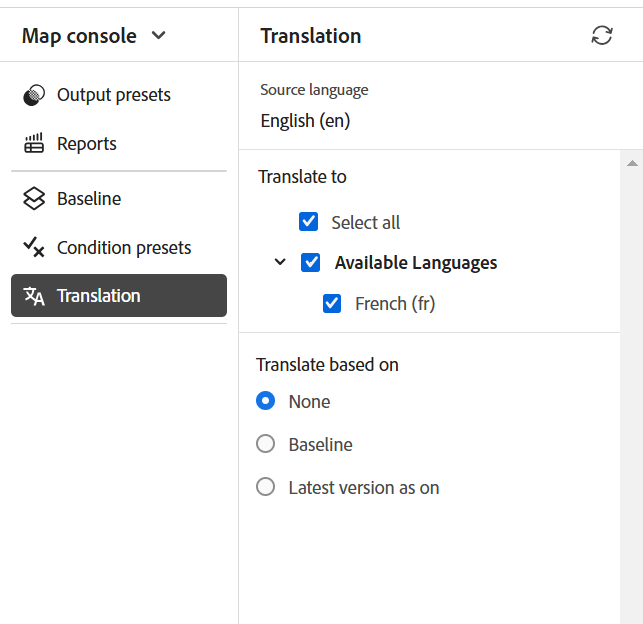

# Översätta dokument från kartkonsolen {#id21BKF0Z0YZF}

>[!TIP]
>
> Vi rekommenderar att du använder den här översättningsfunktionen från redigeraren om du har uppgraderat till Adobe Experience Manager Guides as a Cloud Service från februari 2022 eller senare.

Experience Manager Guides har en kraftfull funktion i Editor som gör att du kan översätta ditt innehåll till flera språk. Du kan skapa ett nytt översättningsprojekt och sedan lägga till översättningsjobben i det befintliga översättningsprojektet. Du kan också skapa ett flerspråkigt översättningsprojekt som innehåller översättningsjobb för alla valda språk.

>[!NOTE]
>
> Administratören kan konfigurera fliken Hantera \(används för översättning\) i Redigeraren. Mer information finns i avsnittet *Konfigurera översättningsfunktionen i redigeraren* i Installera och konfigurera Adobe Experience Manager Guides as a Cloud Service.

## Innan du börjar

Innan du utför stegen i den här proceduren måste du se till att du har skapat språkroten och målmapparna

1. Skapa en rotmapp där källinnehållet lagras. Rotmappen måste skapas med språknamnet \(till exempel engelska\) eller språkkoden \(en\).
1. Skapa de målmappar som du vill översätta innehållet till. Om du till exempel vill översätta ditt innehåll till tyska eller franska måste du skapa en mapp med namnet -de \(för tyska\) eller -fr \(för franska\).

>[!NOTE]
>
> Rotmappen och målmapparna måste skapas på samma nivå.

## Skapa ett översättningsprojekt

1. Öppna DITA-mappningsfilen i Kartvyn på panelen **Databas**.
1. Välj ikonen **Öppna i kartkonsol** .
1. Navigera till fliken **Översättning** på Kartkonsolen. På **översättningspanelen** visas de tillgängliga språkgrupperna.

1. Som användare kan du visa språkgrupperna som är konfigurerade för din mappprofil. Språkgrupperna visar språkmapparna tillsammans med deras språkkoder. Exempelvis innehåller språkgruppen G1 italienska \(it\), tyska \(de\), franska \(fr\) och engelska \(en\) språkmappar.

   {width="300" align="left"}

   *Välj de språkgrupper eller språk som du vill översätta dina dokument på.*

   >[!IMPORTANT]
   >
   > Du kan bara markera och översätta till de språk som du har skapat målmappen för parallellt med källspråket. En språkmapp som skapats på en annan nivå, t.ex. en nivå ned från källspråksmappen, visas inte heller. Se till att du skapar alla målspråksmappar på samma nivå som källspråksmappen.

1. Du kan välja vilken språkgrupp som helst som mål för översättningen. Om du **markerar alla** översätts de markerade filerna till alla tillgängliga språk i de befintliga språkgrupperna.

   Alternativet för språkmappen är nedtonat och visar ett varningstecken:

   - Om målmappen för ett språk saknas.
   - Om målspråket är samma som källan.

   >[!NOTE]
   >
   > Om du skapar målmappen för ett språk när du har skapat språkgruppen, uppdaterar du webbläsaren så att språket aktiveras i språkgrupperna.

1. Om du väljer ett visst språk visas det som markerat under alla språkgrupper som du har valt. När du översätter till ett språk översätts det på ett och samma ställe för alla språkgrupper. Om t.ex. tyska finns i både G1- och G2-språkgrupper markeras det för båda.

1. Från **Andra språk** kan du välja vilket språk som helst som du har skapat målmappen för, men som inte ingår i någon språkgrupp.

1. Du kan också välja något av följande alternativ för att översätta projektet:

   **Ingen** Välj det här alternativet om du vill översätta standardversionerna av filerna. Det här alternativet är markerat som standard.

   **Använd baslinje:** Du kan välja en baslinje för att översätta projektet. Välj **Använd baslinje** och välj en baslinje som skapats på kartan. Alla filer som ingår i den valda baslinjen visas på översättningssidan. När innehållet har översatts kan du exportera den översatta baslinjen. Mer information om hur du exporterar den översatta baslinjen finns i [Exportera översatt baslinje](generate-output-use-baseline-for-publishing.md#id196SE600GHS).

   **Använd den senaste versionen från och med**: Välj om du vill filtrera ämnesversionen utifrån datum och tid när de skapades. När du väljer ett datum och en tid visas endast den senaste versionen av filerna som skapades på eller före det valda datumet och tiden.

1. Välj **Använd**. En lista med information om ämnen och associerade resurser visas.
1. Markera de ämnen som du vill skicka för översättning. Du kan också använda alternativen för ämnesfiltrering för följande kolumner:

   - **Titel**: Källfilens namn.  Håll pekaren över källfilens namn för att visa målfilens eller den översatta filens namn.
   - **Filnamn**: Källfilens namn
   - **Filtyp**: Källfilens typ. De tillgängliga alternativen är Karta, Ämne och Bild.
   - **Referenstyp**: Direkta eller indirekta referenser
   - **Version**: Källfilens versionsnummer
   - **Versionsetikett**: Etikett för den valda versionen av källfilen
   - **Målversion**: Målfilens versionsnummer
   - **Dokumenttillstånd**: Källfilens tillstånd. De tillgängliga alternativen är Utkast, Under granskning och Granskad.
   - **Målspråk**: Det språk som du vill översätta källfilen till
   - **Översättningsstatus**: De tillgängliga alternativen är: Osynkroniserad, Kopia saknas, Pågår och Synkroniserad.
   - **Måletikett**: Etikett för den valda versionen av målfilen
1. Välj **Skicka för översättning** i det övre högra hörnet.

   {align="left"}

1. Välj **Skapa ett nytt översättningsprojekt** i listrutan.

   {width="350" align="left"}

   Förutom ett nytt översättningsprojekt kan du även välja mellan följande alternativ:

   - Du kan välja att **endast skapa struktur** för översättningsprojektet.
   - Du kan välja att **skapa ett nytt XLIFF-översättningsprojekt** för att konvertera XML-innehållet till XLIFF (XML Localization Interchange File Format). XLIFF är ett öppet XML-baserat format som används för att standardisera dataöverföringen mellan olika verktyg som används i innehållsöversättningsprocessen. Experience Manager Guides stöder XLIFF version 1.2.
I ett XLIFF-projekt exporteras innehållet till det branschledande XLIFF-formatet, som kan tillhandahållas översättningsleverantörer. XLIFF-formatet möjliggör återanvändning av segment som du redan har översatt under översättningsfasen.\
     När XLIFF-innehållet har översatts kan det importeras till Experience Manager Guides, vilket skapar en översatt version av det ursprungliga DITA-projektet.

   >[!NOTE]
   >
   > XLIFF-export fungerar bara med mänsklig översättningskonfiguration.

   - Du kan välja **Skapa ett nytt flerspråkigt översättningsprojekt** som innehåller översättningsjobb för alla språk som du har valt för översättning. Om du till exempel har valt franska, tyska och spanska skapas ett projekt som innehåller översättningsjobb för alla tre språken.
   - Om du redan har ett översättningsprojekt kan du lägga till ämnen i det projektet. Välj alternativet **Lägg till i befintligt översättningsprojekt** i projektlistan och välj ett projekt i listan Befintliga översättningsprojekt. Du kan sortera dessa projekt efter den senaste, stigande eller fallande ordningen.

   - Om du väljer **Lägg till i det befintliga översättningsprojektet** uppdaterar den här åtgärden den befintliga resursposten i projektet om resursen redan har lagts till och det relaterade översättningsjobbtillståndet är i läget *Utkast*.
      - Om målspråket inte finns i projektet skapas ett nytt projekt för översättningsprojektet för ett enda språk, och ett nytt jobb skapas för översättningsprojektet för flera språk.

      - Om jobbet redan finns för målspråket och jobbstatusen inte är i tillståndet *Utkast* skapas ett nytt jobb i samma projekt för att lägga till resurserna för översättning.

   >[!NOTE]
   >
   > Om ditt befintliga projekt är ett omfångsprojekt har det &#39;\(omfång\)&#39; i sitt namn.

   - Om du behöver skapa omfånget för ett projekt som ska översättas kan du välja **Skapa ett nytt omfångsöversättningsprojekt**. Kopiorna skickas inte för översättning och den ursprungliga översättningsstatusen för filerna behålls. Det påverkar inte målspråkskopian av ämnen som skickas för omfång.

1. Ange en rubrik för projektet i fältet **Projektnamn**.
1. Välj **Skicka** om du vill skapa ett nytt översättningsprojekt.

Ett nytt översättningsprojekt skapas med den valda versionen av ämnena. Nu visas ett popup-meddelande som bekräftar att översättningsprojektet har skapats. När alla målspråkskopior är tillgängliga i översättningsprojektet visas ett meddelande i Inkorgen. När målspråkskopiorna är tillgängliga i översättningsprojektet kan du påbörja översättningsjobbet. [Starta översättningsjobbet](translation-first-time.md#id225IK030OE8) om du vill ha mer information.

>[!NOTE]
>
> Om du avvisar översättningen för ett eller flera ämnen i ett översättningsjobb återställs översättningsstatusen **Pågår** för alla avvisade ämnen till den ursprungliga statusen. Statusen för de refererade ämnena kontrolleras och återställs enligt det senaste översättningstillståndet. Översättningsfilerna som skapats i målprojektet tas inte bort även om översättningen avvisas för dem.

## Lägg till översättningsreglerna

Med Experience Manager Guides kan dina administratörer konfigurera översättningsreglerna. SRX-formatet (Segmentation Rules eXchange) är en standard för utbyte av segmenteringsregler mellan olika användare och olika översättningsmiljöer. Du kan skapa en mapp och lägga till dina anpassade SRX-filer i den.

SRX-filer ska namnges som `<language-code>.srx`. Exempel: en-US eller ar-AE.

>[!NOTE]
> 
> Titeln är inte skiftlägeskänslig, så du kan ha &#39;en-US&#39;, &#39;en-us&#39; eller &#39;EN-us&#39;. Experience Manager Guides kan också matcha &#39;-&#39; (bindestreck) eller &#39;_&#39; (understreck). Du kan alltså ha &#39;en-US&#39; eller &#39;en_US&#39;.

Du kan också placera de här filerna i en mapp under Adobe Experience Manager resursrot som är `./content/dam`.

När du har skapat mappen som innehåller SRX-filerna kan du lägga till mappsökvägen i platskonfigurationen för Translation SRX i mappprofilen.

Vi rekommenderar att du bara behåller SRX-filer i den mapp som är konfigurerad i mappprofilen för att få bättre prestanda.

Experience Manager Guides väljer SRX-reglerna enligt översättningsprojektets källspråk. Den söker efter en anpassad SRX-fil för ett språk, och om du inte definierar en anpassad SRX-fil väljs reglerna enligt reglerna för översättning utanför rutan.

Mer information om hur du konfigurerar globala profiler och mappprofiler finns i avsnittet *Konfigurera redigeringsmallar* i Installera och konfigurera Adobe Experience Manager Guides as a Cloud Service.

## Skicka versionsetiketten till målversionen

I Experience Manager Guides kan du skicka källfilens etikett till målfilen. Det gör det enklare att identifiera källversionen för den översatta filen.

Om du vill lägga till källversionsetiketten i målkopian måste systemadministratören aktivera alternativet **Sprid källversionsetiketter till målversionen** på fliken **Översättning** i **Inställningar**.

Om du till exempel har källfiler med versionsetiketten `Release 1.0` tillämpad på dem kan du även skicka källetiketten \(`Release 1.0`\) till den översatta filen.

{width="650" align="left"}

>[!NOTE]
>
> Källetiketten är bara kopplad till en målversion. Om du flyttar källetiketten till en annan version återspeglas den automatiskt i den senaste måletiketten.

## Visa versionsskillnad för filer som inte är synkroniserade 

Experience Manager Guides tillhandahåller en funktion som kontrollerar skillnaderna mellan den valda versionen och den senaste översatta källversionen av ämnena. Du kan välja att översätta **filer som inte är synkroniserade** baserat på ändringarna.

{width="650" align="left"}

Välj ikonen **Visa skillnad** för ett avsnitt om du vill visa skillnaderna mellan den senaste översatta versionen och den aktuella versionen av den markerade filen. \(\)

>[!NOTE]
>
> **Ikonen** Visa skillnad \(\) visas bara för DITA-filer som har översättningsstatusen som **Osynkroniserad**.

Dialogrutan **Versionsskillnad** visas. Den visar numret **Senaste översatta version** och **Vald version** till vänster. I förhandsgranskningsfönstret visas skillnaderna mellan den senaste översatta versionen och den valda versionen av ämnet.

{width="650" align="left"}

## Stäng av synkroniserade resurser

Om du gör ändringar i vissa resurser blir dessa resurser inte synkroniserade. Du kan antingen översätta de ändrade resurserna på nytt eller välja att inte längre synkronisera. Om du t.ex. har gjort några mycket små ändringar som egentligen inte behöver en översättning, kan du markera deras status som Synkroniserad.

Så här stänger du statusen Skickat synkronisering:

1. Markera de icke-synkroniserade resurser som du vill ändra statusen för.
1. Markera knappen **Markera i synkronisering** \(\) överst. Dialogrutan **Markera i synkronisering** visas.

   {width="550" align="left"}

1. Välj **Tvinga synkronisering**. Statusen är synkroniserad för de valda Out-of-sync-resurserna.

>[!NOTE]
>
> Knappen **Markera i synkronisering** \(\) visas bara för resurser som har översättningsstatusen som Inte synkroniserad.

## Visa pågående översättningsprojekt för en karta eller ett ämne

Vissa av referenserna på översättningsinstrumentpanelen kanske håller på att bearbetas. Dessa referenser har en **Pågår**-länk under kolumnen **Översättningsstatus**. När du markerar länken öppnas dialogrutan **Pågående projekt** . I dialogrutan kan du visa listan med alla pågående översättningsprojekt \(tillsammans med målspråket\) som innehåller den valda referensen.

>[!NOTE]
>
> Du kan visa länken Pågår för de översatta projekt som har skapats i Adobe Experience Manager Guides as a Cloud Service februari 2023 eller senare.

Markera namnet på referensen i dialogrutan för att öppna den i förhandsgranskningsläge. Du kan också välja översättningsprojektet för att starta översättningen.

{width="550" align="left"}

## Ta bort eller inaktivera ett slutfört översättningsprojekt automatiskt

>[!NOTE]
> 
>Den här funktionen är tillgänglig för nya översättningsprojekt som du skapar med Experience Manager Guides 2404 eller senare.  Det påverkar inte befintliga projekt.

Administratören kan konfigurera rensningen av översättningsprojektet **efter slutförande** på fliken **Översättning** i **Redigeringsinställningar** för att inaktivera eller ta bort översättningsprojekten automatiskt.

För effektiv dokumenthantering kan Experience Manager Guides ta bort översättningsprojekten när du har slutfört översättningen.

Du kan även inaktivera översättningsprojekten om du vill använda dem senare. Om du tar bort ett projekt tas alla filer och mappar i projektet bort. Om du inaktiverar ett projekt tas det inte bort, utan behålls i databasen. Men du kan inte uppdatera eller redigera ett inaktiverat projekt.  Om du tar bort eller inaktiverar ett projekt påverkas inte översättningsstatusen för några referenser.

**Överordnat ämne:**&#x200B;[ Introduktion till redigeraren](web-editor.md)
