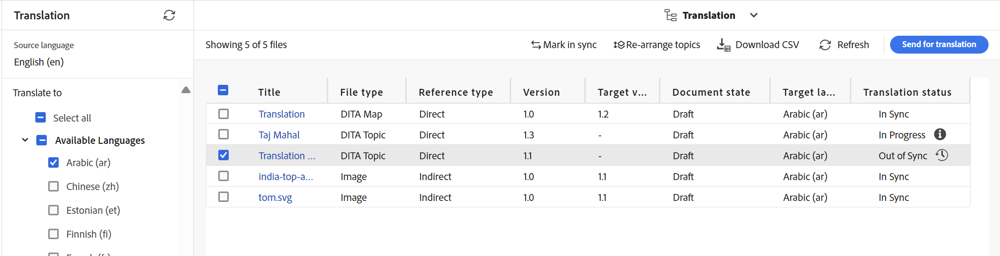

# Översätt ändrade ämnen {#id16A5A0B6072}

Om du ändrar något i vissa ämnen måste dessa ämnen översättas på nytt. Du kan hålla reda på ändrade ämnen från DITA-kartan. I källmappen för språkkopiering väljer du DITA-mappningsfilen på mappningskonsolen och sedan fliken Översättning. Du kan visa status för varje ämne oavsett om det kräver omöversättning eller inte.

Utför följande steg för att skicka ett ändrat ämne för omöversättning:

1. Välj DITA-mappningsfilen från källspråkskopieringsmappen på **kartkonsolen** i redigeraren.

1. Välj fliken **Översättning**.

1. På panelen **Översättning** till vänster markerar du **Tillgängliga språk** som du vill kontrollera statusen för och väljer **Använd**.

   Du kan visa översättningsstatus för varje ämne. De ämnen som har en annan version av ämnet tillgänglig än vad som skickades för översättning visar statusen **Efter synkronisering**.

   >[!NOTE]
   >
   > Översättningsarbetsflödet jämför den senast sparade versionen av ämnesfilen i källspråksmappen med den översatta versionen.

   Om du markerar pilen för att visa mer information kan du visa den aktuella språkkopian som inte är synkroniserad.

   {align="left"}

1. Markera kryssrutan för att markera de ämnen som du vill skicka för omöversättning.

   När du väljer ett ämne som inte är synkroniserat visas knappen **Markera i synkronisering** ovanför namnlisten.

   Du kan använda knappen **Markera i synkronisering** om du vill åsidosätta statusen Synkroniserad för ämnena i DITA-kartan.  Om du t.ex. har gjort några mycket små ändringar som egentligen inte behöver en översättning, kan du markera deras status som Synkroniserad.

   >[!NOTE]
   >
   > Om du väljer knappen **Markera i synkronisering** anges Ämnesstatus till Synkronisera för de valda ämnena.

1. Du kan välja knappen **Skicka för översättning**.

1. Du kan välja att skapa ett nytt översättningsprojekt eller lägga till ämnen i ett befintligt översättningsprojekt. Ange nödvändig information för att konfigurera översättningsprojektet.

1. Välj **Skicka**.

   Ett bekräftelsemeddelande som visar att ämnet har skickats för översättning visas.

1. Navigera till översättningsprojektet i projektkonsolen. Ett nytt översättningsjobbkort skapas i mappen. Markera ellipsen för att visa mappens resurser.

   {width="300" align="left"}

1. Om du vill starta översättningen markerar du pilen på översättningsjobbkortet och väljer **Start** i listan. Ett meddelande meddelar att jobbet har startats.

   Du kan även visa statusen för det ämne som översätts när du väljer ellipsen längst ned på översättningsjobbkortet.

   >[!NOTE]
   >
   > Om du använder översättningstjänsten för människor måste du exportera innehållet för översättning. När du har det översatta innehållet måste du importera det tillbaka till översättningsprojektet.

1. När översättningen är klar ändras statusen till **Klar att granskas**. Markera ellipsen för att visa ämnesinformation och gör något av följande i verktygsfältet:

   - Välj **Visa i Assets** om du vill visa och verifiera översättningen.

   - Välj **Acceptera översättning** om du tror att ändringarna har översatts korrekt. Ett bekräftelsemeddelande visas.

   - Välj **Avvisa översättning** om du tror att jobbet måste utföras om. Ett meddelande om avvisning visas.

   >[!NOTE]
   >
   > Det är viktigt att acceptera eller avvisa den översatta resursen, annars stannar filen kvar på den tillfälliga platsen och kopieras inte till DAM.

1. Gå tillbaka till DITA-mappningsfilen i källspråksmappen i Assets UI. De omöversatta ämnena är nu synkroniserade.

**Överordnat ämne:**[&#x200B;Översikt över innehållsöversättning](translation.md)
