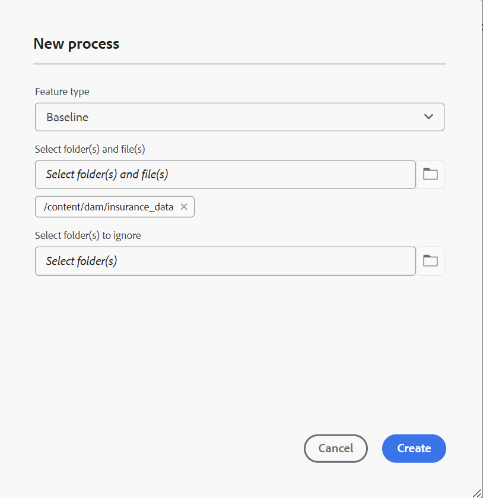
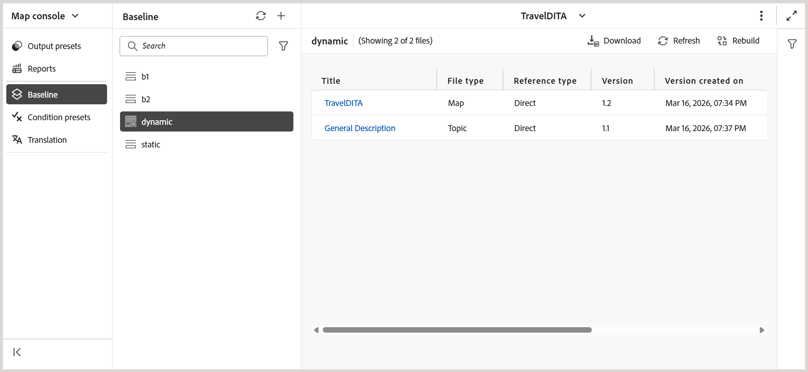
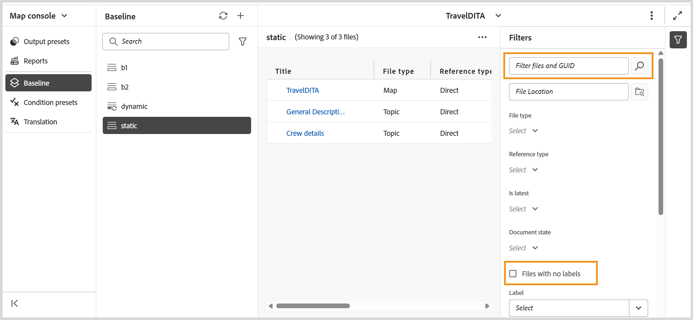

# Ny baslinje (Beta) i Experience Manager Guides

>[!NOTE]
>
> Den här artikeln gäller den nya baslinjen, som för närvarande finns som en *Beta* -funktion, som ger bättre prestanda och stabilitet i Experience Manager Guides 2026.03.0. Om du vill aktivera den nya baslinjefunktionen i din konfiguration kontaktar du Customer Success Team.

Den nya baslinjefunktionen åtgärdar viktiga tillförlitlighets- och prestandaproblem som är kopplade till stora, komplexa kartor. Den levereras med en omarbetad baslinjearkitektur som ger en snabbare, stabilare och mer enhetlig baslinjeupplevelse. Innan vi går in på detaljerna ska vi titta på en kort genomgång som visar hur den nya baslinjefunktionen fungerar.

>[!VIDEO](https://video.tv.adobe.com/v/3483154/aem-guides)

Den nya baslinjemodellen förstärker baslinjen genom att ta itu med de vanligaste smärtorna:

- Långsam inläsning och dålig svarstid när du arbetar med stora baslinjer
- Inkonsekventa baslinjetillstånd orsakade av partiella uppdateringar eller misslyckade valideringar
- Begränsad synlighet och kontroll vid hantering av omfattande basinnehåll
- Prestandamässiga flaskhalsar vid skapande, uppdatering eller ombyggnad av baslinjen

I följande avsnitt beskrivs den nya baslinjemodellen, inklusive de förbättringar som introduceras, viktiga beteendeförändringar som ska övervägas före migrering samt instruktioner för migrering till och användning av den nya baslinjen:

- [Viktiga förbättringar i den nya baslinjen](#key-enhancements-introduced-in-the-new-baseline)
- [Beteendet ändras till att känna innan det migreras till den nya baslinjen](#behavior-changes-to-know-before-migrating-to-the-new-baseline)
- [Migrera till den nya baslinjen](#migrate-to-new-baseline)
- [Använd den nya baslinjen](#use-the-new-baseline)

## Viktiga förbättringar i den nya baslinjen

Den nya baslinjen innehåller viktiga förbättringar som gör baslinjehanteringen snabbare och enklare att skala utan att ändra hur du arbetar. Överväg att byta till den nya baslinjen för:

- **Förbättrade prestanda och skalbarhet:** Basdatamodellen och återgivningsbeteendet har optimerats för att skalas effektivt med stora baslinjer, med inkrementell inläsning och en strömlinjeformad datastruktur för att förbättra svarstiderna.
- **Starkare användargränssnitt och backend-konsekvens:** Alla ändringar som görs i en baslinje (till exempel version- eller beroendeuppdateringar) visas nu i användargränssnittet först efter lyckad backend-validering, vilket förhindrar att ogiltiga baslinjer skapas.
- **Filtrering, sortering och navigering:** Baslinjer har stöd för omfattande filtrering över flera attribut, inklusive dokumentstatus, etiketter, filtyp, referenstyp och GUID-baserad sökning över hela baslinjen. Sidnumrering stöds för stora baslinjer, med ett alternativ för att inkludera filer som inte har några etiketter.
- **Tydlig synlighet för beroendepåverkan:** Beroendepåverkan (för tillagda eller borttagna beroenden) visas som en förhandsgranskning innan versionsändringar tillämpas, vilket gör att du kan granska ändringarna innan du tillämpar dem.
- **Flexiblare etiketthantering:** Etiketter kan flyttas mellan versioner inom en baslinje, vilket ger större flexibilitet vid hantering av etiketter mellan olika ämnesversioner.
- **Deterministiskt redigerings- och sparbeteende:** grundläggande redigeringar stöder radnivåuppdateringar, läser in resurskrävande data (som versionsträd och beroendeskillnader) endast under versionsuppdateringar och slutför sparåtgärder deterministiskt i ett enda steg, vilket minskar oväntade fel vid sparande och partiella uppdateringar.
- **Mer tillförlitlig generering av baslinjer:** baslinjer skapas med lagrade referensdata i stället för körtidsanalys. Den nödvändiga versionsinformationen valideras direkt för att förhindra ofullständiga eller ogiltiga baslinjer.
- **Stöd för API och automatisering:** Den nya baslinjemodellen stöds fullt ut av REST API:er och Java SDK, vilket möjliggör automatisering och integrering med externa arbetsflöden.

## Beteendet ändras till att känna innan det migreras till den nya baslinjen

Granska följande beteendeförändringar innan du migrerar till den nya baslinjemodellen. Dessa ändringar påverkar hur baslinjer skapas, uppdateras och hanteras, och kan påverka befintliga arbetsflöden.

| Område | Ändra (beskrivning) |
|------|-------------|
| **Referensupplösning** | Referenser till direktmappning klassificeras som **DIRECT**. Ogiltiga referenser hoppas över, och referenser från `reltable` tas fortfarande bort. |
| **Välj automatiskt** | Versionsurvalet utvärderas omedelbart innan direkta referenser löses, vilket ger rätt versionsupplösning. |
| **Regler för att skapa baslinje** | Version **1.0** är obligatorisk. Baslinjer med saknade eller tvetydiga versioner kan matchas på olika sätt efter migreringen. |
| **Migreringshantering** | Ogiltiga referenser hoppas över. **DIRECT**-referenser har företräde, ej fasta referenser flyttas till den senaste versionen och ytterligare metadata läggs till från version **5.0** och framåt. |
| **Baslinjedatamodell** | Den nya diagrambaserade baslinjemodellen tar bort ändringsbara fält och är inte bakåtkompatibel med den tidigare baslinjemodellen. |
| **API-användning** | Baslinjeåtgärder stöds av REST API:er och Java SDK. Raw-baslinjeobjekt visas inte längre. |
| **Rensning av version** | Efter migrering hanteras endast baslinjer som lagras i den nya baslinjedatabasen vid versionsrensning. |

## Migrera till ny baslinje

När du har aktiverat funktionen från Customer Success Team måste du migrera de befintliga baslinjerna till den nya baslinjen.

Utför följande steg om du vill migrera den befintliga baslinjen till den nya baslinjen.

1. Markera Adobe Experience Manager logotyp överst och välj **Verktyg**.
1. Välj **Stödlinjer** på panelen **Verktyg**.
1. Markera rutan **Gruppbearbetare**.

   {align="left"}

   Sidan **Guides Bulk Processor** visas.

1. Välj **Ny process** i det övre högra hörnet på sidan om du vill starta en ny bearbetningsåtgärd.

   Dialogrutan **Ny process** visas.

1. Ange följande information i dialogrutan:

   1. **Funktionstyp**: Välj **Baslinje** i listrutan.
   1. **Markera mappar och filer**: Navigera och välj en eller flera mappar och filer som ska bearbetas.
   1. **Välj mapp(ar) som ska ignoreras**: Om du vill kan du välja att undermappar i den valda överordnade mappen ska exkluderas från migreringen.

   {align="left"}

1. Välj **Skapa**.

Ett popup-fönster med **Resursbearbetning som har utlösts** visas. Du kan visa status för bearbetningsuppgiften på sidan.

Du kan också välja **Visa loggar** för att kontrollera och hämta loggarna för migreringsaktiviteten.

{align="left"}

Loggrapporten innehåller information om migreringen, inklusive antalet migrerade kartor, baslinjer som migrerats samt relaterad information.

{align="left"}

>[!NOTE]
>
> Inga grundläggande ändringar bör göras under migreringen, särskilt i arbetskopior, för att förhindra fel. Efter migreringen kan vissa baslinjer behöva återskapas om versioner saknas.

## Använd den nya baslinjen

Den nya baslinjemodellen använder samma arbetsflöden och användargränssnitt som den befintliga baslinjefunktionen i Experience Manager Guides. Du kan fortsätta att [skapa och hantera baslinjen från kartkonsolen](./web-editor-baseline.md) med de tillgängliga alternativen.

>[!NOTE]
>
> Den nya baslinjemodellen stöder inte skapande och hantering av baslinjer från kontrollpanelen för kartor.

I det här avsnittet beskrivs endast de ändringar och förbättringar som gjorts i den nya baslinjemodellen. Vanliga arbetsflöden för baslinjer förblir oförändrade om de inte uttryckligen anges.

**Nya/förbättrade alternativ tillgängliga i det nya baslinjegränssnittet**

Följande uppdateringar gäller när du arbetar med baslinjer som skapats med den **nya baslinjemodellen**:

- Alternativet **Exportera baslinje** på Alternativ-menyn har bytt namn till **Hämta** för baslinjer som skapats med både manuella och automatiska uppdateringar.

  

- Dynamiska baslinjer kan öppnas direkt från panelen **Baslinje** och hanteras med hjälp av de tillgängliga åtgärderna på Alternativ-menyn.

  

  Du kan också använda de nya alternativen som introducerats för dynamiska baslinjer som skapats med den nya baslinjemodellen:
   - **Redigera egenskaper**: Gör att du kan redigera egenskaperna för en befintlig baslinje.
   - **Återskapa**: Gör att du kan återskapa en dynamisk baslinje när ändringar görs.

     {align="left"}

- Åtgärden **Hämta** stöder sidnumrerade hämtningar. Allt baslinjeinnehåll som matchar de använda filtren tas med i hämtningen, inte bara det innehåll som visas på den aktuella sidan.
- Filtrera filer efter GUID, förutom filnamn och filplats. Det finns också ytterligare ett alternativ för **Filtrera filer utan etiketter**.

  
- Den nya baslinjemodellen har stöd för deterministisk redigering, vilket gör att du kan uppdatera en referens i taget med validerad beroendeupplösning.

  +++Steg för att redigera referenserna för en ny baslinje

  Utför följande steg för att redigera en baslinje:

   - Öppna baslinjen från panelen **Baslinje**.

     Tabellvyn med baslinjernas referenser visas.

   - Navigera till och hovra över filen som du vill redigera.
   - Välj ikonen **Redigera** .

     {align="left"}

     Dialogrutan **Redigera version** visas.
   - Välj önskad version i listrutan **Version** (ändra till exempel från version 1.0 till 1.1).

     {align="left"}

     Tillagda och borttagna beroenden utvärderas och visas som en förhandsgranskning. Granska ändringarna innan du använder dem.

     

     Om inga beroendeändringar identifieras visas ett meddelande om tomt läge.

   - Välj **Uppdatera** för att tillämpa ändringarna.

  Baslinjen uppdateras med den valda versionen.
  +++
