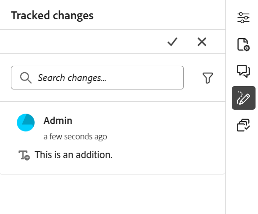
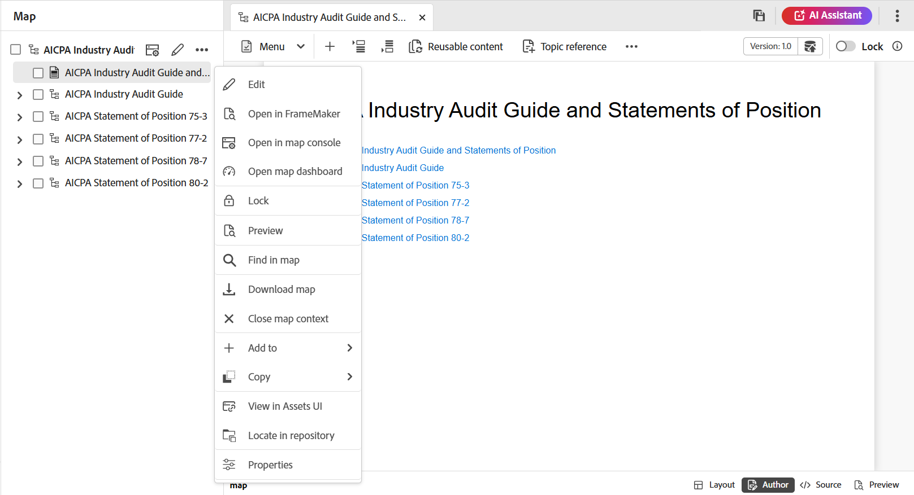

# Lär dig redigeringsfunktionerna {#id176NC500V5Z}

I det här avsnittet går du igenom de olika funktioner som är tillgängliga i redigeraren. Vi kan dela in redigeraren i följande avsnitt eller områden:

- [Sidhuvudsfält](#header-bar)
- [Flikfält](#tab-bar)
- [Verktygsfält](#toolbar)
- [Vänster panel](#left-panel)
- [Innehållsredigeringsområde](#content-editing-area)
- [Höger panel](#right-panel)

Följande underavsnitt beskriver de olika avsnitten i redigeraren.

## Sidhuvudsfält

Huvudfältet är det översta fältet i redigeraren som visar Adobe Experience Manager-logotypen (eller ett enhetligt gränssnitt om du använder det enhetliga skalet som Experience Manager Guides-gränssnitt). När du markerar logotypen dirigeras du till Experience Manager navigeringssida.


Använd ikonen **Expandera** i verktygsfältet för att dölja rubrikfältet och maximera innehållsområdet. Om du vill återställa standardvyn väljer du **Avsluta den utökade vyn**.


## Flikfält

Flikfältet finns högst upp i redigerarens gränssnitt och ger tillgång till följande funktioner:


**Tabbar**

Visar de ämnen som är öppna i Redigeraren som filflikar. Du kan ha flera ämnen öppna samtidigt, som visas på respektive flik i flikfältet. Som standard kan du visa filnamnen på flikarna. När du för muspekaren över en fil kan du visa filens namn och sökväg som ett verktygstips.

>[!NOTE]
>
> Som administratör kan du även välja att visa fillistan efter filnamn på flikarna. Välj alternativet **Filnamn** för **redigeringsfilerna visar konfigurationsavsnittet** i [användarinställningarna](./intro-home-page.md#user-preferences).

När du väljer filfliken öppnas en snabbmeny med alternativen Spara som ny version, Kopiera, Leta upp i, Lägg till i, Egenskaper, Dela, Hämta som PDF och Stäng.

**Spara alla**

Sparar de ändringar du har gjort i alla öppna ämnen. Om du har flera ämnen öppna i redigeraren och väljer **Spara alla** eller med kortkommandot **Ctrl**+**S** sparas alla dokument med ett klick. Du behöver inte spara varje enskilt dokument.

>[!NOTE]
>
> Åtgärden **Spara alla** skapar inte en ny version av dina ämnen. Om du vill skapa en ny version använder du alternativet **Spara som ny version**.

**AI-assistenten**

Ett kraftfullt, AI-drivet verktyg som har utformats för att öka produktiviteten med smarta hjälp- och redigeringsfunktioner. Här finns två kraftfulla AI-funktioner - **Redigering** och **Hjälp** - i Experience Manager Guides-gränssnittet, så att du kan skapa innehåll och komma åt information från Experience Manager Guides-dokumentation snabbare och effektivare.

>[!NOTE]
>
>AI-assistentfunktionen är för närvarande tillgänglig för Adobe Experience Manager Guides as a Cloud Service.

**Expandera vy**: Gör att du kan expandera sidvyn med hjälp av ikonen **Expandera** . I den här vyn är sidhuvudsfältet med Adobe Experience Manager logotyp dolt. Detta maximerar innehållsområdet för redigering. Om du vill gå tillbaka till standardvyn använder du ikonen **Avsluta den expanderade vyn** .

**Fler åtgärder**: Gör att du kan navigera till **Assets** och **Inställningar**.

Alternativet **Assets** tar dig till ett mål baserat på din konfiguration:

- **Molntjänster**: Om du använder molntjänster kan du gå till AEM navigeringssida genom att välja alternativet **Assets** .

- **Lokal programvara**: Om du använder Adobe Experience Manager Guides (4.2.1 och senare) kan du välja alternativet **Assets** för att komma till den aktuella filsökvägen i Assets användargränssnitt.


Alternativet **Inställningar** är bara tillgängligt för administratörer och mappprofiladministratörer och tillåter konfigurering av följande inställningar:

>[!NOTE]
>
> Om du uppdaterar några standardinställningar bör du öppna dokumenten på nytt för att ändringarna ska börja gälla.

- **Allmänt**: Med de allmänna inställningarna kan du konfigurera det lexikon som ska användas med redigeraren. Fliken innehåller fyra avsnitt: **Stavningskontroll**, **Villkor**, **Redigering** och **Källhänvisningar** .

  {width="650" align="left"}

   - **Stavningskontroll**: Det finns två alternativ: **AEM stavningskontroll** och **webbläsarstavningskontroll**. Som standard används stavningskontrollen i webbläsaren, där stavningskontrollen utförs med webbläsarens inbyggda ordlista. Du kan växla till AEM stavningskontroll om du vill använda Adobe Experience Manager ordlista, som också kan anpassas för att lägga till din egen ordlista. Mer information om hur du anpassar AEM-ordlistan finns i avsnittet [Anpassa AEM standardordlista](../cs-install-guide/customize-aem-custom-dictionary.md) i Installera och konfigurera Adobe Experience Manager Guides as a Cloud Service.

   - **Villkor**

      - **Markera villkorlig text i redigeringsvyn**: Markera det här alternativet om du vill markera den villkorliga texten i författarvyn. Villkorsinnehållet markeras med den färg som är definierad för villkoret.

      - **Validera med villkorsattribut**: Välj det här om du vill tillåta validering av de värden som definierats för attributen. Detta förhindrar att du lägger till felaktiga värden.

      - **Visa nyckel med titeln på panelen Ämnesschema**: Välj det här om du vill visa nycklarna tillsammans med rubrikerna i ämnesschemat. Om du inte väljer det här alternativet visas bara rubrikerna. Här visas till exempel nycklarna &#39;os&#39;, &#39;målgrupp&#39; och &#39;other&#39; tillsammans med titlarna.

        {width="550" align="left"}

      - **Visa ämnesschema på villkorspanelen**: Välj det här om du vill visa ett ämnesschema på villkorspanelen. Om du avmarkerar detta visas de definierade villkoren på villkorspanelen.

   - **Redigering**

      - **Aktivera Ersätt alla**: Markera det här alternativet om du vill visa ikonen **Ersätt alla** på panelen **Sök och ersätt**.

   - **Citat**
Ändra format på citat. Välj den källstil i listrutan som du vill använda i ditt projekt. Mer information finns i [Ändra källhänvisningsformat](./web-editor-apply-citations.md#change-citation-style).

   - **AI-assistenten**
Välj det här om du vill aktivera funktionen [ AI-assistenten ](./ai-assistant.md) i Experience Manager Guides. Avmarkera om du vill inaktivera funktionen.

**Paneler**: Den här inställningen kontrollerar panelerna som visas i den vänstra och högra panelen i redigeraren och kartekonsolen. Du kan växla knappen för att visa eller dölja den önskade panelen.

{width="650" align="left"}

Du kan också ange i vilken ordning funktionerna i panelerna ska visas. Om du vill ändra standardordningen för de tillgängliga funktionerna på panelerna markerar du de prickade fälten för att dra och släppa funktionstabbarna på önskad plats. En funktion kan också flyttas från avsnittet **Mer** till huvudavsnittet på en panel, och tvärtom enligt kraven. När du har ändrat ordningen visas funktionerna i samma sekvens på respektive höger- och vänsterpanel.

{width="650" align="left"}


Högst åtta paneler kan visas samtidigt. Alla ändringar som görs i panelinställningarna tillämpas omedelbart.


>[!NOTE]
>
> Om en anpassad panel har konfigurerats visas den också i listan med paneler. Du kan växla om du vill visa eller dölja den anpassade panelen.

- **Elementlista**: Som administratör kan du styra listan med element som en författare kan infoga i en fil och även definiera elementets visningsnamn. Med Elements-listinställningen kan du ange elementets namn enligt DITA-specifikationerna och en etikett som du vill använda i stället för det DITA-definierade elementnamnet:

  {width="650" align="left"}

I skärmbilden ovan har elementet `p` fått etiketten Stycke och `codeblock` får etiketten Kodblock tillsammans med några andra element. Om du väljer alternativet **Använd endast ovanför element** visas endast de giltiga elementen \(vid den aktuella insättningspunkten\) i listan i dialogrutan **Infoga element**.

I skärmbilden nedan visas endast 3 av 4 konfigurerade element från den föregående skärmbilden i det aktuella sammanhanget:

{width="300" align="left"}

- **Attributlista**: Precis som elementlistan kan du styra listan med attribut och deras visningsnamn som ska visas i attributlistan för ett element. På följande skärmbild har bara tre attribut konfigurerats för att visas i ett elements attributlista:

  {width="650" align="left"}

  När du försöker lägga till ett attribut i ett element med den här inställningen visas bara listan med attribut som konfigurerats i listan.

  {width="300" align="left"}

- **Färger**: Visar en lista med förkonfigurerade bakgrundsfärger för **Villkor**. Användarna kan välja en bakgrundsfärg när de använder ett villkor i ett ämne. Som administratör kan du även skapa och lägga till egna bakgrundsfärger i listan. Om du vill lägga till en ny färg anger du önskat namn i fältet **Färgnamn**, väljer en egen färg och väljer ikonen **+** . Den anpassade färgen visas i slutet av färglistan.

- **Publiceringsprofiler**: Detta innehåller de profiler som kan användas för att publicera **kunskapsbasutdata**. Du kan skapa en ny profil för en målkunskapsbas. Exempel: Salesforce eller ServiceNow.

   - **Skapa en Salesforce-profil**

     **Förutsättningar**

      - Skapa en ansluten app för Salesforce. Mer information finns i [Aktivera OAuth-inställningar för API-integrering](https://help.salesforce.com/s/articleView?id=sf.connected_app_create_api_integration.htm&amp;type=5).

      - När du konfigurerar den anslutna appen ska du se till följande:

         - Ange återanropet.

           `URL: http://<server name>:<port>/bin/dxml/thirdparty/callback/salesforce`

         - Välj följande OAuth-scope:
            - Fullständig åtkomst (fullständig)
            - Välj Hantera användardata via API (api)

     När appen har konfigurerats tillhandahåller Salesforce en **konsumentnyckel** och **konsumenthemlighet**. Dessa kan användas för att skapa Salesforce-profilen.


   - Om du vill skapa en Salesforce-profil väljer du **Salesforce** kunskapsbas i listrutan **Servertyp** . Ange ett profilnamn. Ange den konsumentwebbplats som du skulle använda för att publicera utdata i URL:en för **platsen** och lägg sedan till **konsumentnyckeln** och **konsumenthemligheten** från Salesforce konsumentwebbplats. **Validera** och **Spara** den nya profilen.

     {width="550" align="left"}

     >[!NOTE]
     >
     >Om du vill konfigurera en proxy för Salesforce i Experience Manager Guides använder du Apache HTTP Components Proxy Configuration i AEM. Lär dig hur du [konfigurerar proxy för AEM Link Checker](https://helpx.adobe.com/experience-manager/kb/How-to-configure-proxy-for-the-AEM-Link-Checker-AEM.html).


   - **Skapa en ServiceNow-profil**

     **Förutsättningar**

     Konfigurera ServiceNow-servern för överföring av resurserna.
      - Anslut till **ServiceNow**-servern.
      - Navigera till **Systemegenskaper** > **Säkerhet**.
      - Avmarkera följande alternativ:

        **Den här egenskapen måste vara inställd för att aktivera MIME-typkontroll för överföringar (alla versioner, Eureka och senare). Aktiverar (true) eller inaktiverar (false) MIME-typvalidering för de bifogade filerna. Filtillägg som konfigurerats via glide.attachment.extensions kontrolleras för MIME-typ under överföring.**

      - Välj **Spara**.

     Skapa profilen **ServiceNow** när du har konfigurerat appen.

   - Om du vill skapa en profil väljer du ServiceNow Knowledge Base i listrutan **Servertyp**. Ange profilen **Namn**. I **ServiceNow URL** anger du den konsumentwebbplats som du skulle använda för att publicera utdata och lägger sedan till **Användarnamn** och **Lösenord** från ServiceNow-konsumentwebbplatsen. **Validera** och **Spara** den nya profilen.

     {width="550" align="left"}

  När du har validerat kan du välja publiceringsprofilen i utdataförinställningarna för en DITA-karta och använda den för att generera utdata till den **Salesforce** - eller **ServiceNow** -server som du har valt.

  Läs mer om förinställningen för [kunskapsbas](../user-guide/generate-output-knowledge-base.md)-utdata.


- **Validering**: Den här fliken innehåller alternativ för att konfigurera schematrons valideringar i Redigeraren. Du kan aktivera följande funktioner:

   - **Kör verifieringskontrollen innan du sparar filen**: Välj det här alternativet om du vill köra schematron-verifieringar med de valda Schematron-filerna innan någon sparåtgärd utförs. Du kan lägga till en Schematron-fil genom att välja ikonen +. De valda schematrons-filerna visas.

     >[!NOTE]
     >
     >De markerade schematrons-filerna behålls för den valda mappprofilen.

     {width="550" align="left"}

     Detta förhindrar att användarna sparar filer som bryter en regel som definierats i de valda Schematron-filerna. Om detta inte är markerat kommer filen inte att valideras innan ändringarna sparas.

   - **Tillåt alla användare att lägga till schematronfiler på valideringspanelen**: Välj det här om du vill tillåta användarna att lägga till schematronfiler på valideringspanelen i redigeraren. Detta gör att användarna kan lägga till Schematron-filer och sedan validera ämnena mot Schematron-filen. Om detta inte är markerat är alternativet att lägga till schematronfilen **Lägg till schematronfil** inte tillgängligt för användarna på **valideringspanelen** i redigeraren.


- **Visa attribut**: Precis som i attributlistan kan du styra listan med attribut som ska visas i attributlistan för ett element. Som standard har fyra **visningsattribut** - målgrupp, plattform, produkt och uttryck konfigurerats för att visas i ett elements attributlista. Du kan också lägga till ett visningsattribut med ikonen **Lägg till** högst upp. Du kan också ta bort alla visningsattribut med ikonen **Ta bort** .

  De attribut som är definierade för ett element visas i layoutvyn och dispositionsvyn.

  {width="550" align="left"}

- **Översättning**: Den här fliken innehåller alternativ för att skapa språkgrupper, sprida källetiketterna till målversionen och rensa översättningsprojektet.

  {width="550" align="left"}

   - **Språkgrupper**: Som administratör kan du skapa en grupp med språk och använda dem som en uppsättning för att översätta innehållet.

     Så här skapar du en ny språkgrupp:

      1. Välj **Lägg till**.
      1. Ange språkgruppsnamnet. Varje språk ska ha ett unikt namn. Du kan visa ett fel om namnfältet är tomt eller om namnet inte är unikt.
      1. Välj språk i listrutan. Du kan välja flera språk.

         Skriv de första tecknen i språket eller språkkoden för att filtrera de önskade språken. Skriv t.ex. &#39;en&#39; om du vill filtrera alla språk som innehåller &#39;en&#39; i början av namnet eller koden.

      1. Välj ikonen Klar om du vill lägga till de valda språken i gruppen. Språken visas. När du lägger till tre eller fler språk visas alternativet **Visa fler**. Du kan välja **Visa mer** om du vill visa alla språk som finns i gruppen.

         >[!TIP]
         >
         >Växla **Visa mer** till **Visa mindre** och visa endast ett fåtal språk.

      1. Håll markören över språken i en grupp om du vill redigera  eller ta bort  språkgrupperna.
      1. Spara **inställningarna**.

         >[!NOTE]
         >
         >Som användare kan du visa språkgrupperna som är konfigurerade för din mappprofil.

   - **Sprid källversionsetiketter till målversionen**: Välj det här alternativet om du vill skicka etiketten för källfilsversionen till den översatta filen. Som standard är detta inaktiverat.
   - **Rensning av översättningsprojekt efter slutförande**: Välj det här alternativet om du vill konfigurera översättningsprojekten så att de inaktiveras eller tas bort automatiskt efter översättningen. Som standard är **Inget** markerat, så att projektet finns efter översättning.

     Du kan inaktivera översättningsprojekten om du vill använda dem senare. Om du tar bort ett projekt tas alla filer och mappar i projektet bort permanent.


- **Metadata**: Du kan styra metadata för versionen av ämnet och deras värden som ska visas i dialogrutan **Versionshistorik**.  Ange platsen för de noder som du vill hämta metadata från i metadatasökvägen. Du kan också definiera ett anpassat namn för metadata som etikett. Standardegenskaperna är Titel, Dokumenttillstånd och Taggar.

  Metadata kan hämtas från alla egenskaper under objektets `/jcr:content`-nod, så du kan lägga till egenskapens sökväg som metadatasökväg.


  Ett fel visas om metadatasökvägen är tom. Om du lämnar etiketten tom väljs det sista elementet som etikett.


  {width="550" align="left"}

  *Konfigurera metadata för dialogrutan **Versionshistorik**.*


  Du kan också definiera i vilken ordning dessa metadatataggar ska visas. Om du vill ändra standardordningen för de här märkorden markerar du de prickade strecken för att dra och släppa märkorden på önskad plats.
Metaetiketterna visas i samma sekvens i dialogrutan **Versionshistorik** i redigeraren.

## Verktygsfält

Verktygsfältet visas när du öppnar ett ämne eller en karta för redigering i Editor. Följande funktioner är tillgängliga i verktygsfältet:

- [Meny-listruta](#menu-dropdown)
- [Alternativ för att infoga innehåll](#content-insertion-options)
- [Versionsinformation och knappen Spara som ny version](#save-as-new-version)
- [Lås/lås upp](#lockunlock)

>[!NOTE]
>
> Funktionerna ovan gäller endast ämnesfiler. När du arbetar med en kartfil visas olika alternativ i verktygsfältet baserat på den aktuella kartredigeringsvyn. Läs mer om alternativen i verktygsfältet för kartredigering i [Karteditordokumentet](./map-editor-advanced-map-editor.md).

### Meny-listruta

Menyn ger åtkomst till redigeringsåtgärderna Sök och ersätt, Versionshistorik, Versionsetikett, Sammanfoga, Skapa granskning, Spåra ändringar och Taggar.

Den detaljerade förklaringen till dessa funktioner är följande:

**Redigerar åtgärder**

När du redigerar ett ämne i Redigeraren kan du få åtkomst till olika redigeringsåtgärder, till exempel **Klipp ut** eller ***Ctrl***+***X*** , **Kopiera** eller ***Ctrl***+***C*** , **Ångra** eller ***Ctrl***+***}Z*** , **Gör om** eller ***Ctrl***+***Y*** och **Ta bort** som finns i listrutan Meny.


**Sök och ersätt**

Funktionen **Sök och ersätt** är tillgänglig i redigeringsläge och Source-visningsläge. När alternativet är aktiverat visas textfältet Sök och ersätt längst ned i ämnesredigeringsområdet. Du kan använda kortkommandona **CTRL**+**F** för att aktivera fältet Sök och ersätt.

{width="800" align="left"}

Med inställningsikonen \(\) kan du växla sökalternativen **Ignorera skiftläge** och **Endast hela ord**. Aktivera (eller markera) alternativet **Ignorera skiftläge** om du vill utföra den skiftlägeskänsliga sökningen. Annars, om du vill utföra den skiftlägeskänsliga sökningen, stänger av (eller avmarkerar) alternativet **Ignorera skiftläge**. Du kan också söka efter ett helt ord.

Sökningen sker omedelbart, vilket innebär att när du skriver sökfrasen eller ordet i fältet **Sök** så söks termen igenom omedelbart och väljs i avsnittet. Om du vill ersätta en text i ett ämne anger du söktermen och dess ersättning i respektive fält och väljer knappen **Ersätt** eller **Ersätt alla** .

I Source-vyn är funktionen **Sök och ersätt** mycket användbar när du söker efter ett visst element eller attribut. Om du till exempel vill ersätta värdet för attributet `@product` kan du enkelt göra det från Source-vyn. I redigeringsvyn kan du inte söka baserat på ett attribut eller element. Du måste dock vara försiktig när du använder funktionen **Ersätt alla** eftersom den kan skriva över XML-koden.

**Versionshistorik**

Med funktionen **Versionshistorik** i redigeraren kan du kontrollera vilka versioner av dina DITA-filer som är tillgängliga, jämföra dem och återställa till valfri version från redigeraren. Du kan jämföra innehåll och metadata för den aktuella versionen (som också kan vara en arbetskopia) med en tidigare version av samma fil. Du kan också visa etiketter och kommentarer för de jämförda versionerna.

>[!NOTE]
>
> Alternativen för versionshistorik visas bara om det finns ändringar i den första versionen av ämnet eller kartan.

Så här får du åtkomst till versionshistoriken och återgår till en specifik version av ditt ämne:

1. Öppna ett ämne i Redigeraren.
1. Välj **Versionshistorik** i listrutan **Meny**.

   Dialogrutan **Versionshistorik** visas.

   {width="550" align="left"}

   *Förhandsgranska ändringarna i olika versioner av ett ämne.*

1. Välj en version av ämnet som du vill jämföra eller återgå till i listrutan **Jämför med**.

   >[!NOTE]
   >
   > Om en version har etiketter som används på den visas de också \(inom hakparenteser\) tillsammans med versionsnumret.

1. Aktivera alternativet **Visa etiketter och kommentarer** om du vill visa etiketter och kommentarer som används för den aktuella versionen och den jämförda versionen.
1. Du kan även visa följande information i dialogrutan **Versionshistorik**:

   Fliken **Förhandsgranska**: Det nya innehållet är i grönt teckensnitt och det borttagna innehållet är i rött teckensnitt.

   Fliken **Metadata**: De nya metadata som har lagts till är i grönt teckensnitt och de borttagna metadata är i rött teckensnitt.

   {width="550" align="left"}

   *Jämför metadata för olika versioner i versionshistoriken.*

   >[!NOTE]
   >
   > Systemadministratören kan ändra de metadata som ska visas på fliken Metadata i **Inställningar**. Mer information finns i avsnittet **Fler åtgärder** i [flikfältet](#tab-bar).

   Du kan även visa användar- och tidsinformation för den aktuella och den jämförda versionen.

   När du har valt en version i listrutan är alternativet **Återgå till markerad version** tillgängligt. I förhandsvisningsfönstret visas skillnaderna mellan den aktuella versionen och den valda versionen av ämnet.

1. Välj **Återgå till markerad version** om du vill återställa arbetskopian med den valda versionen av ämnet.

   Dialogrutan Återställ version visas.

   {width="550" align="left"}

1. \(*Valfritt*\) Ange en orsak till att du återgår till en tidigare version. Du kan också skapa en ny version av den aktiva arbetskopian av ditt ämne.

1. Välj **Bekräfta.**

   Arbetskopian av filen återställs till den valda versionen. Om du väljer att skapa en ny version av den aktiva arbetskopian skapas även en ny version av filen med alla arbetsändringar.

   När du återgår till en tidigare version visas en visuell indikation på att den version du arbetar med för närvarande inte är den senaste versionen.

   {width="800" align="left"}

**Versionsetiketter**

Etiketter hjälper dig att identifiera i vilken fas ett visst ämne finns i DDLC (Document Development Life Cycle). När du till exempel arbetar med ett ämne kan du ange etiketten som &quot;Godkänd&quot;. När ett ämne har publicerats och gjorts tillgängligt för kunder kan du tilldela rubriken&quot;Släppt&quot; etikett.

I Experience Manager Guides kan du ange etiketter i ett frihandstextformat eller använda en uppsättning fördefinierade etiketter. Med den anpassade etiketten kan alla författare i systemet ange en etikett efter eget val. Detta ger flexibilitet, men medför inkonsekventa etiketter i systemet. För att lösa problemet kan administratörer konfigurera en uppsättning fördefinierade etiketter. Mer information om hur du konfigurerar fördefinierade etiketter finns i *Konfigurera och anpassa XML-webbredigeraren* i Installera och konfigurera Adobe Experience Manager Guides as a Cloud Service.

Dessa etiketter visas i en nedrullningsbar lista för författare där de behöver ange en etikett. Detta garanterar att endast fördefinierade, konsekventa etiketter används i systemet.

Det finns olika metoder som du kan använda för att använda etiketter i dina ämnen - panelen [Versionshistorik](web-editor-use-label.md) i Assets-gränssnittet, användargränssnittet för [baslinjer](/help/product-guide/user-guide/generate-output-use-baseline-for-publishing.md) och redigeraren. Funktionen Versionsetikett i redigeraren är ett snabbt och enkelt sätt att tilldela etiketter till ämnen.

Gör så här om du vill lägga till etiketter i ett ämne från Redigeraren:

1. Öppna ett ämne i Redigeraren.

1. Välj **Versionsetiketter** i listrutan Meny.

   Dialogrutan Hantering av versionsetiketter visas.

   {width="650" align="left"}

   Dialogrutan Hantering av versionsetiketter är uppdelad i två delar - den vänstra panelen har en lista över tillgängliga versioner för ämnet tillsammans med listrutan Etikett \(eller en textruta där du kan ange en etikett\) och den högra panelen med en förhandsgranskning av ämnet.

1. Välj den version som du vill använda etiketter på.

   När du väljer en annan version av ämnet från versionslistan visas ändringarna mellan den aktuella versionen och den valda versionen av ämnet på förhandsvisningspanelen

   >[!NOTE]
   >
   > Om en etikett redan används för en version visas den bredvid versionsnumret i listrutan och nedanför listan Välj version. Du kan ta bort en befintlig etikett genom att markera ikonen \(**x**\) bredvid etiketten.

1. Om administratören har definierat en lista med etiketter visas en nedrullningsbar lista med de etiketter som du kan välja de etiketter du vill använda. Du kan välja flera etiketter i listrutan.

   Annars visas en textruta där du kan ange de etiketter du vill lägga till i ämnet.

   >[!NOTE]
   >
   > Du kan inte använda samma etikett på flera versioner av ett ämne. Om du försöker associera en befintlig etikett kan du ta bort den från den befintliga versionen och använda den på den valda versionen av ämnet.

1. Välj **Lägg till etikett**.

1. I bekräftelsemeddelandet för Använd etikett väljer du alternativet **Flytta etikett (om den används i en annan version)** om du vill flytta etiketter från en befintlig version till den valda versionen. Om du inte markerar det här alternativet och det finns etiketter som har tilldelats till en annan version av ämnet, flyttas de inte till det valda ämnets version. Sådana etiketter ignoreras i etikettprogramprocessen.

**Sammanfoga**

När du arbetar i en miljö med flera författare blir det svårt att spåra vilka ändringar de andra författarna har gjort i ett ämne eller en karta. Med sammanfogningsfunktionen får du bättre kontroll över inte bara hur ändringarna visas, utan även vilka ändringar som finns i den senaste versionen av dokumentet.

- **Sammanfoga ämnesfiler**

  Så här sammanfogar du ändringar i ett ämne:

   1. Öppna ett ämne i Redigeraren.

   1. Välj **Sammanfoga**.

      Dialogrutan Sammanfoga visas.

      {width="550" align="left"}

   1. *\(Valfritt\)* Du kan även bläddra och välja en ny fil från en annan plats i databasen.

   1. Välj en version av filen som du vill jämföra den aktuella versionen av filen med.

   1. Välj:

      - **Spåra ändringar från den valda versionen**: Det här alternativet visar alla innehållsuppdateringar i form av spårade ändringar. Du kan sedan välja att acceptera eller ignorera ändringar i dokumentet en åt gången eller alla på en gång.

      - **Återgå till markerad version**: Det här alternativet återställer den aktuella versionen av dokumentet till den markerade versionen. Det här alternativet ger dig ingen kontroll över vilket innehåll som godkänns eller avvisas.

   1. Välj **Klar**.

   1. Om du markerade alternativet **Spåra ändringar från den valda versionen** visas alla ändringar från den valda versionen i funktionen Spåra ändringar på den högra panelen.

      Du kan välja att acceptera eller ignorera alla kommentarer från panelen Spårade ändringar eller acceptera eller ignorera enskilda kommentarer.


- **Sammanfoga kartfiler**

  Så här sammanfogar du ändringar i en kartfil:

   1. Öppna en karta i Editor.

   1. Välj **Sammanfoga**.

      Dialogrutan Sammanfoga visas.

      {width="550" align="left"}

   1. *\(Valfritt\)* Du kan även bläddra och välja en ny fil från en annan plats i databasen.

   1. Välj en version av filen som du vill jämföra den aktuella versionen av filen med.

   1. Välj:

      - **Spåra ändringar från den valda versionen**: Det här alternativet visar alla innehållsuppdateringar i form av spårningsändringar. Du kan sedan välja att acceptera eller ignorera ändringar i dokumentet en åt gången eller alla på en gång.

      - **Återgå till markerad version**: Det här alternativet återställer den aktuella versionen av dokumentet till den markerade versionen. Det här alternativet ger dig ingen kontroll över vilket innehåll som godkänns eller avvisas.

   1. Välj **Klar**.

   1. Om du markerade alternativet **Spåra ändringar från den valda versionen** visas alla ändringar från den valda versionen på panelen Spårade ändringar \(till höger\).

      Du kan välja att acceptera eller ignorera alla ändringar på panelen Spårade ändringar eller acceptera eller ignorera enskilda ändringar i kartfilen.


**Skapa granskningsaktivitet**

Du kan [skapa en granskningsaktivitet](./review-send-topics-for-review.md) av det aktuella ämnet eller mappfilen direkt från redigeraren. Öppna filen som du vill skapa granskningsaktiviteten för och välj **Skapa granskningsaktivitet** i listrutan Meny för att starta granskningsprocessen.

**Spåra ändringar**

Du kan hålla reda på alla uppdateringar som gjorts i ett dokument genom att aktivera läget Spåra ändringar. När du har aktiverat spårändringar hämtas alla infogningar och borttagningar i dokumentet. Allt borttaget innehåll markeras med Genomstruken och alla infogningar markeras med grön text. Dessutom visas ändringsfälten vid ämnessidans kant. Återigen visas ett rött fält för borttaget innehåll och ett grönt fält visas för tillagt innehåll. Om det finns ett tillägg och en borttagning på samma rad visas både gröna och röda staplar.

I följande skärmbild markeras det borttagna och infogade innehållet tillsammans med ändringsfälten:

{width="650" align="left"}

Ett typiskt användningssätt för att spåra ändringar i ett dokument kan vara att utföra peer-granskning. Du kan aktivera spåra ändringar och dela dokumentet för granskning, och granskaren gör sedan ändringar med Spåra ändringar PÅ. När du tar emot dokumentet bör du ha en funktion för att visa de föreslagna uppdateringarna tillsammans med ett praktiskt sätt att acceptera eller ignorera ändringar.

Experience Manager Guides tillhandahåller funktionen Spårade ändringar som innehåller information om de uppdateringar som gjorts i dokumentet. Funktionen Spårade ändringar ger information om vilka uppdateringar som gjordes, vem som gjorde dem och vid vilken tidpunkt. Med funktionen Spårade ändringar kan du enkelt acceptera eller ignorera de föreslagna uppdateringarna i dokumentet.

Om du vill komma åt funktionen väljer du ikonen **Spåra ändringar** i den högra panelen.

{width="300" align="left"}

Om du väljer en spårad ändring markeras det ändrade innehållet i dokumentet. Du kan acceptera en ändring genom att markera ikonen Acceptera ändring eller ignorera den genom att välja Ignorera ändring.

Om du vill acceptera eller ignorera alla ändringar med ett enda klick väljer du **Acceptera alla ändringar** eller **Ignorera alla ändringar**.

>[!NOTE]
>
> I förhandsgranskningsläget kan du visa dokumentet med eller utan det ändrade innehållets markeringar. Mer information finns i [förhandsgranskningsläget](web-editor-views.md#preview-mode-id19AAGL00163).

**Taggar**

Funktionen **Taggar** i redigeraren är en växlingsknapp som styr synligheten för DITA-element. När det här alternativet är aktiverat visas strukturella taggar i innehållet, vilket gör att du kan visa och hantera underliggande DITA-element mer effektivt. När det är inaktiverat döljs taggarna, vilket ger en renare och mer fokuserad redigeringsmiljö.

På följande skärmbild visas ett dokument med taggvyn aktiverad:

{width="650" align="left"}

Följande åtgärder kan utföras i ett dokument med taggar:

- **Markera ett element**: Markera den inledande eller avslutande taggen för ett element för att markera dess innehåll.

- **Expandera eller komprimera taggar**: Markera + eller - logga in en tagg för att utöka eller komprimera den.

- **Använd snabbmenyn**: Snabbmenyn innehåller alternativ för att klippa ut, kopiera eller klistra in det markerade elementet. Du kan också infoga ett element före eller efter det markerade elementet. Med de andra alternativen kan du generera ett ID eller öppna egenskapspanelen för det markerade elementet.

- **Dra och släpp element**: Markera ett elements tagg och dra och släpp den enkelt i dokumentet. Om släppplatsen är en giltig plats där elementet tillåts placeras elementet på släppplatsen.


>[!NOTE]
>
> Om en användare aktiverar taggvyn från redigeraren är den fortfarande aktiverad även i alla sessioner. Det innebär att du inte behöver aktivera taggvyn igen för att komma åt den senare. Standardvärdet för taggvyn för en ny användarsession bestäms av egenskapen `tagsView` i filen `ui\_config.json`. Mer information finns i avsnittet [Konfigurera standardvärde för taggvyn](../cs-install-guide/configure-default-value-tags-view.md) i Installera och konfigurera Adobe Experience Manager Guides as a Cloud Service.

### Alternativ för att infoga innehåll

**Element** - 

Infogar ett giltigt element på den aktuella eller nästa giltiga plats. Du kan också använda kortkommandot ***Alt***+***Retur*** för att öppna dialogrutan Element. Du redigerar till exempel ett stycke och i dialogrutan **Element** visas en lista med element som kan infogas i stycket. Markera elementet som du vill infoga. Du kan använda tangentbordet för att bläddra igenom elementlistan och trycka på ***Retur*** för att infoga det element som behövs.

Du kan visa två typer av giltiga element:

- **Giltiga element på den aktuella platsen**: I listan visas de element som du kan infoga på den aktuella markörplatsen.

- **Giltiga element utanför den aktuella platsen**: I listan visas de element som du kan infoga efter någon av de överordnade elementen för det aktuella elementet i elementhierarkin.

Om du till exempel befinner dig inom det infogade `<b>`-elementet kan du infoga element som `<u>`, `<xref>`, `<i>` på den aktuella platsen. Du kan däremot infoga element som `<table>` och `<topic>` utanför den aktuella platsen.

Du kan också skriva ett tecken eller en sträng i sökrutan och söka efter elementen som börjar med det.

{width="300" align="left"}

*Ange t om du vill söka efter alla giltiga element som börjar med t.*

Om du arbetar i ett blockelement som `note` använder du ikonen Infoga element för att infoga ett nytt element efter `note`-elementet. I följande skärmbild har ett anteckningselement infogats i elementet p \(stycke\):

{width="800" align="left"}

Om du trycker på Retur i anteckningselementet skapas ett nytt stycke i själva anteckningselementet. Om du vill infoga ett nytt element utanför anteckningen, markerar du p-elementet \(markerat i skärmbild\) i elementbeskrivningen och väljer sedan elementikonen eller trycker på ***Alt***+***Retur*** för att öppna dialogrutan Infoga element. Markera sedan det önskade elementet och tryck på Retur för att infoga det markerade elementet efter anteckningselementet.

Du kan också lägga till ett element mellan två element när en blinkande blockmarkör visas.


{width="300" align="left"}

Om du till exempel arbetar med ett DITA-ämne och blockmarkören blinkar mellan den korta beskrivningen och brödtexten kan du lägga till elementet `prolog` och sedan lägga till copyright, författare och annan information.

Ett annat sätt att ange ett nytt element är att använda snabbmenyn. Högerklicka var som helst i dokumentet för att öppna snabbmenyn. På den här menyn väljer du **Infoga element** för att visa dialogrutan **Infoga element** och väljer det element som du vill infoga.

{width="300" align="left"}

**Stycke** - 

Infoga styckeelement på den aktuella eller nästa giltiga plats.

**Punktlista** - 

Skapar en punktlista på den aktuella eller nästa giltiga plats. Om du befinner dig i en punktlista och väljer den här ikonen konverteras objektet till ett normalt stycke.

**Numrerad lista** - 

Skapar en numrerad lista på den aktuella eller nästa giltiga plats. Om du befinner dig i en numrerad lista och väljer den här ikonen konverteras objektet till ett normalt stycke.

>[!NOTE]
>
>Du kan också välja alternativet **Dela lista** på snabbmenyn för ett listobjekt om du vill dela den aktuella listan och påbörja en ny lista på samma nivå.

**Tabell** - 

Infogar en tabell vid den aktuella eller nästa giltiga plats. Klicka på ikonen Tabell för att öppna dialogrutan Infoga enkel tabell.

{width="550" align="left"}

>[!NOTE]
>
> Du kan också kopiera en tabell från MS Word eller Excel och klistra in den i Experience Manager Guides ämnesfil. Den kopierade tabellen klistras in som antingen `<simpletable>` eller `<tgroup>` beroende på inställningarna som konfigurerats i XML-redigerarkonfigurationen. Mer information finns i [Konfigurera visning av inklistrade tabeller](../cs-install-guide/conf-pasted-tables.md).

Du kan ange antalet rader och kolumner som krävs i tabellen. Om du vill behålla den första raden som tabellrubrik markerar du alternativet **Ange den första raden som rubrik**. Om du vill lägga till en rubrik i tabellen anger du den i fältet Titel.

När en tabell har infogats kan du ändra den via snabbmenyn.

{width="550" align="left"}


Med tabellens snabbmeny kan du:

- Infoga celler, rader eller kolumner

- Sammanfoga celler åt höger och nedåt

- Dela celler vågrätt eller lodrätt

- Ta bort celler, rader eller kolumner

- Generera ID


Du kan också definiera attribut för flera celler, hela rader eller kolumner i en tabell. Om du till exempel vill justera tabellcellen drar och markerar du önskad cell. I panelen Innehållsegenskaper (till höger) ändras egenskapen **Type** till **entry**.

1. I avsnittet **Attribut** väljer du **+Lägg till**.
1. Välj attributet `@valign` i listrutan **Attribut**.
1. Välj den textjustering du vill använda på de markerade tabellcellerna i listrutan Värde.
1. Välj **Lägg till.**

{width="800" align="left"}

**Bild** - 

Infogar en bild vid den aktuella eller nästa giltiga plats. Välj ikonen Bild för att öppna dialogrutan Infoga bild och sök efter och markera den bild som du vill infoga.

>[!NOTE]
>
> Du kan också lägga till en bild genom att dra och släppa den från det lokala systemet i artikeln. I det här fallet läggs bildfilen till med arbetsflödet **Överför Assets**.  Mer information finns i arbetsflödet **Överför Assets** i avsnittet [Vänster panel](#left-panel).


{width="650" align="left"}

Du kan lägga till en bild-/figurtitel och alternativ text för bilden i dialogrutan Infoga bild.

>
>
> När du infogar en bild och anger en alternativ text för samma bild, läggs den till i elementet `<alt>` i enlighet med de senaste DITA-standarderna. Användningen av attributet `@alt` för alternativ text är föråldrad, men stöds fortfarande i tidigare DITA-versioner.

Med alternativet **Välj fil** kan du söka efter den önskade bildfilen efter filnamn. Du kan också filtrera sökresultaten efter sökväg \(för att söka i\), samlingar, filtyp och taggar. När du har hittat den önskade bildfilen markerar du filen och väljer **Välj** för att infoga bilden i dokumentet. Du kan infoga olika format för bildfiler, t.ex. `.png`, `.svg`, `.gif`, `.jpg`, `.eps`, `.ai`, `.psd` med flera.

När du har infogat en bild kan du ändra höjd, bredd, placering och attribut på panelen Innehållsegenskaper. Markera bildfilen och gör sedan ändringarna på panelen Innehållsegenskaper på den högra panelen.

{width="800" align="left"}

I fältet Source visas UUID för den infogade bildfilen. Du kan hitta hela sökvägen till den infogade bildfilen genom att hålla muspekaren över fältet Source. Sökvägen visas i verktygstipset.

Du kan ändra storlek på en bild genom att ange ett värde för höjd eller bredd för bildfilen. Bildens proportioner bibehålls automatiskt. Om du vill kan du även välja att inte behålla bildfilens proportioner genom att markera låsikonen \(i Behåll proportioner\) och ange värden för höjd och bredd.

Du kan också ange placeringsinställningen för bilden som Textbunden eller Bryt. Om du väljer att använda alternativet Brytningsplacering kan du sedan välja var bilden ska justeras (vänster, mitten eller höger).

Du kan också lägga till andra egenskaper för en bildfil genom att markera de egenskaper som krävs i fältet **Attribut**.

>[!NOTE]
>
>Du kan också definiera klickbara områden i bilden \(bildschema\). Mer information finns i funktionsbeskrivningen för **Infoga/redigera bildschema** i avsnittet [Vänster panel](web-editor-features.md#left-panel).

**Snabbmeny för bild- eller mediefiler**

Du kan också utföra vissa vanliga åtgärder för bilder och mediefiler med hjälp av snabbmenyn. Högerklicka var som helst på bilden för att öppna snabbmenyn.

Snabbmenyn innehåller alternativ för att klippa ut, kopiera eller klistra in bilden eller mediet. Du kan infoga ett element före eller efter det markerade elementet. Du kan också ändra namn på eller dela upp ett element. Du kan hitta den markerade bilden eller mediet i databasen eller förhandsgranska filen i Assets-gränssnittet.

Med de andra alternativen på snabbmenyn kan du kopiera en bana, redigera ett bildschema, byta namn på element, skapa ett fragment eller generera ID:n för det markerade elementet.

**Infoga/redigera bildschema**

Infogar ett bildschema på den markerade bilden. En bild med klickbara områden som länkar till ämnen eller webbsidor kallas för ett bildschema.

Markera en bild i det aktuella avsnittet och välj ikonen Infoga/redigera bildschema för att öppna dialogrutan Infoga bildschema.

{width="650" align="left"}

Välj önskad formrektangel , cirkel  eller polygon  för att definiera ett område över en bild som du vill använda som länk. När du har definierat ett område visas dialogrutan Referens där du måste ange länken till det interna eller externa innehållet:

{width="650" align="left"}

Om områden överlappar varandra kan du flytta formen framåt eller flytta den bakåt genom att klicka på respektive ikon i verktygsfältet. Du kan också ta bort ett område genom att markera det och klicka på ikonen Ta bort. Om du dubbelklickar på ett område öppnas dialogrutan Referens där du kan ändra mållänken. När du har markerat önskade områden på bilden sparar du ändringarna genom att välja **Klar**.


**Multimedia**

Infogar olika typer av multimediefiler. Välj ikonen Multimedia i listrutan och välj den typ av fil som du vill infoga. De multimedieformat som stöds är:

- Ljudfil
- Videofil
- YouTube
- Vimeo

När du väljer alternativet Ljud- eller videofil visas databasvyn där du kan bläddra och välja önskad fil. Om du väljer YouTube eller Vimeo visas dialogrutan Infoga multimedia. Klistra in länken till videofilen i fältet Webblänk och välj Infoga för att lägga till videon på den aktuella eller nästa giltiga platsen i dokumentet.

>[!NOTE]
>
> När du lägger till en YouTube-videolänk måste du ersätta strängen `watch?v=` med `embed` i URL:en. Om du till exempel vill lägga till en YouTube-videolänk: `https://www.youtube.com/**watch?v**=WlIKQOrmZcs` måste du lägga till den som: `https://www.youtube.com/**embed/**WlIKQOrmZcs`. Ändringen säkerställer att videon bäddas in i utdata från AEM Site och PDF.

Du kan också lägga till ljud- eller videofilen från dialogrutan Infoga multimedia. Välj alternativet Ljud-/videofil och välj sedan bläddringsikonen för att starta databasvyn. Markera ljud- eller videofilen från databasen och välj **Välj** för att lägga till länken för filen i fältet Ljud-/videofil. Om du väljer en videofil visas även en förhandsgranskning av filen i förhandsvisningsområdet. Du kan spela upp videofilen för att visa förhandsgranskningen.

{width="650" align="left"}

**Korsreferens**

Infoga referenser av typen - Innehållsreferens, Nyckelreferens, Filreferens, Webblänk eller E-postlänk.

Välj ikonen **Välj Arkiv** \(för Innehållsreferens och Filreferens\) eller **Välj Rotkarta** \(för Innehållsnyckelreferens och Nyckelreferens\) och markera den fil eller det innehåll som du vill länka till.

{width="650" align="left"}

En länk till den valda referensen läggs till i dokumentet. På länkens snabbmeny finns alternativen:

- **Infoga element**: Visar en lista med giltiga element som du kan infoga i den angivna kontexten.
- **Kopiera UUID**: Kopierar UUID för den infogade referensen.
- **Kopiera sökväg**: Kopierar den fullständiga sökvägen för den infogade referensen.
- **Generera ID:n**: Genererar unikt ID för den infogade referensen.

Du kan också söka med UUID för filen som du vill referera till. För länkarna Innehåll och Nyckelreferens anger du UUID för filen som du vill länka till. Filen söks automatiskt och visas i avsnittet Förhandsgranska. När du anger filens UUID behöver du inte uttryckligen ange filtillägget för XML-filer. XML-tillägget läggs automatiskt till i UUID.

{width="650" align="left"}

Om administratören har aktiverat alternativet UUID:n i *XMLEditorConfig* så visar du UUID:t för det refererade innehållet i egenskapen **Link** .

{width="800" align="left"}

>[!NOTE]
>
> Om alternativet **Aktivera UUID** inte är aktiverat visas den relativa sökvägen för det refererade innehållet.

>[!IMPORTANT]
>
> Även om den relativa sökvägen för det refererade innehållet visas i egenskapen **Link** skapas länken internt med det refererade innehållets UUID.

>[!TIP]
>
> Se avsnittet Referenser i guiden om bästa praxis för att få information om hur du refererar till innehåll.

**Filtersökning**

Du kan söka efter text i de filer som finns på den valda sökvägen i AEM-databasen. Till exempel genomsöks&quot;general&quot; i skärmbilden nedan. Du kan även begränsa sökningen med hjälp av förbättrade filter. Du kan söka efter alla DITA-filer som DITA-avsnitt och DITA-kartor som finns på den valda sökvägen.

Du kan söka efter icke-DITA-filer som bildfiler, multimedia och dokument i den valda sökvägen. Du kan också söka efter specifika värden i attributen för DITA-element. Du kan också söka efter filer som har checkats ut av den angivna användaren.

{width="650" align="left"}

>[!NOTE]
>
> Systemadministratören kan också konfigurera textfiltren och visa eller dölja andra filter. Mer information finns i avsnittet *Konfigurera textfilter* i Installera och konfigurera Adobe Experience Manager Guides as a Cloud Service.

Listan med filtrerade filer som innehåller den sökta texten visas. På skärmbilden ovan visas t.ex. filerna som innehåller texten &quot;general&quot;. Du kan också förhandsgranska filens innehåll.


**Återanvändbart innehåll** - 

Återanvänd innehåll som finns i andra dokument i projektet. Du kan infoga innehåll genom att länka direkt till innehållet i en fil eller genom att använda en nyckelreferens, visa [Lös nyckelreferenser](map-editor-other-features.md#id176GD01H05Z). När du väljer ikonen Återanvändbart innehåll visas dialogrutan Återanvänd innehåll:

{width="650" align="left"}

I dialogrutan Återanvänd innehåll markerar du DITA-filen för filreferenser eller den DITA-kartfil som innehåller nyckelreferenserna. När du har valt det här alternativet visas ämnet eller nyckelreferenserna i dialogrutan. Du kan välja ID/nyckel för det ämne som du vill infoga och välja **Klar** för att infoga innehållet i ämnet.

När du infogar en innehållsreferens kan du även ange filens UUID och det återanvändbara innehållet från den filen visas i förhandsvisningsavsnittet.

Baserat på inställningen för att infoga länkar kan du antingen visa UUID för det infogade innehållet eller den relativa sökvägen på egenskapspanelen eller i kodvyn i Source. Länken skapas alltid med UUID för det refererade innehållet. Visa *Konfigurera UUID-baserade länkar* i Installera och konfigurera Adobe Experience Manager Guides as a Cloud Service.

>[!NOTE]
>
> Om du vill lägga till innehåll före eller efter det refererade innehållet använder du *Alt*+*Vänsterpil* eller Alt+*Högerpil* för att flytta markören till önskad plats.

Du kan även bädda in det refererade innehållet i ämnet genom att högerklicka på det refererade innehållet och välja **Ersätt referens med innehåll** på snabbmenyn.

**Symbol** - 

Infogar specialtecken i ditt ämne. Välj symbolen för att öppna dialogrutan Infoga specialtecken.

>[!NOTE]
>
> Experience Manager Guides erbjuder rörliga och storleksändringsbara dialogrutor. Storleken på dialogrutor som har två tvärsnitt längst ned till höger kan ändras. Korslinjerna i dialogrutan Specialtecken visas nedan.

{width="550" align="left"}

I dialogrutan Infoga specialtecken kan du söka efter ett specialtecken med hjälp av dess namn. Alla specialtecken lagras i olika kategorier. Använd listrutan Välj kategori och välj en kategori. De specialtecken som finns i den valda kategorin visas. Du kan navigera i listan med specialtecken med piltangenterna eller välja det tecken som du vill infoga. Namnet och hexadecimala koden för det valda specialtecknet visas under listan. Välj **Infoga** om du vill infoga det markerade tecknet i dokumentet.

**Nyckelord** - 

Infoga nyckelord som definieras i DITA-kartan. Välj alternativet Nyckelord för att öppna dialogrutan Nyckelreferens.

{width="550" align="left"}

Nyckelorden visas i alfabetisk ordning och du kan även söka efter nyckelord genom att skriva en söksträng i sökrutan. Sökresultatet returnerar nyckelorden som innehåller strängen i ID eller Value. De nyckelord som definieras i DITA-kartan visas i den här dialogrutan. Välj det nyckelord som du vill infoga och välj **Infoga**.

Du kan också ändra attributen för det infogade nyckelordet genom att högerklicka på nyckelordet och välja alternativet Attribut. Dialogrutan **Attribut för nyckelord öppnas:

{width="550" align="left"}

Du kan ändra nyckelordets attribut eller lägga till ett nytt attribut till nyckelordet.

**Kodavsnitt** - 

Infoga ett fragment på aktuell eller nästa giltiga plats. För att den här funktionen ska fungera måste du ha definierat fragment i systemet. Mer information om hur du lägger till ett fragment finns i **funktionsbeskrivningen för fragment** i avsnittet [Vänster panel](web-editor-features.md#left-panel).

När du väljer alternativet Fragment visas katalogen Infoga fragment. Katalogen är sammanhangsberoende, vilket innebär att kodavsnitten endast visas om de tillåts på den aktuella platsen.

I följande exempel visas två förkonfigurerade fragment - Varning och Fel som kan infogas på den aktuella platsen i dokumentet.

{width="300" align="left"}

När du väljer ett fragment från listan infogas det på den aktuella eller nästa giltiga platsen i dokumentet. På följande skärmbild visas det felutdrag som infogats i dokumentet:

{width="400" align="left"}

**Citat** - 

Skapa källhänvisningar och lägg till dem i innehållet. Lär dig hur du [lägger till och hanterar citat i ditt innehåll](./web-editor-apply-citations.md).

**Frågedata** - 

Anslut till datakällan och använd data för att skapa innehåll. Lär dig hur du [använder data från din datakälla](./web-editor-content-snippet.md).

### Versionsinformation och Spara som ny version

Funktionen **Versionsinformation och Spara som ny version** kombinerar versionshantering och innehållssparande i en enda funktion.

- Versionsinformation visar aktuell version av ämnet eller kartan. En asterisk (*) visas bredvid versionsnumret för att visa ändringar som inte sparats.

  Versionsnumret ändras för varje ny version som skapas för ämne- eller mappfilen. Om du arbetar med ett nyligen skapat dokument visas versionsinformationen som **ingen**.

  {width="800" align="left"}


- **Spara som ny version** är en knapp som sparar de ändringar du har gjort i ditt ämne och skapar även en ny version av ditt ämne.

  {width="800" align="left"}


När du väljer att spara ett ämne eller en karta med **Spara som ny version** visas följande dialogruta:

{width="300" align="left"}

Ange kommentarer och versionsetiketter för att identifiera ändringarna och välj **Spara** för att skapa en ny version av filen.

När du väljer alternativet **Spara som ny version** skapas den första versionen av ämnet i DAM, som också blir den aktiva versionen av ämnet. Om du senare återgår till en äldre version av ämnet blir det den aktuella aktiva versionen av ämnet.

Om administratören har förkonfigurerade versionsetiketter visas dessa i en listruta. Du kan välja en etikett i listan med tillgängliga etiketter och spara dokumentet.

{width="300" align="left"}

När du sparar ett ämne kan du lägga till en kommentar som anger vilka ändringar du har gjort i ämnet. Den här kommentaren visas i ämnets Tidigare versioner.

Om ditt ämne är under granskning får granskarna ett meddelande om att det finns en nyare version av ämnet. De kan enkelt komma åt den senaste versionen av ditt dokument och fortsätta att granska den senaste versionen av ditt ämne.

När du håller pekaren över ett ämnes titel visas filens titel, filsökväg och versionsnummer.

{width="800" align="left"}

>[!NOTE]
>
> När en version av ämnet är tillgänglig kan du även lägga till etiketter till ämnet. Dessa etiketter kan sedan användas för att skapa en baslinje för publicering av en viss version av dokumentet. Mer information om hur du använder etiketter i dina ämnen finns i [Använd etiketter](web-editor-use-label.md#).

### Lås/lås upp

Låser eller låser upp den aktuella filen. Genom att låsa en fil får du exklusiv skrivåtkomst till filen. Detta hindrar andra användare från att redigera filen. Lås upp filen om du vill att andra ska ha redigeringsåtkomst. När filen är olåst sparas ändringarna i den aktuella versionen av filen.

{width="800" align="left"}

Om du är i Kartvyn och expanderar den överordnade kartan kan du låsa alla filer på kartan med ett enda klick. Expandera bara den överordnade mappfilen och markera den överordnade filen, vilket gör att du kan markera alla filer på kartan. Sedan kan du välja **Lås**  för att låsa alla filer på kartan.

På panelen Databas visas de låsta filerna med en låsikon. När du håller pekaren över den här låsikonen visas låst av dig/användarnamn som ett verktygstips.

{width="350" align="left"}

Om en fil är låst av en annan användare och du håller pekaren över låsikonen i databasen visas namnet på den användare som låste den. I det här fallet öppnas filen i skrivskyddat läge och **skrivskyddad åtkomst** visas bredvid versionsinformationen.

Som administratör får du även åtkomst till funktionen **Tvinga upplåsning** som gör att du kan låsa upp filen som låsts av andra användare. Använd den här funktionen för att komma åt redigeringsrättigheterna för en fil som har låsts av andra användare.

{width="350" align="left"}

## Vänster panel

Den vänstra panelen ger dig snabb åtkomst till samlingar, databasvyn, kartvyn och andra funktioner. Du kan expandera panelen genom att markera ikonen **Expandera** som finns i det nedre vänstra hörnet av gränssnittet. När du har expanderat använder du ikonen **Komprimera** för att komprimera panelen. I den utökade vyn visas namnen på de ikoner som visas som verktygstips i den komprimerade vyn.

>[!NOTE]
>
> Det går att ändra storlek på den vänstra panelen. Om du vill ändra storlek på panelen placerar du markören på panelkanten, pekaren ändras till en dubbelriktad pil, markerar och drar för att ändra storlek på panelbredden.

Den vänstra panelen ger dig tillgång till följande funktioner:

- [Samlingar](#collections)
- [Databas](#repository)
- [Karta](#map)
- [Återanvändbart innehåll](#reusable-content)
- [Kontur](#outline)

Vissa av funktionerna i den vänstra panelen finns under avsnittet **Mer**. Välj ikonen Mer  för att komma åt funktionerna nedan:

- [Ordlista](#glossary)
- [Villkor](#conditions)
- [Ämnesschema](#subject-scheme)
- [Fragment](#snippets)
- [Mallar](#templates)
- [Citat](#citations)
- [Språkvariabler](#language-variables)
- [Variabel](#variables)
- [Sök och ersätt](#find-and-replace)
- [PDF-mallar](#pdf-templates)
- [Granska](#review)


Ytterligare ett alternativ med etiketten **Workfront** visas även på den vänstra panelen om Adobe Workfront är konfigurerat.

Mer information finns i [Integrering med Workfront](./workfront-integration.md).

>[!NOTE]
>
> De funktioner som är tillgängliga i den vänstra panelen hanteras av administratören, vilket gör att du kan aktivera eller inaktivera de enskilda funktionerna i den vänstra panelen. Endast aktiverade funktioner visas i den vänstra panelen. Mer information finns i avsnittet **Paneler** i [flikfältet](#tab-bar).

Den vänstra panelens funktioner beskrivs nedan:

### Samlingar

Om du arbetar med en uppsättning filer eller mappar kan du lägga till dem i din favoritlista för att snabbt komma åt dem. **Samlingar** visar en lista över dokument som du har lagt till och andra offentliga dokumentlistor från andra användare.

Som standard kan du visa filerna efter namn. När du för muspekaren över en fil kan du visa filens namn och sökväg som ett verktygstips.

>[!NOTE]
>
> Som administratör kan du även välja att visa fillistan efter filnamn i Redigeraren. Välj alternativet **Filnamn** för **redigeringsfilerna visar konfigurationsavsnittet** i **Användarinställningar**.

Om du vill skapa en ny samling väljer du +-ikonen bredvid panelen Samlingar för att öppna dialogrutan **Ny samling** :

{width="300" align="left"}

Ange en titel och en beskrivning för samlingen som du vill skapa. Om du väljer **Offentlig** visas den här favoriten även för andra användare.

>[!NOTE]
>
> Du kan också skapa en samling från Experience Manager Guides hemsida. Öppna hemsidan, navigera till widgeten **Samlingar** i avsnittet [Översikt](./intro-home-page.md#overview) och välj **Ny samling**.

Om du vill lägga till en fil i samlingar använder du någon av följande metoder:

- Navigera till önskad fil eller mapp i databasvyn, markera ikonen *Alternativ* för att öppna snabbmenyn och välj **Lägg till i** > **Samlingar**. I dialogrutan **Lägg till i samlingar** kan du välja att lägga till filen/mappen till en befintlig favorit eller skapa en ny.

  {width="300" align="left"}

- Högerklicka på en fils flik i redigeraren för att öppna snabbmenyn. Välj **Lägg till i** > **Samlingar** om du vill lägga till filen i favoritlistan.

  {width="800" align="left"}


>[!NOTE]
>
> - Om du vill ta bort ett objekt från favoritlistan markerar du alternativikonen bredvid objektet i en favoritsamling och väljer **Ta bort från samlingar**.
> - Om du vill förhandsgranska filen utan att öppna den markerar du en fil och väljer **Förhandsgranska** på Alternativ-menyn.

**Alternativ-meny för en samling**

Du kan även utföra många åtgärder med Alternativ-menyn som är tillgänglig för en samling:

{width="650" align="left"}

- **Byt namn**: Byt namn på den valda samlingen.
- **Ta bort**: Ta bort den markerade samlingen.
- **Uppdatera**: Hämta en ny lista med filer och mappar från databasen.
- **Visa i Assets-användargränssnitt**: Visa fil- eller mappinnehållet i Assets användargränssnitt.

>[!NOTE]
>
> Du kan även uppdatera listan med hjälp av ikonen Uppdatera högst upp.


### Databas

När du väljer ikonen Databas visas en lista med filer och mappar som är tillgängliga i DAM. Som standard kan du visa filerna efter namn. När du för muspekaren över en fil kan du visa filens namn och filnamnet som ett verktygstips.

>[!NOTE]
>
> Som administratör kan du även välja att visa fillistan efter filnamn i Redigeraren. Välj alternativet **Filnamn** för **redigeringsfilerna visar konfigurationsavsnittet** i **Användarinställningar**.

75 filer läses in samtidigt. Varje gång du väljer **Läs in fler** ... 75 filer läses in och knappen visas inte när alla filer har listats. Gruppinläsningen är effektiv och du kan komma åt filerna snabbare än att läsa in alla filer som finns i en mapp.

Du kan enkelt navigera till önskad fil i DAM och öppna den i redigeraren. Om du har behörighet att redigera filen kan du göra det.

Du kan också välja och spela upp en ljud- eller videofil i Editor. Du kan ändra volymen eller
videons vy. På snabbmenyn har du också möjlighet att hämta, ändra uppspelningen
eller visa bild-i-bild.

Markera en karta och tryck på Retur eller dubbelklicka för att öppna den i **kartvyn**. Mer information finns i funktionsbeskrivningen för **Kartvyn** i avsnittet [Vänster panel](#left-panel). Markera ett ämne och tryck på Enter eller dubbelklicka för att öppna det i [området för innehållsredigering](#content-editing-area). Du kan navigera och öppna en fil direkt i redigeraren vilket sparar tid och ökar produktiviteten.

**Filtersökning i databas**

Redigeraren har förbättrade filter för textsökning. Du kan söka efter och filtrera efter en text i de filer som finns på den valda sökvägen i Adobe Experience Manager-databasen. Det söker i titeln, filnamnet och innehållet i filerna.


{width="300" align="left"}

*Använd filter för att söka efter filer som innehåller texten`personal spaceship.`*

Välj ikonen **Filtersökning** \(\) för att öppna popup-fönstret Filter.

>[!NOTE]
>
> När du söker efter text eller filtrerar filer visas en blå punkt på ikonen **Filtersökning** \(\) som anger att vi finns på sökpanelen och att vissa filter har tillämpats.


Du har följande alternativ för att filtrera filerna och begränsa sökningen i Adobe Experience Manager-databasen:

- **DITA-filer**: Du kan söka efter alla **DITA-avsnitt** och **DITA-kartor** som finns på den valda sökvägen. Dessa är markerade som standard.
- **Icke-DITA-filer**: Du kan söka efter **Ditavala filer**, **Bildfiler**, **Multimedia**, **Dokument** och **JSON** i den valda sökvägen.

   {width="300" align="left"}

  *Använd snabbfiltren för att söka efter DITA- och icke-DITA-filer.*

**Avancerad filtrering**

Välj ikonen **Avancerad filtrering** för att visa dialogrutan **Avancerat filter** .

Du kan visa följande alternativ på flikarna **Allmänt** och **Avancerat**.

 {width="650" align="left"}


**Allmänt**

- **Sökresultat med**: Sök efter text i filerna som finns på den valda sökvägen i Adobe Experience Manager-databasen. Texten genomsöks i filernas titel, filnamn och innehåll.

Detta är synkroniserat med sökrutan i databasfönstret. Om du t.ex. skriver `general purpose` i sökrutan på databaspanelen visas den även i dialogrutan **Avancerat filter** och vice versa.

- **Sök i**: Välj den sökväg där du vill söka efter filerna som finns i Adobe Experience Manager-databasen.

**Avancerat**

- **DITA Elements**: Du kan också söka efter specifika värden i attributen för de angivna DITA-elementen.
   - Välj **Lägg till element** om du vill lägga till element, attribut och värden.
   - Använd de filter som du har valt.

- Välj **Rensa alla** om du vill rensa alla använda filter.


- Välj ikonen **Stäng filter**  för att stänga filtret och återgå till trädvyn i databasen.

  >[!NOTE]
  >
  >Systemadministratören kan också konfigurera textfiltren och visa eller dölja andra filter. Mer information finns i avsnittet *Konfigurera textfilter* i Installera och konfigurera Adobe Experience Manager Guides as a Cloud Service.
  >
  >Listan med filtrerade filer som innehåller den sökta texten visas. Filerna som innehåller texten `personal spaceship` visas till exempel i den föregående skärmbilden. Du kan markera flera filer i den filtrerade listan om du vill dra och släppa dem på en karta som har öppnats för redigering.

**Alternativ-menyn**

Förutom att öppna filer från den vänstra panelen kan du även utföra många åtgärder med hjälp av Alternativ-menyn i databasvyn. Du kan visa olika alternativ beroende på om du väljer en mapp, ämnesfil eller mediefil.

**Alternativ för en mapp**

Du kan utföra följande åtgärder på Alternativ-menyn som är tillgänglig för en *mapp* i databasvyn:

{width="550" align="left"}


- **Nytt**: Skapa ett nytt DITA-ämne, en DITA-karta eller en mapp.

  Steg för att skapa ett nytt ämne:
   1. Välj **Nytt** > **Ämne**.
   2. Dialogrutan **Nytt ämne** visas.

      {width="300" align="left"}

   3. Ange följande information i dialogrutan **Nytt ämne**:
      - En rubrik för ämnet.
      - \(Valfritt\)* Ämnets filnamn. Filnamnet föreslås automatiskt baserat på ämnet Titel. Om administratören har aktiverat automatiska filnamn baserat på UUID-inställningen, kommer du inte att visa namnfältet.
      - En mall som ämnet baseras på. Om du till exempel har en färdig installation kan du välja bland mallarna Tom, Koncept, DITAVAL, Referens, Uppgift, Ämne, Markering, Ordlista och Felsökning. Om mappen har en konfigurerad mappprofil visas endast de ämnesmallar som har konfigurerats i mappprofilen.

      - Sökväg där du vill spara ämnesfilen. Som standard visas sökvägen till den markerade mappen i databasen i fältet Sökväg.

   4. Välj **Skapa**. Ämnet skapas på den angivna sökvägen. Dessutom öppnas ämnet i Redigeraren för redigering.

  Steg för att skapa en ny DITA-karta:

   1. Välj **Ny** > **DITA-karta**.
   2. Dialogrutan **Ny karta** visas.

      {width="300" align="left"}

   3. Ange följande information i dialogrutan **Ny karta**:
      - En titel för kartan.
      - *\(Valfritt\)* Filnamnet för kartan. Filnamnet föreslås automatiskt baserat på kartans titel. Om administratören har aktiverat automatiska filnamn baserat på UUID-inställningen, kommer du inte att visa namnfältet.
      - En mall som kartan baseras på. Om du till exempel har en färdig inställning kan du välja från bokmappsmallarna eller DITA-mappningsmallarna.
      - Sökväg där du vill spara kartfilen. Som standard visas sökvägen till den markerade mappen i databasen i fältet Sökväg.
   4. Välj **Skapa**. Kartan skapas och läggs till i den mapp som anges i fältet Sökväg. Kartan öppnas även i kartvyn. Du kan öppna kartfilen i kartredigeraren och lägga till avsnitt i den. Mer information om hur du lägger till ämnen i en kartfil finns i [Skapa en karta](map-editor-create-map.md#). Du kan också välja **Öppna i kartkonsolen** för att öppna kartan i kartkonsolen.

  Steg för att skapa en ny mapp:

   1. Välj **Ny** > **Mapp**.
   2. Dialogrutan **Ny mapp** visas.

      {width="300" align="left"}

   3. Ange följande information i dialogrutan **Ny mapp**:
      - En rubrik för mappen, som automatiskt konverteras till mappnamnet.
      - Sökväg där du vill spara mappen. Som standard visas sökvägen till den markerade mappen i databasen i fältet Sökväg.
   4. Välj **Skapa**. Mappen skapas och läggs till i den mapp som alternativet Skapa mapp kördes från.

- **Överför Assets**: Överför en fil från ditt lokala system till den valda mappen i Adobe Experience Manager-databasen. Du kan också dra och släppa filer från ditt lokala system till ditt aktuella arbetspass. Det här är mycket användbart om du vill infoga bilder från ditt lokala system i avsnittet.

  {width="300" align="left"}

  Du kan välja en mapp där du vill överföra filen och en förhandsvisning av bilden visas också. Om du vill byta namn på filen kan du göra det i textrutan för filnamn. Välj **Överför** för att slutföra filöverföringen. Om du har dragit och släppt en bildfil till ett ämne, läggs bildfilen till i artikeln och den överförs också.

  Om administratören har aktiverat alternativet UUID:n i *XMLEditorConfig* så visar du UUID:t för den överförda bilden i egenskapen **Source** .

  {width="800" align="left"}

- **Sök efter filer i mappen**: Flyttar fokus till databassökning där du kan ange söktermen. Sökningen utförs under den valda mappen i databasen. Du kan också använda ett filter för att returnera DITA-filer, bildfiler eller båda.

  {width="300" align="left"}

  Du kan också söka med hjälp av filens UUID. I så fall visar sökresultaten titeln på DITA/XML-filen och om filen är en bildfil visas filens UUID. I följande sökexempel genomsöks UUID för en bildfil och i sökresultaten visas UUID för den ursprungliga bildfilen och avsnittsrubriken för den fil där bilden refereras.

  {width="300" align="left"}

- **Komprimera**: Komprimera den markerade mappen i databasen.

  >[!NOTE]
  >
  > Använd ikonen **\>** bredvid en mapp för att expandera den.

- **Lägg till i samlingar**: Lägger till den markerade mappen i favoriter. Du kan lägga till den i en befintlig eller ny samling.

- **Uppdatera**: Hämta en ny lista med filer och mappar från databasen.
- **Visa i Assets-användargränssnitt**: Visa mappinnehållet i Assets användargränssnitt.

**Alternativ för en fil**

Du får tillgång till olika alternativ på Alternativ-menyn beroende på om du väljer en mediefil eller en DITA-fil. Några vanliga alternativ för både media och DITA-filer är:

- Redigera
- Öppna i FrameMaker
- Duplicera
- Lås/lås upp
- Förhandsgranska
- Flytta till
- Byt namn
- Ta bort
- Generera
- Ladda ned som PDF
- Lägg till i
- Kopiera
- Visa i Assets användargränssnitt
- Egenskaper


{width="550" align="left"}

De olika alternativen på Alternativ-menyn förklaras nedan:

- **Redigera**: Öppna filen för redigering. Om det är en .ditamap/.bookmap-fil öppnas den i [kartredigeraren](map-editor-advanced-map-editor.md#) för redigering.

- **Duplicera**: Använd det här alternativet om du vill skapa en dubblett eller en kopia av den markerade filen. Du kan också ändra namn på den duplicerade filen i kommandotolken Duplicera resurs. Som standard skapas filen med suffixet \(som filnamn\_1.extension\). Filens namn är detsamma som källfilen och den nya filen börjar med version 1.0. Alla referenser, taggar och metadata kopieras medan baslinjerna inte kopieras i den duplicerade filen.
- **Lås**: Lås den markerade filen för redigering. Om filen är låst när du håller muspekaren över låsikonen visas **Låst av dig** om du låst den, eller **Låst av [användarnamn]** om en annan användare har låst den.

- **Förhandsgranska**: Få en snabb förhandsvisning av filen (.dita, .xml, ljud, video eller bild) utan att öppna den. Du kan ändra storlek på förhandsgranskningsfönstret. Om innehållet innehåller `<xref>` eller `<conref>` kan du markera det och öppna det på en ny flik. Filens titel visas i fönstret. Om det inte finns någon titel visas filnamnet. Om du vill stänga **förhandsgranskningspanelen** kan du antingen välja stängningsikonen eller välja var som helst utanför rutan.

  {width="800" align="left"}

- **Byt namn**: Använd det här alternativet om du vill byta namn på den markerade filen. Ange namnet på den nya filen i dialogrutan **Byt namn på resurs**.
   - Du kan byta namn på en fil av valfri typ.
   - Du kan inte ändra filtillägget.
   - Två filer kan inte ha samma namn. Du kan alltså inte byta namn på en fil till ett namn som redan finns. Ett fel visas.

- **Flytta till**: Använd det här alternativet om du vill flytta den markerade filen till en annan mapp.
   - Du kan antingen skriva namnet på målmappen eller välja **Välj sökväg** för att välja målmappen.
   - Du kan flytta en fil av valfri typ till valfritt mål i innehållsmappen.
   - Två filer kan inte ha samma namn. Du kan alltså inte flytta en fil till en mapp där det redan finns en fil med samma namn.

  Om du försöker flytta en fil till en mapp där det finns en fil med samma namn men en annan titel, visas dialogrutan Byt namn och flytta filen. Du måste byta namn på filen innan du flyttar den. Den flyttade filen i målmappen har det nya filnamnet.

  {width="550" align="left"}

  >[!NOTE]
  >
  > Du kan också dra och släppa en fil till en annan målmapp.

  **Uteslutningsscenarier**

  Du kan inte byta namn på eller flytta en fil i följande scenarier i Experience Manager Guides:

   - Du kan inte flytta eller byta namn på en fil om den ingår i en granskning eller ett översättningsarbetsflöde.

   - Om någon annan användare låser filen, kan du inte byta namn på den eller flytta den, kommer du inte att se alternativet Byt namn eller Flytta till för filen.

  >[!NOTE]
  >
  > Om administratören har gett dig behörighet för en mapp visas endast alternativen **Byt namn** eller **Flytta till**.

  <details>
    <summary> Molntjänster </summary>

  Om du byter namn på eller flyttar en fil bryts inte befintliga referenser från eller till filen, eftersom varje fil har ett unikt UUID.
  </details>

- **Ta bort**: Använd det här alternativet om du vill ta bort den markerade filen. En bekräftelse visas innan filen tas bort.

   - En bekräftelse visas innan filen tas bort.
   - Om det inte finns någon referens till filen från någon annan fil tas den bort och ett meddelande om att åtgärden lyckades visas.
   - Om filen är låst kan du inte ta bort den och ett felmeddelande visas.

     >[!NOTE]
     >
     > Om administratören har förhindrat att låsta filer tas bort visas endast felmeddelandet. Mer information finns i avsnittet *Förhindra borttagning av utcheckade filer* i Installera och konfigurera Adobe Experience Manager Guides as a Cloud Service.

   - Om filen läggs till i en samling visas dialogrutan **Tvinga borttagning**, som du kan ta bort.
   - Om någon annan fil refererar till filen visas dialogrutan **Tvinga borttagning** med bekräftelsemeddelandet, och du kan framtvinga borttagning av filen:

     {width="300" align="left"}

     >[!NOTE]
     >
     > Om administratören har gett filborttagningsbehörighet aktiveras **Tvinga borttagning**. Annars är **Tvinga borttagning** inaktiverat och ett meddelande visas om att du inte har behörighet att ta bort refererade filer. Mer information finns i avsnittet *Förhindra borttagning av refererade filer* i Installera och konfigurera Adobe Experience Manager Guides as a Cloud Service.

   - Om du tar bort ett refererat ämne och har öppnat filen som innehåller referenser för redigering, visas den brutna länken för den refererade filen.

  >[!NOTE]
  >
  > Du kan även ta bort den markerade filen på liknande sätt med tangenten Delete på tangentbordet.

- **Kopiera**: Du kan välja bland följande alternativ:

   - **Kopiera UUID**: Kopiera UUID för den markerade filen till Urklipp.

   - **Kopiera sökväg**: Kopiera den fullständiga sökvägen för den markerade filen till Urklipp.

- **Lägg till i**: Du kan välja bland följande alternativ:
   - **Samlingar**: Lägger till den markerade filen i Samlingar. Du kan lägga till den i en befintlig eller ny samling.

   - **Återanvändbart innehåll**: Lägger till den markerade filen i listan Återanvändbart innehåll i den vänstra panelen.

- **Egenskaper**: Använd detta för att öppna egenskapssidan för den markerade filen. Du kan även komma åt den här egenskapssidan från Assets-gränssnittet genom att markera en fil och sedan välja egenskapsikonen i verktygsfältet.

- **Öppna på kartkontrollpanelen**: Om den valda filen är en DITA-karta öppnas kartkontrollpanelen med det här alternativet.

- **Öppna i kartkonsol**: Om den valda filen är en DITA-karta öppnas kartkonsolen med det här alternativet.

- **Redigera i syre**: Välj det här alternativet om du vill redigera den valda filen i syreanslutningens plugin-program. Filen öppnas för redigering.

  >[!NOTE]
  >
  >Kontakta kundgruppen för att aktivera den här funktionen i miljön. Detta är inte aktiverat som en del av det färdiga stödet. Mer information finns i avsnittet [Konfigurera alternativet att redigera i syre](../cs-install-guide/conf-edit-in-oxygen.md) i installations- och konfigurationshandboken.


- **Visa i Assets-gränssnitt**: Använd det här alternativet om du vill visa en förhandsvisning av en DITA/.xml-fil i Assets-gränssnittet. Om det är en .ditamap/.bookmap-fil visas alla ämnesfiler på kartan i en enda enhetlig sida-för-sida-vy.

- **Hämta som PDF**: Använd alternativet för att generera PDF-utdata och hämta dem.

- **Generera**: Använd alternativet för att publicera en eller flera kartor inom en karta till en webbplatssida, ett innehållsfragment eller ett Experience Fragment.

### Karta

När du väljer ikonen Kartvy visas en lista med ämnen i kartvyn. Om du inte har öppnat någon kartfil visas kartvyn som tom. Om du dubbelklickar på en kartfil öppnas kartfilen i den här vyn. Du kan dubbelklicka på en fil på kartan för att öppna den i redigeraren.

Som standard kan du visa filerna efter namn. När du för muspekaren över en fil kan du visa filens namn och sökväg som ett verktygstips.

>[!NOTE]
>
>Som administratör kan du även välja att visa filnamnet på den överordnade kartan som är öppen i kartvyn. Välj alternativet **Filnamn** för **redigeringsfilerna visar konfigurationsavsnittet** i **Användarinställningar**.


När du öppnar en karta i kartvyn visas den aktuella kartans titel i mitten av flikfältet. Om titeln är för lång visas en ellips och du kan också hovra över titeln för att visa den fullständiga titeln i verktygstipset.

När du definierar nyckelattribut för ämnet eller mappningsreferenserna kan du visa titeln, motsvarande ikon och nyckeln i den vänstra panelen. Nyckeln visas som `keys=<key-name>`.

{width="300" align="left"}

Om du har redigeringsbehörighet för kartfilerna kan du även redigera filerna. Mer information om hur du öppnar och redigerar ett ämne via DITA-kartan finns i [Redigera ämnen via DITA-kartan](map-editor-advanced-map-editor.md#id17ACJ0F0FHS).

Följande alternativ är tillgängliga för en kartfil i Kartvyn:

- **Öppna i kartkonsol**: Öppnar kartfilen i kartkonsolen.
- **Redigera**: Öppnar kartfilen för redigering.
- **Alternativ**: Öppnar snabbmenyn för den markerade kartfilen.

Du kan utföra följande åtgärder på Alternativ-menyn i kartfilen:

{width="800" align="left"}

- **Redigera**: Öppna kartfilen för redigering i kartredigeraren.

- **Markera alla**: Markera alla filer på kartan.

- **Radera markering**: Avmarkera de markerade filerna på kartan.

- **Lås**: Lås de markerade filerna på kartan.

- **Lås upp**: Låser upp kartfilen och gör den tillgänglig för redigering. Ändringarna återställs inte till tidigare versioner.

- **Spara som ny version och lås upp**: Skapa en nyare version och släpp låset för de markerade filerna på kartan.

- **Förhandsgranska**: Öppna en förhandsgranskning av kartfilen. I den här vyn visas alla ämnesfiler på kartan i en enhetlig sida vid sida-vy.

- **Kopiera**: Du kan välja bland följande alternativ:
   - **Kopiera UUID**: Kopiera UUID för mappningsfilen till Urklipp.
   - **Kopiera sökväg**: Kopiera hela sökvägen för mappningsfilen till Urklipp.

- **Hitta i databasen**: Visar platsen för mappningsfilen i databasen \(eller DAM\).

- **Lägg till i**: Du kan välja bland följande alternativ:
   - **Samlingar**: Lägger till kartfilen i samlingar. Du kan lägga till den i en befintlig eller ny samling.

   - **Återanvändbart innehåll**: Lägger till kartfilen i listan Återanvändbart innehåll i den vänstra panelen.

- **Egenskaper**: Använd detta för att öppna egenskapssidan för mappningsfilen. Du kommer också åt den här egenskapssidan från Assets-gränssnittet genom att markera en fil och välja egenskapsikonen i verktygsfältet.

- **Öppna kartkontrollpanelen**: Öppnar kartkontrollpanelen.

- **Visa i Assets-användargränssnitt**: Använd det här alternativet om du vill visa en förhandsgranskning av kartfilen i Assets användargränssnitt. I den här vyn visas alla ämnesfiler på kartan i en enhetlig sida vid sida-vy.
- **Hämta karta**: Välj det här alternativet om du vill öppna dialogrutan **Hämta karta**.

  I dialogrutan **Hämta karta** kan du välja följande alternativ:

  **Använd baslinje**: Välj det här alternativet om du vill visa en lista över baslinjer som skapats för DITA-kartan. Om du vill hämta kartfilen och dess innehåll baserat på en viss baslinje väljer du Baslinje i listrutan. Mer information om att arbeta med baslinjer finns i [Arbeta med baslinje](./generate-output-use-baseline-for-publishing.md).

  **Förenkla filhierarkin**: Välj det här alternativet om du vill spara alla refererade ämnen och mediefiler i en enda mapp.

  Du kan även hämta kartfilen utan att välja något alternativ. I så fall hämtas de senast beständiga versionerna av de ämnen och mediefiler som refereras.

  När du har valt knappen **Hämta** köas begäran om kartexportpaket. Dialogrutan **Slutfört** visas om paketet har skapats.  Du kan välja knappen **Hämta** i dialogrutan **Klart**.

  Du får ett meddelande om att kartan är klar att hämtas. Om hämtningen misslyckas får du ett meddelande om att hämtningen av kartan misslyckades.

  Du kommer åt nedladdningslänken från Adobe Experience Manager meddelandeinkorg. Välj det genererade kartmeddelandet i Inkorgen för att hämta kartan i ZIP-format.

  >[!NOTE]
  >
  >  Som standard finns de hämtade kartorna kvar i fem dagar i Adobe Experience Manager meddelandeinkorg.

- **Stäng kartkontext**: Stänger kartfilen.

I följande skärmbild visas Alternativ-menyn för en fil i mappningsvyn:

{width="800" align="left"}

Du kan utföra följande åtgärder på Alternativ-menyn:

- **Redigera**: Öppna filen för redigering. Om det är en .ditamap/.bookmap-fil öppnas den i [kartredigeraren](map-editor-advanced-map-editor.md#) för redigering.

- **Lås**: Låser den markerade filen. För en låst fil ändras det här alternativet till **Lås upp**.


  >[!NOTE]
  >
  > - Om en fil är låst av en användare och du håller muspekaren över låsikonen visas den användare \(namn\) som har låst filen.
  > - När du checkar in en fil uppmanas du att spara ändringarna. Om du inte sparar ändringarna checkas bara filen in.

- **Förhandsgranska**: Få en snabb förhandsvisning av filen (.dita, .xml, ljud, video eller bild) utan att öppna den. Du kan ändra storlek på förhandsgranskningsfönstret. Om innehållet innehåller `<xref>` eller `<conref>` kan du markera det och öppna det på en ny flik.  Filens titel visas i fönstret. Om det inte finns någon titel visas filnamnet. Om du vill stänga rutan **Förhandsgranska** kan du antingen välja stängningsikonen eller välja var som helst utanför rutan.
- **Kopiera**: Du kan välja bland följande alternativ:
   - **Kopiera UUID**: Kopiera UUID för den markerade filen till Urklipp.
   - **Kopiera sökväg**: Kopiera hela sökvägen för den markerade filen till Urklipp.


- **Hitta i databasen**: Visar platsen för den valda filen i databasen \(eller DAM\).
- **Expandera alla**: Expandera alla ämnen i kartfilerna.

- **Komprimera alla**: Komprimera alla ämnen som är en del av den aktuella kartfilen.

- **Lägg till i**: Du kan välja bland följande alternativ:
   - **Samlingar**: Lägger till den markerade filen i samlingar. Du kan lägga till den i en befintlig eller ny samling.

   - **Återanvändbart innehåll**: Lägger till den markerade filen i listan Återanvändbart innehåll i den vänstra panelen.

- **Egenskaper**: Använd detta för att öppna egenskapssidan för den markerade filen. Du kommer också åt den här egenskapssidan från Assets-gränssnittet genom att markera en fil och välja egenskapsikonen i verktygsfältet.

- **Visa i Assets-gränssnitt**: Använd det här alternativet om du vill visa en förhandsvisning av en DITA/.xml-fil i Assets-gränssnittet. Om det är en .ditamap/.bookmap-fil visas alla ämnesfiler på kartan i en enda enhetlig sida-för-sida-vy.

- **Generera**: Generera utdata för den valda filen på webbplatssidan, i innehållsfragmentet eller i Experience Fragment.

>[!NOTE]
>
> Du kan också öppna och redigera egenskaperna för markerade ämnen i en DITA-karta på menyn **Fler alternativ** under Referenser.

### Återanvändbart innehåll

En av huvudfunktionerna i DITA är möjligheten att återanvända innehåll. Panelen **Återanvändbart innehåll** kan lagra dina DITA-filer där du vanligtvis infogar återanvändbart innehåll. När du har lagt till DITA-filerna finns de kvar i panelen Återanvändbart innehåll mellan sessionerna. Det innebär att du inte behöver lägga till dina DITA-filer igen för att komma åt dem senare.

Du kan helt enkelt dra och släppa återanvändbart innehåll från panelen till det aktuella ämnet så infogas det enkelt och snabbt. Du kan också förhandsgranska innehållet innan du infogar det i dokumentet.

Som standard kan du visa filerna efter namn. När du för muspekaren över en fil kan du visa filens namn och sökväg som ett verktygstips.

>[!NOTE]
>
> Som administratör kan du även välja att visa fillistan efter filnamn i Redigeraren. Välj alternativet **Filnamn** för **redigeringsfilerna visar konfigurationsavsnittet** i **Användarinställningar**.

Om du vill lägga till en DITA-fil på panelen Återanvändbart innehåll använder du någon av följande metoder:

- Välj ikonen **+** bredvid Återanvändbart innehåll för att öppna dialogrutan Bläddra i fil. Markera filen som du vill lägga till och välj sedan **Lägg till** för att slutföra processen.

- I databasvyn markerar du ikonen **Alternativ** för den önskade filen och väljer **Lägg till i** > **Återanvändbart innehåll** på snabbmenyn.

- Högerklicka på en fils flik i redigeraren för att öppna snabbmenyn och välj **Lägg till i** > **Återanvändbart innehåll**.


När filen har lagts till kan du visa alla återanvändbara innehållselement från filen på panelen Återanvändbart innehåll. Återanvändbart innehåll visas med deras ID:n och elementnamn.

När du lägger till en fil i listan Återanvändbart innehåll visas filens namn i stället för filens UUID. Om du vill kontrollera filens UUID håller du muspekaren över filens namn och filens UUID visas i verktygstipset.

{width="400" align="left"}

>[!NOTE]
>
> Du kan lägga till flera filer i listan över återanvändbart innehåll. Sedan kan du infoga önskat innehåll från panelen Återanvändbart innehåll i dokumentet.

**Uppdatera**: Söker efter allt återanvändbart innehåll och visar en ny lista över återanvändbart innehåll.

Om du vill infoga innehåll från panelen Återanvändbart innehåll använder du någon av följande metoder:

- Håll muspekaren över ett element som du vill infoga, markera ikonen **Alternativ** och välj **Infoga återanvändbart innehåll** i listrutan.

  {width="400" align="left"}

  >[!NOTE]
  >
  > Markera en fil och välj sedan **Förhandsgranska** på menyn **Alternativ** för att förhandsgranska filen utan att öppna den. Du kan också förhandsgranska referenserna i ett ämne. Referens-ID:t visas i fönstret.
  >
  > Alternativet **Förhandsgranska** finns också på menyn **Alternativ** för ett element, vilket ger dig en snabb förhandsvisning av elementet innan du infogar det.

- Dra och släpp det återanvändbara innehållsobjektet från panelen till önskad plats i dokumentet.

### Kontur

När du väljer ikonen **Disposition** får du den hierarkiska vyn över elementen som används i dokumentet.

{width="300" align="left"}

I dispositionsvyn finns följande funktioner:

- En trädvy över alla element som används i dokumentet.

- Om ett element har ett ID, attribut och text kan du visa dem tillsammans med elementet.

- Visa dispositionsvyn i både författarvyn och Source-vyn.

- Använd den nedrullningsbara filterlistan för att visa alla element eller endast brutna referenser:

- Om du väljer ett element i dispositionsvyn markeras elementets innehåll i författarvyn eller Source-vyn. Dispositionsvyn är fortfarande synkroniserad med författarvyn och Source-vyn. Om du gör några ändringar i en vy kan du visa dem i dispositionsvyn. Om du till exempel lägger till ett stycke eller uppdaterar ett element i redigeringsvyn visas det i dispositionsvyn.

  {width="650" align="left"}

- Dra och släpp element. Du kan enkelt ersätta ett element genom att släppa ett annat element på det. Om du drar och släpper ett element över ett annat element och visar en streckad rektangelruta runt elementet, indikerar det att elementet kommer att ersättas. Den ersätter elementet som elementet släpps på.

  {width="800" align="left"}

  Om du drar och släpper ett element visar en streckad rektangel att elementet kan placeras på den aktuella platsen. Om dra och släpp-funktionen är ogiltig visas ett felmeddelande som anger att åtgärden inte är tillåten.

  {width="800" align="left"}

- Med menyn **Alternativ** i vyn *Disposition* kan du utföra allmänna åtgärder som Klipp ut, Kopiera, Ta bort, Generera ID, Infoga element före eller efter det aktuella elementet, Byta namn på eller ersätta ett element, Bryt ned ett element och skapa ett utdrag ur det markerade elementet.

>[!NOTE]
>
>Mer information om Generate ID, Infoga element före eller efter det aktuella elementet och Bryt upp ett element finns i [Andra funktioner i redigeraren](web-editor-other-features.md#).

**Visa Konfigurera**

Med alternativet **Visa Konfigurera** kan du välja att visa följande:

- **Visa ID**: Visar elementets ID.
- **Visa attribut**: Visar attributet tillsammans med dess värde.
- **Visa text**: Visar texten. Om texten är längre än 20 tecken visas en ellips.

Om ett blockelement har en egen text visas det tillsammans med det blockelementet. Om den inte har någon egen text visas texten för det första underordnade elementet tillsammans med det blockelementet.

{width="550" align="left"}

Om administratören har skapat en profil för attribut får du dessa attribut tillsammans med deras konfigurerade värden. Du kan också tilldela visningsattribut som konfigurerats av administratören på fliken **Visningsattribut** i **Inställningar** . De attribut som är definierade för ett element visas i layoutvyn och dispositionsvyn.


Mer information finns i *Visa attribut* i funktionsbeskrivningen för *Inställningar* i avsnittet [Vänster panel](#left-panel).

**Sökfunktion**

Med sökfunktionen kan du söka efter ett element med hjälp av dess namn, id, text eller attributvärde.

Sökningen är skiftlägesokänslig och matchar strängen exakt. Sökresultaten sorteras utifrån elementets position i dokumentet.

Du kan söka efter en sträng i elementet om den visas i vyn **Kontur** . Om strängen &quot;Adobe&quot; till exempel finns i elementets text och visas i dispositionsvyn (som du har valt **Visa text** i listrutan Visningsalternativ), filtreras elementet som finns i den. Men om texten inte visas på panelen Dispositionsvy (eftersom du inte har markerat **Visa text** i listrutan Visningsalternativ) filtreras inte elementet som innehåller. På samma sätt finns strängen i ID:t eller attributen om du har markerat dem.

### Ordlista

Med Experience Manager Guides kan du enkelt skapa och använda ordboksdokument. Du kan skapa ordlisteämnesfiler och sedan inkludera dem i en gemensam ordlista. När den här kartan har lagts till som rotkarta visas ordlisteposterna på ordlistepanelen.

{width="650" align="left"}

Om du vill infoga en term från ordlistan drar och släpper du posten från panelen till önskad plats i ämnet. På Alternativ-menyn för en ordlista kan du snabbt få **Förhandsgranska** av posttermen, **Kopiera sökväg** till posttermfilen eller hitta posttermfilen i databasen.

Utför följande steg för att söka efter och ersätta textermerna med ordlisteförkortningar:

1. Öppna det DITA-avsnitt eller den DITA-karta där du vill söka efter och konvertera texten eller termerna.
1. Välj ordlistepanelen för att visa de ordlistor som finns i rotkartan. Du kan dra och släppa dessa termer för att lägga till dem i det öppna ämnet.
1. Välj verktyget **Aktiveringspunkt** \( \) i ordlistepanelen om du vill söka efter och konvertera specifika texttermer till länkade ordlisteförkortningar. Du kan också använda den för att söka efter ordboksförkortningar och konvertera dem till texttermer.


Du kan konfigurera följande inställningar för verktyget Aktiveringspunkt:

{width="300" align="left"}


- **Ordlistenycklar**: Välj de ordlistenycklar på DITA-kartan som du vill använda för sökningen i det markerade ämnet. De valda tangenterna visas nedan. Du kan ta bort en markerad tangent genom att markera ikonen **Ta bort** .

- **Ämnen**: Välj antingen det **aktuella ämnet** som är öppet i redigeraren, alla **ämnen som är öppna** i den aktuella kartan eller den **aktuella kartan** som redigeras i kartredigeraren för att söka efter villkoren.
- **Filtrera ämnen efter status**: Du kan välja att begränsa sökningen till ämnen som har den valda dokumentstatusen. Ämnen kan vara i statusläget Utkast, Redigera, Under granskning, Godkänd, Granskad, Klar eller i något av de tillstånd som organisationen har konfigurerat.
- **Åtgärd**: Du kan antingen söka efter ordlistenycklarna **manuellt för varje ämne** eller **Automatiskt för alla ämnen**. Om du väljer **Manuellt för varje ämne** uppmanas du att bekräfta innan du konverterar varje term i varje ämne. Om du väljer **Automatiskt för alla ämnen** konverteras alla termer i alla ämnen automatiskt.
- **Konvertera**: Du kan antingen konvertera en sökad **text till ordlista** eller **ordlista till text.**
- **Alternativ**: Du kan välja bland följande alternativ:
   - **Skiftlägeskänslig matchning**: Söker efter en term för att hitta matchningen som har samma skiftläge. USB matchar till exempel inte usb.
   - **Konvertera endast den första instansen**: Om det finns flera instanser av den sökta termen i ett ämne konverteras bara den första instansen.
   - **Lås filen före konvertering**: Den sökta filen är låst innan termerna konverteras.
   - **Skapa en ny version efter konvertering**: En ny version av ämnet skapas när konverteringen av termer har slutförts.
- Knappen **Nästa** visas om du väljer alternativet **Manuellt för varje ämne**. Välj **Nästa** om du vill konvertera villkoren för varje ämne utifrån de valda inställningarna. Där uppmanas du att konvertera termer i varje ämne och går vidare till nästa fil. Du kan välja att konvertera en term eller hoppa över den och gå till nästa term.

  {width="300" align="left"}

- Knappen **Konvertera** visas om du väljer alternativet **Automatiskt för alla ämnen** . Välj **Konvertera** om du vill konvertera alla termer i dokumentet till länkade ordlisteförkortningar.

En lista över **ämnen som uppdaterats** med de konverterade termerna och **Ämnen med felet** visas. Håll muspekaren över infoikonen bredvid Ämnen med felet om du vill visa information om felet.

>[!NOTE]
>
> Uppdatera avsnittet om du vill visa de konverterade termerna.

### Villkor

På villkorspanelen visas villkorsattributen som definierats av administratören i den globala profilen eller på mappnivå. Du kan lägga till villkor i innehållet genom att helt enkelt dra och släppa det önskade villkoret i innehållet. Det villkorliga innehållet markeras med den färg som är definierad för att det ska vara lätt att identifiera.

Du kan också använda flera villkor för ett element genom att dra och släppa flera villkor för ett element. När du använder flera villkor för ett element visas de använda villkoren separerade med kommatecken på egenskapspanelen.

{width="800" align="left"}

I kodvyn avgränsas emellertid villkoren med en blankstegsavgränsare. När du lägger till eller redigerar ett villkor i kodvyn måste du se till att flera villkor avgränsas med ett mellanslag.

>[!IMPORTANT]
>
> Följande skärmbild är av en användare med administratörsbehörighet. Som användare med administratörsbehörighet kan du lägga till, redigera och ta bort villkor. Annars kan du som vanlig författare bara välja att använda villkor.

{width="800" align="left"}

Om du vill lägga till eller definiera ett villkor väljer du +-ikonen bredvid villkorspanelen för att öppna dialogrutan Definiera villkor:

{width="400" align="left"}

I attributlistan väljer du det villkorsattribut som du vill definiera, anger ett värde för villkoret och anger sedan etiketten som visas på villkorspanelen. Definiera en grupp för villkoret. Du kan lägga till flera villkor till en grupp. Du kan också definiera en färg för villkoret. Den här färgen anges som bakgrundsfärg för innehållet som villkoret används i.

Du kan gruppera villkoren och strukturera dem i kapslade mappar. Med grupper kan du skapa villkor på flera nivåer och ordna dem bättre för användning i innehållet.

Du kan till exempel skapa villkorsgrupper för produkter som *Acrobat* och *AEM Guides*. Du kan välja villkorsattribut för båda grupperna. Under varje grupp kan du ha specifika värden som *Användare*, *Administratör*, *Granskare* och *Författare*.

>[!NOTE]
>
> Ange antingen in för att skapa en ny grupp eller välj en befintlig grupp för ett visst attribut.

Du kan använda `/` och definiera undergrupper som `AEM Guides/Cloud Service`.


{width="300" align="left"}


Om du vill redigera ett villkor väljer du **Redigera** på Alternativ-menyn. Dialogrutan Redigera villkor visas:

{width="400" align="left"}

Ange informationen på samma sätt som den konfigureras när du definierar ett nytt villkor.

### Ämnesschema

Ämnesscheman är en specialiserad form av DITA-kartor som används för att definiera taxonomiska ämnen och kontrollerade värden. Beroende på dina behov kan du skapa en ämneskarta och referera till den i rotmappfilen. Med Experience Manager Guides kan du definiera hierarkin på den kapslade nivån för ämnesdefinitionerna i ditt ämnesschema.

Du kan enkelt skapa och sedan använda ämnesschemat i ett ämnesschema. När den här kartan har lagts till som din rotkarta visas ämnesschemat i panelen Ämnesschema. Panelen Ämnesschema visar det tillgängliga ämnesschemat på ett kapslat eller hierarkiskt sätt.

Experience Manager Guides stöder även inkapslade ämnesschemamappningar och du kan ha flera ämnesscheman definierade under rottemats schemamappning.

I följande exempel visas hur du använder ämnesschemat i Experience Manager Guides.

1. Skapa en ämnesschemafil i ett valfritt verktyg. Följande XML-kod skapar ett ämnesschema som binder värden för attributet `platform`.

   ```XML
   <?xml version="1.0" encoding="UTF-8"?>
   <!DOCTYPE subjectScheme PUBLIC "-//OASIS//DTD DITA Subject Scheme Map//EN" "subjectScheme.dtd">
   <subjectScheme id="GUID-4f942f63-9a20-4355-999f-eab7c6273270">
       <title>rw</title>
       <!-- Define new OS values that are merged with those in the unixOS scheme -->
       <subjectdef keys="os">
           <subjectdef keys="linux">    </subjectdef>
           <subjectdef keys="mswin">    </subjectdef>
           <subjectdef keys="zos">    </subjectdef>
       </subjectdef>
       <!-- Define application values -->
       <subjectdef keys="app" navtitle="Applications">
           <subjectdef keys="apacheserv">    </subjectdef>
           <subjectdef keys="mysql">    </subjectdef>
       </subjectdef>
       <!-- Define an enumeration of the platform attribute, equal to       each value in the OS subject. This makes the following values       valid for the platform attribute: linux, mswin, zos -->
       <enumerationdef>
           <attributedef name="platform">    </attributedef>
           <subjectdef keyref="os">    </subjectdef>
       </enumerationdef>
       <!-- Define an enumeration of the otherprops attribute, equal to       each value in the application subjects.       This makes the following values valid for the otherprops attribute:       apacheserv, mysql -->
       <enumerationdef>
           <attributedef name="otherprops">    </attributedef>
           <subjectdef keyref="app">    </subjectdef>
       </enumerationdef>
   </subjectScheme>
   ```

   {width="300" align="left"}

1. Spara filen med tillägget a.ditamap och överför den till valfri mapp i DAM.

   >[!NOTE]
   >
   > Du kan lägga till en referens till ämnesschemafilen i den överordnade DITA-kartan.

   {width="550" align="left"}

1. Ange den överordnade kartan som rotkarta i **användarinställningarna**. När den här kartan har lagts till som din rotkarta visas ämnesschemat i panelen Ämnesschema.

   {width="650" align="left"}


1. Öppna filen där du vill använda definitionerna för ämnesschemat i Editor.
1. Använd ämnesschemat på ditt innehåll genom att helt enkelt dra och släppa det önskade ämnesschemat till ditt innehåll. Innehållet markeras sedan i den definierade färgen.


**Hantera hierarkiska definitioner av ämnesdefinitioner och uppräkningar**

Förutom att hantera uppräkningarna och ämnesdefinitionerna som finns på samma karta, innehåller Experience Manager Guides även funktionen som definierar uppräkningar och ämnesdefinitioner i två separata kartor. Du kan definiera en eller flera ämnesdefinitioner i en karta och uppräkningsdefinitionerna i en annan karta och sedan lägga till kartreferensen. I följande XML-kod skapas ämnesdefinitioner och uppräkningsdefinitioner i två separata kartor.

Ämnesdefinitionerna definieras i `subject_scheme_map_1.ditamap`


```XML
  <?xml version="1.0" encoding="UTF-8"?> 
    <!DOCTYPE subjectScheme PUBLIC "-//OASIS//DTD DITA Subject Scheme Map//EN" "../dtd/libs/fmdita/dita_resources/DITA-1.3/dtd/subjectScheme/dtd/subjectScheme.dtd"> 
    <subjectScheme id="subject-scheme.ditamap_f0bfda58-377b-446f-bf49-e31bc87792b3"> 

    <title>subject_scheme_map_1</title> 
    
    <subjectdef keys="os" navtitle="Operating system">
        <subjectdef keys="linux" navtitle="Linux">
        <subjectdef keys="redhat" navtitle="RedHat Linux">
        </subjectdef>
        <subjectdef keys="suse" navtitle="SuSE Linux">
        </subjectdef>
        </subjectdef>
        <subjectdef keys="windows" navtitle="Windows">
        </subjectdef>
        <subjectdef keys="zos" navtitle="z/OS">
        </subjectdef>
        </subjectdef>
        <subjectdef keys="deliveryTargetValues">
        <subjectdef keys="print">
        </subjectdef>
        <subjectdef keys="online">
        </subjectdef>
    </subjectdef>
    <subjectdef keys="mobile" navtitle="Mobile">
        <subjectdef keys="android" navtitle="Android">
        </subjectdef>
        <subjectdef keys="ios" navtitle="iOS">
    </subjectdef>
    </subjectdef>
    <subjectdef keys="cloud" navtitle="Cloud">
        <subjectdef keys="aws" navtitle="Amazon Web Services">
        </subjectdef>
        <subjectdef keys="azure" navtitle="Microsoft Azure">
        </subjectdef>
        <subjectdef keys="gcp" navtitle="Google Cloud Platform">
        </subjectdef>
    </subjectdef>
    </subjectScheme>
```

Uppräkningsdefinitionen finns i    subject_scheme_map_2.ditamap.

```XML
    ?xml version="1.0" encoding="UTF-8"?> 
        <!DOCTYPE subjectScheme PUBLIC "-//OASIS//DTD DITA Subject Scheme Map//EN" "../dtd/libs/fmdita/dita_resources/DITA-1.3/dtd/subjectScheme/dtd/subjectScheme.dtd"> 
        <subjectScheme id="subject-scheme.ditamap_17c433d9-0558-44d4-826e-3a3373a4c5ae"> 
        <title>subject_scheme_map_2</title> 
        <mapref format="ditamap" href="subject_scheme_map_1.ditamap" type="subjectScheme"> 
        </mapref> 
        <enumerationdef>
        <attributedef name="platform">
        </attributedef>
        <subjectdef keyref="mobile">
        </subjectdef>
        <subjectdef keyref="cloud">
        </subjectdef>
        </enumerationdef>
        </subjectScheme>
```

Här definieras ämnesdefinitioner i `subject_scheme_map_1.ditamap` medan uppräkningsdef finns i `subject_scheme_map_2.ditamap`. Referensen till `subject_scheme_map_1.ditamap` läggs också till i `subject_scheme_map_2.ditamap`.

>[!NOTE]
>
> Eftersom `subject_scheme_map_1.ditamap` och `subject_scheme_map_2.ditamap` refereras till varandra kommer ämnesscheman att matchas.

Referenserna för ämnesuppräkning löses i följande prioritetsordning:

1. Samma karta
1. Refererad karta


Referenserna löses inte om uppräkningen inte hittas i samma karta och den refererade kartan.

**Begränsa värdena till ett specifikt element**

Du kan också begränsa villkoren till vissa element i ett ämne. Använd taggen `<elementdef>` för att definiera elementet och taggen `<attributedef>` för att definiera villkoret som kan tillämpas på elementet.  Om du inte lägger till taggen `<elementdef>` kan du använda villkoren för alla element.
Använd till exempel följande uppräkning för att begränsa attributet `@platform` till elementet `<shortdesc>`.  De andra villkoren är synliga för alla element.

```XML
<enumerationdef>
    <elementdef name="shortdesc">
    </elementdef>
    <attributedef name="platform">
    </attributedef>
    <subjectdef keyref="deliveryTargetValues">
    </subjectdef>
    <subjectdef keyref="os">
    </subjectdef>
  </enumerationdef>
```


**Listrutan Attribut**

Du kan också ändra värdet för ämnesschemat med hjälp av listrutan **Attribut** på panelen **Innehållsegenskaper** i vyn **Författare** .

Gör så här för att ändra värdet:

1. Välj ett attribut i listrutan **Attribut**.
1. Välj **Redigera**.
1. Välj önskat värde i listrutan **Värde**.
1. Välj **Uppdatera**.

Du kan också använda värden för ett attribut genom att välja flera värden i listrutan.

**Source-vy**

Du kan också ändra värdena från attributets listruta i Source-vyn. I Source-vyn kan du inte lägga till felaktiga värden.

{width="550" align="left"}

**Visa och tillämpa ämnesschemat från panelen Villkor**

Du kan också visa och använda ämnesschemat från villkorspanelen.

Om du vill visa ämnesschemat från villkorspanelen måste systemadministratören markera alternativet **Visa ämnesschema på villkorspanelen** på fliken Allmänt i Inställningar. Mer information finns i avsnittet **Inställningar** i [flikfältet](#tab-bar).

På villkorspanelen visas den platta lodräta strukturen för ämnesdefinitionerna i ämnesschemat.

Du kan lägga till villkor i innehållet genom att dra och släppa det önskade villkoret i innehållet. Villkorsinnehållet markeras med den färg som är definierad för villkoret.

### Fragment

Kodavsnitt är små innehållsfragment som kan återanvändas i olika ämnen i dokumentationsprojektet. På panelen Kodavsnitt visas en samling med innehållsfragment som du har skapat. Om du vill infoga ett fragment drar och släpper du fragmentet från panelen till önskad plats i avsnittet. På fragmentpanelen kan du lägga till, redigera, ta bort, förhandsgranska och infoga ett fragment.

>[!IMPORTANT]
>
> Följande skärmbild är av en användare med administratörsbehörighet. Som användare med administratörsbehörighet kan du lägga till, redigera och ta bort fragment. I annat fall får du som vanlig författare bara alternativ för att förhandsgranska och infoga ett fragment.

{width="800" align="left"}

Om du vill lägga till ett fragment använder du någon av följande metoder:

- Öppna dialogrutan **Nytt fragment** genom att markera ikonen **+** bredvid Fragment.

  {width="300" align="left"}

  I dialogrutan Nytt fragment anger du en rubrik som visas på fragmentpanelen, en beskrivning och en XML-kod för det fragmentinnehåll som du vill skapa. Välj **Skapa** om du vill spara och skapa fragmentet.

- Högerklicka på elementets synliga del som du vill använda som fragment i området för innehållsredigering och välj **Skapa fragment** på snabbmenyn. Dialogrutan Nytt fragment visas med XML-koden för det valda elementet i fältet **Innehåll** . Ange **titeln** och **beskrivningen** för fragmentet och välj **Skapa** för att spara fragmentet.

- I området för innehållsredigering högerklickar du var som helst på det innehåll som du vill använda som kodfragment och väljer **Skapa fragment** på snabbmenyn. Dialogrutan Nytt kodfragment visas med XML-koden för det valda elementet i fältet **Innehåll** . Ange **titeln** och **beskrivningen** för fragmentet och välj **Skapa** för att spara fragmentet.

  Följande skärmbild markerar vägbeskrivningen och innehållsområdet där du kan anropa snabbmenyn.

  {width="350" align="left"}


Om du vill infoga ett fragment använder du någon av följande metoder:

- Välj ett fragment på fragmentpanelen och dra och släpp det på önskad plats i avsnittet.

- Placera insättningspunkten där du vill infoga fragmentet och välj Infoga fragment på Alternativ-menyn för fragmentet.


>[!NOTE]
>
> På snabbmenyn för en fragmentpost kan du även välja Redigera, Ta bort, Hämta en förhandsgranskning eller Infoga ett fragment.

### Mallar

Mallpanelen är bara tillgänglig för administratörer. Med den här panelen kan administratören enkelt skapa och hantera mallar som sedan kan användas av författarna. Som standard är mallarna kategoriserade under mallarna *map* och *topic* .

{width="300" align="left"}

Som standard kan du visa filerna efter namn. När du för muspekaren över en mall kan du visa filens namn och filnamnet som ett verktygstips.

>[!NOTE]
>
> Som administratör kan du även välja att visa fillistan i Redigeraren. Välj alternativet **Filnamn** för **redigeringsfilerna visar konfigurationsavsnittet** i **Användarinställningar**.

Om du vill lära dig hur du skapar anpassade mallar kan du visa [Skapa kartor baserat på anpassade mallar](./create-maps-customized-templates.md).

### Citat

I Experience Manager Guides kan du lägga till och importera citat och använda dem i ditt innehåll. Du kan lägga till dessa citat från alla typer av böcker, webbplatser och journaler.

Mer information finns i [Lägg till och hantera citat i ditt innehåll](./web-editor-apply-citations.md).

### Språkvariabler

I Experience Manager Guides finns en funktion för att använda språkvariabler i PDF-utdata. Du kan använda språkvariabler för att definiera lokaliserade strängar i PDF-utdata eller för att lokalisera statisk text i utdatamallarna. Du kan använda CSS-format för att lokalisera strängarna som kommer från en CSS.

Mer information finns i [Stöd för språkvariabler](../native-pdf/native-pdf-language-variables.md).

### Variabel

Med Experience Manager Guides kan du skapa och hantera variabler för PDF-publicering. Mer information finns i [Variabler i PDF-utdata](../native-pdf/native-pdf-variables.md).


### Sök och ersätt

Ikonen Sök och ersätt finns längst ned på den vänstra panelen. På panelen Sök och ersätt kan du söka efter och ersätta text mellan filer på en karta eller i en mapp i databasen. Du kan söka och ersätta i alla avsnitt av en karta samt i ämnen som finns i undermappningarna på kartan.

{width="800" align="left"}

Som standard kan du visa filerna efter namn. När du för muspekaren över en fil kan du visa filens namn och sökväg som ett verktygstips.

>[!NOTE]
>
> Som administratör kan du även välja att visa listan med filnamn i Redigeraren. Välj alternativet **Filnamn** för **redigeringsfilerna visar konfigurationsavsnittet** i **Användarinställningar**.

Utför följande steg om du vill söka och ersätta globalt:

1. Öppna den globala panelen **Sök och ersätt**.
1. Välj listrutan **Leta i** och välj något av följande alternativ för att utföra sökningen.

   - **Aktuell karta**: Om du vill söka i den karta som är öppen

     >[!NOTE]
     >
     > Det här alternativet visas om du redan har öppnat en karta för redigering.

   - **Sökväg**: Om du vill söka på den markerade sökvägen
   - **Välj karta**: Om du vill söka i den markerade kartan

1. Du kan använda listrutan **Alternativ** och välja bland följande alternativ:

   - **Lås filen före ersättning**: Välj det här alternativet om du vill låsa en fil automatiskt innan du ersätter söktermen. Den här inställningen är mer relevant om administratören har aktiverat konfigurationen för att låsa en fil innan redigering. När backend-inställningen är aktiverad bör du välja det här alternativet. Det förhindrar att dialogrutan för fillås uppmanar dig att låsa alla filer innan du gör några ändringar. Om du inte markerar det här alternativet visas en uppmaning innan en fil öppnas för redigering.
   - **Endast hela ord**: Välj det här alternativet om du vill söka efter hela söksträngen. Om du t.ex. skriver över i söksträngen returnerar sökresultatet alla filer som innehåller ord som t.ex. over och overview. Om du vill begränsa sökningen till att returnera exakt den angivna termen väljer du det här alternativet.
   - **Skapa ny version efter ersättning**: Välj det här alternativet om du vill skapa en ny version av det ämne som du väljer att ersätta texten i. Du kan också ange versionskommentarer som läggs till för varje uppdaterad fil.

     Om du inte markerar det här alternativet sparas ändringarna i den aktuella versionen av ämnet och ingen ny version skapas.

   - **Inkludera indirekta referenser**: Välj det här alternativet om du vill söka efter strängen i de indirekta referenserna även inom DITA-kartan. Som standard är detta inaktiverat, så sökningen utförs endast på direktreferenser.

1. Ange söktermen eller texten som du vill söka efter.
1. Ange den text som du vill ersätta söktermen med.
1. Tryck på Enter eller välj ikonen **Sök** \( \) för att utföra sökningen.
1. Välj en fil i sökresultatlistan. Filen öppnas i området för innehållsredigering där den sökta termen är markerad i innehållet.

1. Välj **Ersätt en förekomst** \( \) om du vill ersätta den markerade söktermen i avsnittet eller välj Nästa matchning  eller  Föregående matchning om du vill gå till nästa eller föregående förekomst av texten.
1. Välj **Ersätt alla** \( \) om du vill ersätta alla förekomster av den sökta termen i en enda fil med ersättningstermen med ett enda klick. Du får ett meddelande när du har ersatt alla förekomster i den valda filen.

Om du vill aktivera ikonen **Ersätt alla** måste systemadministratören markera alternativet **Aktivera Ersätt alla** på fliken **Allmänt** i **Inställningar** .

>[!NOTE]
>
> Håll pekaren över en fil från sökresultatlistan för att visa ikonen Ersätt alla i fil till höger om den. Du kan också visa ikonen Ignorera fil för att ta bort filen från sökresultatet. De filer som du ignorerar tas bort från listan och den sökta termen ersätts inte i dem.

Det går bara att ersätta en åtgärd åt gången i hela systemet, och tills åtgärden utförs visas statusen Ersätt alla pågående. Du kan också avbryta åtgärden Ersätt alla däremellan eller visa loggrapporten. Om du avbryter åtgärden får du ett meddelande om det i Inkorgen. Du får ett meddelande om att åtgärden lyckades när alla förekomster i den valda filen har ersatts.

{width="300" align="left"}

Du kan också använda alternativet **Sök på karta** på menyn **Alternativ** för en karta för att söka efter och ersätta text på en karta. Det här alternativet visas för en karta som öppnas på databaspanelen eller i kartvyn.

{width="550" align="left"}

### PDF-mallar

Arbeta med olika PDF-mallar. Mer information finns i [PDF-mallar](../native-pdf/pdf-template.md).

### Granska

Experience Manager Guides har en funktion för att visa alla granskningsuppgifter i dina projekt. Du kan visa alla granskningsprojekt och de aktiva granskningsåtgärderna i granskningsprojekten, som du är en del av på panelen **Granska** .  Du kan sedan öppna granskningsåtgärderna och visa kommentarerna från olika granskare.

Granskningspanelen visar granskningsåtgärderna. Som standard kan du visa filerna efter namn. När du för muspekaren över en fil kan du visa filens namn och sökväg som ett verktygstips.

>[!NOTE]
>
> Som administratör kan du även välja att visa fillistan efter filnamn i Redigeraren. Välj alternativet **Filnamn** för **redigeringsfilerna visar konfigurationsavsnittet** i **Användarinställningar**.

Som författare kan du adressera kommentarerna i ett ämne med Redigeraren.

Så här visar du granskningskommentarerna i de aktiva granskningsuppgifterna som finns i dina projekt:

1. Välj Granska i den vänstra panelen. Panelen **Granska** öppnas.  Alla granskningsprojekt och aktiva granskningsåtgärder i granskningsprojekten som du är en del av visas.

   {width="300" align="left"}
1. Välj ett granskningsprojekt och välj sedan en granskningsuppgift i listan för att öppna den.
1. Du kan även filtrera dina projekt på följande sätt:

   - Ange söktermen eller texten som du vill hitta i projektets titel. Tryck sedan på Retur för att utföra sökningen. Du kan till exempel söka i alla projekt med termen&quot;space&quot; i titeln.

   - Välj  för att öppna dialogrutan **Filter**. Du kan välja alla eller endast specifika projekt. De markerade projekten visas på panelen **Granska**.

     {width="300" align="left"}

     Aktivera alternativet **Uppgifter som initierats av mig** om du bara vill visa de uppgifter som du har initierat. Växlingsläget för det här alternativet behålls även efter att sidan har uppdaterats. Aktivera alternativet **Visa endast aktiva aktiviteter** om du vill filtrera projektlistan så att aktiviteter som är aktiva visas.

1. Som standard visas en lista över ämnen som har kommentarer kopplade till sig i granskningsprojektet. Använd de filter som behövs från den vänstra listen för att filtrera ämnen baserat på granskningskommentarerna som finns i dem:

   - **Visa alla ämnen**: Visar alla ämnen som finns i projekten.
   - **Visa ämnen med kommentarer**: Visa endast ämnen som innehåller granskningskommentarer.
1. Du kan också ange söktermen eller texten som du vill söka efter i avsnittets rubrik eller filsökväg. De ämnen som innehåller termen i titeln eller filsökvägen visas.
1. Dubbelklicka på ett ämne för att öppna det i författarvyn. Du kan visa kommentarerna på panelen **Kommentarer**.

   {width="800" align="left"}

   >[!NOTE]
   > 
   > Panelen **Granska** och panelen **Kommentarer** är alltid synkroniserade. På panelen Kommentarer läses kommentarerna in baserat på granskningsåtgärden som läses in på panelen Granska.
   >Du kan visa de stängda granskningsuppgifterna i den vänstra delen av granskningspanelen tillsammans med de aktiva granskningsuppgifterna.
   >För en sluten granskningsåtgärd kan du dessutom visa granskningskommentarerna på panelen Kommentarer till höger, men knapparna **Importera kommentarer** och **Återställ version** är inaktiverade.
   >Mer information om hur du åtgärdar kommentarerna finns i [Adressgranskningskommentarer](review-address-review-comments.md#).


## Innehållsredigeringsområde

Innehållsredigeringsområdet är där innehållet i ditt ämne eller din karta visas. Du gör alla innehållsredigeringar i det här området. Den ger en WYSIWYG-vy över det innehåll du redigerar.

Längst ned till vänster i området för innehållsredigering finns elementets bredd vid den aktuella markörpositionen. I det nedre högra hörnet visas tillgängliga redigeringsvyer.

{width="800" align="left"}

Om du vill veta mer om de redigeringsvyer som är tillgängliga för en ämnesfil i området för innehållsredigering kan du visa [redigeringsvyer](./web-editor-views.md).

>[!NOTE]
>
> Om du arbetar med en kartfil visas olika alternativ eller vyer i innehållets redigeringsområde, inklusive en **layoutvy** för kartfilen. Mer information finns i [Karteditorfunktioner](./map-editor-advanced-map-editor.md).

## Höger panel

Den högra panelen innehåller information om det markerade dokumentet.

>[!NOTE]
>
> Du kan ändra storlek på den högra panelen. Om du vill ändra storlek på panelen placerar du markören på panelkanten, pekaren ändras till en dubbelriktad pil, markerar och drar för att ändra storlek på panelbredden.

Den högra panelen ger dig tillgång till följande funktioner:

- [Innehållsegenskaper](#content-properties)
- [Filegenskaper](#file-properties)
- [Granska](#review-1)
- [Spåra ändringar](#track-changes)
- [Schematron](#schematron)

### Innehållsegenskaper

Du kommer åt funktionen **Innehållsegenskaper** genom att välja ikonen **Innehållsegenskaper** i den högra panelen. Panelen **Innehållsegenskaper** innehåller information om typen av markerat element i dokumentet och dess attribut.

**Typ**: Du kan visa och välja taggarna i hela hierarkin för den aktuella taggen i listrutan.

**Attribut**: Listrutan **Attribut** är tillgänglig i layoutvyn, författarvyn och Source-vyn. Du kan enkelt lägga till, redigera eller ta bort attribut.

1. Välj **Lägg till**.

   {width="300" align="left"}

1. I listrutan **Attribut** väljer du attributet i listrutan och anger ett attributvärde.  Välj sedan **Lägg till**.

   {width="300" align="left"}

1. Om du vill redigera attributet för du pekaren över det och väljer **Redigera**  .

1. Om du vill ta bort attributet för du pekaren över det och väljer **Ta bort** .


>[!NOTE]
>
> Även om ämnet innehåller refererat innehåll kan du lägga till attribut på det med egenskapspanelen.

Om administratören har skapat en profil för attribut får du dessa attribut tillsammans med deras konfigurerade värden. Med innehållsegenskapspanelen kan du välja dessa attribut och tilldela dem till relevant innehåll i ditt ämne. På så sätt kan du också skapa villkorsstyrt innehåll som sedan kan användas för att skapa villkorsstyrda utdata. Mer information om hur du skapar utdata med hjälp av villkorliga förinställningar finns i [Använda villkorsförinställningar](generate-output-use-condition-presets.md#).

### Filegenskaper

Visa egenskaperna för den markerade filen genom att välja ikonen för filegenskaper i den högra panelen. Funktionen för filegenskaper är tillgänglig i alla fyra lägen eller vyer: Layout, Författare, Source och Förhandsgranska.

File-egenskaperna har följande två avsnitt:

**Allmänt**

I avsnittet Allmänt får du tillgång till följande funktioner:

{width="300" align="left"}

- **Filnamn**: Visar filnamnet för det markerade ämnet. Filnamnet är hyperlänkat till egenskapssidan för den markerade filen.
- **ID**: Visar ID:t för det markerade ämnet.
- **Taggar**: Detta är metadatataggar för ämnet. De anges från taggfältet på egenskapssidan. Du kan skriva eller välja dem i listrutan.  Taggarna visas under listrutan. Om du vill ta bort en tagg markerar du kryssikonen bredvid taggen.
- **Redigera fler egenskaper**: Du kan redigera fler egenskaper på sidan för filegenskaper.
- **Språk**: Visar språket för ämnet. Den ställs in från språkfältet på egenskapssidan.
- **Skapad**: Visar datum och tid då ämnet skapades.
- **Ändrad**: Visar datum och tid då ämnet ändrades.
- **Låst av**: Visar användaren som låste ämnet.
- **Dokumentläge**: Du kan välja och uppdatera dokumenttillståndet för det öppna ämnet. Mer information finns i [Dokumenttillstånd](web-editor-document-states.md#).

>[!NOTE]
>
> Du kan kopiera attributvärdena för de olika fälten i filegenskaperna till Urklipp.

**Referenser**

I avsnittet Referenser får du tillgång till följande funktioner:

{width="300" align="left"}

- **Används i**: De dokument som används i referenser listar de dokument där den aktuella filen refereras eller används.
- **Utgående länkar:** Utgående länkar listar de dokument som refereras till i det aktuella dokumentet.

Som standard kan du visa filerna efter namn. När du för muspekaren över en fil kan du visa filens namn och sökväg som ett verktygstips.

>[!NOTE]
>
> Som administratör kan du även välja att visa fillistan efter filnamn i Redigeraren. Välj alternativet **Filnamn** för **redigeringsfilerna visar konfigurationsavsnittet** i **Användarinställningar**.

>[!NOTE]
>
> Alla Använd in- och utgående referenser är hyperlänkade till dokumenten. Du kan enkelt öppna och redigera länkade dokument.

Förutom att öppna filer kan du även utföra många åtgärder via menyn **Alternativ** i avsnittet Referenser. Några av de åtgärder du kan utföra är Redigera, Förhandsgranska, Kopiera UUID, Kopiera sökväg, Lägg till i samlingar, Egenskaper.

### Granska

Om du väljer ikonen Granska öppnas panelen Granska där du kan välja en granskningsuppgift för det dokument som är öppet och visa kommentarer.

{width="300" align="left"}

Om du har skapat flera granskningsprojekt kan du välja ett i listrutan och få tillgång till granskningskommentarerna.

Med hjälp av granskningspanelen kan du visa och publicera svar på kommentarer som ges i ämnet. Du kan godkänna eller avvisa kommentarerna en i taget.

>[!NOTE]
>
> Kommentarsrutan och svarsrutan har stöd för flerradiga poster, och användarna kan expandera den efter behov för att kunna lämna omfattande kommentarer samt detaljerade svar på kommentarerna. Du kan använda **Skift** + **Retur** för att gå till nästa rad medan du skriver kommentarer eller svar.

Mer information finns i [Adressgranskningskommentarer](review-address-review-comments.md#).

### Spåra ändringar

Med funktionen Spårade ändringar i den högra panelen kan du visa information om alla uppdateringar som gjorts i ett dokument. Du kan även söka efter specifika uppdateringar av dokumentet.

>[!NOTE]
>
> Funktionen för spårade ändringar visar alla uppdateringar som har spårats med funktionen Aktivera/inaktivera spåra ändringar i [flikfältet](#tab-bar).

### Schematron

&quot;Schematron&quot; avser ett regelbaserat valideringsspråk som används för att definiera tester för en XML-fil. Redigeraren stöder Schematron-filer. Du kan importera schemafilerna och redigera dem i Redigeraren. Med en Schematron-fil kan du definiera vissa regler och sedan validera dem för ett DITA-avsnitt eller en karta.

Läs mer om hur du arbetar med Schematron-filer i Experience Manager Guides i [Stöd för Schematron-filer](./support-schematron-file.md).


**Överordnat ämne**: [Introduktion till redigeraren](web-editor.md)
