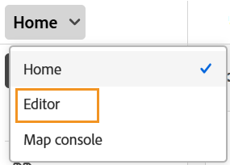
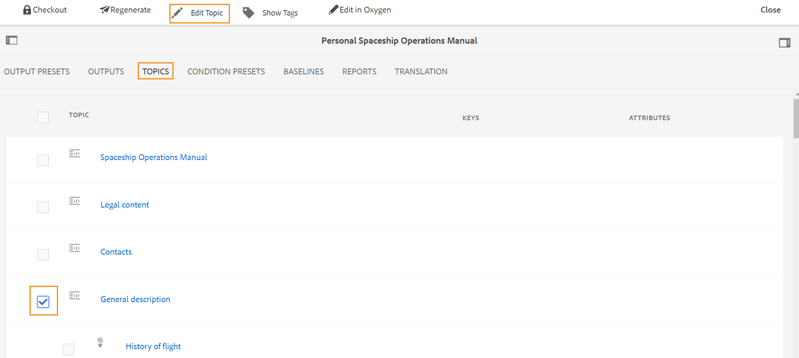

# Starta redigeraren {#id2056B0140HS}

Du kan starta redigeraren från följande platser:

- [Adobe Experience Manager Navigation page](#adobe-experience-manager-navigation-page)
- [Adobe Experience Manager Assets UI](#adobe-experience-manager-assets-ui)
- [Kartkonsol](#map-console)

I följande avsnitt beskrivs hur du kommer åt och startar redigeraren från olika platser.

## Adobe Experience Manager Navigation page

När du loggar in i Experience Manager visas navigeringssidan:

{align="left"}

Om du väljer länken **Stödlinjer** kommer du till [Adobe Experience Manager Guides hemsida](./intro-home-page.md).

{align="left"}

Om du vill starta redigeraren går du till navigeringsfältet och väljer **Redigeraren** i listrutan. Hemsidan är markerad som standard.

{width="350" align="left"}

När du har startat redigeraren utan att välja någon fil visas en tom redigeringsskärm. Du kan öppna en fil för redigering från Experience Manager **databas** eller dina **samlingar**.

{align="left"}

Du kan också starta redigeraren genom att öppna de befintliga filerna i widgeten **Senaste filer** och widgeten **Samlingar** i [Adobe Experience Manager Guides Home page experience](./intro-home-page.md) .

Om du vill gå tillbaka till Experience Manager Navigation-sidan väljer du Adobe Experience Manager logotyp i det övre vänstra hörnet av sidhuvudet.

## Adobe Experience Manager Assets UI

En annan plats där du kan starta redigeraren är från Experience Manager Assets-gränssnittet. Du kan markera ett eller flera ämnen och öppna dem direkt i redigeraren.

Så här öppnar du ett ämne i Redigeraren:

1. Gå till det avsnitt du vill redigera i användargränssnittet för Assets.

   >[!NOTE]
   >
   > Du kan även visa Ämnets UUID.

   {align="left"}

   >[!IMPORTANT]
   >
   > Kontrollera att du har läs- och skrivbehörighet för mappen som innehåller det ämne som du vill redigera.

1. Om du vill låsa ämnet exklusivt markerar du ämnet och väljer **Checka ut**.

   >[!IMPORTANT]
   >
   > Om administratören har konfigurerat alternativet **Inaktivera redigering utan att låsa filen** måste du checka ut filen innan du redigerar. Om du inte checkar ut filen kan du inte visa redigeringsalternativet.

1. Stäng resursurvalsläget och markera det ämne som du vill redigera.

   Ämnets förhandsgranskning visas.

   Du kan öppna redigeraren från listvyn, kortvyn och förhandsgranskningsläget.

   >[!IMPORTANT]
   >
   > Om du vill öppna flera ämnen för redigering markerar du önskade ämnen i resursgränssnittet och väljer **Redigera**. Kontrollera att webbläsaren inte har någon blockering aktiverad, annars öppnas bara det första avsnittet i den markerade listan för redigering.

   {align="left"}

   Om du inte vill förhandsgranska ett ämne och vill öppna det direkt i redigeraren väljer du ikonen **Redigera** på snabbåtgärdsmenyn i kortvyn:

   {align="left"}

   Ämnet öppnas i Redigeraren.

   {align="left"}

Du kan också öppna en kartfil i Assets-gränssnittet och starta redigeraren för att redigera avsnitten i kartfilen.

Så här öppnar du en karta i Editor:

1. Navigera till och markera kartfilen som innehåller det ämne du vill redigera i användargränssnittet för Assets.
1. Gå till fliken **Ämnen** i DITA-kartkonsolen. En lista med ämnen i kartfilen visas.
1. Markera ämnesfilen som du vill redigera.
1. Välj **Redigera ämne**.

   {align="left"}

1. Ämnet öppnas i Redigeraren.

   >[!IMPORTANT]
   >
   > Om administratören har konfigurerat alternativet **Inaktivera redigering utan att låsa filen** måste du checka ut filen innan du redigerar. Om du inte checkar ut filen öppnas dokumentet i redigeraren i skrivskyddat läge.

## Kartkonsol

Så här öppnar du redigeraren från kartkonsolen:

1. Öppna hemsidan och starta kartkonsolen.

   {width="350" align="left"}

   När du har startat kartkonsolen utan att välja någon kartfil visas en tom kartkonsolskärm. Du kan också öppna en kartfil från Experience Manager **databas** eller dina **samlingar**.

   {width="500" align="left"}

1. Välj **Markera karta** om du vill öppna en kartfil som innehåller de ämnen du vill redigera i redigeraren.
1. Välj den sökväg där kartfilen finns. Den markerade kartfilen läggs till i kartkonsolen.
1. Navigera till kartfilen och välj **Öppna i redigeraren** i listrutan.

   {align="left"}

   Kartfilen som innehåller ämnena är öppen för redigering i Editor.

   {align="left"}

**Överordnat ämne**: [Introduktion till redigeraren](web-editor.md)
