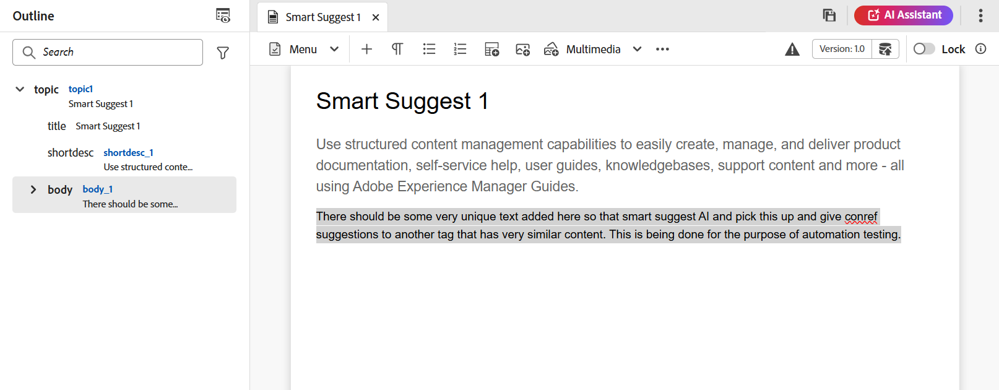
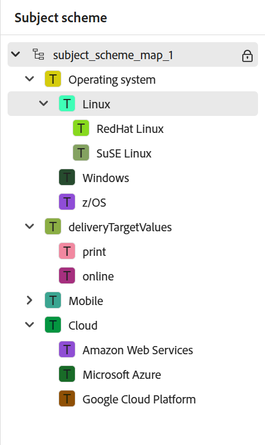
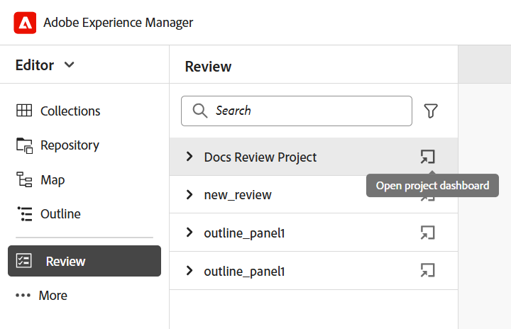

# Vänster panel i redigeraren

Den vänstra panelen ger dig snabb åtkomst till samlingar, databasvyn, kartvyn och andra funktioner. Du kan expandera panelen genom att markera ikonen **Expandera** som finns i det nedre vänstra hörnet av gränssnittet. När du har expanderat använder du ikonen **Komprimera** för att komprimera panelen. I den utökade vyn visas namnen på de ikoner som visas som verktygstips i den komprimerade vyn.

>[!NOTE]
>
>Det går att ändra storlek på den vänstra panelen. Om du vill ändra storlek på panelen placerar du markören på panelkanten, pekaren ändras till en dubbelriktad pil, markerar och drar för att ändra storlek på panelbredden.

Den vänstra panelen ger dig tillgång till följande funktioner:

- [Samlingar](#collections)
- [Databas](#repository)
- [Explorer](#explorer)
- [Karta](#map)
- [Återanvändbart innehåll](#reusable-content)
- [Kontur](#outline)

Vissa av funktionerna i den vänstra panelen finns under avsnittet **Mer**. Välj ikonen Mer  för att komma åt funktionerna nedan:

- [Ordlista](#glossary)
- [Villkor](#conditions)
- [Ämnesschema](#subject-scheme)
- [Fragment](#snippets)
- [Mallar](#templates)
- [Citat](#citations)
- [Språkvariabler](#language-variables)
- [Variabel](#variables)
- [Sök och ersätt](#find-and-replace)
- [PDF-mallar](#pdf-templates)
- [Granska](#review)


Ytterligare ett alternativ med etiketten **Workfront** visas även på den vänstra panelen om Adobe Workfront är konfigurerat.

Mer information finns i [Integrering med Workfront](./workfront-integration.md).

>[!NOTE]
>
> De funktioner som är tillgängliga i den vänstra panelen hanteras av administratören, vilket gör att du kan aktivera eller inaktivera de enskilda funktionerna i den vänstra panelen. Endast aktiverade funktioner visas i den vänstra panelen. Mer information finns i avsnittet **Paneler** i [flikfältet](./web-editor-tab-bar.md).

Den vänstra panelens funktioner beskrivs nedan:

## Samlingar

Om du arbetar med en uppsättning filer eller mappar kan du lägga till dem i din favoritlista för att snabbt komma åt dem. **Samlingar** visar en lista över dokument som du har lagt till och andra offentliga dokumentlistor från andra användare.

Som standard kan du visa filerna efter namn. När du för muspekaren över en fil kan du visa filens namn och sökväg som ett verktygstips.

>[!NOTE]
>
> Som administratör kan du även välja att visa fillistan efter filnamn i Redigeraren. Välj alternativet **Filnamn** för **redigeringsfilerna visar konfigurationsavsnittet** i **Användarinställningar**.

<details>
    <summary> Skapa en ny samling </summary>


Om du vill skapa en ny samling väljer du +-ikonen bredvid panelen Samlingar för att öppna dialogrutan **Ny samling** :

{width="300" align="left"}

Ange en titel och en beskrivning för samlingen som du vill skapa. Om du väljer **Offentlig** visas den här favoriten även för andra användare.

>[!NOTE]
>
> Du kan också skapa en samling från Experience Manager Guides hemsida. Öppna hemsidan, navigera till widgeten **Samlingar** i avsnittet [Översikt](./intro-home-page.md#overview) och välj **Ny samling**.

</details>

<details>
    <summary> Lägga till en fil i samlingar </summary>


Om du vill lägga till en fil i samlingar använder du någon av följande metoder:

- Navigera till önskad fil eller mapp i databasvyn, markera ikonen *Alternativ* för att öppna snabbmenyn och välj **Lägg till i** > **Samlingar**. I dialogrutan **Lägg till i samlingar** kan du välja att lägga till filen/mappen till en befintlig favorit eller skapa en ny.

  {width="300" align="left"}

- Högerklicka på en fils flik i redigeraren för att öppna snabbmenyn. Välj **Lägg till i** > **Samlingar** om du vill lägga till filen i favoritlistan.

  {align="left"}


>[!NOTE]
>
> - Om du vill ta bort ett objekt från favoritlistan markerar du alternativikonen bredvid objektet i en favoritsamling och väljer **Ta bort från samlingar**.
> - Om du vill förhandsgranska filen utan att öppna den markerar du en fil och väljer **Förhandsgranska** på Alternativ-menyn.

</details>

**Alternativ-meny för en samling**

Du kan även utföra många åtgärder med Alternativ-menyn som är tillgänglig för en samling:

{width="650" align="left"}

- **Byt namn**: Byt namn på den valda samlingen.
- **Ta bort**: Ta bort den markerade samlingen.
- **Uppdatera**: Hämta en ny lista med filer och mappar från databasen.
- **Visa i Assets-användargränssnitt**: Visa fil- eller mappinnehållet i Assets användargränssnitt.

>[!NOTE]
>
> Du kan uppdatera listan med ikonen **Uppdatera** längst upp. Om du dessutom uppdaterar listan läses samlingarna in igen, och därför komprimeras alla expanderade samlingar på panelen.


## Databas

>[!NOTE]
>
> Från och med version 2025.11.0 kommer **Databasen** i redigeraren att bli inaktuell och ersättas av installationen av **Utforskaren** för **molntjänsten** . Under installationen av **On-Premise** fortsätter du att visa och använda databasen via redigeringsgränssnittet till version 5.1 av Experience Manager Guides.

När du väljer ikonen Databas visas en lista med filer och mappar som är tillgängliga i DAM. Som standard kan du visa filerna efter namn. När du för muspekaren över en fil kan du visa filens namn och filnamnet som ett verktygstips.

>[!NOTE]
>
> Som administratör kan du även välja att visa fillistan efter filnamn i Redigeraren. Välj alternativet **Filnamn** för **redigeringsfilerna visar konfigurationsavsnittet** i **Användarinställningar**.

75 filer läses in samtidigt. Varje gång du väljer **Läs in fler** ... 75 filer läses in och knappen visas inte när alla filer har listats. Gruppinläsningen är effektiv och du kan komma åt filerna snabbare än att läsa in alla filer som finns i en mapp.

Du kan enkelt navigera till önskad fil i DAM och öppna den i redigeraren. Om du har behörighet att redigera filen kan du göra det.

Du kan också välja och spela upp en ljud- eller videofil i Editor. Du kan ändra volymen eller
videons vy. På snabbmenyn har du också möjlighet att hämta, ändra uppspelningen
eller visa bild-i-bild.

Markera en karta och tryck på Retur eller dubbelklicka för att öppna den i **kartvyn**. Mer information finns i funktionsbeskrivningen för **Kartvyn** i den vänstra panelen. Markera ett ämne och tryck på Enter eller dubbelklicka för att öppna det i [området för innehållsredigering](./web-editor-content-editing-area.md). Du kan navigera och öppna en fil direkt i redigeraren vilket sparar tid och ökar produktiviteten.

## Filtersökning i databas

Redigeraren har förbättrade filter för textsökning. Du kan söka efter och filtrera efter en text i de filer som finns på den valda sökvägen i Adobe Experience Manager-databasen. Det söker i titeln, filnamnet och innehållet i filerna.


{width="300" align="left"}

*Använd filter för att söka efter filer som innehåller texten`personal spaceship.`*

Välj ikonen **Filtersökning** \(\) för att öppna popup-fönstret Filter.

>[!NOTE]
>
> När du söker efter text eller filtrerar filer visas en blå punkt på ikonen **Filtersökning** \(\) som anger att vi finns på sökpanelen och att vissa filter har tillämpats.


Du har följande alternativ för att filtrera filerna och begränsa sökningen i Adobe Experience Manager-databasen:

- **DITA-filer**: Du kan söka efter alla **DITA-avsnitt** och **DITA-kartor** som finns på den valda sökvägen. Dessa är markerade som standard.
- **Icke-DITA-filer**: Du kan söka efter **Ditavala filer**, **Bildfiler**, **Multimedia**, **Dokument** och **JSON** i den valda sökvägen.

   {width="300" align="left"}

  *Använd snabbfiltren för att söka efter DITA- och icke-DITA-filer.*

>[!NOTE]
>
> Du kan också använda filtret **DITA-ämne** för att söka efter innehåll som är specifikt för Markdown-filer i databasen, inklusive titlar, ämnesinnehåll och egenskaper. Den här funktionen gäller för närvarande bara för nyligen skapade Markdown-filer.

**Avancerad filtrering**

Välj ikonen **Avancerad filtrering** för att visa dialogrutan **Avancerat filter** .

Du kan visa följande alternativ på flikarna **Allmänt** och **Avancerat**.

 {width="650" align="left"}


**Allmänt**

- **Sökresultat med**: Sök efter text i filerna som finns på den valda sökvägen i Adobe Experience Manager-databasen. Texten genomsöks i filernas titel, filnamn och innehåll.

Detta är synkroniserat med sökrutan i databasfönstret. Om du t.ex. skriver `general purpose` i sökrutan på databaspanelen visas den även i dialogrutan **Avancerat filter** och vice versa.

- **Sök i**: Välj den sökväg där du vill söka efter filerna som finns i Adobe Experience Manager-databasen.
- **DITA-filer**: Du kan söka efter alla **DITA-avsnitt** och **DITA-kartor** som finns på den valda sökvägen. Dessa är markerade som standard.
- **Icke-DITA-filer**: Du kan söka efter **Ditavala filer**, **Bildfiler**, **Multimedia**, **Dokument** och **JSON** i den valda sökvägen.
- **Låst av**: Visar en lista över användare. Listan sidnumreras och läses in asynkront, med en begränsad uppsättning användare åt gången och fler hämtas när du rullar eller navigerar. Detta förbättrar inläsningshastigheten och övergripande prestanda, särskilt när du arbetar med ett stort antal användare.
- **Ändrad efter** / **Ändrad före**: Filtrera innehåll baserat på ändringsdatum. Välj ett datumintervall i kalendern eller välj något av följande alternativ för tidsram:
   - De senaste två timmarna
   - I förra veckan
   - Under den senaste månaden
   - Under förra året
- **Taggar**: Filtrera innehåll baserat på taggar.

**Avancerat**

- **DITA Elements**: Du kan också söka efter specifika värden i attributen för de angivna DITA-elementen.
   - Välj **Lägg till element** om du vill lägga till element, attribut och värden.
   - Använd de filter som du har valt.

- Välj **Rensa alla** om du vill rensa alla använda filter.


- Välj ikonen **Stäng filter**  för att stänga filtret och återgå till trädvyn i databasen.

  >[!NOTE]
  >
  >Systemadministratören kan också konfigurera textfiltren och visa eller dölja andra filter. Mer information finns i avsnittet *Konfigurera textfilter* i Installera och konfigurera Adobe Experience Manager Guides as a Cloud Service.
  >
  >Listan med filtrerade filer som innehåller den sökta texten visas. Filerna som innehåller texten `personal spaceship` visas till exempel i den föregående skärmbilden. Du kan markera flera filer i den filtrerade listan om du vill dra och släppa dem på en karta som har öppnats för redigering.

### Alternativ-menyn

Förutom att öppna filer från den vänstra panelen kan du även utföra många åtgärder med hjälp av Alternativ-menyn i databasvyn. Du kan visa olika alternativ beroende på om du väljer en mapp, ämnesfil eller mediefil.

**Alternativ för en mapp**

Du kan utföra följande åtgärder på Alternativ-menyn som är tillgänglig för en *mapp* i databasvyn:

{width="550" align="left"}


- **Nytt**: Skapa ett nytt DITA-ämne, en DITA-karta eller en mapp.

<details>
    <summary> Steg för att skapa ett nytt ämne </summary>

Steg för att skapa ett nytt ämne:

1. Välj **Nytt** > **Ämne**.
1. Dialogrutan **Nytt ämne** visas.

   {width="300" align="left"}

1. Ange följande information i dialogrutan **Nytt ämne**:
   - En rubrik för ämnet.
   - \(Valfritt\)* Ämnets filnamn. Filnamnet föreslås automatiskt baserat på ämnet Titel. Om administratören har aktiverat automatiska filnamn baserat på UUID-inställningen, kommer du inte att visa namnfältet.
   - En mall som ämnet baseras på. Om du till exempel har en färdig installation kan du välja bland mallarna Tom, Koncept, DITAVAL, Referens, Uppgift, Ämne, Markering, Ordlista och Felsökning. Om mappen har en konfigurerad mappprofil visas endast de ämnesmallar som har konfigurerats i mappprofilen.

   - Sökväg där du vill spara ämnesfilen. Som standard visas sökvägen till den markerade mappen i databasen i fältet Sökväg.
1. Välj **Skapa**. Ämnet skapas på den angivna sökvägen. Dessutom öppnas ämnet i Redigeraren för redigering.

</details>

<details>
<summary> Steg för att skapa en ny DITA-karta </summary>


Steg för att skapa en ny DITA-karta:

1. Välj **Ny** > **DITA-karta**.
2. Dialogrutan **Ny karta** visas.

   {width="300" align="left"}

3. Ange följande information i dialogrutan **Ny karta**:
   - En titel för kartan.
   - *\(Valfritt\)* Filnamnet för kartan. Filnamnet föreslås automatiskt baserat på kartans titel. Om administratören har aktiverat automatiska filnamn baserat på UUID-inställningen, kommer du inte att visa namnfältet.
   - En mall som kartan baseras på. Om du till exempel har en färdig inställning kan du välja från bokmappsmallarna eller DITA-mappningsmallarna.
   - Sökväg där du vill spara kartfilen. Som standard visas sökvägen till den markerade mappen i databasen i fältet Sökväg.
4. Välj **Skapa**. Kartan skapas och läggs till i den mapp som anges i fältet Sökväg. Kartan öppnas även i kartvyn. Du kan öppna kartfilen i kartredigeraren och lägga till avsnitt i den. Mer information om hur du lägger till ämnen i en kartfil finns i [Skapa en karta](map-editor-create-map.md#). Du kan också välja **Öppna i kartkonsolen** för att öppna kartan i kartkonsolen.
</details>

<details>
<summary> Steg för att skapa en ny mapp </summary>

Steg för att skapa en ny mapp:

1. Välj **Ny** > **Mapp**.
2. Dialogrutan **Ny mapp** visas.

   {width="300" align="left"}

3. Ange följande information i dialogrutan **Ny mapp**:
   - En rubrik för mappen, som automatiskt konverteras till mappnamnet.
   - Sökväg där du vill spara mappen. Som standard visas sökvägen till den markerade mappen i databasen i fältet Sökväg.
4. Välj **Skapa**. Mappen skapas och läggs till i den mapp som alternativet Skapa mapp kördes från.

</details>

- **Överför resurser**: Överför en fil från ditt lokala system till den valda mappen i Adobe Experience Manager-databasen. Du kan också dra och släppa filer från ditt lokala system till ditt aktuella arbetspass. Det här är mycket användbart om du vill infoga bilder från ditt lokala system i avsnittet.

  {width="300" align="left"}

  Du kan välja en mapp där du vill överföra filen och en förhandsvisning av bilden visas också. Om du vill byta namn på filen kan du göra det i textrutan för filnamn. Välj **Överför** för att slutföra filöverföringen. Om du har dragit och släppt en bildfil till ett ämne, läggs bildfilen till i artikeln och den överförs också.

  Om administratören har aktiverat alternativet UUID:n i *XMLEditorConfig* så visar du UUID:t för den överförda bilden i egenskapen **Source** .

  {align="left"}

  När överföringen är klar visas följande bekräftelsedialogruta:

  

  <details>

  <summary>Hantera ogiltiga tecken i filnamn</summary>

  Om filnamnet för resursen som överförs innehåller ogiltiga tecken (till exempel * / : [\]) | # % { } ?) kan följande scenarier inträffa:

   - **Delvis överföring**: Anger att en eller flera resurser som överförs innehåller ogiltiga tecken i filnamnen.

     

   - **Överföringen misslyckades** : Anger att alla resurser som överförs innehåller ogiltiga tecken i filnamnen.

     

  Om du vill lösa de här konflikterna tar du bort ogiltiga tecken från resursernas filnamn och överför dem sedan till databasen igen.

  </details>

- **Uppdatera**: Hämta en ny lista med filer och mappar från databasen.
- **Komprimera**: Komprimera den markerade mappen i databasen.

  >[!NOTE]
  >
  > Använd ikonen **\>** bredvid en mapp för att expandera den.

- **Sök efter filer i mappen**: Flyttar fokus till databassökning där du kan ange söktermen. Sökningen utförs under den valda mappen i databasen. Du kan också använda ett filter för att returnera DITA-filer, bildfiler eller båda.

  {width="300" align="left"}

  Du kan också söka med hjälp av filens UUID. I så fall visar sökresultaten titeln på DITA/XML-filen och om filen är en bildfil visas filens UUID. I följande sökexempel genomsöks UUID för en bildfil och i sökresultaten visas UUID för den ursprungliga bildfilen och avsnittsrubriken för den fil där bilden refereras.

  {width="300" align="left"}

- **Lägg till i samlingar**: Lägger till den markerade mappen i favoriter. Du kan lägga till den i en befintlig eller ny samling.

- **Återbearbeta resurser**: Utlöser bearbetningen av alla resurser i mappen.
- **Visa i Assets-användargränssnitt**: Visa mappinnehållet i Assets användargränssnitt.

**Alternativ för en fil**

Du får tillgång till olika alternativ på Alternativ-menyn beroende på om du väljer en mediefil eller en DITA-fil. Några vanliga alternativ för både media och DITA-filer är:

- Redigera
- Öppna i FrameMaker
- Duplicera
- Lås/lås upp
- Förhandsgranska
- Flytta till
- Byt namn
- Ta bort
- Generera
- Ladda ned som PDF
- Lägg till i
- Kopiera
- Återbearbeta resurs
- Visa i Assets användargränssnitt
- Egenskaper


{width="550" align="left"}

De olika alternativen på Alternativ-menyn förklaras nedan:

- **Redigera**: Öppna filen för redigering. Om det är en .ditamap/.bookmap-fil öppnas den i [kartredigeraren](map-editor-advanced-map-editor.md#) för redigering.

- **Redigera i syre**: Välj det här alternativet om du vill redigera den valda filen i syreanslutningens plugin-program. Filen öppnas för redigering.

  >[!NOTE]
  >
  >Kontakta kundgruppen för att aktivera den här funktionen i miljön. Detta är inte aktiverat som en del av det färdiga stödet. Mer information finns i avsnittet [Konfigurera alternativet att redigera i syre](../cs-install-guide/conf-edit-in-oxygen.md) i installations- och konfigurationshandboken.

- **Öppna på kartkontrollpanelen**: Om den valda filen är en DITA-karta öppnas kartkontrollpanelen med det här alternativet.

- **Öppna i kartkonsol**: Om den valda filen är en DITA-karta öppnas kartkonsolen med det här alternativet.

- **Lås**: Lås den markerade filen för redigering. Om filen är låst när du håller muspekaren över låsikonen visas **Låst av dig** om du låst den, eller **Låst av [användarnamn]** om en annan användare har låst den.

- **Förhandsgranska**: Få en snabb förhandsvisning av filen (.dita, .xml, ljud, video eller bild) utan att öppna den. Du kan ändra storlek på förhandsgranskningsfönstret. Om innehållet innehåller `<xref>` eller `<conref>` kan du markera det och öppna det på en ny flik. Filens titel visas i fönstret. Om det inte finns någon titel visas filnamnet. Om du vill stänga **förhandsgranskningspanelen** kan du antingen välja stängningsikonen eller välja var som helst utanför rutan.

  {align="left"}


- **Duplicera**: Använd det här alternativet om du vill skapa en dubblett eller en kopia av den markerade filen. Du kan också ändra namn på den duplicerade filen i kommandotolken Duplicera resurs. Som standard skapas filen med suffixet \(som filnamn\_1.extension\). Filens namn är detsamma som källfilen och den nya filen börjar med version 1.0. Alla referenser, taggar och metadata kopieras medan baslinjerna inte kopieras i den duplicerade filen.

- **Flytta till**: Använd det här alternativet om du vill flytta den markerade filen till en annan mapp.
   - Du kan antingen skriva namnet på målmappen eller välja **Välj sökväg** för att välja målmappen.
   - Du kan flytta en fil av valfri typ till valfritt mål i innehållsmappen.
   - Två filer kan inte ha samma namn. Du kan alltså inte flytta en fil till en mapp där det redan finns en fil med samma namn.

  Om du försöker flytta en fil till en mapp där det finns en fil med samma namn men en annan titel, visas dialogrutan Byt namn och flytta filen. Du måste byta namn på filen innan du flyttar den. Den flyttade filen i målmappen har det nya filnamnet.

  {width="550" align="left"}

  >[!NOTE]
  >
  > Du kan också dra och släppa en fil till en annan målmapp.

  **Uteslutningsscenarier**

  Du kan inte byta namn på eller flytta en fil i följande scenarier i Experience Manager Guides:

   - Du kan inte flytta eller byta namn på en fil om den ingår i en granskning eller ett översättningsarbetsflöde.

   - Om någon annan användare låser filen, kan du inte byta namn på den eller flytta den, kommer du inte att se alternativet Byt namn eller Flytta till för filen.

  >[!NOTE]
  >
  > Om administratören har gett dig behörighet för en mapp visas endast alternativen **Byt namn** eller **Flytta till**.

  <details>
    <summary> Molntjänster </summary>

  Om du byter namn på eller flyttar en fil bryts inte befintliga referenser från eller till filen, eftersom varje fil har ett unikt UUID.
  </details>

- **Byt namn**: Använd det här alternativet om du vill byta namn på den markerade filen. Ange namnet på den nya filen i dialogrutan **Byt namn på resurs**.
   - Du kan byta namn på en fil av valfri typ.
   - Du kan inte ändra filtillägget.
   - Två filer kan inte ha samma namn. Du kan alltså inte byta namn på en fil till ett namn som redan finns. Ett fel visas.

- **Ta bort**: Använd det här alternativet om du vill ta bort den markerade filen. En bekräftelse visas innan filen tas bort.

   - En bekräftelse visas innan filen tas bort.
   - Om det inte finns någon referens till filen från någon annan fil tas den bort och ett meddelande om att åtgärden lyckades visas.
   - Om filen är låst kan du inte ta bort den och ett felmeddelande visas.

     >[!NOTE]
     >
     > Om administratören har förhindrat att låsta filer tas bort visas endast felmeddelandet. Mer information finns i avsnittet *Förhindra borttagning av utcheckade filer* i Installera och konfigurera Adobe Experience Manager Guides as a Cloud Service.

   - Om filen läggs till i en samling visas dialogrutan **Tvinga borttagning**, som du kan ta bort.
   - Om någon annan fil refererar till filen visas dialogrutan **Tvinga borttagning** med bekräftelsemeddelandet, och du kan framtvinga borttagning av filen:

     {width="300" align="left"}

     >[!NOTE]
     >
     > Om administratören har gett filborttagningsbehörighet aktiveras **Tvinga borttagning**. Annars är **Tvinga borttagning** inaktiverat och ett meddelande visas om att du inte har behörighet att ta bort refererade filer. Mer information finns i avsnittet *Förhindra borttagning av refererade filer* i Installera och konfigurera Adobe Experience Manager Guides as a Cloud Service.

   - Om du tar bort ett refererat ämne och har öppnat filen som innehåller referenser för redigering, visas den brutna länken för den refererade filen.

  >[!NOTE]
  >
  > Du kan även ta bort den markerade filen på liknande sätt med tangenten Delete på tangentbordet.

- **Generera**: Använd alternativet för att publicera en eller flera kartor inom en karta till en webbplatssida, ett innehållsfragment eller ett Experience Fragment.

- **Lägg till i**: Du kan välja bland följande alternativ:
   - **Samlingar**: Lägger till den markerade filen i Samlingar. Du kan lägga till den i en befintlig eller ny samling.

   - **Återanvändbart innehåll**: Lägger till den markerade filen i listan Återanvändbart innehåll i den vänstra panelen.

- **Kopiera**: Du kan välja bland följande alternativ:

   - **Kopiera UUID**: Kopiera UUID för den markerade filen till Urklipp.

   - **Kopiera sökväg**: Kopiera den fullständiga sökvägen för den markerade filen till Urklipp.

- **Bearbeta om resurs**: Startar bearbetningen för den valda resursen.

- **Visa i Assets-gränssnitt**: Använd det här alternativet om du vill visa en förhandsvisning av en DITA/.xml-fil i Assets-gränssnittet. Om det är en .ditamap/.bookmap-fil visas alla ämnesfiler på kartan i en enda enhetlig sida-för-sida-vy.

- **Egenskaper**: Använd detta för att öppna egenskapssidan för den markerade filen.

  Alla tillägg, borttagningar eller ändringar av metadataegenskaper på den här sidan (oavsett om de är standard eller anpassade) utlöser indikatorn för [arbetskopia](./web-editor-edit-topics.md#working-copy-indicator) för dokumentversionen.

  Du kan även komma åt egenskapssidan från Assets-gränssnittet genom att markera en fil och sedan välja egenskapsikonen i verktygsfältet.

- **Hämta som PDF**: Använd alternativet för att generera PDF-utdata och hämta dem.

## Explorer

>[!NOTE]
>
> Från och med version 2025.11.0 ersätts termen databas i redigeraren av **Utforskaren** för installation av molntjänster. Installationen på plats fortsätter att visa och komma åt databasen i redigeraren.

Utforskaren har de flesta funktioner som tidigare fanns i Databas, bland annat:

- Navigering mellan filer och mappar
- Alternativ-menyn för filer och mappar

Men det ger en förbättrad sök- och filtreringsupplevelse som är utformad för att förbättra användbarheten och effektiviteten.

Mer information om snabbmenyn för filer och mappar finns i [Alternativ-menyn](#options-menu).

Mer information om sökgränssnittet finns i [sökpanelen](./search-panel-explorer.md).

## Karta

När du väljer ikonen Kartvy visas en lista med ämnen i kartvyn. Om du inte har öppnat någon kartfil visas kartvyn som tom. Om du dubbelklickar på en kartfil öppnas kartfilen i den här vyn. Du kan dubbelklicka på en fil på kartan för att öppna den i redigeraren.

Som standard kan du visa filerna efter namn. När du för muspekaren över en fil kan du visa filens namn och sökväg som ett verktygstips.

>[!NOTE]
>
>Som administratör kan du även välja att visa filnamnet på den överordnade kartan som är öppen i kartvyn. Välj alternativet **Filnamn** för **redigeringsfilerna visar konfigurationsavsnittet** i **Användarinställningar**.


När du öppnar en karta i kartvyn visas den aktuella kartans titel i mitten av flikfältet. Om titeln är för lång visas en ellips och du kan också hovra över titeln för att visa den fullständiga titeln i verktygstipset.

När du definierar nyckelattribut för ämnet eller mappningsreferenserna kan du visa titeln, motsvarande ikon och nyckeln i den vänstra panelen. Nyckeln visas som `keys=<key-name>`.

{width="300" align="left"}

Om du har redigeringsbehörighet för kartfilerna kan du även redigera filerna. Mer information om hur du öppnar och redigerar ett ämne via DITA-kartan finns i [Redigera ämnen via DITA-kartan](map-editor-advanced-map-editor.md#id17ACJ0F0FHS).

Följande alternativ är tillgängliga för en kartfil i Kartvyn:

- **Öppna i kartkonsol**: Öppnar kartfilen i kartkonsolen.
- **Redigera**: Öppnar kartfilen för redigering.
- **Alternativ**: Öppnar snabbmenyn för den markerade kartfilen.

Du kan utföra följande åtgärder på Alternativ-menyn i kartfilen:

{align="left"}

- **Redigera**: Öppna kartfilen för redigering i kartredigeraren.

- **Markera alla**: Markera alla filer på kartan.

- **Radera markering**: Avmarkera de markerade filerna på kartan.

- **Lås**: Lås de markerade filerna på kartan.

- **Lås upp**: Låser upp kartfilen och gör den tillgänglig för redigering. Ändringarna återställs inte till tidigare versioner.

- **Spara som ny version och lås upp**: Skapa en nyare version och släpp låset för de markerade filerna på kartan.

- **Förhandsgranska**: Öppna en förhandsgranskning av kartfilen. I den här vyn visas alla ämnesfiler på kartan i en enhetlig sida vid sida-vy.

- **Kopiera**: Du kan välja bland följande alternativ:
   - **Kopiera UUID**: Kopiera UUID för mappningsfilen till Urklipp.
   - **Kopiera sökväg**: Kopiera hela sökvägen för mappningsfilen till Urklipp.

- **Hitta i Utforskaren**: Visar platsen för kartfilen i Utforskaren\(eller DAM\).

- **Lägg till i**: Du kan välja bland följande alternativ:
   - **Samlingar**: Lägger till kartfilen i samlingar. Du kan lägga till den i en befintlig eller ny samling.

   - **Återanvändbart innehåll**: Lägger till kartfilen i listan Återanvändbart innehåll i den vänstra panelen.

- **Egenskaper**: Använd detta för att öppna egenskapssidan för mappningsfilen. Du kommer också åt den här egenskapssidan från Assets-gränssnittet genom att markera en fil och välja egenskapsikonen i verktygsfältet.

- **Öppna kartkontrollpanelen**: Öppnar kartkontrollpanelen.

- **Visa i Assets-användargränssnitt**: Använd det här alternativet om du vill visa en förhandsgranskning av kartfilen i Assets användargränssnitt. I den här vyn visas alla ämnesfiler på kartan i en enhetlig sida vid sida-vy.
- **Hämta karta**: Välj det här alternativet om du vill öppna dialogrutan **Hämta karta**.

  I dialogrutan **Hämta karta** kan du välja följande alternativ:

  **Använd baslinje**: Välj det här alternativet om du vill visa en lista över baslinjer som skapats för DITA-kartan. Om du vill hämta kartfilen och dess innehåll baserat på en viss baslinje väljer du Baslinje i listrutan. Mer information om att arbeta med baslinjer finns i [Arbeta med baslinje](./generate-output-use-baseline-for-publishing.md).

  **Förenkla filhierarkin**: Välj det här alternativet om du vill spara alla refererade ämnen och mediefiler i en enda mapp.

  Du kan även hämta kartfilen utan att välja något alternativ. I så fall hämtas de senast beständiga versionerna av de ämnen och mediefiler som refereras.

  När du har valt knappen **Hämta** köas begäran om kartexportpaket. Dialogrutan **Slutfört** visas om paketet har skapats.  Du kan välja knappen **Hämta** i dialogrutan **Klart**.

  Du får ett meddelande om att kartan är klar att hämtas. Om hämtningen misslyckas får du ett meddelande om att hämtningen av kartan misslyckades.

  Du kommer åt nedladdningslänken från Adobe Experience Manager meddelandeinkorg. Välj det genererade kartmeddelandet i Inkorgen för att hämta kartan i ZIP-format.

  >[!NOTE]
  >
  >  Som standard finns de hämtade kartorna kvar i fem dagar i Adobe Experience Manager meddelandeinkorg.

- **Stäng kartkontext**: Stänger kartfilen.

I följande skärmbild visas Alternativ-menyn för en fil i mappningsvyn:

{align="left"}

Du kan utföra följande åtgärder på Alternativ-menyn:

- **Redigera**: Öppna filen för redigering. Om det är en .ditamap/.bookmap-fil öppnas den i [kartredigeraren](map-editor-advanced-map-editor.md#) för redigering.

- **Lås**: Låser den markerade filen. För en låst fil ändras det här alternativet till **Lås upp**.


  >[!NOTE]
  >
  > - Om en fil är låst av en användare och du håller muspekaren över låsikonen visas den användare \(namn\) som har låst filen.
  > - När du checkar in en fil uppmanas du att spara ändringarna. Om du inte sparar ändringarna checkas bara filen in.

- **Förhandsgranska**: Få en snabb förhandsvisning av filen (.dita, .xml, ljud, video eller bild) utan att öppna den. Du kan ändra storlek på förhandsgranskningsfönstret. Om innehållet innehåller `<xref>` eller `<conref>` kan du markera det och öppna det på en ny flik.  Filens titel visas i fönstret. Om det inte finns någon titel visas filnamnet. Om du vill stänga rutan **Förhandsgranska** kan du antingen välja stängningsikonen eller välja var som helst utanför rutan.
- **Kopiera**: Du kan välja bland följande alternativ:
   - **Kopiera UUID**: Kopiera UUID för den markerade filen till Urklipp.
   - **Kopiera sökväg**: Kopiera hela sökvägen för den markerade filen till Urklipp.


- **Hitta i Utforskaren**: Visar platsen för den markerade filen i Utforskaren \(eller DAM\).
- **Expandera alla**: Expandera alla ämnen i kartfilerna.

- **Komprimera alla**: Komprimera alla ämnen som är en del av den aktuella kartfilen.

- **Lägg till i**: Du kan välja bland följande alternativ:
   - **Samlingar**: Lägger till den markerade filen i samlingar. Du kan lägga till den i en befintlig eller ny samling.

   - **Återanvändbart innehåll**: Lägger till den markerade filen i listan Återanvändbart innehåll i den vänstra panelen.

- **Egenskaper**: Använd detta för att öppna egenskapssidan för den markerade filen. Du kommer också åt den här egenskapssidan från Assets-gränssnittet genom att markera en fil och välja egenskapsikonen i verktygsfältet.

- **Visa i Assets-gränssnitt**: Använd det här alternativet om du vill visa en förhandsvisning av en DITA/.xml-fil i Assets-gränssnittet. Om det är en .ditamap/.bookmap-fil visas alla ämnesfiler på kartan i en enda enhetlig sida-för-sida-vy.

- **Generera**: Generera utdata för den valda filen på webbplatssidan, i innehållsfragmentet eller i Experience Fragment.

>[!NOTE]
>
> Du kan också öppna och redigera egenskaperna för markerade ämnen i en DITA-karta på menyn **Fler alternativ** under Referenser.

## Återanvändbart innehåll

En av huvudfunktionerna i DITA är möjligheten att återanvända innehåll. Panelen **Återanvändbart innehåll** kan lagra dina DITA-filer där du vanligtvis infogar återanvändbart innehåll. När du har lagt till DITA-filerna finns de kvar i panelen Återanvändbart innehåll mellan sessionerna. Det innebär att du inte behöver lägga till dina DITA-filer igen för att komma åt dem senare.

Du kan helt enkelt dra och släppa återanvändbart innehåll från panelen till det aktuella ämnet så infogas det enkelt och snabbt. Du kan också förhandsgranska innehållet innan du infogar det i dokumentet.

Som standard kan du visa filerna efter namn. När du för muspekaren över en fil kan du visa filens namn och sökväg som ett verktygstips.

>[!NOTE]
>
> Som administratör kan du även välja att visa fillistan efter filnamn i Redigeraren. Välj alternativet **Filnamn** för **redigeringsfilerna visar konfigurationsavsnittet** i **Användarinställningar**.

Om du vill lägga till en DITA-fil på panelen Återanvändbart innehåll använder du någon av följande metoder:

- Öppna dialogrutan **Välj fil** genom att markera ikonen **+** bredvid Återanvändbart innehåll.
- Markera filen som du vill lägga till och välj sedan **Markera**. Du kan också söka efter specifika filer med filtersökningsalternativet. Mer information finns i [Andra funktioner i redigeraren](./web-editor-other-features.md).


  {width="650" align="left"}

  Du kan också använda ikonen **Ta bort** för att avmarkera vissa filer i förhandsvisningen.

  {width="650" align="left"}
- I databasvyn markerar du ikonen **Alternativ** för den önskade filen och väljer **Lägg till i** > **Återanvändbart innehåll** på snabbmenyn.

- Högerklicka på en fils flik i redigeraren för att öppna snabbmenyn och välj **Lägg till i** > **Återanvändbart innehåll**.

När filen har lagts till kan du visa alla återanvändbara innehållselement från filen på panelen Återanvändbart innehåll. Återanvändbart innehåll visas med deras ID:n och elementnamn.

När du lägger till en fil i listan Återanvändbart innehåll visas filens namn i stället för filens UUID. Om du vill kontrollera filens UUID håller du muspekaren över filens namn och filens UUID visas i verktygstipset.

{width="400" align="left"}

>[!NOTE]
>
> Du kan lägga till flera filer i listan över återanvändbart innehåll. Sedan kan du infoga önskat innehåll från panelen Återanvändbart innehåll i dokumentet.

**Uppdatera**: Söker efter allt återanvändbart innehåll och visar en ny lista över återanvändbart innehåll.

Om du vill infoga innehåll från panelen Återanvändbart innehåll använder du någon av följande metoder:

- Håll muspekaren över ett element som du vill infoga, markera ikonen **Alternativ** och välj **Infoga återanvändbart innehåll** i listrutan.

  {width="400" align="left"}

  >[!NOTE]
  >
  > Markera en fil och välj sedan **Förhandsgranska** på menyn **Alternativ** för att förhandsgranska filen utan att öppna den. Du kan också förhandsgranska referenserna i ett ämne. Referens-ID:t visas i fönstret.
  >
  > Alternativet **Förhandsgranska** finns också på menyn **Alternativ** för ett element, vilket ger dig en snabb förhandsvisning av elementet innan du infogar det.

- Dra och släpp det återanvändbara innehållsobjektet från panelen till önskad plats i dokumentet.

## Kontur

När du väljer ikonen **Disposition** får du den hierarkiska vyn över elementen som används i dokumentet.

{width="300" align="left"}

I dispositionsvyn finns följande funktioner:

- En trädvy över alla element som används i dokumentet.

- Om ett element har ett ID, attribut och text kan du visa dem tillsammans med elementet.

- Visa dispositionsvyn i både författarvyn och Source-vyn.

- Använd den nedrullningsbara filterlistan för att visa alla element eller endast brutna referenser:

- Om du väljer ett element i dispositionsvyn markeras elementets innehåll i författarvyn eller Source-vyn. Dispositionsvyn är fortfarande synkroniserad med författarvyn och Source-vyn. Om du gör några ändringar i en vy kan du visa dem i dispositionsvyn. Om du till exempel lägger till ett stycke eller uppdaterar ett element i redigeringsvyn visas det i dispositionsvyn.

  {width="650" align="left"}

- Dra och släpp element. Du kan enkelt ersätta ett element genom att släppa ett annat element på det. Om du drar och släpper ett element över ett annat element och visar en streckad rektangelruta runt elementet, indikerar det att elementet kommer att ersättas. Den ersätter elementet som elementet släpps på.

  {align="left"}

  Om du drar och släpper ett element visar en streckad rektangel att elementet kan placeras på den aktuella platsen. Om dra och släpp-funktionen är ogiltig visas ett felmeddelande som anger att åtgärden inte är tillåten.

  {align="left"}

- Med menyn **Alternativ** i vyn *Disposition* kan du utföra allmänna åtgärder som Klipp ut, Kopiera, Ta bort, Generera ID, Infoga element före eller efter det aktuella elementet, Byta namn på eller ersätta ett element, Bryt ned ett element och skapa ett utdrag ur det markerade elementet.

>[!NOTE]
>
>Mer information om Generate ID, Infoga element före eller efter det aktuella elementet och Bryt upp ett element finns i [Andra funktioner i redigeraren](web-editor-other-features.md#).

**Visa Konfigurera**

Med alternativet **Visa Konfigurera** kan du välja att visa följande:

- **Visa ID**: Visar elementets ID.
- **Visa attribut**: Visar attributet tillsammans med dess värde.
- **Visa text**: Visar texten. Om texten är längre än 20 tecken visas en ellips.

Om ett blockelement har en egen text visas det tillsammans med det blockelementet. Om den inte har någon egen text visas texten för det första underordnade elementet tillsammans med det blockelementet.

{width="550" align="left"}

Om administratören har skapat en profil för attribut får du dessa attribut tillsammans med deras konfigurerade värden. Du kan också tilldela visningsattribut som konfigurerats av administratören på fliken **Visningsattribut** i **Workspace-inställningarna** (visas som **Inställningar** för **På-plats**). De attribut som är definierade för ett element visas i layoutvyn och dispositionsvyn.


**Sökfunktion**

Med sökfunktionen kan du söka efter ett element med hjälp av dess namn, id, text eller attributvärde.

Sökningen är skiftlägesokänslig och matchar strängen exakt. Sökresultaten sorteras utifrån elementets position i dokumentet.

Du kan söka efter en sträng i elementet om den visas i vyn **Kontur** . Om strängen &quot;Adobe&quot; till exempel finns i elementets text och visas i dispositionsvyn (som du har valt **Visa text** i listrutan Visningsalternativ), filtreras elementet som finns i den. Men om texten inte visas på panelen Dispositionsvy (eftersom du inte har markerat **Visa text** i listrutan Visningsalternativ) filtreras inte elementet som innehåller. På samma sätt finns strängen i ID:t eller attributen om du har markerat dem.

## Ordlista

Med Experience Manager Guides kan du enkelt skapa och använda ordboksdokument. Du kan skapa ordlisteämnesfiler och sedan inkludera dem i en gemensam ordlista. När den här kartan har lagts till som rotkarta visas ordlisteposterna på ordlistepanelen.

{width="650" align="left"}

Om du vill infoga en term från ordlistan drar och släpper du posten från panelen till önskad plats i ämnet. På Alternativ-menyn för en ordlista kan du snabbt få **Förhandsgranska** av posttermen, **Kopiera sökväg** till posttermfilen eller hitta posttermfilen i databasen.

<details>
    <summary> Steg för att söka efter och ersätta text i ordlisteförkortningar </summary>

Utför följande steg för att söka efter och ersätta textermerna med ordlisteförkortningar:

1. Öppna det DITA-avsnitt eller den DITA-karta där du vill söka efter och konvertera texten eller termerna.
1. Välj ordlistepanelen för att visa de ordlistor som finns i rotkartan. Du kan dra och släppa dessa termer för att lägga till dem i det öppna ämnet.
1. Välj verktyget **Aktiveringspunkt** \( \) i ordlistepanelen om du vill söka efter och konvertera specifika texttermer till länkade ordlisteförkortningar. Du kan också använda den för att söka efter ordboksförkortningar och konvertera dem till texttermer.

</details>


Du kan konfigurera följande inställningar för verktyget Aktiveringspunkt:

{width="300" align="left"}


- **Ordlistenycklar**: Välj de ordlistenycklar på DITA-kartan som du vill använda för sökningen i det markerade ämnet. De valda tangenterna visas nedan. Du kan ta bort en markerad tangent genom att markera ikonen **Ta bort** .

- **Ämnen**: Välj antingen det **aktuella ämnet** som är öppet i redigeraren, alla **ämnen som är öppna** i den aktuella kartan eller den **aktuella kartan** som redigeras i kartredigeraren för att söka efter villkoren.
- **Filtrera ämnen efter status**: Du kan välja att begränsa sökningen till ämnen som har den valda dokumentstatusen. Ämnen kan vara i statusläget Utkast, Redigera, Under granskning, Godkänd, Granskad, Klar eller i något av de tillstånd som organisationen har konfigurerat.
- **Åtgärd**: Du kan antingen söka efter ordlistenycklarna **manuellt för varje ämne** eller **Automatiskt för alla ämnen**. Om du väljer **Manuellt för varje ämne** uppmanas du att bekräfta innan du konverterar varje term i varje ämne. Om du väljer **Automatiskt för alla ämnen** konverteras alla termer i alla ämnen automatiskt.
- **Konvertera**: Du kan antingen konvertera en sökad **text till ordlista** eller **ordlista till text.**
- **Alternativ**: Du kan välja bland följande alternativ:
   - **Skiftlägeskänslig matchning**: Söker efter en term för att hitta matchningen som har samma skiftläge. USB matchar till exempel inte usb.
   - **Konvertera endast den första instansen**: Om det finns flera instanser av den sökta termen i ett ämne konverteras bara den första instansen.
   - **Lås filen före konvertering**: Den sökta filen är låst innan termerna konverteras.
   - **Skapa en ny version efter konvertering**: En ny version av ämnet skapas när konverteringen av termer har slutförts.
- Knappen **Nästa** visas om du väljer alternativet **Manuellt för varje ämne**. Välj **Nästa** om du vill konvertera villkoren för varje ämne utifrån de valda inställningarna. Där uppmanas du att konvertera termer i varje ämne och går vidare till nästa fil. Du kan välja att konvertera en term eller hoppa över den och gå till nästa term.

  {width="300" align="left"}

- Knappen **Konvertera** visas om du väljer alternativet **Automatiskt för alla ämnen** . Välj **Konvertera** om du vill konvertera alla termer i dokumentet till länkade ordlisteförkortningar.

En lista över **ämnen som uppdaterats** med de konverterade termerna och **Ämnen med felet** visas. Håll muspekaren över infoikonen bredvid Ämnen med felet om du vill visa information om felet.

>[!NOTE]
>
> Uppdatera avsnittet om du vill visa de konverterade termerna.

## Villkor

På villkorspanelen visas villkorsattributen som definierats av administratören i den globala profilen eller på mappnivå. Du kan lägga till villkor i innehållet genom att helt enkelt dra och släppa det önskade villkoret i innehållet. Det villkorliga innehållet markeras med den färg som är definierad för att det ska vara lätt att identifiera.

Du kan också använda flera villkor för ett element genom att dra och släppa flera villkor för ett element. När du använder flera villkor för ett element visas de använda villkoren separerade med kommatecken på egenskapspanelen.

{align="left"}

I kodvyn avgränsas emellertid villkoren med en blankstegsavgränsare. När du lägger till eller redigerar ett villkor i kodvyn måste du se till att flera villkor avgränsas med ett mellanslag.

>[!IMPORTANT]
>
> Följande skärmbild är av en användare med administratörsbehörighet. Som användare med administratörsbehörighet kan du lägga till, redigera och ta bort villkor. Annars kan du som vanlig författare bara välja att använda villkor.

{align="left"}

Om du vill lägga till eller definiera ett villkor väljer du +-ikonen bredvid villkorspanelen för att öppna dialogrutan Definiera villkor:

{width="400" align="left"}

I attributlistan väljer du det villkorsattribut som du vill definiera, anger ett värde för villkoret och anger sedan etiketten som visas på villkorspanelen. Definiera en grupp för villkoret. Du kan lägga till flera villkor till en grupp. Du kan också definiera en färg för villkoret. Den här färgen anges som bakgrundsfärg för innehållet som villkoret används i.

Du kan gruppera villkoren och strukturera dem i kapslade mappar. Med grupper kan du skapa villkor på flera nivåer och ordna dem bättre för användning i innehållet.

Du kan till exempel skapa villkorsgrupper för produkter som *Acrobat* och *AEM Guides*. Du kan välja villkorsattribut för båda grupperna. Under varje grupp kan du ha specifika värden som *Användare*, *Administratör*, *Granskare* och *Författare*.

>[!NOTE]
>
> Ange antingen in för att skapa en ny grupp eller välj en befintlig grupp för ett visst attribut.

Du kan använda `/` och definiera undergrupper som `AEM Guides/Cloud Service`.


{width="300" align="left"}


Om du vill redigera ett villkor väljer du **Redigera** på Alternativ-menyn. Dialogrutan Redigera villkor visas:

{width="400" align="left"}

Ange informationen på samma sätt som den konfigureras när du definierar ett nytt villkor.

## Ämnesschema

Ämnesscheman är en specialiserad form av DITA-kartor som används för att definiera taxonomiska ämnen och kontrollerade värden. Beroende på dina behov kan du skapa en ämneskarta och referera till den i rotmappfilen. Med Experience Manager Guides kan du definiera hierarkin på den kapslade nivån för ämnesdefinitionerna i ditt ämnesschema.

Du kan enkelt skapa och sedan använda ämnesschemat i ett ämnesschema. När den här kartan har lagts till som din rotkarta visas ämnesschemat i panelen Ämnesschema. Panelen Ämnesschema visar det tillgängliga ämnesschemat på ett kapslat eller hierarkiskt sätt.

Experience Manager Guides stöder även inkapslade ämnesschemamappningar och du kan ha flera ämnesscheman definierade under rottemats schemamappning.

<details>
    <summary> Använda ämnesschemat i Experience Manager Guides </summary>
I följande exempel visas hur du använder ämnesschemat i Experience Manager Guides.

1. Skapa en ämnesschemafil i ett valfritt verktyg. Följande XML-kod skapar ett ämnesschema som binder värden för attributet `platform`.

   ```XML
   <?xml version="1.0" encoding="UTF-8"?>
   <!DOCTYPE subjectScheme PUBLIC "-//OASIS//DTD DITA Subject Scheme Map//EN" "subjectScheme.dtd">
   <subjectScheme id="GUID-4f942f63-9a20-4355-999f-eab7c6273270">
       <title>rw</title>
       <!-- Define new OS values that are merged with those in the unixOS scheme -->
       <subjectdef keys="os">
           <subjectdef keys="linux">    </subjectdef>
           <subjectdef keys="mswin">    </subjectdef>
           <subjectdef keys="zos">    </subjectdef>
       </subjectdef>
       <!-- Define application values -->
       <subjectdef keys="app" navtitle="Applications">
           <subjectdef keys="apacheserv">    </subjectdef>
           <subjectdef keys="mysql">    </subjectdef>
       </subjectdef>
       <!-- Define an enumeration of the platform attribute, equal to       each value in the OS subject. This makes the following values       valid for the platform attribute: linux, mswin, zos -->
       <enumerationdef>
           <attributedef name="platform">    </attributedef>
           <subjectdef keyref="os">    </subjectdef>
       </enumerationdef>
       <!-- Define an enumeration of the otherprops attribute, equal to       each value in the application subjects.       This makes the following values valid for the otherprops attribute:       apacheserv, mysql -->
       <enumerationdef>
           <attributedef name="otherprops">    </attributedef>
           <subjectdef keyref="app">    </subjectdef>
       </enumerationdef>
   </subjectScheme>
   ```

   {width="300" align="left"}

1. Spara filen med tillägget a.ditamap och överför den till valfri mapp i DAM.

   >[!NOTE]
   >
   > Du kan lägga till en referens till ämnesschemafilen i den överordnade DITA-kartan.

   {width="550" align="left"}

1. Ange den överordnade kartan som rotkarta i **användarinställningarna**. När den här kartan har lagts till som din rotkarta visas ämnesschemat i panelen Ämnesschema.

   {width="650" align="left"}


1. Öppna filen där du vill använda definitionerna för ämnesschemat i Editor.
1. Använd ämnesschemat på ditt innehåll genom att helt enkelt dra och släppa det önskade ämnesschemat till ditt innehåll. Innehållet markeras sedan i den definierade färgen.
</details>

<details>
    <summary> Hantera hierarkiska definitioner av ämnesdefinitioner och uppräkningar </summary>

Förutom att hantera uppräkningarna och ämnesdefinitionerna som finns på samma karta, innehåller Experience Manager Guides även funktionen som definierar uppräkningar och ämnesdefinitioner i två separata kartor. Du kan definiera en eller flera ämnesdefinitioner i en karta och uppräkningsdefinitionerna i en annan karta och sedan lägga till kartreferensen. I följande XML-kod skapas ämnesdefinitioner och uppräkningsdefinitioner i två separata kartor.

Ämnesdefinitionerna definieras i `subject_scheme_map_1.ditamap`


```XML
  <?xml version="1.0" encoding="UTF-8"?> 
    <!DOCTYPE subjectScheme PUBLIC "-//OASIS//DTD DITA Subject Scheme Map//EN" "../dtd/libs/fmdita/dita_resources/DITA-1.3/dtd/subjectScheme/dtd/subjectScheme.dtd"> 
    <subjectScheme id="subject-scheme.ditamap_f0bfda58-377b-446f-bf49-e31bc87792b3"> 

    <title>subject_scheme_map_1</title> 
    
    <subjectdef keys="os" navtitle="Operating system">
        <subjectdef keys="linux" navtitle="Linux">
        <subjectdef keys="redhat" navtitle="RedHat Linux">
        </subjectdef>
        <subjectdef keys="suse" navtitle="SuSE Linux">
        </subjectdef>
        </subjectdef>
        <subjectdef keys="windows" navtitle="Windows">
        </subjectdef>
        <subjectdef keys="zos" navtitle="z/OS">
        </subjectdef>
        </subjectdef>
        <subjectdef keys="deliveryTargetValues">
        <subjectdef keys="print">
        </subjectdef>
        <subjectdef keys="online">
        </subjectdef>
    </subjectdef>
    <subjectdef keys="mobile" navtitle="Mobile">
        <subjectdef keys="android" navtitle="Android">
        </subjectdef>
        <subjectdef keys="ios" navtitle="iOS">
    </subjectdef>
    </subjectdef>
    <subjectdef keys="cloud" navtitle="Cloud">
        <subjectdef keys="aws" navtitle="Amazon Web Services">
        </subjectdef>
        <subjectdef keys="azure" navtitle="Microsoft Azure">
        </subjectdef>
        <subjectdef keys="gcp" navtitle="Google Cloud Platform">
        </subjectdef>
    </subjectdef>
    </subjectScheme>
```

Uppräkningsdefinitionen finns i    subject_scheme_map_2.ditamap.

```XML
    ?xml version="1.0" encoding="UTF-8"?> 
        <!DOCTYPE subjectScheme PUBLIC "-//OASIS//DTD DITA Subject Scheme Map//EN" "../dtd/libs/fmdita/dita_resources/DITA-1.3/dtd/subjectScheme/dtd/subjectScheme.dtd"> 
        <subjectScheme id="subject-scheme.ditamap_17c433d9-0558-44d4-826e-3a3373a4c5ae"> 
        <title>subject_scheme_map_2</title> 
        <mapref format="ditamap" href="subject_scheme_map_1.ditamap" type="subjectScheme"> 
        </mapref> 
        <enumerationdef>
        <attributedef name="platform">
        </attributedef>
        <subjectdef keyref="mobile">
        </subjectdef>
        <subjectdef keyref="cloud">
        </subjectdef>
        </enumerationdef>
        </subjectScheme>
```

Här definieras ämnesdefinitioner i `subject_scheme_map_1.ditamap` medan uppräkningsdef finns i `subject_scheme_map_2.ditamap`. Referensen till `subject_scheme_map_1.ditamap` läggs också till i `subject_scheme_map_2.ditamap`.

>[!NOTE]
>
> Eftersom `subject_scheme_map_1.ditamap` och `subject_scheme_map_2.ditamap` refereras till varandra kommer ämnesscheman att matchas.

Referenserna för ämnesuppräkning löses i följande prioritetsordning:

1. Samma karta
1. Refererad karta


Referenserna löses inte om uppräkningen inte hittas i samma karta och den refererade kartan.

</details>

<details>
    <summary> Begränsa värdena till ett visst element </summary>


Du kan också begränsa villkoren till vissa element i ett ämne. Använd taggen `<elementdef>` för att definiera elementet och taggen `<attributedef>` för att definiera villkoret som kan tillämpas på elementet.  Om du inte lägger till taggen `<elementdef>` kan du använda villkoren för alla element.
Använd till exempel följande uppräkning för att begränsa attributet `@platform` till elementet `<shortdesc>`.  De andra villkoren är synliga för alla element.

```XML
<enumerationdef>
    <elementdef name="shortdesc">
    </elementdef>
    <attributedef name="platform">
    </attributedef>
    <subjectdef keyref="deliveryTargetValues">
    </subjectdef>
    <subjectdef keyref="os">
    </subjectdef>
  </enumerationdef>
```

</details>


**Listrutan Attribut**

Du kan också ändra värdet för ämnesschemat med hjälp av listrutan **Attribut** på panelen **Innehållsegenskaper** i vyn **Författare** .

Gör så här för att ändra värdet:

1. Välj ett attribut i listrutan **Attribut**.
1. Välj **Redigera**.
1. Välj önskat värde i listrutan **Värde**.
1. Välj **Uppdatera**.

Du kan också använda värden för ett attribut genom att välja flera värden i listrutan.

**Source-vy**

Du kan också ändra värdena från attributets listruta i Source-vyn. I Source-vyn kan du inte lägga till felaktiga värden.

{width="550" align="left"}

**Visa och tillämpa ämnesschemat från panelen Villkor**

Du kan också visa och använda ämnesschemat från villkorspanelen.

Om du vill visa ämnesschemat från villkorspanelen måste systemadministratören markera alternativet **Visa ämnesschema på villkorspanelen** under fliken Allmänt i **Workspace-inställningar** (visas som **Inställningar** för **Lokal**). Mer information finns i [flikfältet](./web-editor-tab-bar.md).

På villkorspanelen visas den platta lodräta strukturen för ämnesdefinitionerna i ämnesschemat.

Du kan lägga till villkor i innehållet genom att dra och släppa det önskade villkoret i innehållet. Villkorsinnehållet markeras med den färg som är definierad för villkoret.

## Fragment

Kodavsnitt är små innehållsfragment som kan återanvändas i olika ämnen i dokumentationsprojektet. På panelen Kodavsnitt visas en samling med innehållsfragment som du har skapat. Om du vill infoga ett fragment drar och släpper du fragmentet från panelen till önskad plats i avsnittet. På fragmentpanelen kan du lägga till, redigera, ta bort, förhandsgranska och infoga ett fragment.

>[!IMPORTANT]
>
> Följande skärmbild är av en användare med administratörsbehörighet. Som användare med administratörsbehörighet kan du lägga till, redigera och ta bort fragment. I annat fall får du som vanlig författare bara alternativ för att förhandsgranska och infoga ett fragment.

{align="left"}

**Skapa ett fragment**

Om du vill lägga till ett fragment använder du någon av följande metoder:

1. Öppna dialogrutan **Nytt fragment** genom att markera ikonen **+** bredvid Fragment.

   {width="300" align="left"}

   I dialogrutan Nytt fragment anger du en titel som visas på fragmentpanelen, en beskrivning, väljer ett format (DITA eller HTML) för ditt innehåll och anger en kod för fragmentinnehållet som du vill skapa. Välj **Skapa** om du vill spara och skapa fragmentet.

2. Högerklicka på elementets synliga del som du vill använda som fragment i området för innehållsredigering och välj **Skapa fragment** på snabbmenyn. Dialogrutan Nytt fragment visas med XML-koden för det valda elementet i fältet **Innehåll** . Ange **titeln** och **beskrivningen** för fragmentet och välj **Skapa** för att spara fragmentet.

3. I området för innehållsredigering högerklickar du var som helst på det innehåll som du vill använda som kodfragment och väljer **Skapa fragment** på snabbmenyn. Dialogrutan Nytt kodfragment visas med XML-koden för det valda elementet i fältet **Innehåll** . Ange **titeln** och **beskrivningen** för fragmentet och välj **Skapa** för att spara fragmentet.

   Följande skärmbild markerar vägbeskrivningen och innehållsområdet där du kan anropa snabbmenyn.

   {width="350" align="left"}

**Infoga ett fragment**

Om du vill infoga ett fragment använder du någon av följande metoder:

- Välj ett fragment på fragmentpanelen och dra och släpp det på önskad plats i avsnittet. Du kan också använda filteralternativen längst upp på panelen Kodavsnitt för att förfina vyn:

   - **Visa alla fragment**: Visar alla tillgängliga fragment, inklusive både DITA- och HTML-format.
   - **Visa endast tillämpliga fragment**: Filtrerar listan så att endast de fragment som är relevanta för det aktuella ämnet eller det aktuella sammanhanget visas. Om du till exempel arbetar med ett DITA-avsnitt kommer HTML-fragment att tas bort från listan för att säkerställa kontextuell precision.

- Placera insättningspunkten där du vill infoga fragmentet och välj Infoga fragment på Alternativ-menyn för fragmentet.


>[!NOTE]
>
> På snabbmenyn för en fragmentpost kan du även välja Redigera, Ta bort, Hämta en förhandsgranskning eller Infoga ett fragment.

## Mallar

Mallpanelen är bara tillgänglig för administratörer. Med den här panelen kan administratören enkelt skapa och hantera mallar som sedan kan användas av författarna. Som standard är mallarna kategoriserade under mallarna *map* och *topic* .

{width="300" align="left"}

Som standard kan du visa filerna efter namn. När du för muspekaren över en mall kan du visa filens namn och filnamnet som ett verktygstips.

>[!NOTE]
>
> Som administratör kan du även välja att visa fillistan i Redigeraren. Välj alternativet **Filnamn** för **redigeringsfilerna visar konfigurationsavsnittet** i **Användarinställningar**.

Om du vill lära dig hur du skapar anpassade mallar kan du visa [Skapa kartor baserat på anpassade mallar](./create-maps-customized-templates.md).

## Citat

I Experience Manager Guides kan du lägga till och importera citat och använda dem i ditt innehåll. Du kan lägga till dessa citat från alla typer av böcker, webbplatser och journaler.

Mer information finns i [Lägg till och hantera citat i ditt innehåll](./web-editor-apply-citations.md).

## Språkvariabler

I Experience Manager Guides finns en funktion för att använda språkvariabler i PDF-utdata. Du kan använda språkvariabler för att definiera lokaliserade strängar i PDF-utdata eller för att lokalisera statisk text i utdatamallarna. Du kan använda CSS-format för att lokalisera strängarna som kommer från en CSS.

Mer information finns i [Stöd för språkvariabler](../native-pdf/native-pdf-language-variables.md).

## Variabel

Med Experience Manager Guides kan du skapa och hantera variabler för PDF-publicering. Mer information finns i [Variabler i PDF-utdata](../native-pdf/native-pdf-variables.md).


## Sök och ersätt

Ikonen Sök och ersätt finns längst ned på den vänstra panelen. På panelen Sök och ersätt kan du söka efter och ersätta text mellan filer på en karta eller i en mapp i databasen. Du kan utföra Sök och ersätt-åtgärder för alla ämnen på en karta, inklusive avsnitt i underkartor och markeringsfiler.

Som standard kan du visa filerna efter namn. När du för muspekaren över en fil kan du visa filens namn och sökväg som ett verktygstips.

>[!NOTE]
>
> Som administratör kan du även välja att visa listan med filnamn i Redigeraren. Välj alternativet **Filnamn** för **redigeringsfilerna visar konfigurationsavsnittet** i **Användarinställningar**.

Funktionen Sök och ersätt kan användas i två olika lägen beroende på dina behov:

- **Med Source-läge:** Sökningen söker inte bara efter det synliga innehållet utan även efter det underliggande källinnehållet (XML-struktur, inklusive element, taggar och attributvärden) för den sökda strängen. Detta läge garanterar en omfattande sökning i hela innehållet. Om du vill använda den här funktionen måste du aktivera alternativet **Använd källäge** som finns på panelen Sök och ersätt.

  >[!NOTE]
  >
  > Funktionen **Använd källäge** är tillgänglig i Experience Manager Guides as a Cloud Service med version 2026.01.0 och för lokal installation med version 5.2. Om du vill använda den här funktionen måste du först indexera innehållet beroende på vilken konfiguration du använder.
  > - **För molntjänster**: En anpassad indexdistribution måste utföras. Mer information finns i [Distribuera anpassat index](/help/product-guide/cs-install-guide/custom-indexing.md). När du är klar kontaktar du ditt Customer Success-team för att aktivera den här funktionen.
  > - **För lokal**: Omindexering av befintligt innehåll krävs innan funktionen kan användas. Mer information finns i [Indexera om innehåll](/help/product-guide/install-guide/custom-indexing-prem.md). När du är klar kontaktar du ditt Customer Success-team för att aktivera den här funktionen.

  {align="left"}

<br>

<details>
    <summary> Sök och ersätt globalt i Source-läge</summary>

Utför följande steg om du vill utföra global sökning och ersätta med Source-läget:

1. Öppna den globala panelen **Sök och ersätt**.
1. Aktivera alternativet **Använd källäget**.
1. Välj listrutan **Sökväg** och välj något av följande alternativ för att utföra sökningen.

   - **Sökväg**: Om du vill söka på den markerade sökvägen
   - **Karta**: Om du vill söka i en specifik karta från databasen eller samlingarna
   - **Aktuell karta**: Om du vill söka i den karta som är öppen

   {width="350" align="left"}


1. Ange söksträngen i fältet **Sök**. Om du vill begränsa resultaten markerar du ikonen **Filter** bredvid sökfältet och väljer följande filter:

   {width="350" align="left"}

   - **Filtyp**: Välj filtyp, **Ämnen** och **Kartor** där du vill söka i texten
   - **Dokumentläge**: Du kan välja ett dokumentläge bland de tillgängliga alternativen. Vilka alternativ för dokumenttillstånd som visas hämtas från Mappprofiler. De representerar den kombinerade uppsättningen med alla möjliga dokumentlägen för alla dessa profiler. Standardlägena är Granskning, Klar, Utkast, Godkänd, Redigera och Granskad.
   - **Senast ändrad**: Filtrera innehåll baserat på ändringsdatum. Välj ett datumintervall i kalendern eller välj något av följande alternativ för tidsram:

      - De senaste 2 timmarna
      - I förra veckan
      - Under den senaste månaden
      - Under förra året
   - **Övriga**: Du kan konfigurera följande:
      - **Taggar**: Filtrera innehåll baserat på taggar.
      - **Skiftlägeskänslig sökning**: Aktiverar sökning för att säkerställa att resultatet matchar det exakta skiftläget som angetts.
      - **Visa filer som låsts av andra**: Visar filer som för närvarande är låsta av andra användare och förhindrar redigeringar tills låset släpps.

1. Tryck på Enter eller välj ikonen **Sök** för att utföra sökningen.

   {width="350" align="left"}

1. Välj en fil i sökresultatlistan. Filen öppnas i Source-vyn med den sökta termen markerad i innehållet.

1. Ange den term som du vill använda som ersättning i fältet **Ersätt med**. Klicka på ikonen **Inställningar** intill fältet och välj bland de tillgängliga alternativen om du vill anpassa hur ersättningar ska användas.

   - **Ersätt olåsta filer**: Välj det här alternativet om du vill tillåta ersättning i olåsta filer.

   - **Skapa ny version efter ersättning**: Välj det här alternativet om du vill skapa en ny version av det ämne som du väljer att ersätta texten i. Du kan också ange versionskommentarer som läggs till för varje uppdaterad fil. Om du inte markerar det här alternativet sparas ändringarna i den aktuella versionen av ämnet och ingen ny version skapas.

   {width="350" align="left"}


1. Välj **Ersätt förekomst** om du vill ersätta den markerade söksträngen i avsnittet eller markera de övre och nedre pilarna om du vill gå till nästa eller föregående förekomst av texten.

   {width="350" align="left"}

1. Välj **Ersätt alla** om du vill ersätta alla förekomster av den sökda strängen i alla sökda filer med den angivna ersättningssträngen i ett enda försök. Du får ett meddelande när alla förekomster har ersatts.

   {width="350" align="left"}

   >[!NOTE]
   >
   >Om du vill aktivera knappen **Ersätt alla** måste mappprofiladministratören eller systemadministratören markera alternativet **Aktivera Ersätt alla** på fliken **Allmänt** i **Workspace-inställningarna** (visas som **Inställningar** för **Lokalt**).

1. Du kan också hovra över en fil från sökresultatlistan om du vill visa ikonen **Ersätt alla i filen** till höger om den, vilket gör att du kan ersätta alla förekomster av termen i en enda fil.

   >[!NOTE]
   >
   > Du kan också visa ikonen **Ta bort** för att ta bort filen från sökresultatet. De filer som du tar bort flyttas bort från listan och den sökta termen ersätts inte i dem.

   {width="350" align="left"}

1. När åtgärden Ersätt alla har slutförts genereras en hämtningsbar CSV-rapport med en ögonblicksbild av alla ersättningsåtgärder som har utförts. Du kan hämta rapporten för att visa detaljerad information om ersättningsåtgärderna, inklusive antalet förekomster som har ersatts, tillsammans med information om varje, samt eventuella fel och orsaken till dem. Åtgärden kan misslyckas på grund av vissa specifika orsaker, som att filen låses av en annan användare, valideringsfel som orsakas av ändringar som gjorts i filen under åtgärden eller andra liknande problem.

   {width="350" align="left"}

Det går bara att ersätta en åtgärd åt gången i hela systemet, och tills åtgärden utförs visas statusen Ersätt alla pågående. Du kan också avbryta åtgärden Ersätt alla däremellan. Om du avbryter åtgärden får du ett meddelande om det i Inkorgen.

{width="350" align="left"}

</details>

<br>

- **Utan Source-läge:** Sökningen är begränsad till den text som visas i redigeringsvyn och fokuserar enbart på det synliga innehållet som hoppar över källinnehåll som XML-element eller attribut. Det här läget är idealiskt för snabba, innehållsbaserade sökningar.

  {align="left"}

<br>
<details>
    <summary> Sök och ersätt globalt utan Source-läge</summary>


Utför följande steg om du vill utföra global sökning och ersätta utan Source-läge:

1. Öppna den globala panelen **Sök och ersätt**.
1. Välj listrutan **Sökväg** och välj något av följande alternativ för att utföra sökningen.

   - **Sökväg**: Om du vill söka på den markerade sökvägen
   - **Karta**: Om du vill söka i en specifik karta från databasen eller samlingarna
   - **Aktuell karta**: Om du vill söka i den karta som är öppen

   {width="350" align="left"}

1. Ange söksträngen i fältet **Sök**. Om du vill begränsa resultaten markerar du ikonen **Filter** bredvid sökfältet och väljer följande filter:


   - **Endast hela ord**: Välj det här alternativet om du vill söka efter hela söksträngen. Om du t.ex. skriver över i söksträngen returnerar sökresultatet alla filer som innehåller ord som t.ex. over och overview. Om du vill begränsa sökningen till att returnera exakt den angivna termen väljer du det här alternativet.

   - **Inkludera indirekta referenser**: Välj det här alternativet om du vill söka efter strängen i de indirekta referenserna även inom DITA-kartan. Som standard är detta inaktiverat, så sökningen utförs endast på direktreferenser.

   {width="350" align="left"}

1. Tryck på Enter eller välj ikonen **Sök** för att utföra sökningen.

   {width="350" align="left"}

1. Välj en fil i sökresultatlistan. Filen öppnas i redigeringsvyn i området Innehållsredigering där den sökta termen är markerad i innehållet.

1. Ange den term som du vill använda som ersättning i fältet **Ersätt med**. Klicka på ikonen **Inställningar** intill fältet och välj bland de tillgängliga alternativen om du vill anpassa hur ersättningar ska användas.

   - **Lås filen före ersättning**: Välj det här alternativet om du vill låsa en fil automatiskt innan du ersätter söksträngen. Den här inställningen är mer relevant om administratören har aktiverat konfigurationen för att låsa en fil innan redigering. När backend-inställningen är aktiverad bör du välja det här alternativet. Det förhindrar att dialogrutan för fillås uppmanar dig att låsa alla filer innan du gör några ändringar. Om du inte markerar det här alternativet visas en uppmaning innan en fil öppnas för redigering.

   - **Skapa ny version efter ersättning**: Välj det här alternativet om du vill skapa en ny version av det ämne som du väljer att ersätta texten i. Du kan också ange versionskommentarer som läggs till för varje uppdaterad fil. Om du inte markerar det här alternativet sparas ändringarna i den aktuella versionen av ämnet och ingen ny version skapas.

   {width="350" align="left"}


1. Välj **Ersätt förekomst** om du vill ersätta den markerade söksträngen i avsnittet eller markera de övre och nedre pilarna om du vill gå till nästa eller föregående förekomst av texten

   {width="350" align="left"}

1. Välj **Ersätt alla** om du vill ersätta alla förekomster av den sökta termen i en enda fil med termen Ersätt i en enda gång. Du får ett meddelande när du har ersatt alla förekomster i den valda filen.

   >[!NOTE]
   >
   > Om du vill aktivera ikonen **Ersätt alla** måste mappprofiladministratören eller systemadministratören markera alternativet **Aktivera Ersätt alla** på fliken **Allmänt** i **Workspace-inställningarna** (visas som **Inställningar** för **Lokalt**). Om fel uppstår under ersättningsåtgärden hoppas dessa filer över på grund av XML-tolkningsproblem eller DITA-relaterade fel.

   {width="350" align="left"}

1. Du kan också föra pekaren över en fil från sökresultatlistan för att visa ikonen **Ersätt alla i filen** till höger om den. På så sätt kan du ersätta alla förekomster av termen i en enda fil.

   >[!NOTE]
   >
   > Du kan också visa ikonen **Ta bort** för att ta bort filen från sökresultatet. De filer som du tar bort flyttas bort från listan och den sökta termen ersätts inte i dem.

   {width="350" align="left"}

Det går bara att ersätta en åtgärd åt gången i hela systemet, och tills åtgärden utförs visas statusen Ersätt alla pågående. Du kan också avbryta åtgärden Ersätt alla däremellan eller visa loggrapporten. Om du avbryter åtgärden får du ett meddelande om det i Inkorgen. Du får ett meddelande om att åtgärden lyckades när alla förekomster i den valda filen har ersatts.

{width="350" align="left"}

Du kan också använda alternativet **Sök på karta** på menyn **Alternativ** för en karta för att söka efter och ersätta text på en karta. Det här alternativet visas för en karta som öppnas på databaspanelen eller i kartvyn.

{width="650" align="left"}

</details>

## PDF-mallar

Arbeta med olika PDF-mallar. Mer information finns i [PDF-mallar](../native-pdf/pdf-template.md).

## Granska

Experience Manager Guides har en funktion för att visa alla granskningsuppgifter i dina projekt. Du kan visa alla granskningsprojekt och de aktiva granskningsåtgärderna i granskningsprojekten, som du är en del av på panelen **Granska** .  Du kan sedan öppna granskningsåtgärderna och visa kommentarerna från olika granskare.

Granskningspanelen visar granskningsåtgärderna. Som standard kan du visa filerna efter namn. När du för muspekaren över en fil kan du visa filens namn och sökväg som ett verktygstips.

>[!NOTE]
>
> Som administratör kan du även välja att visa fillistan efter filnamn i Redigeraren. Välj alternativet **Filnamn** för **redigeringsfilerna visar konfigurationsavsnittet** i **Användarinställningar**.

Som författare kan du adressera kommentarerna i ett ämne med Redigeraren.

<details>
    <summary> Steg för att granska kommentarer </summary>


Så här visar du granskningskommentarerna i de aktiva granskningsuppgifterna som finns i dina projekt:

1. Välj Granska i den vänstra panelen. Panelen **Granska** öppnas.  Alla granskningsprojekt och aktiva granskningsåtgärder i granskningsprojekten som du är en del av visas.

   {width="300" align="left"}
1. Välj ett granskningsprojekt och välj sedan en granskningsuppgift i listan för att öppna den.
1. Du kan välja ikonen **Öppna projektkontrollpanel** för att öppna projektet i **projektkonsolen**.

   {width="300" align="left"}

1. Du kan även filtrera dina projekt på följande sätt:

   - Ange söktermen eller texten som du vill hitta i projektets titel. Tryck sedan på Retur för att utföra sökningen. Du kan till exempel söka i alla projekt med termen&quot;space&quot; i titeln.

   - Välj  för att öppna dialogrutan **Filter**. Du kan välja alla eller endast specifika projekt. De markerade projekten visas på panelen **Granska**.

     {width="300" align="left"}

     Dialogrutan **Filter** innehåller även följande alternativ som kan aktiveras eller inaktiveras med växlingsknappen:

      - **Uppgifter som har initierats av mig**: När det här alternativet är aktiverat visas endast de uppgifter som du har initierat.
      - **Visa endast aktiva aktiviteter**: När det här alternativet är aktiverat filtreras projektlistan så att endast aktiva aktiviteter visas.

     Som standard är båda alternativen inaktiverade. Dessutom behålls det markerade växlingsläget även efter att sidan har uppdaterats.

1. Som standard visas en lista över ämnen som har kommentarer kopplade till sig i granskningsprojektet. Använd de filter som behövs från den vänstra listen för att filtrera ämnen baserat på granskningskommentarerna som finns i dem:

   - **Visa alla ämnen**: Visar alla ämnen som finns i projekten.
   - **Visa ämnen med kommentarer**: Visa endast ämnen som innehåller granskningskommentarer.
1. Du kan också ange söktermen eller texten som du vill söka efter i avsnittets rubrik eller filsökväg. De ämnen som innehåller termen i titeln eller filsökvägen visas.
1. Dubbelklicka på ett ämne för att öppna det i författarvyn. Du kan visa kommentarerna på panelen **Kommentarer**.

   {align="left"}

   >[!NOTE]
   > 
   > Panelen **Granska** och panelen **Kommentarer** är alltid synkroniserade. På panelen Kommentarer läses kommentarerna in baserat på granskningsåtgärden som läses in på panelen Granska.
   >Du kan visa de stängda granskningsuppgifterna i den vänstra delen av granskningspanelen tillsammans med de aktiva granskningsuppgifterna.
   >För en sluten granskningsåtgärd kan du dessutom visa granskningskommentarerna på panelen Kommentarer till höger, men knapparna **Importera kommentarer** och **Återställ version** är inaktiverade.
   >Mer information om hur du åtgärdar kommentarerna finns i [Adressgranskningskommentarer](review-address-review-comments.md#).

</details>

**Överordnat ämne:**&#x200B;[&#x200B; Introduktion till redigeraren](web-editor.md)
