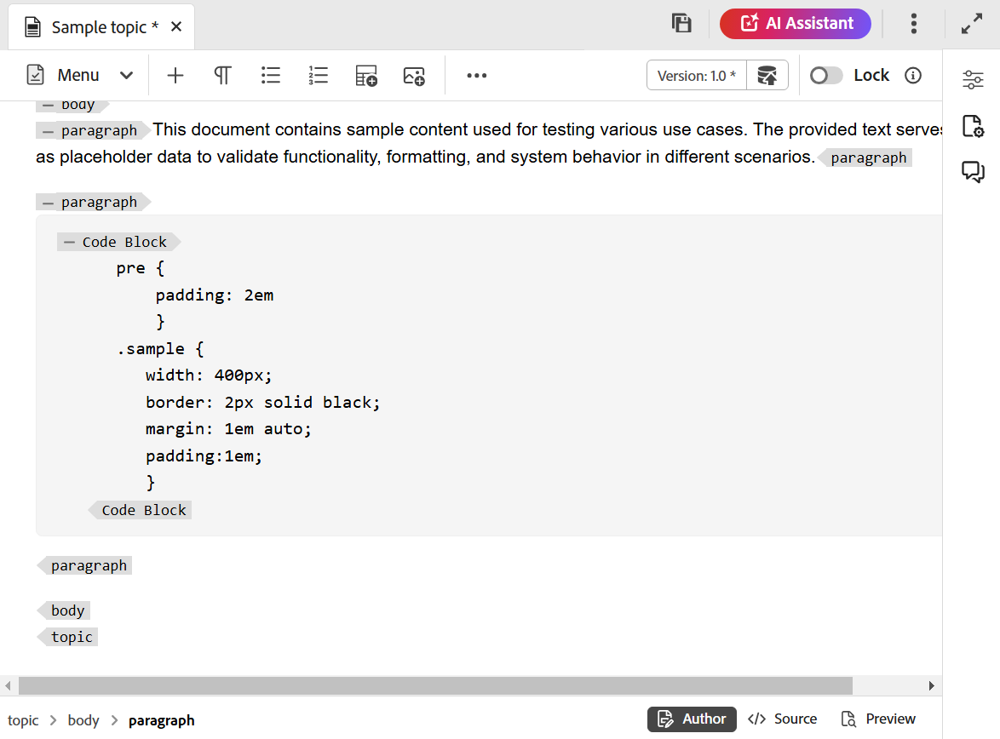

# Ytterligare funktioner i Editor {#id2056B0B0YPF}

Det finns några andra användbara funktioner i Editor som du kan använda för att:

**Snabbmenyfunktioner på en fils flik**

När du öppnar en fil i Redigeraren kan du utföra olika åtgärder på snabbmenyn. Du kan visa olika alternativ beroende på om du öppnar en mediefil, en DITA-fil eller flera filer.

**Mediefil**

Du får följande funktioner på snabbmenyn för en öppnad mediefils flik:

{width="300" align="left"}

**En DITA-fil**

Du får följande funktioner på snabbmenyn för en öppen fils flik:

{width="400" align="left"}

**Flera filer**

När du har flera filer öppna får du fler alternativ på snabbmenyn:

{width="550" align="left"}

De olika alternativen på snabbmenyn förklaras nedan:

***Spara***: Du kan välja bland följande alternativ:

- **Spara**: Om du vill spara en fil utan att skapa en ny version väljer du **Spara**. När du skapar ett nytt ämne skapas en versionslös arbetskopia av ämnet i DAM. När du sparar dokumentet uppdateras arbetskopian av dokumentet i DAM. När du sparar en version på ett enkelt sätt skapas ingen ny version av ett ämne. Om ditt ämne är under granskning kan inte dina granskare få åtkomst till det ändrade ämnesinnehållet om du sparar ett ämne.

- **Spara alla**: Om det finns flera dokument öppna i redigeraren får du även ett alternativ för att **Spara alla** öppnade dokument.

***Spara som ny version***

Om du vill skapa en ny version av filen väljer du **Spara som ny version**. Mer information om **Spara** och **Spara som ny version** finns i [Känn till redigeringsfunktionerna](web-editor-features.md#).

***Kopiera***: Du kan välja bland följande alternativ:

- **Kopiera UUID**: Om du vill kopiera UUID för den aktiva filen till Urklipp väljer du **Kopiera \> Kopiera UUID**.
- **Kopiera sökväg**: Om du vill kopiera den fullständiga sökvägen för den aktiva filen till Urklipp väljer du **Kopiera \> Kopiera sökväg**.

***Hitta i***: Du kan välja bland följande alternativ:

- **Karta**: Om du har öppnat en stor DITA-karta och vill hitta den exakta platsen för en fil på kartan väljer du **Hitta i \> Karta**. När du väljer alternativet Hitta i karta, placeras filen \(från vilken alternativet anropas\) och markeras i karthierarkin. Om du vill kunna använda den här funktionen måste du öppna kartfilen i Redigeraren. Om Kartvyn är dold visas kartvyn när funktionen anropas och filen markeras i karthierarkin.

- **Databas**: På samma sätt som Sök i karta visar **Hitta i \> databas** platsen för filen i databasen \(eller DAM\). Databasvyn öppnas och den valda filen markeras i databasen. Om filen finns i en mapp utökas den mappen så att den visar den valda filens plats i databasen.

***Lägg till i***: Du kan välja bland följande alternativ:

- **Samlingar**: Om du vill lägga till den markerade filen i samlingar väljer du **Lägg till i \> Samlingar**. Mer information finns i funktionsbeskrivningen för **samlingar** i avsnittet [Vänster panel](web-editor-features.md#left-panel).

- **Återanvändbart innehåll**: Om du vill kopiera den markerade filen till listan över återanvändbart innehåll väljer du **Lägg till i \> Återanvändbart innehåll**. Mer information finns i funktionsbeskrivningen för **Återanvändbart innehåll** i avsnittet [Vänster panel](web-editor-features.md#left-panel).

***Egenskaper***

Om du vill visa AEM-egenskapssidan för den markerade filen väljer du **Egenskaper**.

***Dela***: Du kan välja mellan följande alternativ:

**Upp, Ned, Vänster eller Höger**

Som standard kan du visa ett avsnitt i taget i Redigeraren. Det kan finnas tillfällen då du vill visa två eller flera ämnen samtidigt. Genom att dela redigerarens skärm kan du visa flera ämnen samtidigt. Om du till exempel har två ämnen - A och B öppnade i redigeraren. Om du högerklickar på ämnet B och väljer **Dela \> Uppåt** delas redigeringsfönstret upp i två delar. Ämne B visas i den övre halvan och ämne A visas i den nedre halvan. Du kan också dela skärmen vågrätt genom att välja **Dela \> Vänster** eller **Dela \> Höger**. Du kan flytta dokument från en skärm till en annan genom att dra filfliken och släppa den på skärmen där du vill placera den. På samma sätt kan du ändra ordning på filflikarna genom att dra och flytta dem som du vill.

<!--------------------------------------------

***Quick Generate***

Generate the output for the selected file. Output can be generated only for files that are a part of an output preset. For more details, view [Article-based publishing from the Web Editor](web-editor-article-publishing.md#id218CK0U019I).

--->

***Stäng***: Du kan välja bland följande alternativ:

**Stäng**, **Stäng andra** eller **Stäng alla**

Om du vill stänga filen som du anropade snabbmenyn från väljer du **Stäng \> Stäng**. Använd **Stäng \> Stäng andra** om du vill stänga alla andra öppna filer förutom den aktiva filen. Om du vill stänga alla öppna filer väljer du alternativet **Stäng \> Stäng alla** på snabbmenyn eller också kan du välja att stänga redigeraren. Om det finns filer som inte har sparats i sessionen uppmanas du att spara dessa filer.

**Stäng och spara scenarier**

När du försöker stänga en fil som har öppnats i Redigeraren med knappen **Stäng** på filens flik eller med alternativet **Stäng** på Alternativ-menyn ber Experience Manager Guides dig att spara ändringarna och låsa upp en låst fil.

Frågorna baseras på följande konfigurationer som valts av administratören:

- **Be om upplåsning vid stängning:** Du kan låsa upp filen \(som du har låst\) när du stänger redigeraren.
- **Be om en ny version när du stänger**: Du kan välja att spara filen \(som du har redigerat\) som en ny version när du stänger redigeraren.

Hur du sparar filer beror på följande tre scenarier:

- Har inte gjort några ändringar i innehållet.
- Redigerade innehållet och sparade ändringarna.
- Innehållet har redigerats men ändringarna har inte sparats.

Du kan visa följande alternativ beroende på om filen är låst/olåst och har sparade eller osparade ändringar:

- **Lås upp och stäng**: Lås upp filen och filen stängs.
- **Spara som ny version**: Detta sparar ändringarna som du har gjort i innehållet och skapar en ny version av filen. Du kan också lägga till etiketter och kommentarer för den nyligen sparade versionen. Mer information om hur du sparar en ny version finns i [Spara som ny version](web-editor-features.md#save-as-new-version).

- **Lås upp filen**: Om du väljer att låsa upp en fil kommer den att låsa upp filen och ändringarna sparas i den aktuella versionen av filen.

  >[!NOTE]
  >
  > Om du avmarkerar alternativet att låsa upp filen får du också ett alternativ för att stänga filen utan att spara ändringarna.

  Till exempel visas en av uppmaningarna på följande skärmbild:

  {width="400" align="left"}

**Visuella Cues för brutna referenser**

Om ditt ämne innehåller brutna korsreferenser eller innehållsreferenser visas de i röd text.

**Smart copy-paste**

Du kan enkelt kopiera och klistra in innehåll inom och mellan ämnen. Källelementets struktur bevaras på målet. Om det kopierade innehållet innehåller innehållsreferenser kopieras även dessa.

**Kom ihåg den senast bläddrade platsen**

Redigeraren innehåller en smart dialogruta för filbläddring. Redigeraren kommer ihåg den senast använda platsen när en referens eller ett innehåll infogas. Första gången du öppnar dialogrutan för filbläddring, \(via Infoga referens eller Infoga återanvänd innehåll\), flyttas du till den plats där det aktuella dokumentet sparas. Om du under samma session försöker infoga en annan referens navigerar dialogrutan för filbläddring automatiskt till den plats där du infogade den senaste referensen.

>[!NOTE]
>
> Om det gäller en bild-, ljud- eller videofil används filens plats som standard i dialogrutan för filbläddring, inte den plats som användes senast.

**Stöd för artikelbaserad publicering**

I redigeraren kan du generera utdata för ett eller flera ämnen, eller för hela DITA-kartan. Du måste skapa förinställningar för DITA-kartan och sedan enkelt generera utdata för ett eller flera ämnen. Om du har uppdaterat några avsnitt på kartan kan du även generera utdata endast för dessa ämnen från redigeraren. Mer information finns i [Artikelbaserad publicering](web-editor-article-publishing.md#id218CK0U019I).

**Stöd för markeringsdokument**

I redigeraren kan du använda Markdown-dokument \(.md\) tillsammans med DITA-dokument. Du kan enkelt skapa och förhandsgranska ett markeringsdokument i redigeraren och även lägga till det i kartfilen via DITA-kartredigeraren. Mer information finns i [Författarmarkeringsdokument från redigeraren](web-editor-markdown-topic.md#).

**Stöd för DITA-ordlisteämne**

Redigeraren stöder DITA-ordlistor som du kan infoga genom att lägga till `term`- eller `abbreviated-form`-element.

**Infoga MathML-ekvationer**

Experience Manager Guides har ett körklart stöd för att infoga MathML-ekvationer genom integrering med [MathType Web](https://docs.wiris.com/en/mathtype/mathtype_web/intro) -programmet. Om du vill infoga en MathML-ekvation väljer du ikonen **Element** och skriver mathml. När du väljer matematiska element i listan visas dialogrutan **Infoga MathML**:

{width="550" align="left"}

Skapa ekvationen med MathML ekvationsverktyg och välj **Infoga** för att lägga till den i dokumentet. Ekvationen infogas med ljusgrå bakgrund.

Du kan när som helst uppdatera en ekvation genom att högerklicka på en befintlig ekvation och välja **Redigera MathML** på snabbmenyn.

- **Validering av ekvationer i MathML Editor**

  Experience Manager Guides validerar MathML ekvationer när du sparar ett ämne som innehåller dem.
När du infogar en ekvation med MathML Editor markeras ekvationen i rött om det finns syntaxproblem i Experience Manager Guides. Du kan korrigera det innan du infogar det. Om du inte gör några ändringar men väljer **Infoga** visas en varning.

  {width="400" align="left"}

  Om du infogar den MathML-ekvation som innehåller ett syntaxfel inträffar ett valideringsfel när du försöker spara ämnet.

**Infoga fotnoter**

Infoga fotnot i innehållet med elementet `fn`. I redigeringsläget visas fotnotens värde i linje med innehållet. När du byter förhandsgranskningsläge eller publicerar dokumentet visas dock fotnoten i slutet av avsnittet.

**Byt namn på eller ersätta ett element**

Elementets vägbeskrivningar visas längst ned till vänster i avsnittet. Om du vill byta ut eller ersätta ett element mot ett annat element kan du göra det på snabbmenyn för vägbeskrivningsfilen. Du kan till exempel växla elementet `p` med `note` eller något annat giltigt element i kontexten.

{width="400" align="left"}

Högerklicka på namnet på ett element som du vill ersätta på sidlisten och välj sedan Byt namn på element på snabbmenyn. I dialogrutan Byt namn på element visas alla giltiga element som är tillåtna på den aktuella platsen. I dialogrutan Ändra namn på element markerar du det element som du vill använda. Det ursprungliga elementet ersätts med det nya elementet.

Förutom snabbmenyn för den synliga sökvägen kan du även öppna dialogrutan Byt namn på element från andra platser:

- Markera elementnamnet på den synliga sökvägen för att markera innehållet i elementet och högerklicka på det markerade innehållet för att visa snabbmenyn.

- Aktivera taggvyn, markera öppningstaggen för ett element och högerklicka sedan på det markerade innehållet för att visa snabbmenyn.

- Du kommer åt dialogrutan Byt namn på element genom att öppna Alternativ-menyn för ett element på panelen Kontur.

**Radbryt ett element**

- När du kapslar ett element kan du lägga till en elementtagg i den markerade texten. Du kan radbryta texten till vilket underordnat element som helst enligt DITA-standarder. Om du till exempel har text under ett `note`-element kan du kapsla in texten i ett `p` -element.

- Alternativet **Radbryt element** är tillgängligt på snabbmenyn för avsnittets vägbeskrivningar. Om du vill kapsla in ett element högerklickar du på elementet och öppnar snabbmenyn. Markera elementet i dialogrutan **Radbryt element**. Texten visas i det nya elementet.

- Du kan också markera texten eller elementet i innehållet och sedan välja alternativet **Radbryt element** på snabbmenyn.

**Dela upp ett element**

Om du tar bort ett element kan du ta bort elementtaggen från den markerade texten och sammanfoga den med det överordnade elementet. Om du till exempel har ett `p`-element i ett `note` -element kan du dela upp `p`-elementet och sammanfoga texten direkt i `note` -elementet. Alternativet **Bryt upp element** är tillgängligt på snabbmenyn för avsnittets synliga del. Om du vill dela upp ett element högerklickar du på elementet för att öppna snabbmenyn och väljer sedan **Dela upp element** för att ta bort elementet och sammanfoga elementets text med dess överordnade element.

**Hantering av tomt utrymme för DITA-element**

I XML-format innehåller blanksteg, tabbar, radbrytningar och tomma rader. Experience Manager Guides konverterar flera efterföljande blanksteg till ett blanksteg. Detta gör att du kan bevara WYSIWYG-vyn i Redigeraren.

    >[!OBS!]
    >
    >I vissa element där blanksteg måste bevaras enligt DITA-reglerna behålls de flera efterföljande blankstegen. T.ex. `&lt;pre>` och `&lt;codeblock>`-element.

**Bevarar radbrytningar och indrag**

DITA-element som innehåller radbrytningar och blanksteg stöds och återges enligt definitionen i redigeringsläget, Source- eller förhandsgranskningsläget samt i det slutliga publicerade resultatet. På följande skärmbild visas innehållet i elementet `msgblock` där radbrytningarna och mellanrummen \(indrag\) har bevarats:

{align="left"}

**Hantera fasta mellanslag i redigeraren**

- Du kan infoga fasta mellanslag i dokumentet med hjälp av ikonen **Symbol**  eller kortkommandona **Alt** + **Blanksteg** .  Dessa fasta mellanslag visas som en indikator när du redigerar ett ämne i redigeraren. Du kan inaktivera visningen av fasta mellanslag med alternativet **Visa fasta mellanslag i redigeringsläget** på fliken **Utseende** i [Användarinställningar](./intro-home-page.md#user-preferences).

- Om du kopierar och klistrar in innehåll med fast mellanslag från externa källor i vyn **Författare** konverteras det fasta utrymmet till ett mellanslag.
Om du kopierar och klistrar in innehåll med fast mellanslag från vyn **Författare** bevaras det.

**Generera element-ID automatiskt**

Du kan automatiskt generera ID:n för elementen i ditt DITA-avsnitt. Dessa ID:n är unika inom ett DITA-avsnitt. Om du till exempel genererar ID:n för ett styckeelement kommer ID:n att vara p\_1, p2, p\_3 och så vidare. Du kan välja flera element och generera ID:n för varje markerat element.

Gör följande för att automatiskt generera ID för ett eller flera element:

1. Öppna ämnet i Redigeraren.
1. Markera innehållet som du vill tilldela ID:n till.
1. Högerklicka och välj **Generera ID:n** på snabbmenyn.

   Du kan också högerklicka i vägbeskrivningsfilen och välja **Generera ID**.

**Överordnat ämne:**[ Introduktion till redigeraren](web-editor.md)
