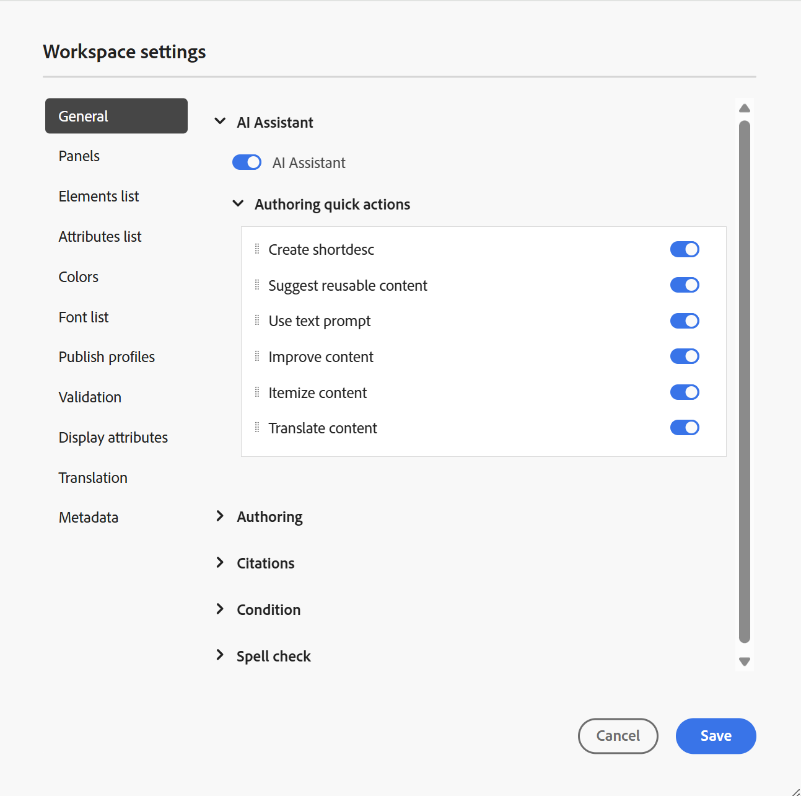

# Workspace-inställningar

Alternativet **Workspace-inställningar** som finns i [flikfältet](./web-editor-tab-bar.md) i redigeraren är bara tillgängligt för administratörer och mappprofiladministratörer och tillåter konfigurering av följande inställningar:

- [Allmänt](#general)
- [Panel](#panels)
- [Elementlista](#elements-list)
- [Attributlista](#attributes-list)
- [Färger](#colors)
- [Publicera profiler](#publish-profiles)
- [Validering](#validation)
- [Visningsattribut](#display-attributes)
- [Översättning](#translation)
- [Metadata](#metadata)

>[!NOTE]
>
> Om du uppdaterar några standardinställningar bör du öppna dokumenten på nytt för att ändringarna ska börja gälla.

## Allmänt

Med de allmänna inställningarna kan du konfigurera inställningarna så att de använder redigeraren. Fliken innehåller fem avsnitt: **AI Assistant**, **Redigering**, **Källhänvisningar**, **Villkor** och **Stavningskontroll**.

{width="350" align="left"}

- **AI-assistenten**
Välj det här om du vill aktivera funktionen [&#x200B; AI-assistenten &#x200B;](./ai-assistant.md) i Experience Manager Guides. Avmarkera om du vill inaktivera funktionen.

  När du har aktiverat växeln **AI Assistant** kan du konfigurera vilka alternativ som ska visas under **redigeringsfliken** för författare med hjälp av menyn **Snabbåtgärder för redigering** som visas nedan.\
  De här ändringarna gäller för den specifika mappprofil som du arbetar med. Om du skapar en ny mappprofil ärver den Workspace-inställningarna som definierats i mappprofilen **Global** som standard. Du kan ändra inställningarna efter behov med **Workspace-inställningarna** och spara den uppdaterade konfigurationen.\
  En detaljerad översikt över de tillgängliga alternativen för redigering med hjälp av AI Assistant finns i [Skapa dokument smart med AI Assistant](./ai-assistant-right-panel.md).

  På menyn **Snabbåtgärder för redigering** kan du:

   - Använd reglagen för att aktivera eller inaktivera specifika alternativ som författare kan komma åt när de arbetar med AI Assistant.

   - ändra den ordning i vilken alternativen visas, dra och släpp dem efter behov.

  {width="350" align="left"}

- **Redigering**

   - **Aktivera Ersätt alla**: Markera det här alternativet om du vill visa ikonen **Ersätt alla** på panelen **Sök och ersätt**.

- **Citat**

  Ändra format på citat. Välj den källstil i listrutan som du vill använda i ditt projekt. Mer information finns i [Ändra källhänvisningsformat](./web-editor-apply-citations.md#change-citation-style).

- **Villkor**

   - **Markera villkorlig text i redigeringsvyn**: Markera det här alternativet om du vill markera den villkorliga texten i författarvyn. Villkorsinnehållet markeras med den färg som är definierad för villkoret.

   - **Validera med villkorsattribut**: Välj det här om du vill tillåta validering av de värden som definierats för attributen. Detta förhindrar att du lägger till felaktiga värden.

   - **Visa nyckel med titeln på panelen Ämnesschema**: Välj det här om du vill visa nycklarna tillsammans med rubrikerna i ämnesschemat. Om du inte väljer det här alternativet visas bara rubrikerna. Här visas till exempel nycklarna &#39;os&#39;, &#39;målgrupp&#39; och &#39;other&#39; tillsammans med titlarna.

     {width="550" align="left"}

   - **Visa ämnesschema på villkorspanelen**: Välj det här om du vill visa ett ämnesschema på villkorspanelen. Om du avmarkerar detta visas de definierade villkoren på villkorspanelen.

- **Stavningskontroll**
Det finns två alternativ: **AEM stavningskontroll** och **webbläsarstavningskontroll** . Som standard används stavningskontrollen i webbläsaren, där stavningskontrollen utförs med webbläsarens inbyggda ordlista. Du kan växla till AEM stavningskontroll om du vill använda Adobe Experience Manager ordlista, som också kan anpassas för att lägga till din egen ordlista. Mer information om hur du anpassar AEM-ordlistan finns i avsnittet [Anpassa AEM standardordlista](../cs-install-guide/customize-aem-custom-dictionary.md) i Installera och konfigurera Adobe Experience Manager Guides as a Cloud Service.

## Panel

Den här inställningen styr panelerna som visas på den vänstra och högra panelen i redigeraren och kartkonsolen. Du kan växla knappen för att visa eller dölja den önskade panelen.

{width="650" align="left"}

Du kan också ange i vilken ordning funktionerna i panelerna ska visas. Om du vill ändra standardordningen för de tillgängliga funktionerna på panelerna markerar du de prickade fälten för att dra och släppa funktionstabbarna på önskad plats. En funktion kan också flyttas från avsnittet **Mer** till huvudavsnittet på en panel, och tvärtom enligt kraven. När du har ändrat ordningen visas funktionerna i samma sekvens på respektive höger- och vänsterpanel.

{width="650" align="left"}

Högst åtta paneler kan visas samtidigt. Alla ändringar som görs i panelinställningarna tillämpas omedelbart.

>[!NOTE]
>
> Om en anpassad panel har konfigurerats visas den också i listan med paneler. Du kan växla om du vill visa eller dölja den anpassade panelen.

## Elementlista

Som administratör kan du styra listan med element som en författare kan infoga i en fil och även definiera elementets visningsnamn. Med Elements-listinställningen kan du ange elementets namn enligt DITA-specifikationerna och en etikett som du vill använda i stället för det DITA-definierade elementnamnet:

{width="650" align="left"}

I skärmbilden ovan har elementet `p` fått etiketten Stycke och `codeblock` får etiketten Kodblock tillsammans med några andra element. Om du väljer alternativet **Använd endast ovanför element** visas endast de giltiga elementen \(vid den aktuella insättningspunkten\) i listan i dialogrutan **Infoga element**.

I skärmbilden nedan visas endast 3 av 4 konfigurerade element från den föregående skärmbilden i det aktuella sammanhanget:

{width="300" align="left"}

## Attributlista

På samma sätt som elementlistan kan du styra listan med attribut och deras visningsnamn som ska visas i attributlistan för ett element. På följande skärmbild har bara tre attribut konfigurerats för att visas i ett elements attributlista:

{width="650" align="left"}

När du försöker lägga till ett attribut i ett element med den här inställningen visas bara listan med attribut som konfigurerats i listan.

{width="300" align="left"}

## Färger

Visar en lista med förkonfigurerade bakgrundsfärger för **Villkor**. Användarna kan välja en bakgrundsfärg när de använder ett villkor i ett ämne. Som administratör kan du även skapa och lägga till egna bakgrundsfärger i listan. Om du vill lägga till en ny färg anger du önskat namn i fältet **Färgnamn**, väljer en egen färg och väljer ikonen **+** . Den anpassade färgen visas i slutet av färglistan.

## Publicera profiler

Detta innehåller de profiler som kan användas för att publicera **kunskapsbasen** -utdata. Du kan skapa en ny profil för en målkunskapsbas. Exempel: Salesforce eller ServiceNow.

**Skapa en Salesforce-profil**

**Förutsättningar**

- Skapa en ansluten app för Salesforce. Mer information finns i [Aktivera OAuth-inställningar för API-integrering](https://help.salesforce.com/s/articleView?id=sf.connected_app_create_api_integration.htm&type=5).

- När du konfigurerar den anslutna appen ska du se till följande:

   - Ange återanropet.

     `URL: http://<server name>:<port>/bin/dxml/thirdparty/callback/salesforce`

   - Välj följande OAuth-scope:
      - Fullständig åtkomst (fullständig)
      - Välj Hantera användardata via API (api)

     När appen har konfigurerats tillhandahåller Salesforce en **konsumentnyckel** och **konsumenthemlighet**. Dessa kan användas för att skapa Salesforce-profilen.

   - Om du vill skapa en Salesforce-profil väljer du **Salesforce** kunskapsbas i listrutan **Servertyp** . Ange ett profilnamn. Ange den konsumentwebbplats som du skulle använda för att publicera utdata i URL:en för **platsen** och lägg sedan till **konsumentnyckeln** och **konsumenthemligheten** från Salesforce konsumentwebbplats. **Validera** och **Spara** den nya profilen.

     {width="550" align="left"}

     >[!NOTE]
     >
     >Om du vill konfigurera en proxy för Salesforce i Experience Manager Guides använder du Apache HTTP Components Proxy Configuration i AEM. Lär dig hur du [konfigurerar proxy för AEM Link Checker](https://helpx.adobe.com/experience-manager/kb/How-to-configure-proxy-for-the-AEM-Link-Checker-AEM.html).

**Skapa en ServiceNow-profil**

**Förutsättningar**

Konfigurera ServiceNow-servern för överföring av resurserna.

- Anslut till **ServiceNow**-servern.
- Navigera till **Systemegenskaper** > **Säkerhet**.
- Avmarkera följande alternativ:

  **Den här egenskapen måste vara inställd för att aktivera MIME-typkontroll för överföringar (alla versioner, Eureka och senare). Aktiverar (true) eller inaktiverar (false) MIME-typvalidering för de bifogade filerna. Filtillägg som konfigurerats via glide.attachment.extensions kontrolleras för MIME-typ under överföring.**

- Välj **Spara**.

  Skapa profilen **ServiceNow** när du har konfigurerat appen.

- Om du vill skapa en profil väljer du ServiceNow Knowledge Base i listrutan **Servertyp**. Ange profilen **Namn**. I **ServiceNow URL** anger du den konsumentwebbplats som du skulle använda för att publicera utdata och lägger sedan till **Användarnamn** och **Lösenord** från ServiceNow-konsumentwebbplatsen. **Validera** och **Spara** den nya profilen.

  {width="550" align="left"}

  När du har validerat kan du välja publiceringsprofilen i utdataförinställningarna för en DITA-karta och använda den för att generera utdata till den **Salesforce** - eller **ServiceNow** -server som du har valt.

  Läs mer om förinställningen för [kunskapsbas](../user-guide/generate-output-knowledge-base.md)-utdata.

## Validering

Fliken innehåller alternativ för att konfigurera schematrons valideringar i Redigeraren. Du kan aktivera följande funktioner:

- **Kör verifieringskontrollen innan du sparar filen**: Välj det här alternativet om du vill köra schematron-verifieringar med de valda Schematron-filerna innan någon sparåtgärd utförs. Du kan lägga till en Schematron-fil genom att välja ikonen +. De valda schematrons-filerna visas.

  >[!NOTE]
  >
  > De markerade schematrons-filerna behålls för den valda mappprofilen.

  {width="550" align="left"}

  Detta förhindrar att användarna sparar filer som bryter en regel som definierats i de valda Schematron-filerna. Om detta inte är markerat kommer filen inte att valideras innan ändringarna sparas.

- **Tillåt alla användare att lägga till schematronfiler på valideringspanelen**: Välj det här om du vill tillåta användarna att lägga till schematronfiler på valideringspanelen i redigeraren. Detta gör att användarna kan lägga till Schematron-filer och sedan validera ämnena mot Schematron-filen. Om detta inte är markerat är alternativet att lägga till schematronfilen **Lägg till schematronfil** inte tillgängligt för användarna på **valideringspanelen** i redigeraren.

## Visningsattribut

Precis som i attributlistan kan du styra listan med attribut som ska visas i attributlistan för ett element. Som standard har fyra **visningsattribut** - målgrupp, plattform, produkt och uttryck konfigurerats för att visas i ett elements attributlista. Du kan också lägga till ett visningsattribut med ikonen **Lägg till** högst upp. Du kan också ta bort alla visningsattribut med ikonen **Ta bort** .

De attribut som är definierade för ett element visas i layoutvyn och dispositionsvyn.

{width="550" align="left"}

## Översättning

Fliken innehåller alternativ för att skapa språkgrupper, sprida källetiketterna till målversionen och rensa översättningsprojektet.

{width="550" align="left"}

- **Språkgrupper**: Som administratör kan du skapa en grupp med språk och använda dem som en uppsättning för att översätta innehållet.

  Så här skapar du en ny språkgrupp:

   1. Välj **Lägg till**.
   1. Ange språkgruppsnamnet. Varje språk ska ha ett unikt namn. Du kan visa ett fel om namnfältet är tomt eller om namnet inte är unikt.
   1. Välj språk i listrutan. Du kan välja flera språk.

      Skriv de första tecknen i språket eller språkkoden för att filtrera de önskade språken. Skriv t.ex. &#39;en&#39; om du vill filtrera alla språk som innehåller &#39;en&#39; i början av namnet eller koden.

   1. Välj ikonen Klar om du vill lägga till de valda språken i gruppen. Språken visas. När du lägger till tre eller fler språk visas alternativet **Visa fler**. Du kan välja **Visa mer** om du vill visa alla språk som finns i gruppen.

      >[!TIP]
      >
      > Växla **Visa mer** till **Visa mindre** och visa endast ett fåtal språk.

   1. Håll markören över språken i en grupp om du vill redigera  eller ta bort  språkgrupperna.
   1. Spara **inställningarna**.

      >[!NOTE]
      >
      >Som användare kan du visa språkgrupperna som är konfigurerade för din mappprofil.

- **Sprid källversionsetiketter till målversionen**: Välj det här alternativet om du vill skicka etiketten för källfilsversionen till den översatta filen. Som standard är detta inaktiverat.
- **Rensning av översättningsprojekt efter slutförande**: Välj det här alternativet om du vill konfigurera översättningsprojekten så att de inaktiveras eller tas bort automatiskt efter översättningen. Som standard är **Inget** markerat, så att projektet finns efter översättning.

  Du kan inaktivera översättningsprojekten om du vill använda dem senare. Om du tar bort ett projekt tas alla filer och mappar i projektet bort permanent.

## Metadata

Du kan styra metadata för versionen av ämnet och deras värden som ska visas i dialogrutan **Versionshistorik**.  Ange platsen för de noder som du vill hämta metadata från i metadatasökvägen. Du kan också definiera ett anpassat namn för metadata som etikett. Standardegenskaperna är Titel, Dokumenttillstånd och Taggar.

Metadata kan hämtas från alla egenskaper under objektets `/jcr:content`-nod, så du kan lägga till egenskapens sökväg som metadatasökväg.

Ett fel visas om metadatasökvägen är tom. Om du lämnar etiketten tom väljs det sista elementet som etikett.

{width="550" align="left"}

*Konfigurera metadata för dialogrutan **Versionshistorik**.*

Du kan också definiera i vilken ordning dessa metadatataggar ska visas. Om du vill ändra standardordningen för de här märkorden markerar du de prickade strecken för att dra och släppa märkorden på önskad plats.
Metaetiketterna visas i samma sekvens i dialogrutan **Versionshistorik** i redigeraren.

**Överordnat ämne:**&#x200B;[&#x200B; Introduktion till redigeraren](web-editor.md)
