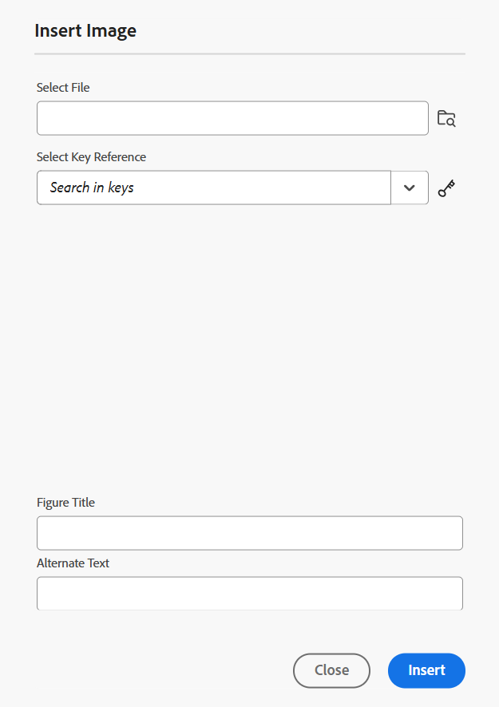

# Verktygsfältet i Redigeraren

Verktygsfältet visas när du öppnar ett ämne eller en karta för redigering i Editor. Följande funktioner är tillgängliga i verktygsfältet:

- [Meny-listruta](#menu-dropdown)
- [Alternativ för att infoga innehåll](#content-insertion-options)
- [Versionsinformation och knappen Spara som ny version](#version-information-and-save-as-new-version)
- [Lås/lås upp](#lockunlock)

>[!NOTE]
>
> Funktionerna ovan gäller endast ämnesfiler. När du arbetar med en kartfil visas olika alternativ i verktygsfältet baserat på den aktuella kartredigeringsvyn. Läs mer om alternativen i verktygsfältet för kartredigering i [Karteditordokumentet](./map-editor-advanced-map-editor.md).

## Meny-listruta

Menyn ger åtkomst till redigeringsåtgärderna Sök och ersätt, Versionshistorik, Versionsetikett, Sammanfoga, Skapa granskning, Spåra ändringar och Taggar.

Den detaljerade förklaringen till dessa funktioner är följande:

**Redigerar åtgärder**

När du redigerar ett ämne i Redigeraren kan du få åtkomst till olika redigeringsåtgärder, till exempel **Klipp ut** eller ***Ctrl***+***X*** , **Kopiera** eller ***Ctrl***+***C*** , **Ångra** eller ***Ctrl***+***}Z*** , **Gör om** eller ***Ctrl***+***Y*** och **Ta bort** som finns i listrutan Meny.

**Sök och ersätt**

Funktionen **Sök och ersätt** är tillgänglig i redigeringsläge och Source-visningsläge. När alternativet är aktiverat visas textfältet Sök och ersätt längst ned i ämnesredigeringsområdet. Du kan använda kortkommandona **CTRL**+**F** för att aktivera fältet Sök och ersätt.

{align="left"}

Med inställningsikonen \(\) kan du växla sökalternativen **Ignorera skiftläge** och **Endast hela ord**. Om du vill utföra en skiftlägesokänslig sökning aktiverar du \(eller väljer\) alternativet **Ignorera skiftläge**. Annars, om du vill utföra den skiftlägeskänsliga sökningen, stänger du av \(eller avmarkerar\) alternativet **Ignorera skiftläge**. Du kan också söka efter ett helt ord.

Sökningen sker omedelbart, vilket innebär att när du skriver sökfrasen eller ordet i fältet **Sök** så söks termen igenom omedelbart och väljs i avsnittet. Om du vill ersätta en text i ett ämne anger du söktermen och dess ersättning i respektive fält och väljer knappen **Ersätt** eller **Ersätt alla** .

I Source-vyn är funktionen **Sök och ersätt** mycket användbar när du söker efter ett visst element eller attribut. Om du till exempel vill ersätta värdet för attributet `@product` kan du enkelt göra det från Source-vyn. I redigeringsvyn kan du inte söka baserat på ett attribut eller element. Du måste dock vara försiktig när du använder funktionen **Ersätt alla** eftersom den kan skriva över XML-koden.

**Versionshistorik**

Med funktionen **Versionshistorik** i redigeraren kan du kontrollera vilka versioner av dina DITA-filer som är tillgängliga, jämföra dem och återställa till valfri version från redigeraren. Du kan jämföra innehåll och metadata för den aktuella versionen (som också kan vara en arbetskopia) med en tidigare version av samma fil. Du kan också visa etiketter och kommentarer för de jämförda versionerna.

>[!NOTE]
>
> Alternativen för versionshistorik visas bara om det finns ändringar i den första versionen av ämnet eller kartan.

    
 Steg för att komma åt versionshistoriken 

1. Öppna ett ämne i Redigeraren.
1. Välj **Versionshistorik** i listrutan **Meny**.

   Dialogrutan **Versionshistorik** visas.

   {width="550" align="left"}

   *Förhandsgranska ändringarna i olika versioner av ett ämne.*

1. Välj en version av ämnet som du vill jämföra eller återgå till i listrutan **Jämför med**.

   >[!NOTE]
   >
   > Om en version har etiketter som används på den visas de också \(inom hakparenteser\) tillsammans med versionsnumret.

1. Aktivera alternativet **Visa etiketter och kommentarer** om du vill visa etiketter och kommentarer som används för den aktuella versionen och den jämförda versionen.
1. Du kan även visa följande information i dialogrutan **Versionshistorik**:

   Fliken **Förhandsgranska**: Det nya innehållet är i grönt teckensnitt och det borttagna innehållet är i rött teckensnitt.

   Fliken **Metadata**: De nya metadata som har lagts till är i grönt teckensnitt och de borttagna metadata är i rött teckensnitt.

   {width="550" align="left"}

   *Jämför metadata för olika versioner i versionshistoriken.*

   >[!NOTE]
   >
   > Systemadministratören kan ändra de metadata som ska visas på fliken Metadata i **Inställningar**. Mer information finns i avsnittet **Fler åtgärder** i [flikfältet](./web-editor-tab-bar.md).

   Du kan även visa användar- och tidsinformation för den aktuella och den jämförda versionen.

   När du har valt en version i listrutan är alternativet **Återgå till markerad version** tillgängligt. I förhandsvisningsfönstret visas skillnaderna mellan den aktuella versionen och den valda versionen av ämnet.

1. Välj **Återgå till markerad version** om du vill återställa arbetskopian med den valda versionen av ämnet.

   Dialogrutan Återställ version visas.

   {width="550" align="left"}

1. \(*Valfritt*\) Ange en orsak till att du återgår till en tidigare version. Du kan också skapa en ny version av den aktiva arbetskopian av ditt ämne.

1. Välj **Bekräfta**.

   Arbetskopian av filen återställs till den valda versionen. Om du väljer att skapa en ny version av den aktiva arbetskopian skapas även en ny version av filen med alla arbetsändringar.

   När du återgår till en tidigare version visas en visuell indikation på att den version du arbetar med för närvarande inte är den senaste versionen.

   {align="left"}

**Versionsetiketter**

Etiketter hjälper dig att identifiera i vilken fas ett visst ämne finns i DDLC \(Document Development Life Cycle\). När du till exempel arbetar med ett ämne kan du ange etiketten som &quot;Godkänd&quot;. När ett ämne har publicerats och gjorts tillgängligt för kunder kan du tilldela rubriken&quot;Släppt&quot; etikett.

I Experience Manager Guides kan du ange etiketter i ett frihandstextformat eller använda en uppsättning fördefinierade etiketter. Med den anpassade etiketten kan alla författare i systemet ange en etikett efter eget val. Detta ger flexibilitet, men medför inkonsekventa etiketter i systemet. För att lösa problemet kan administratörer konfigurera en uppsättning fördefinierade etiketter. Mer information om hur du konfigurerar fördefinierade etiketter finns i *Konfigurera och anpassa XML-webbredigeraren* i Installera och konfigurera Adobe Experience Manager Guides as a Cloud Service.

Dessa etiketter visas i en nedrullningsbar lista för författare där de behöver ange en etikett. Detta garanterar att endast fördefinierade, konsekventa etiketter används i systemet.

Det finns olika metoder som du kan använda för att använda etiketter i dina ämnen - panelen [Versionshistorik](web-editor-use-label.md) i Assets-gränssnittet, användargränssnittet för [baslinjer](/help/product-guide/user-guide/generate-output-use-baseline-for-publishing.md) och redigeraren. Funktionen Versionsetikett i redigeraren är ett snabbt och enkelt sätt att tilldela etiketter till ämnen.

    
 Steg för att lägga till etiketter i ämnet från Redigeraren 

1. Öppna ett ämne i Redigeraren.

1. Välj **Versionsetiketter** i listrutan Meny.

   Dialogrutan Hantering av versionsetiketter visas.

   {width="350" align="left"}

   Dialogrutan Hantering av versionsetiketter är uppdelad i två delar - den vänstra panelen har en lista över tillgängliga versioner för ämnet tillsammans med listrutan Etikett \(eller en textruta där du kan ange en etikett\) och den högra panelen med en förhandsgranskning av ämnet.

1. Välj den version som du vill använda etiketter på.

   När du väljer en annan version av ämnet från versionslistan visas ändringarna mellan den aktuella versionen och den valda versionen av ämnet på förhandsvisningspanelen

   >[!NOTE]
   >
   > Om en etikett redan används för en version visas den bredvid versionsnumret i listrutan och nedanför listan Välj version. Du kan ta bort en befintlig etikett genom att markera ikonen \(**x**\) bredvid etiketten.

1. Om administratören har definierat en lista med etiketter visas en nedrullningsbar lista med de etiketter som du kan välja de etiketter du vill använda. Du kan välja flera etiketter i listrutan.

   Annars visas en textruta där du kan ange de etiketter du vill lägga till i ämnet.

   >[!NOTE]
   >
   > Du kan inte använda samma etikett på flera versioner av ett ämne. Om du försöker associera en befintlig etikett kan du ta bort den från den befintliga versionen och använda den på den valda versionen av ämnet.

1. Välj **Lägg till etikett**.

1. I bekräftelsemeddelandet för Använd etikett väljer du alternativet **Flytta etikett (om den används i en annan version)** om du vill flytta etiketter från en befintlig version till den valda versionen. Om du inte markerar det här alternativet och det finns etiketter som har tilldelats till en annan version av ämnet, flyttas de inte till det valda ämnets version. Sådana etiketter ignoreras i etikettprogramprocessen.

**Sammanfoga**

När du arbetar i en miljö med flera författare blir det svårt att spåra vilka ändringar de andra författarna har gjort i ett ämne eller en karta. Med sammanfogningsfunktionen får du bättre kontroll över inte bara hur ändringarna visas, utan även vilka ändringar som finns i den senaste versionen av dokumentet.

    
 Sammanfoga ämnesfiler 

Så här sammanfogar du ändringar i ett ämne:

1. Öppna ett ämne i Redigeraren.

1. Välj **Sammanfoga**.

   Dialogrutan Sammanfoga visas.

   {width="550" align="left"}

1. *\(Valfritt\)* Du kan även bläddra och välja en ny fil från en annan plats i databasen.

1. Välj en version av filen som du vill jämföra den aktuella versionen av filen med.

1. Välj:

   - **Spåra ändringar från den valda versionen**: Det här alternativet visar alla innehållsuppdateringar i form av spårade ändringar. Du kan sedan välja att acceptera eller ignorera ändringar i dokumentet en åt gången eller alla på en gång.

   - **Återgå till markerad version**: Det här alternativet återställer den aktuella versionen av dokumentet till den markerade versionen. Det här alternativet ger dig ingen kontroll över vilket innehåll som godkänns eller avvisas.

1. Välj **Klar**.

1. Om du markerade alternativet **Spåra ändringar från den valda versionen** visas alla ändringar från den valda versionen i funktionen Spåra ändringar på den högra panelen.

   Du kan välja att acceptera eller ignorera alla kommentarer från panelen Spårade ändringar eller acceptera eller ignorera enskilda kommentarer.

    
 Sammanfoga kartfiler 

Så här sammanfogar du ändringar i en kartfil:

1. Öppna en karta i Editor.

1. Välj **Sammanfoga**.

   Dialogrutan Sammanfoga visas.

   {width="550" align="left"}

1. *\(Valfritt\)* Du kan även bläddra och välja en ny fil från en annan plats i databasen.

1. Välj en version av filen som du vill jämföra den aktuella versionen av filen med.

1. Välj:

   - **Spåra ändringar från den valda versionen**: Det här alternativet visar alla innehållsuppdateringar i form av spårningsändringar. Du kan sedan välja att acceptera eller ignorera ändringar i dokumentet en åt gången eller alla på en gång.

   - **Återgå till markerad version**: Det här alternativet återställer den aktuella versionen av dokumentet till den markerade versionen. Det här alternativet ger dig ingen kontroll över vilket innehåll som godkänns eller avvisas.

1. Välj **Klar**.

1. Om du markerade alternativet **Spåra ändringar från den valda versionen** visas alla ändringar från den valda versionen på panelen Spårade ändringar \(till höger\).

   Du kan välja att acceptera eller ignorera alla ändringar på panelen Spårade ändringar eller acceptera eller ignorera enskilda ändringar i kartfilen.

**Skapa granskningsaktivitet**

Du kan [skapa en granskningsaktivitet](./review-send-topics-for-review.md) av det aktuella ämnet eller mappfilen direkt från redigeraren. Öppna filen som du vill skapa granskningsaktiviteten för och välj **Skapa granskningsaktivitet** i listrutan Meny för att starta granskningsprocessen.

**Spåra ändringar**

Du kan hålla reda på alla uppdateringar som gjorts i ett dokument genom att aktivera läget Spåra ändringar. När du har aktiverat spårändringar hämtas alla infogningar och borttagningar i dokumentet. Allt borttaget innehåll markeras med Genomstruken och alla infogningar markeras med grön text. Dessutom visas ändringsfälten vid ämnessidans kant. Återigen visas ett rött fält för borttaget innehåll och ett grönt fält visas för tillagt innehåll. Om det finns ett tillägg och en borttagning på samma rad visas både gröna och röda staplar.

I följande skärmbild markeras det borttagna och infogade innehållet tillsammans med ändringsfälten:

{width="650" align="left"}

Ett typiskt användningssätt för att spåra ändringar i ett dokument kan vara att utföra peer-granskning. Du kan aktivera spåra ändringar och dela dokumentet för granskning, och granskaren gör sedan ändringar med Spåra ändringar PÅ. När du tar emot dokumentet bör du ha en funktion för att visa de föreslagna uppdateringarna tillsammans med ett praktiskt sätt att acceptera eller ignorera ändringar.

Experience Manager Guides tillhandahåller funktionen Spårade ändringar som innehåller information om de uppdateringar som gjorts i dokumentet. Funktionen Spårade ändringar ger information om vilka uppdateringar som gjordes, vem som gjorde dem och vid vilken tidpunkt. Med funktionen Spårade ändringar kan du enkelt acceptera eller ignorera de föreslagna uppdateringarna i dokumentet.

Om du vill komma åt funktionen väljer du ikonen **Spåra ändringar** i den högra panelen.

{width="300" align="left"}

Om du väljer en spårad ändring markeras det ändrade innehållet i dokumentet. Du kan acceptera en ändring genom att markera ikonen Acceptera ändring eller ignorera den genom att välja Ignorera ändring.

Om du vill acceptera eller ignorera alla ändringar med ett enda klick väljer du **Acceptera alla ändringar** eller **Ignorera alla ändringar**.

>[!NOTE]
>
> I förhandsgranskningsläget kan du visa dokumentet med eller utan det ändrade innehållets markeringar. Mer information finns i [förhandsgranskningsläget](web-editor-views.md#preview-mode).

**Taggar**

Funktionen **Taggar** i redigeraren är en växlingsknapp som styr synligheten för DITA-element. När det här alternativet är aktiverat visas strukturella taggar i innehållet, vilket gör att du kan visa och hantera underliggande DITA-element mer effektivt. När det är inaktiverat döljs taggarna, vilket ger en renare och mer fokuserad redigeringsmiljö.

På följande skärmbild visas ett dokument med taggvyn aktiverad:

{width="650" align="left"}

Följande åtgärder kan utföras i ett dokument med taggar:

- **Markera ett element**: Markera den inledande eller avslutande taggen för ett element för att markera dess innehåll.

- **Expandera eller komprimera taggar**: Markera + eller - logga in en tagg för att utöka eller komprimera den.

- **Använd snabbmenyn**: Snabbmenyn innehåller alternativ för att klippa ut, kopiera eller klistra in det markerade elementet. Du kan också infoga ett element före eller efter det markerade elementet. Med de andra alternativen kan du generera ett ID eller öppna egenskapspanelen för det markerade elementet.

- **Dra och släpp element**: Markera ett elements tagg och dra och släpp den enkelt i dokumentet. Om släppplatsen är en giltig plats där elementet tillåts placeras elementet på släppplatsen.

>[!NOTE]
>
> Om en användare aktiverar taggvyn från redigeraren är den fortfarande aktiverad även i alla sessioner. Det innebär att du inte behöver aktivera taggvyn igen för att komma åt den senare. Standardvärdet för taggvyn för en ny användarsession bestäms av egenskapen `tagsView` i filen `ui\_config.json`. Mer information finns i avsnittet [Konfigurera standardvärde för taggvyn](../cs-install-guide/configure-default-value-tags-view.md) i Installera och konfigurera Adobe Experience Manager Guides as a Cloud Service.

## Alternativ för att infoga innehåll

**Element** - 

Infogar ett giltigt element på den aktuella eller nästa giltiga plats. Du kan också använda kortkommandot ***Alt***+***Retur*** för att öppna dialogrutan Element. Du redigerar till exempel ett stycke och i dialogrutan **Element** visas en lista med element som kan infogas i stycket. Markera elementet som du vill infoga. Du kan använda tangentbordet för att bläddra igenom elementlistan och trycka på ***Retur*** för att infoga det element som behövs.

Du kan visa två typer av giltiga element:

- **Giltiga element på den aktuella platsen**: I listan visas de element som du kan infoga på den aktuella markörplatsen.

- **Giltiga element utanför den aktuella platsen**: I listan visas de element som du kan infoga efter någon av de överordnade elementen för det aktuella elementet i elementhierarkin.

Om du till exempel befinner dig inom det infogade `<b>`-elementet kan du infoga element som `<u>`, `<xref>`, `<i>` på den aktuella platsen. Du kan däremot infoga element som `<table>` och `<topic>` utanför den aktuella platsen.

Du kan också skriva ett tecken eller en sträng i sökrutan och söka efter elementen som börjar med det.

{width="300" align="left"}

*Ange t om du vill söka efter alla giltiga element som börjar med t.*

Om du arbetar i ett blockelement som `note` använder du ikonen Infoga element för att infoga ett nytt element efter `note`-elementet. I följande skärmbild har ett anteckningselement infogats i elementet p \(stycke\):

{align="left"}

Om du trycker på Retur i anteckningselementet skapas ett nytt stycke i själva anteckningselementet. Om du vill infoga ett nytt element utanför anteckningen, markerar du p-elementet \(markerat i skärmbild\) i elementbeskrivningen och väljer sedan elementikonen eller trycker på ***Alt***+***Retur*** för att öppna dialogrutan Infoga element. Markera sedan det önskade elementet och tryck på Retur för att infoga det markerade elementet efter anteckningselementet.

Du kan också lägga till ett element mellan två element när en blinkande blockmarkör visas.

{width="300" align="left"}

Om du till exempel arbetar med ett DITA-ämne och blockmarkören blinkar mellan den korta beskrivningen och brödtexten kan du lägga till elementet `prolog` och sedan lägga till copyright, författare och annan information.

Ett annat sätt att ange ett nytt element är att använda snabbmenyn. Högerklicka var som helst i dokumentet för att öppna snabbmenyn. På den här menyn väljer du **Infoga element** för att visa dialogrutan **Infoga element** och väljer det element som du vill infoga.

{width="300" align="left"}

**Stycke** - 

Infoga styckeelement på den aktuella eller nästa giltiga plats.

**Punktlista** - 

Skapar en punktlista på den aktuella eller nästa giltiga plats. Om du befinner dig i en punktlista och väljer den här ikonen konverteras objektet till ett normalt stycke.

**Numrerad lista** - 

Skapar en numrerad lista på den aktuella eller nästa giltiga plats. Om du befinner dig i en numrerad lista och väljer den här ikonen konverteras objektet till ett normalt stycke.

>[!NOTE]
>
>Du kan också välja alternativet **Dela lista** på snabbmenyn för ett listobjekt om du vill dela den aktuella listan och påbörja en ny lista på samma nivå.

**Tabell** - 

Infogar en tabell vid den aktuella eller nästa giltiga plats. Klicka på ikonen Tabell för att öppna dialogrutan Infoga enkel tabell.

{width="550" align="left"}

>[!NOTE]
>
> Du kan också kopiera en tabell från MS Word eller Excel och klistra in den i Experience Manager Guides ämnesfil. Den kopierade tabellen klistras in som antingen `<simpletable>` eller `<tgroup>` beroende på inställningarna som konfigurerats i XML-redigerarkonfigurationen. Mer information finns i [Konfigurera visning av inklistrade tabeller](../cs-install-guide/conf-pasted-tables.md).

Du kan ange antalet rader och kolumner som krävs i tabellen. Om du vill behålla den första raden som tabellrubrik markerar du alternativet **Ange den första raden som rubrik**. Om du vill lägga till en rubrik i tabellen anger du den i fältet Titel.

När en tabell har infogats kan du ändra den via snabbmenyn.

{width="550" align="left"}

Med tabellens snabbmeny kan du:

- Infoga celler, rader eller kolumner

- Sammanfoga celler åt höger och nedåt

- Dela celler vågrätt eller lodrätt

- Ta bort celler, rader eller kolumner

- Generera ID

    
 Definiera attribut för flera celler, hela rader eller kolumner i en tabell 

Du kan också definiera attribut för flera celler, hela rader eller kolumner i en tabell. Om du till exempel vill justera tabellcellen drar och markerar du önskad cell. I panelen Innehållsegenskaper (till höger) ändras egenskapen **Type** till **entry**.

1. I avsnittet **Attribut** väljer du **+Lägg till**.
1. Välj attributet `@valign` i listrutan **Attribut**.
1. Välj den textjustering du vill använda på de markerade tabellcellerna i listrutan Värde.
1. Välj **Lägg till.**

{align="left"}

**Bild** - 

Infogar en bild vid den aktuella eller nästa giltiga plats. Välj ikonen Bild för att öppna dialogrutan Infoga bild och sök efter och markera den bild som du vill infoga.

>[!NOTE]
>
> Du kan också lägga till en bild genom att dra och släppa den från det lokala systemet i artikeln. I det här fallet läggs bildfilen till med arbetsflödet **Överför Assets**.  Mer information finns i arbetsflödet **Överför Assets** i avsnittet [Vänster panel](./web-editor-left-panel.md).

{width="300" align="left"}

Du kan lägga till en bild-/figurtitel och alternativ text för bilden i dialogrutan Infoga bild.

>[!NOTE]
>
> När du infogar en bild och anger en alternativ text för samma bild, läggs den till i elementet `<alt>` i enlighet med de senaste DITA-standarderna. Användningen av attributet `@alt` för alternativ text är föråldrad, men stöds fortfarande i tidigare DITA-versioner.

Med alternativet **Välj fil** kan du söka efter den önskade bildfilen efter filnamn. Du kan också filtrera sökresultaten efter sökväg \(för att söka i\), samlingar, filtyp och taggar. När du har hittat den önskade bildfilen markerar du filen och väljer **Välj** för att infoga bilden i dokumentet. Du kan infoga olika format för bildfiler, t.ex. `.png`, `.svg`, `.gif`, `.jpg`, `.eps`, `.ai`, `.psd` med flera.

När du har infogat en bild kan du ändra höjd, bredd, placering och attribut på panelen Innehållsegenskaper. Markera bildfilen och gör sedan ändringarna på panelen Innehållsegenskaper på den högra panelen.

{align="left"}

I fältet Source visas UUID för den infogade bildfilen. Du kan hitta hela sökvägen till den infogade bildfilen genom att hålla muspekaren över fältet Source. Sökvägen visas i verktygstipset.

Du kan ändra storlek på en bild genom att ange ett värde för höjd eller bredd för bildfilen. Bildens proportioner bibehålls automatiskt. Om du vill kan du även välja att inte behålla bildfilens proportioner genom att markera låsikonen \(i Behåll proportioner\) och ange värden för höjd och bredd.

Du kan också ange placeringsinställningen för bilden som Textbunden eller Bryt. Om du väljer att använda alternativet Brytningsplacering kan du sedan välja var bilden ska justeras (vänster, mitten eller höger).

Du kan också lägga till andra egenskaper för en bildfil genom att markera de egenskaper som krävs i fältet **Attribut**.

>[!NOTE]
>
>Du kan också definiera klickbara områden i bilden \(bildschema\). Mer information finns i funktionsbeskrivningen för **Infoga/redigera bildschema** i avsnittet [Vänster panel](web-editor-features.md#left-panel).

**Snabbmeny för bild- eller mediefiler**

Du kan också utföra vissa vanliga åtgärder för bilder och mediefiler med hjälp av snabbmenyn. Högerklicka var som helst på bilden för att öppna snabbmenyn.

Snabbmenyn innehåller alternativ för att klippa ut, kopiera eller klistra in bilden eller mediet. Du kan infoga ett element före eller efter det markerade elementet. Du kan också ändra namn på eller dela upp ett element. Du kan hitta den markerade bilden eller mediet i databasen eller förhandsgranska filen i Assets-gränssnittet.

Med de andra alternativen på snabbmenyn kan du kopiera en bana, redigera ett bildschema, byta namn på element, skapa ett fragment eller generera ID:n för det markerade elementet.

**Infoga/redigera bildschema**

Infogar ett bildschema på den markerade bilden. En bild med klickbara områden som länkar till ämnen eller webbsidor kallas för ett bildschema.

Markera en bild i det aktuella avsnittet och välj ikonen Infoga/redigera bildschema för att öppna dialogrutan Infoga bildschema.

{width="650" align="left"}

Välj önskad formrektangel , cirkel  eller polygon  för att definiera ett område över en bild som du vill använda som länk. När du har definierat ett område visas dialogrutan Referens där du måste ange länken till det interna eller externa innehållet:

{width="650" align="left"}

Om områden överlappar varandra kan du flytta formen framåt eller flytta den bakåt genom att klicka på respektive ikon i verktygsfältet. Du kan också ta bort ett område genom att markera det och klicka på ikonen Ta bort. Om du dubbelklickar på ett område öppnas dialogrutan Referens där du kan ändra mållänken. När du har markerat önskade områden på bilden sparar du ändringarna genom att välja **Klar**.

**Multimedia**

Infogar olika typer av multimediefiler. Välj ikonen Multimedia i listrutan och välj den typ av fil som du vill infoga. De multimedieformat som stöds är:

- Ljudfil
- Videofil
- YouTube
- Vimeo

När du väljer alternativet Ljud- eller videofil visas databasvyn där du kan bläddra och välja önskad fil. Om du väljer YouTube eller Vimeo visas dialogrutan Infoga multimedia. Klistra in länken till videofilen i fältet Webblänk och välj Infoga för att lägga till videon på den aktuella eller nästa giltiga platsen i dokumentet.

>[!NOTE]
>
> När du lägger till en YouTube-videolänk måste du ersätta strängen `watch?v=` med `embed` i URL:en. Om du till exempel vill lägga till en YouTube-videolänk: `https://www.youtube.com/**watch?v**=WlIKQOrmZcs` måste du lägga till den som: `https://www.youtube.com/**embed/**WlIKQOrmZcs`. Ändringen säkerställer att videon bäddas in i utdata från AEM Site och PDF.

Du kan också lägga till ljud- eller videofilen från dialogrutan Infoga multimedia. Välj alternativet Ljud-/videofil och välj sedan bläddringsikonen för att starta databasvyn. Markera ljud- eller videofilen från databasen och välj **Välj** för att lägga till länken för filen i fältet Ljud-/videofil. Om du väljer en videofil visas även en förhandsgranskning av filen i förhandsvisningsområdet. Du kan spela upp videofilen för att visa förhandsgranskningen.

{width="650" align="left"}

**Korsreferens**

Infoga referenser av typen - Innehållsreferens, Nyckelreferens, Filreferens, Webblänk eller E-postlänk.

Välj ikonen **Välj Arkiv** \(för Innehållsreferens och Filreferens\) eller **Välj Rotkarta** \(för Innehållsnyckelreferens och Nyckelreferens\) och markera den fil eller det innehåll som du vill länka till.

{width="650" align="left"}

En länk till den valda referensen läggs till i dokumentet. På länkens snabbmeny finns alternativen:

- **Infoga element**: Visar en lista med giltiga element som du kan infoga i den angivna kontexten.
- **Kopiera UUID**: Kopierar UUID för den infogade referensen.
- **Kopiera sökväg**: Kopierar den fullständiga sökvägen för den infogade referensen.
- **Generera ID:n**: Genererar unikt ID för den infogade referensen.

Du kan också söka med UUID för filen som du vill referera till. För länkarna Innehåll och Nyckelreferens anger du UUID för filen som du vill länka till. Filen söks automatiskt och visas i avsnittet Förhandsgranska. När du anger filens UUID behöver du inte uttryckligen ange filtillägget för XML-filer. XML-tillägget läggs automatiskt till i UUID.

{width="650" align="left"}

Om administratören har aktiverat alternativet UUID:n i *XMLEditorConfig* så visar du UUID:t för det refererade innehållet i egenskapen **Link** .

{align="left"}

>[!NOTE]
>
> Om alternativet **Aktivera UUID** inte är aktiverat visas den relativa sökvägen för det refererade innehållet.

>[!IMPORTANT]
>
> Även om den relativa sökvägen för det refererade innehållet visas i egenskapen **Link** skapas länken internt med det refererade innehållets UUID.

>[!TIP]
>
> Se avsnittet Referenser i guiden om bästa praxis för att få information om hur du refererar till innehåll.

**Filtersökning**

Du kan söka efter text i de filer som finns på den valda sökvägen i AEM-databasen. Till exempel genomsöks&quot;general&quot; i skärmbilden nedan. Du kan även begränsa sökningen med hjälp av förbättrade filter. Du kan söka efter alla DITA-filer som DITA-avsnitt och DITA-kartor som finns på den valda sökvägen.

Du kan söka efter icke-DITA-filer som bildfiler, multimedia och dokument i den valda sökvägen. Du kan också söka efter specifika värden i attributen för DITA-element. Du kan också söka efter filer som har checkats ut av den angivna användaren.

{width="650" align="left"}

>[!NOTE]
>
> Systemadministratören kan också konfigurera textfiltren och visa eller dölja andra filter. Mer information finns i avsnittet *Konfigurera textfilter* i Installera och konfigurera Adobe Experience Manager Guides as a Cloud Service.

Listan med filtrerade filer som innehåller den sökta texten visas. På skärmbilden ovan visas t.ex. filerna som innehåller texten &quot;general&quot;. Du kan också förhandsgranska filens innehåll.

**Återanvändbart innehåll** - 

Återanvänd innehåll som finns i andra dokument i projektet. Du kan infoga innehåll genom att länka direkt till innehållet i en fil eller genom att använda en nyckelreferens, visa [Lös nyckelreferenser](map-editor-other-features.md#id176GD01H05Z). När du väljer ikonen Återanvändbart innehåll visas dialogrutan Återanvänd innehåll:

{width="650" align="left"}

I dialogrutan Återanvänd innehåll markerar du DITA-filen för filreferenser eller den DITA-kartfil som innehåller nyckelreferenserna. När du har valt det här alternativet visas ämnet eller nyckelreferenserna i dialogrutan. Du kan välja ID/nyckel för det ämne som du vill infoga och välja **Klar** för att infoga innehållet i ämnet.

När du infogar en innehållsreferens kan du även ange filens UUID och det återanvändbara innehållet från den filen visas i förhandsvisningsavsnittet.

Baserat på inställningen för att infoga länkar kan du antingen visa UUID för det infogade innehållet eller den relativa sökvägen på egenskapspanelen eller i kodvyn i Source. Länken skapas alltid med UUID för det refererade innehållet. Visa *Konfigurera UUID-baserade länkar* i Installera och konfigurera Adobe Experience Manager Guides as a Cloud Service.

>[!NOTE]
>
> Om du vill lägga till innehåll före eller efter det refererade innehållet använder du *Alt*+*Vänsterpil* eller Alt+*Högerpil* för att flytta markören till önskad plats.

Du kan även bädda in det refererade innehållet i ämnet genom att högerklicka på det refererade innehållet och välja **Ersätt referens med innehåll** på snabbmenyn.

**Symbol** - 

Infogar specialtecken i ditt ämne. Välj symbolen för att öppna dialogrutan Infoga specialtecken.

>[!NOTE]
>
> Experience Manager Guides erbjuder rörliga och storleksändringsbara dialogrutor. Storleken på dialogrutor som har två tvärsnitt längst ned till höger kan ändras. Korslinjerna i dialogrutan Specialtecken visas nedan.

{width="350" align="left"}

I dialogrutan Infoga specialtecken kan du söka efter ett specialtecken med hjälp av dess namn. Alla specialtecken lagras i olika kategorier. Använd listrutan Välj kategori och välj en kategori. De specialtecken som finns i den valda kategorin visas. Du kan navigera i listan med specialtecken med piltangenterna eller välja det tecken som du vill infoga. Namnet och hexadecimala koden för det valda specialtecknet visas under listan. Välj **Infoga** om du vill infoga det markerade tecknet i dokumentet.

**Nyckelord** - 

Infoga nyckelord som definieras i DITA-kartan. Välj alternativet Nyckelord för att öppna dialogrutan Nyckelreferens.

{width="550" align="left"}

Nyckelorden visas i alfabetisk ordning och du kan även söka efter nyckelord genom att skriva en söksträng i sökrutan. Sökresultatet returnerar nyckelorden som innehåller strängen i ID eller Value. De nyckelord som definieras i DITA-kartan visas i den här dialogrutan. Välj det nyckelord som du vill infoga och välj **Infoga**.

Du kan också ändra attributen för det infogade nyckelordet genom att högerklicka på nyckelordet och välja alternativet Attribut. Dialogrutan **Attribut för nyckelord öppnas:

{width="550" align="left"}

Du kan ändra nyckelordets attribut eller lägga till ett nytt attribut till nyckelordet.

**Kodavsnitt** - 

Infoga ett fragment på aktuell eller nästa giltiga plats. För att den här funktionen ska fungera måste du ha definierat fragment i systemet. Mer information om hur du lägger till ett fragment finns i **funktionsbeskrivningen för fragment** i avsnittet [Vänster panel](./web-editor-left-panel.md).

När du väljer alternativet Fragment visas katalogen Infoga fragment. Katalogen är sammanhangsberoende, vilket innebär att kodavsnitten endast visas om de tillåts på den aktuella platsen.

I följande exempel visas två förkonfigurerade fragment - Varning och Fel som kan infogas på den aktuella platsen i dokumentet.

{width="300" align="left"}

När du väljer ett fragment från listan infogas det på den aktuella eller nästa giltiga platsen i dokumentet. På följande skärmbild visas det felutdrag som infogats i dokumentet:

{width="400" align="left"}

**Citat** - 

Skapa källhänvisningar och lägg till dem i innehållet. Lär dig hur du [lägger till och hanterar citat i ditt innehåll](./web-editor-apply-citations.md).

**Frågedata** - 

Anslut till datakällan och använd data för att skapa innehåll. Lär dig hur du [använder data från din datakälla](./web-editor-content-snippet.md).

## Versionsinformation och Spara som ny version

Funktionen **Versionsinformation och Spara som ny version** kombinerar versionshantering och innehållssparande i en enda funktion.

- Versionsinformation visar aktuell version av ämnet eller kartan. En asterisk (*) visas bredvid versionsnumret för att visa ändringar som inte sparats.

  Versionsnumret ändras för varje ny version som skapas för ämne- eller mappfilen. Om du arbetar med ett nyligen skapat dokument visas versionsinformationen som **ingen**.

  {align="left"}

- **Spara som ny version** är en knapp som sparar de ändringar du har gjort i ditt ämne och skapar även en ny version av ditt ämne.

  {align="left"}

När du väljer att spara ett ämne eller en karta med **Spara som ny version** visas följande dialogruta:

{width="300" align="left"}

Ange kommentarer och versionsetiketter för att identifiera ändringarna och välj **Spara** för att skapa en ny version av filen.

När du väljer alternativet **Spara som ny version** skapas den första versionen av ämnet i DAM, som också blir den aktiva versionen av ämnet. Om du senare återgår till en äldre version av ämnet blir det den aktuella aktiva versionen av ämnet.

Om administratören har förkonfigurerade versionsetiketter visas dessa i en listruta. Du kan välja en etikett i listan med tillgängliga etiketter och spara dokumentet.

{width="300" align="left"}

När du sparar ett ämne kan du lägga till en kommentar som anger vilka ändringar du har gjort i ämnet. Den här kommentaren visas i ämnets Tidigare versioner.

Om ditt ämne är under granskning får granskarna ett meddelande om att det finns en nyare version av ämnet. De kan enkelt komma åt den senaste versionen av ditt dokument och fortsätta att granska den senaste versionen av ditt ämne.

När du håller pekaren över ett ämnes titel visas filens titel, filsökväg och versionsnummer.

{align="left"}

>[!NOTE]
>
> När en version av ämnet är tillgänglig kan du även lägga till etiketter till ämnet. Dessa etiketter kan sedan användas för att skapa en baslinje för publicering av en viss version av dokumentet. Mer information om hur du använder etiketter i dina ämnen finns i [Använd etiketter](web-editor-use-label.md#).

## Lås/lås upp

Låser eller låser upp den aktuella filen. Genom att låsa en fil får du exklusiv skrivåtkomst till filen. Detta hindrar andra användare från att redigera filen. Lås upp filen om du vill att andra ska ha redigeringsåtkomst. När filen är olåst sparas ändringarna i den aktuella versionen av filen.

{align="left"}

Om du är i Kartvyn och expanderar den överordnade kartan kan du låsa alla filer på kartan med ett enda klick. Expandera bara den överordnade mappfilen och markera den överordnade filen, vilket gör att du kan markera alla filer på kartan. Sedan kan du välja **Lås**  för att låsa alla filer på kartan.

På panelen Databas visas de låsta filerna med en låsikon. När du håller pekaren över den här låsikonen visas låst av dig/användarnamn som ett verktygstips.

{width="350" align="left"}

Om en fil är låst av en annan användare och du håller pekaren över låsikonen i databasen visas namnet på den användare som låste den. I det här fallet öppnas filen i skrivskyddat läge och **skrivskyddad åtkomst** visas bredvid versionsinformationen.

Som administratör får du även åtkomst till funktionen **Tvinga upplåsning** som gör att du kan låsa upp filen som låsts av andra användare. Använd den här funktionen för att komma åt redigeringsrättigheterna för en fil som har låsts av andra användare.

{width="350" align="left"}
**Överordnat ämne:**[ Introduktion till redigeraren](web-editor.md)
