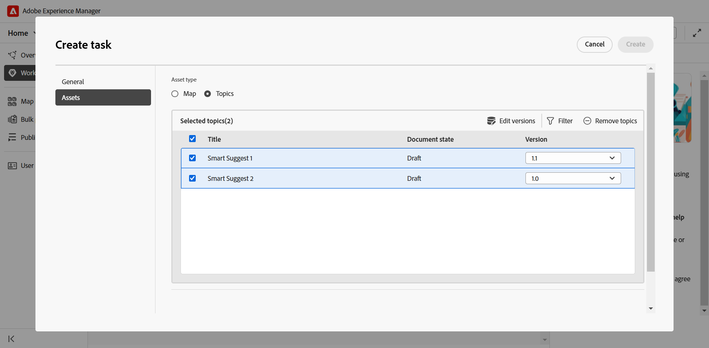
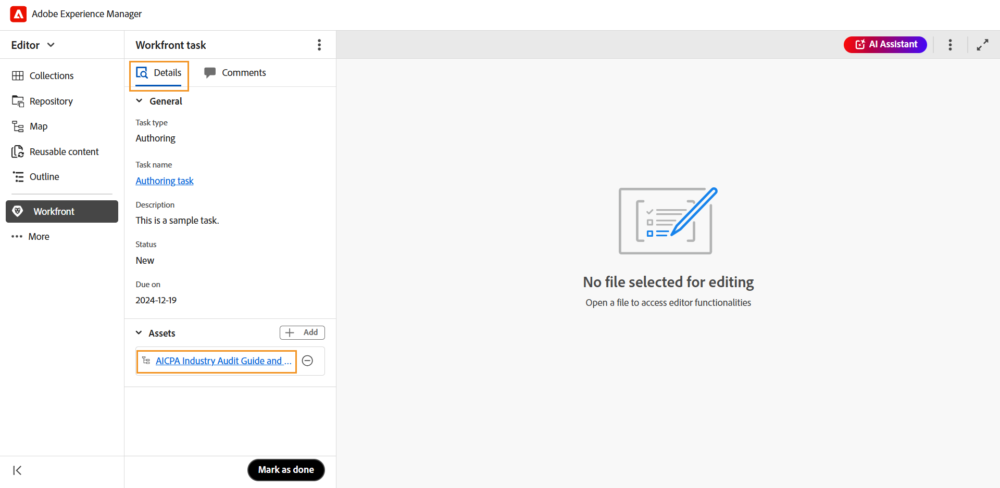
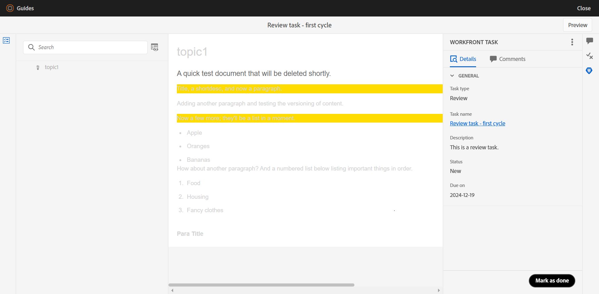
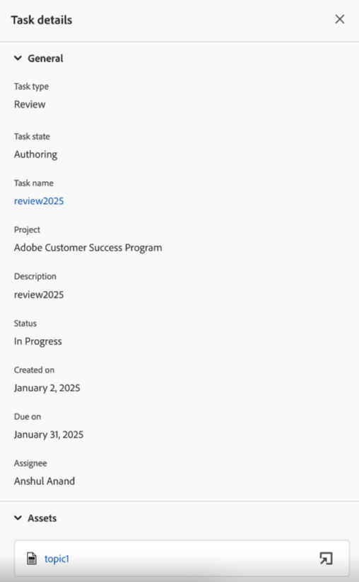

# Integrering med Workfront

Adobe Workfront är en molnbaserad arbetshanteringslösning som hjälper team och organisationer att planera, spåra och hantera sitt arbete effektivt. Integrationen mellan Experience Manager Guides och Adobe Workfront ger dig tillgång till robusta projekthanteringsfunktioner utöver Experience Manager Guides centrala CCMS-funktioner, så att du effektivt kan planera, fördela och spåra uppgifter.

Med den här integreringen kan du skapa och hantera Adobe Workfront-uppgifter direkt från Experience Manager Guides. Som författare kan du till exempel skapa en granskningsuppgift (med ett eller flera DITA-avsnitt eller -kartor tillagda) direkt i Experience Manager Guides-gränssnittet och tilldela den till en granskare. Som granskare kan du arbeta med tilldelade uppgifter i användargränssnittet för Experience Manager Guides Review och returnera dem till författaren med kommentarer. På samma sätt kan du skapa en publicerings- och översättningsåtgärd och sedan tilldela den till de användare som ska arbeta med den.

Integreringen ger dig även möjlighet att övervaka arbetsköerna så att du är organiserad och överordnad alla dina uppgifter (tilldelade uppgifter).

**Viktiga funktioner**

Tack vare integreringen mellan Experience Manager Guides och Adobe Workfront kan du

* Planera, fördela och spåra arbetets förlopp utan att behöva använda flera olika, icke-integrerade verktyg.
* Hantera alla Experience Manager Guides-arbetsflöden effektivare - redigering, granskning, publicering och översättning.
* Få e-postmeddelanden från Adobe Workfront när nya uppgifter tilldelas. Mer information finns i [Översikt över meddelanden](https://experienceleague.adobe.com/en/docs/workfront/using/basics/use-notifications/wf-notifications).
* Övervaka projekthälsan med Adobe Workfront intuitiva kontrollpanel som ger realtidsinsikter om projektresultaten.

  Läs [Planera en projektöversikt](https://experienceleague.adobe.com/en/docs/workfront/using/manage-work/projects/plan-a-project/plan-project) om du vill veta mer om Adobe Workfront robusta projekthanteringsfunktioner som är aktiverade för projektledare i Experience Manager Guides.

## Kom igång

När Adobe Workfront-uppgifterna har konfigurerats och aktiverats av administratören kan de nås direkt från [Experience Manager Guides hemsida](./intro-home-page.md).

Så här får du åtkomst till dina Adobe Workfront-uppgifter:

1. Logga in på Experience Manager Guides och öppna **hemsidan**.
2. Välj **Workfront** i den vänstra panelen.

   Sidan **Workfront tasks** visas.

   {align="left"}
3. Välj **Logga in**.

   Du omdirigeras till Adobe Workfront inloggningssida.
4. Logga in med samma e-postadress som i Experience Manager Guides och välj sedan **Tillåt åtkomst** för att programmet ska få åtkomst till ditt Adobe Workfront-konto.

   Du omdirigeras automatiskt till sidan **Workfront tasks** på Experience Manager Guides.

   {align="left"}

## Funktioner som finns på Workfront uppgiftssida

Följande funktioner finns på Workfront uppgiftssida:

* [Ny aktivitet](#create-workfront-tasks): Gör att du kan skapa Adobe Workfront-aktiviteter direkt från Experience Manager Guides-gränssnittet.
* [Tilldelad till dig](#managing-tasks-assigned-to-you): Visar alla uppgifter som har tilldelats dig och som fortfarande är aktiva.
* [Skapad av dig](#managing-tasks-created-by-you): Visar alla aktiviteter som du har skapat och som fortfarande är aktiva.

På sidan för Workfront-uppgifter finns också en utlänningsikon  som tar dig till Adobe Workfront projektsida när du har valt den. Här kan du visa aktivitetsinformation, visa kommentarer, lägga till kommentarer och få tillgång till andra funktioner baserat på behörigheter som är mappade med ditt Adobe Workfront-konto.

Mer information finns i [Översikt över Project-, Task- och Issue-datum i Workfront](https://experienceleague.adobe.com/en/docs/workfront/using/basics/navigate/definitions-pti-dates).

### Skapa Workfront-uppgifter

Du kan skapa Adobe Workfront-uppgifter direkt från Experience Manager Guides-gränssnittet med knappen **Ny uppgift** på Workfront aktivitetssida.

Så här skapar du en ny Adobe Workfront-uppgift:

1. Välj **Ny aktivitet** på sidan för Workfront-aktiviteter.

   Dialogrutan **Skapa uppgift** visas.

   {align="left"}
2. Ange följande uppgiftsinformation på fliken **Allmänt**:

   * **Aktivitetstyp**: Välj den aktivitetstyp som du vill skapa. De tillgängliga alternativen är: **Redigering**, **Granskning**, **Publicering** och **Översättning**.
   * **Projekt**: Välj det projekt i vilket du vill skapa uppgiften.
   * **Aktivitetsnamn**: Ange ett beskrivande namn för aktiviteten.
   * **Beskrivning**: Ange en kort beskrivning av uppgiften.
   * **Förfaller**: Ange förfallodatum för aktivitetsslutförande.
   * **Tilldelad**: Välj en tilldelad för uppgiften.
3. På fliken **Assets** väljer du **Lägg till** om du vill lägga till en resurs i den här aktiviteten.

   {align="left"}

   Dialogrutan **Välj bana** visas. Välj en sökväg till den önskade resursen. Du kan lägga till flera resurser genom att markera de giltiga sökvägarna i sökvägsläsaren. De markerade banorna behålls så att du enkelt kan granska och ändra dem när du öppnar dialogrutan igen.

   * För redigerings-, publicerings- och översättningsåtgärder uppmanas du att välja platsen för den obligatoriska filen i dialogrutan **Välj fil**. Den valda filen (ett ämne för redigering och mappning för publicering och översättning) läggs till i aktiviteten så snart knappen **Skapa** har valts.

     {align="left"}

   * För granskningsuppgifter uppmanas du först att välja resurstyp (karta eller ämnen) och sedan visas de valda filerna enligt följande:

     {align="left"}

     *Lägga till ämnen i en granskningsaktivitet*

     {align="left"}

     *Lägga till kartor i en granskningsaktivitet*

     Följande åtgärder är tillgängliga för att ändra ditt val innan du skickar för granskning:

      * Avmarkera vissa ämnen i listan.
      * Filtrera ämneslistan baserat på dokumentstatus.
      * Redigera eller ange versionen för markerade ämnen till **Senaste version**, **Version baserat på datum** och **Baslinje** (endast tillgängligt för kartor) efter behov.

     Mer information finns i [Skicka ämnen för granskning](./review-send-topics-for-review.md).

   >[!NOTE]
   >
   > Genom att lägga till en resurs i en uppgift får du snabbt åtkomst till ett ämne, en karta eller någon annan fil som du behöver arbeta med. För redigerings-, publicerings- och översättningsåtgärder är det valfritt att lägga till en resurs, men det kan vara praktiskt om du vill effektivisera arbetsflödena. För granskningsåtgärder är det dock obligatoriskt att lägga till en resurs.

4. Välj **Skapa**.

En ny uppgift skapas och visas under fliken **Skapad av dig**.

>[!NOTE]
>
> Som projektledare kan du visa den här nyskapade uppgiften på Adobe Workfront-kontrollpanelen tillsammans med annan viktig information om aktiviteten. Mer information finns i [Förstå instrumentpaneler](https://experienceleague.adobe.com/en/docs/workfront/using/reporting/dashboards/understand-dashboards/understand-dashboards).

### Hantera uppgifter som du har skapat

Alla aktiviteter som du har skapat och fortfarande är aktiva visas på fliken **Skapat av dig** på aktivitetssidan för Workfront. Här visas viktig uppgiftsinformation som projektnamn, tilldelningar, datum när uppgiften skapades, datum då uppgiften slutfördes och aktivitetsstatus.

{align="left"}

Följande alternativ är tillgängliga när du hovrar över en åtgärd som finns på fliken Skapat av dig:

**Öppna** - 

Gör att du kan öppna uppgiften. Beroende på vilken typ av uppgift det är, öppnas det i redigeraren, kartkonsolen eller granskningsgränssnittet.

**Redigera** - 

Gör att du kan redigera uppgiftsinformation som läggs till när du skapar uppgiften. Alla fält är redigerbara förutom Aktivitetstyp och Projekt. Du kan bara redigera uppgifter som du har skapat. Det går inte att redigera tilldelade uppgifter.

Du kan också lägga till eller ta bort resurser när du redigerar en redigerings-, publicerings- eller översättningsåtgärd. För en granskningsuppgift kan du dock bara ändra versionen av resurserna som skickats för granskning.

**Aktivitetsinformation** - 

Visar aktivitetsinformation, inklusive information som anges när uppgifter skapas, aktivitetsstatus och eventuella tillagda resurser.

### Hantera uppgifter som tilldelats dig

Alla uppgifter som har tilldelats dig och som fortfarande är aktiva visas på fliken **Tilldelad till dig** på aktivitetssidan för Workfront, och du får viktig information om uppgifter som projektnamn, tilldelningar, förfallodatum och uppgiftsstatus.

{align="left"}

Följande alternativ är tillgängliga när du hovrar över en uppgift som finns på fliken Tilldelad till dig:

**Öppna** - 

Gör att du kan öppna uppgiften. Beroende på vilken typ av uppgift det är, öppnas det i redigeraren, kartkonsolen eller granskningsgränssnittet.

**Aktivitetsinformation** - 

Visar aktivitetsinformation, inklusive information som anges när uppgifter skapas, aktivitetsstatus och eventuella tillagda resurser.

{align="left"}

#### Åtkomst till tilldelade uppgifter från avsnittet Översikt

Du kan även komma åt dina tilldelade Adobe Workfront-uppgifter från [översiktsavsnittet](./intro-home-page.md#overview). När du väljer Översikt innehåller det olika widgetar som hjälper dig att hålla dig fokuserad och ordnad.

**Dina aktiviteter** är en sådan widget där en lista över Adobe Workfront-aktiviteter (som är tilldelade dig och fortfarande är aktiva) visas tillsammans med viktig aktivitetsinformation, inklusive aktivitetens namn, associerat projekt, förfallodatum och aktuell status.

{align="left"}

På liknande sätt som på fliken Tilldelad till dig innehåller widgeten Dina uppgifter även alternativ för **Öppna** och visa **Uppgiftsinformation** när du hovrar över en uppgift.

Widgeten innehåller även alternativ för att sortera och ändra storlek på kolumner för en anpassad vy. Om du vill använda sortering för en kolumn markerar du kolumnrubriken så visas alternativen i en lista. Om du vill justera en kolumns bredd håller du pekaren över kolumnavgränsarlinjen i rubriken och drar för att ändra storlek.

>[!NOTE]
>
> När du befinner dig utanför Experience Manager Guides-gränssnittet får du ett e-postmeddelande från Adobe Workfront om nya uppgifter. Om du vill se vad som händer loggar du in i Experience Manager Guides-instansen och får tillgång till de tilldelade uppgifterna.

## Arbeta med uppgifter som tilldelats av Adobe Workfront

Det finns fyra typer av Adobe Workfront-uppgifter som du kan skapa, tilldela och arbeta med när de tilldelas till Experience Manager Guides:

1. [Redigera uppgifter](#authoring-tasks)
2. [Granska uppgifter](#review-tasks)
3. [Översättningsuppgifter](#translation-tasks)
4. [Publiceringsuppgifter](#publishing-tasks)

I följande avsnitt beskrivs hur du arbetar med uppgifter som tilldelats av Adobe Workfront.

### Redigera uppgifter

Utför följande steg när du vill arbeta med en redigeringsåtgärd:

1. Åtkomst till uppgiften antingen från [Översikt](#accessing-assigned-tasks-from-overview-section) eller [Tilldelad till dig](#managing-tasks-assigned-to-you)-fliken.

   {align="left"}

   *Redigeringsaktiviteten på fliken Tilldelad till dig*

   {align="left"}

   *Redigeringsaktivitet i widgeten Dina uppgifter*
2. Håll muspekaren över den uppgift du vill arbeta med och markera    för att öppna den. Du kan också öppna uppgiften genom att välja uppgiften.

   Alla redigeringsåtgärder öppnas i Redigeraren.
3. Granska uppgiftsinformationen på fliken **Detaljer** och markera filen **Resurs** för att öppna den.

   {align="left"}

4. Gör önskade ändringar och välj **Markera som slutförd**.
5. Växla till fliken **Kommentarer** om du vill lägga till en kommentar i den här aktiviteten. Dessa kommentarer, som läggs till på aktivitetsnivå, visas också på Adobe Workfront projektkontrollpanel.

   >[!NOTE]
   >
   > När aktiviteten har markerats som slutförd tas den bort från både din tilldelade uppgiftslista och aktivitetsinitierarens **skapad av dig**.

### Granska uppgifter

Som granskare kan du granska Adobe Workfront granskningsåtgärder som du har tilldelats.

Utför följande steg för att arbeta med en granskningsåtgärd som du har tilldelats.

1. Åtkomst till uppgiften antingen från [Översikt](#accessing-assigned-tasks-from-overview-section) eller [Tilldelad till dig](#managing-tasks-assigned-to-you)-fliken.

   {align="left"}

   *Granska aktiviteten på fliken Tilldelad till dig*

   {align="left"}

   *Redigeringsaktivitet i widgeten Dina uppgifter*
2. Håll muspekaren över den uppgift du vill arbeta med och markera    för att öppna den. Du kan också öppna uppgiften genom att välja uppgiften.

   Granskningsaktiviteten öppnas för granskare i **granskningsgränssnittet**.

   {align="left"}

3. Genomför den granskning som krävs. Mer information om hur du granskar ett ämne finns i [Granska ämnen](./review-topics.md).
4. När granskningen är klar väljer du **Markera som slutförd**.
5. Växla till fliken **Kommentarer** om du vill lägga till en kommentar i den här aktiviteten. Dessa kommentarer, som läggs till på aktivitetsnivå, visas också på Adobe Workfront projektkontrollpanel.

Om du markerar uppgiften som den har gjorts av granskaren betyder det inte att uppgiften har slutförts. Alla granskningsåtgärder tilldelas tillbaka till användaren som skapade uppgiften (helst en författare som begärde en granskning).

>[!NOTE]
>
> Om uppgiften har tilldelats flera granskare, kommer den att tilldelas till den som skapat uppgiften först när alla granskare har markerat den som slutförd.

Granskningsåtgärder som har omtilldelats till skaparen/författarna för granskningsregistrering kan nås från avsnittet [Översikt](#accessing-assigned-tasks-from-overview-section) eller från fliken [Tilldelad till dig](#managing-tasks-assigned-to-you).

{align="left"}

*Granska uppgift som tilldelats författare igen*

För sådana uppgifter ändras uppgiftstillståndet för den som tilldelas till **Redigering** medan uppgiftstypen förblir **Granska**. Den här lägesändringen inträffar när granskningen slutförs av alla granskare.

{align="left"}

Om du väljer uppgiften eller öppningsikonen  öppnas uppgiften i redigeraren där författaren kan [adressera granskningskommentarer](../user-guide/review-address-review-comments.md), redigera uppgiften genom att uppdatera ämnesversionen och sedan återtilldela uppgiften till granskaren om det behövs.

Upphovsmannen kan också redigera uppgiften och tilldela den till en annan författare och delegera uppgiften att lägga in kommentarerna. Det gör du genom att välja **Redigera**, ändra aktivitetsstatus till **Redigering** och sedan välja **Ändra tilldelad**. Du kan nu välja en tilldelad i listan.

Denna process utgör en kontinuerlig process, där uppgiften flyttas fram och tillbaka mellan författaren och granskaren tills den är helt slutförd. När alla föreslagna ändringar har införlivats kan författaren slutföra uppgiften genom att välja **Markera som slutförd**.

### Översättningsuppgifter

Du kan utföra olika översättningsåtgärder för Adobe Workfront översättningsåtgärder som du har tilldelats.

Utför följande steg för att arbeta med en översättningsuppgift:

1. Åtkomst till uppgiften antingen från [Översikt](#accessing-assigned-tasks-from-overview-section) eller [Tilldelad till dig](#managing-tasks-assigned-to-you)-fliken.

   {align="left"}

   *Översättningsaktivitet på fliken Tilldelad till dig*

   {align="left"}

   *Översättningsaktivitet i widgeten Dina uppgifter*

2. Håll muspekaren över den uppgift du vill arbeta med och markera    om du vill öppna den i **kartkonsolen** . Du kan också öppna uppgiften genom att välja uppgiften.
3. Granska uppgiftsinformationen och filen som lagts till för översättning.

   {align="left"}
4. Navigera till fliken **Översättning** för de olika översättningsalternativen. Lär dig [översätta innehåll](../user-guide/translation.md) i Experience Manager Guides.
5. Utför den önskade översättningen och välj **Skicka för översättning**.
   {align="left"}
6. Navigera till avsnittet **Workfront** och markera **Markera som slutförd** för att ange att uppgiften är slutförd.
7. Växla till fliken **Kommentarer** om du vill lägga till en kommentar i den här aktiviteten. Dessa kommentarer, som läggs till på aktivitetsnivå, visas på Adobe Workfront projektkontrollpanel.

   >[!NOTE]
   >
   > När aktiviteten har markerats som slutförd tas den bort från både din tilldelade uppgiftslista och aktivitetsinitierarens **skapad av dig**.

### Publiceringsuppgifter

Som utgivare kan du visa information och publicera en publiceringsuppgift som du har tilldelats.

Utför följande steg när du vill arbeta med en publiceringsåtgärd:

1. Åtkomst till uppgiften antingen från [Översikt](#accessing-assigned-tasks-from-overview-section) eller [Tilldelad till dig](#managing-tasks-assigned-to-you)-fliken.

   {align="left"}

   *Publiceringsuppgift på fliken Tilldelad till dig*

   {align="left"}

   *Publicera aktivitet i din aktivitetswidget*
2. Håll muspekaren över den uppgift du vill arbeta med och markera    om du vill öppna den i **kartkonsolen** . Du kan också öppna uppgiften genom att välja uppgiften.
3. Granska aktivitetsinformationen och filen som lagts till för publicering.

   {align="left"}
4. Navigera till **Utdataförinställningarna** och utför de publiceringsåtgärder som krävs för att publicera uppgiften. Mer information finns i [Om förinställningarna](../user-guide/generate-output-understand-presets.md).
5. När publiceringen är klar går du till avsnittet **Workfront** och väljer **Markera som slutförd** för att ange att aktiviteten är slutförd.
6. Växla till fliken **Kommentarer** om du vill lägga till en kommentar i den här aktiviteten. Dessa kommentarer, som läggs till på aktivitetsnivå, visas på Workfront projektkontrollpanel.

   >[!NOTE]
   >
   > När aktiviteten har markerats som slutförd tas den bort från både din tilldelade uppgiftslista och aktivitetsinitierarens **skapad av dig**.
